## 13.1 நைட்ரோ சேர்மங்கள்

நைட்ரோ சேர்மங்கள் ஹைட்ரோகார்பன்களின் வழிப்பொருட்களாக கருதப்படுகின்றன. ஹைட்ரோகார்பன்களில் காணப்படும் ஒரு ஹைட்ரஜன் அணுவானது \(-\text{NO}_2\) தொகுதியால் பதிலீடு செய்யப்படுவதால் உருவாகும் கரிமச் சேர்மங்கள் கரிம நைட்ரஜன் சேர்மங்கள் எனப்படுகின்றன.

**13.1.1 நைட்ரோ சேர்மங்களை வகைப்படுத்துதல்**

என்பது ஒரு ஆல்கைல் (\(C_n H_{2n+1}\)) தொகுதியாகும். \(-\text{NO}_2\) தொகுதி இணைக்கப்படிருக்கும் கார்பன் அணுவின் தன்மையினைப் பொருத்து நைட்ரோ ஆல்கேன்கள் மேலும் ஒரிணைய, ஈரிணைய மற்றும் மூவிணைய நைட்ரோ ஆல்கேன்கள் என வகைப்படுத்தப்படுகின்றன.

### 13.1.2 நைட்ரோ ஆல்கேன்களுக்குப் பெயரிடுதல்

IUPAC பெயரிடும் முறையில் ஆல்கேன்களின் பெயருக்கு முன்னொட்டாக நைட்ரோ தொகுதி சேர்க்கப்படுகிறது. நைட்ரோ தொகுதி இடம் பெற்றுள்ள கார்பன் எண் மூலம் குறிப்பிடப்படுகிறது.

| சேர்மம் (பொதுவான பெயர் அமைப்பு வாய்ப்பாடு, IUPAC பெயர்) | IUPAC பெயர் (முன்னீட்டு இடை அமைவு எண்ணுடன்) | மூல வாய்க்கை | முதன்மை பின்னொட்டு | இரண்டாம் நிலை பின்னொட்டு |
|---|---|---|---|---|
| 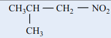 2-மெத்தில்-1-நைட்ரோ புரோப்பேன் | 2-மெத்தில்-1-நைட்ரோ | புரப் | ஏன் | – |
| 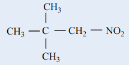 2,2-டைமெத்தில்-1-நைட்ரோ புரோப்பேன் | 2,2-டைமெத்தில்-1-நைட்ரோ | புரப் | ஏன் | – |
| 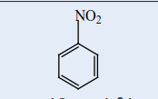 நைட்ரோபென்சீன் | நைட்ரோ | பென்சீன் | – | – |
| 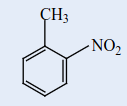 2-நைட்ரோ-1-மெத்தில் பென்சீன் | 2-நைட்ரோ-1-மெத்தில் | பென்சீன் | – | – |
| 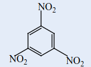 1,3,5-ட்ரைநைட்ரோ பென்சீன் | 1,3,5-ட்ரைநைட்ரோ | பென்சீன் | – | – |
| 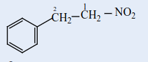 2-பினைல்-1-நைட்ரோஎத்தேன் | 2-பினைல்-1-நைட்ரோ | ஈத் | ஏன் | – |

### 13.1.3 மாற்றியம்

நைட்ரோ சேர்மங்கள் சங்கிலித் தொடர் மற்றும் இட மாற்றியங்களை பெற்றிருப்பதுடன், ஆல்கைல் நைட்ரைட்டுகளுடன் வினைசெயல் தொகுதி மாற்றியத்தினையும் பெற்றுள்ளன. மேலும் \( \alpha \)-H அணுவைக் கொண்டுள்ள நைட்ரோ ஆல்கேன்கள் இயங்கு சமநிலை மாற்றியத்தினையும் கொண்டுள்ளன. எடுத்துக்காட்டாக, \( C_4H_9NO_2 \) என்ற மூலக்கூறு வாய்ப்பாட்டினை உடைய நைட்ரோ சேர்மங்கள் பின்வரும் மாற்றியங்களைக் கொண்டுள்ளன.

| மாற்றியம் | மாற்றியங்களின் அமைப்பு வாய்ப்பாடுகள் |
|---|---|
| **சங்கிலித் தொடர் மாற்றியம்**  இவை சங்கிலியில், கார்பன் சங்கிலியின் நீளத்தில் மாற்றம் காணப்படுகிறது. | 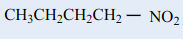 **1 – நைட்ரோ பியூட்டேன்**  மற்றும்  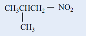 **2 – மெத்தில் – 1 – நைட்ரோபுரொப்பேன்** |
| **இட மாற்றியம்**  இட மாற்றியம் இவை, நைட்ரோ தொகுதியின் இடம் மாறுபடுகிறது | 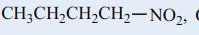 **1 – நைட்ரோ பியூட்டேன்** &nbsp;&nbsp;&nbsp;&nbsp; 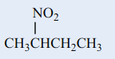 **2 – நைட்ரோ பியூட்டேன்** |
| **வினைசெயல் தொகுதி மாற்றியம்**  நைட்ரோ ஆல்கேன்கள், அல்கைல் நைட்ரேட்டுகளுடன் வினை செயல் தொகுதி மாற்றியத்தினைப் பெறுகின்றன. | 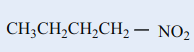 **1 – நைட்ரோ பியூட்டேன்**  மற்றும்  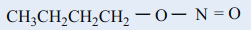 **பியூட்டைல் நைட்ரேட்** |

இயங்குசமநிலை மாற்றியம்: \( \alpha \)-H ஐக் கொண்டுள்ள ஓரிணைய மற்றும் ஈரிணைய நைட்ரோ ஆல்கேன்கள் நைட்ரோ மற்றும் அசி வடிவங்களின் இயங்குசமநிலைக் கலவையாக காணப்படுகின்றது.

மூவிணைய நைட்ரோ ஆல்கேன்கள் \( \alpha \)-H அணுவை பெற்றிருக்காததால், இயங்கு சமநிலை மாற்றியத்தினை பெற்றிருப்பதில்லை.

| வ.எண் | நைட்ரோ வடிவம் | அசி வடிவம் |
|---|---|---|
| 1. | குறைவான அமிலத்தன்மை | அதிக அமிலத் தன்மை |
| 2. | \( \text{NaOH} \) மெதுவாக கரைக்கின்றது | \( \text{NaOH} \) உடனடியாக கரைக்கிறது. |
| 3. | \( \text{FeCl}_3 \) கரைசலை நிறமிமுக்க செய்கிறது. | \( \text{FeCl}_3 \) உடன் சிவப்புப்பழுப்பு நிறத்தைத் தருகிறது. |
| 4. | மின்கடத்துத் திறன் குறைவு | மின்கடத்துத் திறன் அதிகம் |

### 13.1.4 நைட்ரோ ஆல்கேன்களின் அமிலத் தன்மை

\( \text{NO}_2 \) தொகுதியின் எலக்ட்ரானைக் கவரும் வினைவின் காரணமாக \( 1^\circ \) மற்றும் \( 2^\circ \) நைட்ரோ ஆல்கேன்களின் \( \alpha \)-H அணு அமிலத்தன்மையைக் காட்டுகிறது. இச்சேர்மங்கள் ஆல்டிஹைடுகள், கீட்டோன்கள், எஸ்டர்கள் மற்றும் சயனைடுகளைக் காட்டிலும் அதிக அமிலத் தன்மை உடையவை.

நைட்ரோ ஆல்கேன்கள் \( \text{NaOH} \) கரைசலில் கரைந்து உப்புக்களைத் தருகின்றன. அசி நைட்ரோ பெறுகிகள் நைட்ரோ வடிவத்தைக் காட்டிலும் அதிக அமிலத் தன்மை உடையது. \( \alpha \)-H கார்பனுடன் இணைக்கப்பட்டிருக்கும் ஆல்கைல் தொகுதிகளின் எண்ணிக்கை அதிகரிக்கும் போது ஆல்கைல் தொகுதிகளின் \( +I \) வினைவினால் அமிலத் தன்மையும் குறைகிறது.

> **தன்மதிப்பீடு**
>
> பின்வரும் சேர்மங்களுக்கு சாத்தியமான அனைத்து மாற்றியங்களையும் எழுதுக.
>
> i) \( C_2H_5-NO_2 \) ii) \( C_3H_7-NO_2 \)

### 13.1.5 நைட்ரோ ஆல்கேன்களைத் தயாரித்தல்

#### 1) ஆல்கைல் ஹாலைடுகளிலிருந்து பெறுதல் (ஆய்வகமுறை)

அ) ஈத்தைல் புரோமைடுகள் (அல்லது) அயோடைடுகளை எத்தனாலில் கரைக்கப்பட்ட பொட்டாசியம் நைட்ரைட்டு கரைசலுடன் வினைப்படுத்தும் போது நைட்ரோ ஈத்தேனைத் தருகிறது.

$$
\mathrm{CH_3CH_2{-}Br}
+
\mathrm{KNO_2}
\overset{\text{எத்தனால்}/\Delta}{\underset{S_\mathrm{N}2}{\longrightarrow}}
\mathrm{CH_3CH_2{-}NO_2}
+
\mathrm{KBr}
$$

$$
\scriptsize \text{எத்தில் புரோமைடு}
\hspace{4cm}
\scriptsize \text{நைட்ரோ எத்தேன்}
$$

இவ்வினை \( S_N2 \) வினை வழிமுறையைப் பின்பற்றுகிறது. நைட்ரோ பென்சீனை தயாரிக்க இம்முறை ஏற்றதன்று. ஏனெனில் பென்சீன் வளையத்துடன் நேரடியாக பிணைக்கப்பட்டிருக்கும் புரோமினை பிளவுறச் செய்ய இயலாது.

#### 2) ஆல்கேன்களின் ஆவி நிலை நைட்ரோ ஏற்றம் (தொழிற்முறை)

மீத்தேன் மற்றும் நைட்ரிக் அமிலம் ஆகியனவற்றின் வாயுக் கலவையை செஞ்சூடான உலோக குழாயின் வழியே செலுத்தி நைட்ரோ மீத்தேன் பெறப்படுகிறது.

$$
\mathrm{CH_4}_{(g)}+\mathrm{HNO_3}_{(g)}
\overset{675\ \mathrm{K}}{\underset{\text{செஞ்சூடான Si குழாய்}}{\longrightarrow}}
\mathrm{CH_3{-}NO_2}+\mathrm{H_2O}
$$

$$ \scriptsize \text{ஈத்தேன்} \hspace{6cm} \scriptsize \text{நைட்ரோ ஈத்தேன்} $$

மீத்தேனைத் தவிர்த்த பிற ஆல்கேன்கள் (\( n \) – ஹெக்ஸேன் வரை) C – C பிளவினால் நைட்ரோ ஆல்கேன்களின் கலவையினைத் தருகின்றன. பின்ன வாலை வடித்தலின் மூலம் நைட்ரோ ஆல்கேன்கள் தனித்தனியே பிரித்தெடுக்கப்படுகின்றன.

$$
\mathrm{CH_3{-}CH_3}+\mathrm{HNO_3}
\overset{675\ \mathrm{K}}{\longrightarrow}
\mathrm{CH_3CH_2{-}NO_2}
+
\mathrm{CH_3NO_2}
$$

$$ \scriptsize \text{ஈத்தேன்} \hspace{4.25cm} \scriptsize \text{நைட்ரோ ஈத்தேன்} (73\%)  \hspace{.5cm} \scriptsize \text{நைட்ரோ ஈத்தேன்} (27\%)  $$

#### 3) \( \alpha \)- ஹேலோ கார்பாக்சிலிக் அமிலங்களிலிருந்து பெறுதல்

$$
\mathrm{Cl{-}CH_2{-}COOH}
+\mathrm{NaNO_2}
\overset{\mathrm{H_2O}/\text{வெப்பம்}}{\underset{S_\mathrm{N}2}{\longrightarrow}}
\mathrm{CH_3{-}NO_2}
+\mathrm{CO_2}
+\mathrm{NaCl}
$$

$$
\scriptsize \text{α - குளோரோஅசிடிக் அமிலம்}
\hspace{4.2cm}
\scriptsize \text{நைட்ரோ ஈத்தேன்0}
$$

> **தன்மதிப்பீடு**
>
> 4) பின்வரும் வினைகளில் விளைப்பொருட்களைக் கண்டறிக.
>
> i) \( \text{CH}_3\text{CH}(\text{Cl})\text{COOH} \xrightarrow[\Delta]{\text{i) NaNO}_2 \text{ ii) H}_2\text{O}} [X] \)
> 
> ii) \( \text{CH}_3\text{CH}_2\text{-Br} + \text{NaNO}_2 \xrightarrow{\text{ஆல்கஹால்}/\Delta} [Y] \)

#### 4) மூவிணைய ஆல்கைல் அமீன்களின் ஆக்சிஜனேற்றம்

மூவிணைய பியூட்டைல் அமீன் நீர்த்த \( \text{KMnO}_4 \) ஆல் ஆக்சிஜனேற்றம் அடைந்து மூவிணைய நைட்ரோ ஆல்கேன்களைத் தருகின்றது.

#### 5) ஆக்சைம்களின் ஆக்சிஜனேற்றம்

அசிட்டால்டாக்சைம் மற்றும் அசிட்டோன் ஆக்சைம் ஆகியன ட்ரைபுளுரோபெராக்ஸி அசிட்டிக் அமிலத்தால் ஆக்சிஜனேற்றம் அடைந்து முறையே நைட்ரோ ஈத்தேன் (\( 1^\circ \)) மற்றும் 2 – நைட்ரோ புரொப்பேன் (\( 2^\circ \)) ஆகியனவற்றைத் தருகின்றன.

$$
\mathrm{CH_3{-}CH{=}N{-}OH}
\overset{\mathrm{CF_3COOOH}}{\underset{[O]}{\longrightarrow}}
\mathrm{CH_3CH_2{-}NO_2}
$$

$$
\scriptsize \text{அசிட்டால்டாக்சைம்}
\hspace{2.6cm}
\scriptsize \text{நைட்ரோ ஈத்தேன்}
$$

### 13.1.6 நைட்ரோ அரீன்களைத் தயாரித்தல்

**i) நேரடி நைட்ரோ ஏற்றம்**

330K வெப்பநிலையில் பென்சீனை நைட்ரோ ஏற்றக் கலவையுடன் (கூம்பு \( \text{HNO}_3 \) + கூம்பு \( \text{H}_2\text{SO}_4 \)) வெப்பப்படுத்தும் போது எலக்ட்ரான் கவர் பொருள் பதிலீட்டு வினை நடைபெற்று நைட்ரோ பென்சீன் (மிர்பேன் எண்ணெய்) உருவாகிறது.

நைட்ரோ பென்சீனின் நேரடி நைட்ரோ ஏற்றம் \( m \) – நைட்ரோ பென்சீனை உருவாக்குகிறது.

**2) மறைமுக முறை**

கரோஸ் அமிலம் (\( \text{H}_2\text{SO}_5 \)) அல்லது பெர்சல்பூரிக் அமிலம் (\( \text{H}_2\text{S}_2\text{O}_8 \)) அல்லது ட்ரைபுளுரோ பெராக்சி அசிட்டிக் அமிலம் (\( \text{F}_3\text{C}.\text{CO}_3\text{H} \)) போன்றவற்றை ஆக்சிஜனேற்றியாகப் பயன்படுத்தும் போது அமினோ தொகுதியானது நேரடியாக நைட்ரோ தொகுதியாக மாற்றப்படுகிறது.

### 13.1.7 நைட்ரோ ஆல்கேன்களின் இயற்பண்புகள்

குறைவான கார்பன் அணுக்களைக் கொண்டுள்ள நைட்ரோ ஆல்கேன்கள் நிறமற்ற, இனிய மணமுடைய நீர்மங்கள், நீரில் சிறிதளவே கரையும் ஆனால் பென்சீன், அசிட்டோன் போன்ற கரிமக் கரைப்பான்களில் நன்கு கரைகின்றன. இவைகளின் அதிக முனைவுத் தன்மையினால் அதிக கொதிநிலையைக் கொண்டுள்ளன. நைட்ரோ ஆல்கேன்களைக் காட்டிலும் ஆல்கைல் நைட்ரைட்டுகள் குறைவான கொதிநிலையைக் கொண்டுள்ளன.

### 13.1.8 நைட்ரோ ஆல்கேன்களின் வேதிப்பண்புகள்

நைட்ரோ ஆல்கேன்கள் பின்வரும் பொதுவான வினைகளில் ஈடுபடுகின்றன.

i. ஒடுக்கம் ii. நீராற்பகுப்பு iii. வேறைனேற்றம்

**i) நைட்ரோ ஆல்கேன்களின் ஒடுக்கம்**

நைட்ரோ ஆல்கேன்களின் ஒடுக்க வினையானது முக்கியமான தொகுப்பு முறை பயன்களைக் கொண்டுள்ளது. நைட்ரோ தொகுதியின் ஒடுக்க வினையின் பல்வேறு நிலைகள் பின்வருமாறு

இறுதி வினைப்பொருளானது ஒடுக்கும் காரணியின் தன்மை மற்றும் ஊடகத்தின் pH மதிப்பு ஆகியனவற்றைப் பொறுத்து அமையும்.

**ஆல்கைல் நைட்ரைட்டுகளின் ஒடுக்கம்**

**ii) நைட்ரோ ஆல்கேன்களின் நீராற்பகுப்பு**

அடர் \( \text{HCl} \) அல்லது அடர் \( \text{H}_2\text{SO}_4 \) ஐப் பயன்படுத்தி நீராற்பகுத்தலை மேற்கொள்ளலாம். ஓரிணைய நைட்ரோ ஆல்கேன்களை நீராற்பகுக்கும் போது கார்பாக்சிலிக் அமிலங்கள் உருவாகின்றன. மேலும் ஈரிணைய நைட்ரோ ஆல்கேன்கள் கீட்டோன்களைத் தருகின்றன. மூவிணைய நைட்ரோ ஆல்கேன்கள் இவ்வினையில் ஈடுபடுவதில்லை.

மாறாக, எத்தில் நைட்ரைட்டுகள் அமில அல்லது கார நீராற்பகுப்பினால் எத்தனால் உருவாகிறது.

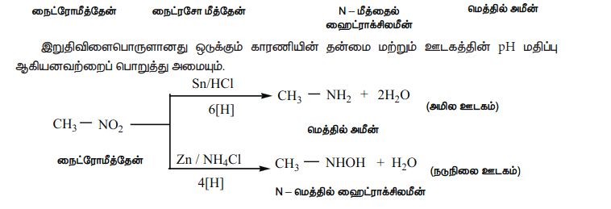

ஆல்கைல் நைட்ரைட்டுகளின் ஒடுக்கம்

Sn / HCl ஐக் கொண்டு எத்தில் நைட்ரைட்டை ஒடுக்கும்போது எத்தனால் உருவாகிறது.

$$
\mathrm{CH_3CH_2{-}O{-}N{=}O}
+6[H]
\overset{\mathrm{Sn/HCl}}{\longrightarrow}
\mathrm{CH_3CH_2{-}OH}
+\mathrm{NH_3}
+\mathrm{H_2O}
$$

$$
\scriptsize \text{எத்தில் நைட்ரைட்டு}
\hspace{5.2cm}
\scriptsize \text{எத்தனால்}
$$

**ii) நைட்ரோஆல்கேன்களின் நீராற்பகுப்பு**

அடர் HCl அல்லது அடர் H$_2$SO$_4$ ஐப் பயன்படுத்தி நீராற்பகுத்தலை மேற்கொள்ளலாம். ஓரிணைய நைட்ரோ ஆல்கேன்களை நீராற்பகுக்கும் போது கார்பாக்சிலிக் அமிலங்கள் உருவாகின்றன. 

மேலும் ஈரிணைய நைட்ரோ ஆல்கேன்கள் கீட்டோன்களைத் தருகின்றன. மூவிணைய நைட்ரோ ஆல்கேன்கள் இவ்வினையில் ஈடுபடுவதில்லை.

$$
\mathrm{CH_3CH_2{-}O{-}N{=}O}
+\mathrm{HOH}
\overset{\mathrm{OH^-}}{\underset{(\mathrm{or})\ \mathrm{H^+}}{\longrightarrow}}
\mathrm{CH_3CH_2{-}OH}
+\mathrm{HNO_2}
$$

$$
\scriptsize \text{எத்தில் நைட்ரைட்டு}
\hspace{5.4cm}
\scriptsize \text{எத்தனால்}
$$

**iii) நைட்ரோ ஆல்கேன்களின் ஹைலஜனேற்றம்**

ஓரிணைய மற்றும் ஈரிணைய நைட்ரோ ஆல்கேன்களை \( \text{Cl}_2 \) அல்லது \( \text{Br}_2 \) உடன் \( \text{NaOH} \) முன்னிலையில் வினைப்படுத்த நைட்ரோ ஆல்கேன்களின் \( \alpha \)-H அணுக்கள் ஒவ்வொன்றாக ஹாலஜன் அணுக்களால் பதிலீடு செய்யப்படுகின்றன.

\[
\text{CH}_3 - \text{NO}_2 + 3\text{Cl}_2 \xrightarrow{\text{NaOH}} \text{CCl}_3 - \text{NO}_2 + 3\text{HCl}
\]

$$
\scriptsize \text{நைட்ரோமீத்தேன்}
\hspace{3.8cm}
\scriptsize \text{குளோரோபிக்ரின்}
$$

$$
\hspace{7cm}
\scriptsize \text{(டிரைகுளோரோநைட்ரோமீத்தேன்)}
$$

**நச்சுத்தன்மை**

நைட்ரோ ஈத்தேன் ஆனது மரபுத்தன்மையில் பாதிப்பை ஏற்படுத்துதல் மற்றும் நரம்பு மண்டல பாதிப்புகளுக்கு காரணமாக இருக்கலாம் என அறியப்படுகிறது.

**iv) நெப்கார்பனைல் தொகுப்பு**

**நைட்ரோ பென்சீனின் வேதிப் பண்புகள்**

**மின்னாற் ஒடுக்கம்**

**உலோக வினையூக்கி மற்றும் உலோக ஹைட்ரைடுகளால் ஒடுக்கம்**

நைட்ரோ பென்சீனை Ni (அல்லது) Pt (அல்லது) \( \text{LiAlH}_4 \) ஐக் கொண்டு ஒடுக்கம் செய்யும் போது அனிலின் உருவாகிறது.

$$
\mathrm{C_6H_5{-}NO_2}
+6[H]
\overset{\mathrm{Ni}\ (\mathrm{அல்லது})\ \mathrm{Pt/H_2}}{\underset{(\mathrm{அல்லது})\ \mathrm{LiAlH_4}}{\longrightarrow}}
\mathrm{C_6H_5{-}NH_2}
+2\mathrm{H_2O}
$$

$$
\scriptsize \text{நைட்ரோபென்சீன்}
\hspace{5.8cm}
\scriptsize \text{அனிலீன்}
$$

**பாலிநைட்ரோ சேர்மங்களின் தெரிந்தெடுத்த ஒடுக்கம்**

**எலக்ட்ரான் கவர் பொருள் பதிலீட்டு வினை**

பொதுவாக, நைட்ரோ பென்சீனின் எலக்ட்ரான் கவர் பொருள் பதிலீட்டு வினை மிக மெதுவாக நிகழும் ஒரு வினையாகும். மேலும் தீவிரமான வினை நிகழ நிபந்தனைகளில் இவ்வினை நிகழ்த்தப்படுகிறது. (\( -\text{NO}_2 \) தொகுதியானது வலிமையான கிளர்வு நீக்கும் மற்றும் m – ஆற்றுப்படுத்தும் தொகுதியாகும்).

\( -\text{NO}_2 \) ஆனது ஒரு வலிமையான கிளர்வு நீக்கும் தொகுதியாக இருப்பதால், ஹைட்ரோ பென்சீன் ப்ரீட் - கிராப்ட் வினைக்கு உட்படுவதில்லை.

> **தன்மதிப்பீடு**
>
> பின்வரும் சேர்மங்களின் தெரிந்தெடுத்த ஒடுக்க வினையினால் உருவாகும் முதன்மை விளைபொருட்களைக் கண்டறிக.
>
> 