**கென்னத் வேட் (1932-2014)**

கென்னத் வேட் ஒரு பிரிட்டிஷ் வேதியியல் அறிஞர் ஆவார். டுர்ஹாம் பல்கலைக்கழகத்தில் பணியாற்றியுள்ளார். அவர் போரேன் கொத்துத் திரள் சேர்மங்களின் (borane clusters) வடிவங்களை கணிக்கும் முறையினை உருவாக்கினார். வேட் உருவாக்கிய விதிகளைப் பயன்படுத்தி, திரள் பிணைப்பிற்கு கிடைக்கக்கூடிய வெளிக்கூட்டு எலக்ட்ரான் இரட்டைகளை (SEP) கணக்கிடுவதன் மூலம் போரேன் திரள்களின் வடிவங்களை பகுத்தறியலாம். இவரது பங்களிப்பிற்காக, கென்னத் வேட் அவர்களுக்கு, 1989 இல் இலண்டன் ராயல் சொசைட்டியின் FRS விருதும் 1990 ஆம் ஆண்டு டில்டன் விருதும் இவருக்கு வழங்கப்பட்டுள்ளது.

தனிம வரிசை அட்டவணையில் இடம்பெற்றுள்ள தனிமங்கள் s, p, d மற்றும் f என நான்கு தொகுதிகளாக வகைப்படுத்தப்பட்டிருப்பதை நாம் ஏற்கனவே கற்றறிந்தோம். s-தொகுதி தனிமங்களின் பண்புகள் பற்றியும், அவற்றின் முக்கியமான சேர்மங்களைப் பற்றியும் பதினொன்றாம் வகுப்பில் கற்றறிந்தோம். p-தொகுதி தனிமங்களில் தொடங்கி, மற்ற பிற தொகுதிகளில் இடம்பெற்றுள்ள தனிமங்களைப்பற்றி இவ்வாண்டில் கற்றறிவோம்.

ஒரு தனிமத்தின் கடைசி எலக்ட்ரான் p-ஆர்பிட்டாலில் சென்று நிரம்புமாறு உள்ள தனிமங்கள் அடங்கிய தொகுதி p-தொகுதி என அழைக்கப்படுகின்றது. இத்தனிமங்கள் நவீன தனிம வரிசை அட்டவணையில் 13 முதல் 18 ஆம் தொகுதி வரை இடம் பெற்றுள்ளன. மேலும் இத் தொகுதிகளில் காணப்படும் முதல் தனிமங்கள் முறையே B, C, N, O, F மற்றும் He ஆகியனவாகும். இத்தொகுதியில் இடம்பெற்றுள்ள தனிமங்கள் பலதரப்பட்ட பண்புகளை பெற்றுள்ளன, மேலும் அலோகங்கள், உலோகங்கள் மற்றும் உலோகப் போலிகளும் காணப்படுகின்றன. இந்தத் தொகுதியில் இடம்பெற்றுள்ள அலோகத் தனிமங்கள் உலோகத் தனிமங்களைக் காட்டிலும் பல்வேறு வகையான மாறுபடும் பண்புகளைப் பெற்றுள்ளன. இத்தொகுதி தனிமங்களும், அவற்றின் சேர்மங்களும் நம் அன்றாட வாழ்வில் முக்கிய பங்காற்றுகின்றன. எடுத்துக்காட்டாக, மூலக்கூறு ஆக்ஸிஜன் இல்லாமல் நாம் உயிர்வாழ்வதை கற்பனைக்கூட செய்ய இயலாது. மிக அதிகளவில் காணப்படும் அலுமினியம் மற்றும் அதன் உலோகக் கலவைகள், வீட்டு உபயோக பாத்திரங்கள் முதல் விமான பாகங்கள் வரையிலான பல்வேறு பயன்பாடுகளைக் கொண்டுள்ளன. சிலிக்கான் மற்றும் ஜெர்மானியம் போன்ற தனிமங்களின் குறைக்கடத்தும் பண்பானது, நவீன மின்னணுவியல் துறையில் பெரும்புரட்சியை உண்டாக்கியுள்ளது. இந்த அலகில் p-தொகுதி தனிமங்களில் முதல் மூன்று தொகுதிகளான (தொகுதி 13 முதல் 15 வரை) போரான், கார்பன் மற்றும் நைட்ரஜன் தொகுதி தனிமங்களின் பண்புகளைப் பற்றி நாம் கற்றறிவோம்.

## 2.1 p-தொகுதி தனிமங்களின் பண்புகளில் காணப்படும் பொதுவான போக்கு:

தனிமங்களின் பண்புகள், அவற்றின் எலக்ட்ரான் அமைப்பு, உருவளவு , அயனியாக்கும் ஆற்றல், எலக்ட்ரான் கவர்திறன் ஆகியவற்றை பொறுத்து அமைகின்றன என்பதை நாம் ஏற்கனவே கற்றறிந்தோம். இப்பாடப்பகுதியில், பல்வேறு p-தொகுதி தனிமங்களின் பண்புகளில் காணப்படும் பொதுவான போக்கை பற்றி நாம் விவாதிப்போம்.

## 2.1.1 எலக்ட்ரான் அமைப்பு மற்றும் ஆக்ஸிஜனேற்ற நிலை:

p-தொகுதி தனிமங்கள் \( ns^2, np^{1-6} \) எனும் பொதுவான எலக்ட்ரான் அமைப்பைப் பெற்றுள்ளன. ஒரு தொகுதியிலுள்ள அனைத்துத் தனிமங்களும், ஒத்த வெளிக்கூட்டு எலக்ட்ரான் அமைப்பைப் பெற்றுள்ளன, ஆனால் n (முதன்மைக் குவாண்டம் எண்) மதிப்பில் மட்டும் மாறுபடுகின்றன. 18 ஆம் தொகுதி தனிமங்கள் ( மந்த வாயுக்கள்) முழுவதும் நிரம்பிய p ஆர்பிட்டால்களை பெற்றிருப்பதால், அவைகள் அதிக நிலைப்புத்தன்மையினையும், குறைந்தபட்ச வினைத்திறனையும் கொண்டுள்ளன. P-தொகுதி தனிமங்கள் மாறுபட்ட ஆக்ஸிஜனேற்ற நிலைகளைக் காட்டுகின்றன, மேலும் அவைகளின் அதிகபட்ச ஆக்ஸிஜனேற்ற நிலையானது ( தொகுதி ஆக்ஸிஜனேற்ற நிலை) அவற்றின் இணைதிற கூட்டிலுள்ள எலக்ட்ரான்களின் எண்ணிக்கைக்கு சமமாக இருக்கும். நேர் ஆக்ஸிஜனேற்ற நிலைகளை மட்டும் பெற்றிருக்கக்கூடிய s-தொகுதி தனிமங்களைப் போல் அல்லாமல் சில p-தொகுதி தனிமங்கள் எதிர் ஆக்ஸிஜனேற்ற நிலைகளையும் பெற்றுள்ளன. ஹேலஜன்கள், ஒரு எலக்ட்ரானை ஏற்றுக்கொண்டு, முழுவதும் நிரம்பிய எலக்ட்ரான் அமைப்புடைய ஹேலைடு அயனிகளை உருவாக்கும் திறனைப் பெற்றுள்ளன. எனவே ஹேலஜன்களில் -1 ஆக்ஸிஜனேற்ற நிலை மிகப் பொதுவானதாகும். இதே போல நிக்டோஜன் மற்றும் சால்கோஜன் தொகுதி தனிமங்களும் எதிர் ஆக்ஸிஜனேற்ற நிலைகளைப் பெற்றுள்ளன.

>**தன் மதிப்பீடு :**
>
>18 வது தொகுதி தனிமங்கள் மந்த வாயுக்கள் என அழைக்கப்படுகின்றன. ஏன்? 18 வது தொகுதி தனிமங்களின் பொதுவான எலக்ட்ரான் அமைப்பை எழுதுக.

**அட்டவணை 2.1 p-தொகுதி தனிமங்களின் பொதுவான எலக்ட்ரான் அமைப்பு மற்றும் ஆக்ஸிஜனேற்ற நிலைகள்.**

| தொகுதி எண் | 13 | 14 | 15 | 16 | 17 | 18 |
|---|---|---|---|---|---|---|
| தொகுதியின் பெயர் | ஐகோசாஜன்கள் | டெட்ராஜன்கள் | நிக்டோஜன்கள் | சால்கோஜன்கள் | ஹேலஜன்கள் | மந்த வாயுக்கள் |
| பொதுவான எலக்ட்ரான் அமைப்பு | \( ns^2 np^1 \) | \( ns^2 np^2 \) | \( ns^2 np^3 \) | \( ns^2 np^4 \) | \( ns^2 np^5 \) | \( ns^2 np^6 \) |
| அதிகபட்ச ஆக்ஸிஜனேற்ற நிலை (தொகுதி ஆக்ஸிஜனேற்ற நிலை) | +3 | +4 | +5 | +6 | +7 | +8 |
| பிற ஆக்ஸிஜனேற்ற நிலைகள் | +1 | +2, -4 | +3, -3 | +4, +2, -2 | +5, +3, +1, -1 | +6, +4, +2 |

## 2.1.2 உலோகப் பண்பு:

ஒரு தனிமம் எலக்ட்ரான்களை இழந்து அதன் நேரயனிகளை உருவாக்கும் திறனானது அத்தனிமத்தின் நேர்மின் தன்மை அல்லது உலோகத் தன்மை என அறியப்படுகிறது. இந்தப் பண்பானது அயனியாக்கும் ஆற்றலைப் பொறுத்தமைகிறது. பொதுவாக ஒரு தொகுதியில் மேலிருந்து கீழாக செல்லும்போது அயனியாக்கும் ஆற்றல் மதிப்பு குறைகிறது, இதனால் உலோகப்பண்பு அதிகரிக்கிறது.

p-தொகுதியில் இடது புறத்தின் கீழ்ப்பகுதியிலுள்ள தனிமங்கள் உலோகங்களாகவும்,ஆனால் வலது புறத்தின் மேற்பகுதியிலுள்ள தனிமங்கள் அலோகங்களாகவும் காணப்படுகின்றன. 13 ஆம் தொகுதியில் முதல் தனிமமான போரான் தவிர்த்த மற்ற தனிமங்கள் உலோகப் பண்புகளைப் பெற்றுள்ளன. போரான் மட்டும் உலோகங்களுக்கும் அலோகங்களுக்கும் இடைப்பட்ட பண்புகளைப் பெற்றுள்ள ஒரு உலோகப் போலியாகும். போரானின் அணு ஆரம் மிகச் சிறியது மேலும் இது அதிக அணுக்கரு மின்சுமையைக் கொண்டுள்ளது, இவைகளே போரானின் அலோகப் பண்பிற்கு காரணமாக அமைகின்றன. அடுத்துள்ள தொகுதிகளில் அலோகப்பண்பு அதிகரிக்கிறது. தொகுதி 14 இல் உள்ள கார்பன் அலோகம், சிலிக்கான் மற்றும் ஜெர்மானியம் ஆகியன உலோகப் போலிகளாகும். தொகுதி 15 இல் உள்ள நைட்ரஜன், பாஸ்பரஸ் ஆகியன அலோகங்கள், ஆர்சனிக் மற்றும் ஆன்டிமனி

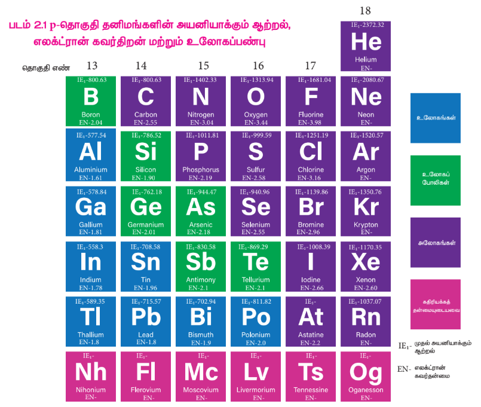

 
ஆகியன உலோகப் போலிகள். தொகுதி 16 இல் உள்ள ஆக்ஸிஜன், சல்பர் மற்றும் செலினியம் ஆகியன அலோகங்கள், டெல்லூரியம் ஒரு உலோகப் போலியாகும். 17 மற்றும் 18 ஆம் தொகுதியைச் சார்ந்த அனைத்து தனிமங்களும் அலோகங்களாகும்.

## 2.1.3 அயனியாக்கும் என்தால்பி:

ஒரு தொகுதியில் மேலிருந்து கீழாக செல்லும்போது தனிமங்களின் அணு ஆரம் அதிகரிப்பதன் காரணமாக அவற்றின் அயனியாக்கும் என்தால்பி தொடர்ந்து குறைகிறது எனவே உலோகத் தன்மை அதிகரிக்கின்றது என்பதை நாம் ஏற்கனவே கற்றிருந்தோம். இத்தகைய பொதுவான போக்கிலிருந்து p- தொகுதி தனிமங்கள் சிறிதளவு விலகலடைகின்றன. 13 ஆம் தொகுதியில் போரானிலிருந்து அலுமினியத்திற்கு செல்லும்போது எதிர்பார்த்தபடியே அயனியாக்கும் என்தால்பி குறைகிறது. ஆனால், அலுமினியத்திலிருந்து தாலியம் வரை மிகக் குறைந்தளவே மாறுபடுகின்றன. s மற்றும் p எலக்ட்ரான்களைவிட குறைந்த திரைமறைவு விளைவு கொண்ட d மற்றும் f எலக்ட்ரான்கள் இருப்பதே இதற்குக் காரணம். இதன் விளைவாக, இணைதிற எலக்ட்ரான்கள் மீதான செயலுறு அணுக்கரு மின்சுமை அதிகரிக்கிறது. இதே போக்கு 14 ஆம் தொகுதியிலும் கண்டறியப்பட்டுள்ளது. எஞ்சியுள்ள தொகுதிகள் (15 முதல் 18 வரை) பொதுவான போக்கைப் பின்பற்றுகின்றன. இந்த தொகுதிகளில் மேலிருந்து கீழாக செல்லச் செல்ல அயனியாக்கும் என்தால்பி மதிப்புகள் குறைகின்றன. இங்கு, d மற்றும் f எலக்ட்ரான்களின் குறைந்த திரை மறைவு விளைவானது, கூடுதலாக சேர்க்கப்பட்ட p எலக்ட்ரான்களின் திரை மறைவு விளைவு அதிகரிப்பினால் ஈடுசெய்யப்படுகிறது. எதிர்பார்த்ததைப் போலவே, தொடர்ந்து வரும் தொகுதிகளிலுள்ள தனிமங்களின் அயனியாக்கும் என்தால்பி மதிப்புகள் முந்தைய தொகுதி தனிமங்களைவிட அதிகமாக உள்ளன.

## 2.1.4 எலக்ட்ரான் கவர்திறன்:

13 ஆம் தொகுதியில் மேலிருந்து கீழாக செல்லும்போது, எலக்ட்ரான் கவர்திறன் மதிப்புகளானது போரானிலிருந்து அலுமினியத்திற்கு முதலில் குறைந்து பின்னர் காலியத்திற்கு சற்றே அதிகரிக்கிறது. அதன் பின்னர் குறிப்பிடத்தக்க மாற்றம் ஏதுமில்லை. 14 ஆம் தொகுதியிலும் இதே போக்கு காணப்படுகிறது. மற்ற தொகுதிகளில், நாம் மேலிருந்து கீழாக செல்லும்போது எலக்ட்ரான் கவர்திறன் மதிப்புகள் குறைகின்றன. இத்தகைய போக்கினை அவற்றின் அணு ஆரங்களுடன் தொடர்புபடுத்த இயலும்.

## 2.1.5 முதல் தனிமங்களின் முரண்பட்ட பண்புகள்:

p-தொகுதி தனிமங்களில், ஒவ்வொரு தொகுதியிலும் உள்ள முதல் தனிமமானது, அத்தொகுதியிலுள்ள மற்ற தனிமங்களிலிருந்து வேறுபடுகின்றன. இத்தகைய முரண்பட்ட பண்புகளுக்கு பின்வரும் காரணிகள் காரணமாக அமைகின்றன.

1. முதல் தனிமத்தின் சிறிய உருவளவு
2. அதிக அயனியாக்கும் என்தால்பி மற்றும் எலக்ட்ரான் கவர் திறன்
3. இணைதிறன் கூட்டில் d ஆர்பிட்டால்கள் இல்லாதிருத்தல்

13 ஆம் தொகுதியின் முதல் தனிமமான போரான் ஒரு உலோக போலியாகும். ஆனால் மற்ற தனிமங்கள் வினைதிறன் மிக்க உலோகங்களாகும். மேலும் போரான் ஆனது 14 ஆம் தொகுதியைச் சார்ந்த சிலிக்கானுடன் மூலைவிட்ட தொடர்பை பெற்றுள்ளது. போரான் மற்றும் சிலிக்கானின் ஆக்சைடுகள் அவற்றின் அமிலப் பண்பில் ஒத்துள்ளன. இவை இரண்டும் எளிதில் நீராற்பகுப்படையும் சகப்பிணைப்பு ஹைட்ரைடுகளை உருவாக்குகின்றன. இதே போல போரான் ட்ரைபுளூரைடைத் தவிர, இவ்விரு தனிமங்களின் ஹேலைடுகளும் எளிதில் நீராற்பகுப்படைகின்றன.

14 ஆம் தொகுதியில், முதல் தனிமமான கார்பன் ஒரு அலோகமாகும். அதேசமயம், மற்ற தனிமங்கள் உலோக போலிகளாகவோ (சிலிக்கான் & ஜெர்மானியம்) அல்லது உலோகங்களாகவோ (டின்&லெட்) உள்ளன. கார்பன் அணுவானது அது இடம்பெற்றுள்ள தொகுதியிலுள்ள மற்ற தனிமங்களைப் போலல்லாமல், \( C=C \), \( C=O \) போன்ற பல்பிணைப்புகளை உருவாக்கும் தன்மையைப் பெற்றுள்ளது. கார்பன் அணுவானது மற்றொரு கார்பன் அணுவுடனோ அல்லது மற்ற அணுக்களுடனோ நீண்ட சங்கிலித் தொடர் சேர்மங்களை உருவாக்கும் திறனைப் பெற்றுள்ளது. இப்பண்பு சங்கிலித் தொடராக்கம் என அறியப்படுகிறது. தொகுதியில் கீழாக செல்லும்போது சங்கிலித் தொடராக்கத்திறன் குறிப்பிடத்தகுந்த அளவில் குறைகிறது. \( (C>>Si>Ge \approx Sn>Pb) \).

15 ஆம் தொகுதியிலும், முதல் தனிமமான நைட்ரஜனானது அத்தொகுதியிலுள்ள மற்ற தனிமங்களிலிருந்து வேறுபடுகிறது. கார்பனைப் போன்றே நைட்ரஜன் அணுவும் பல்பிணைப்புகளை உருவாக்கும் தன்மையைப் பெற்றுள்ளது \( (N \equiv N, C \equiv N, N=O \) போன்றவை...). தொகுதியிலுள்ள மற்ற தனிமங்களைப் போல அல்லாமல் நைட்ஜன் ஒரு டையாகாந்த்தன்மை கொண்ட வாயுவாகும்.

16 ஆம் தொகுதியிலும் முதல் தனிமமான ஆக்ஸிஜனும் ஈரணு மூலக்கூறாக வாயு நிலையில் காணப்படுகிறது. அது அதிக எலக்ட்ரான் கவர்திறன் தன்மையைக் கொண்டிருப்பதால் ஹைட்ரஜன் பிணைப்புகளை உருவாக்குகிறது.

17 ஆம் தொகுதியின் முதல் தனிமமான புளூரின் அதிகபட்ச எலக்ட்ரான் கவர்திறன் கொண்ட தனிமமாகும். தொகுதியிலுள்ள மற்ற தனிமங்களுடன் ஒப்பிடும்போது இது முற்றிலும் வேறுபட்ட பண்புகளைப் பெற்றுள்ளது. ஆக்ஸிஜனைப் போலவே புளூரினும் ஹைட்ரஜன் பிணைப்புகளை உருவாக்குகிறது. புளூரின் -1 ஆக்ஸிஜனேற்ற நிலையை மட்டுமே காட்டுகிறது, ஆனால் மற்ற ஹேலஜன்கள் -1 நிலையுடன் +1, +3, +5 மற்றும் +7 ஆக்ஸிஜனேற்ற நிலைகளையும் காட்டுகின்றன. புளூரின் வலிமை மிக்க ஒரு ஆக்ஸிஜனேற்றக் காரணியாகும், மேலும் ஹேலஜன்களில் புளூரின் மிக அதிக வினைத்திறன் கொண்ட தனிமமாகும்.

## 2.1.6 மந்த இணை விளைவு:

தனிமங்களின் இணைதிறக் கூட்டிலுள்ள எலக்ட்ரான்களின் எண்ணிக்கைக்கேற்ப கார மற்றும் கார மண் உலோகங்கள் முறையே +1 மற்றும் +2 ஆக்ஸிஜனேற்ற நிலைகளை கொண்டிருக்கும் என்பதை நாம் ஏற்கனவே கற்றறிந்தோம். இதேபோல, p—தொகுதி தனிமங்களும், தங்களின் இணைதிற கூட்டிலுள்ள அதிகபட்ச எலக்ட்ரான்களின் எண்ணிக்கைக்கேற்ப வெவ்வேறு ஆக்ஸிஜனேற்ற நிலைகளைப் (தொகுதி ஆக்ஸிஜனேற்ற நிலை) பெற்றுள்ளன. மேலும், அவை மாறுபட்ட ஆக்ஸிஜனேற்ற நிலைகளைக் காட்டுகின்றன. 13 முதல் 16 வரையான தொகுதிகளிலுள்ள, இடைநிலைத் தனிமங்களைத் தொடர்ந்து வரும் கனமான தனிமங்களைப் பொறுத்தவரையில், அதன் தொகுதி ஆக்ஸிஜனேற்ற நிலையைவிட இரண்டு குறைவான ஆக்ஸிஜனேற்ற நிலைகளே அதிக நிலைப்புத் தன்மைக் கொண்டவைகளாக உள்ளன. மேலும் இவைகள் அதன் தொகுதி ஆக்ஸிஜனேற்ற எண்ணைப் பெறுவதில் வழக்கமான நிலை காணப்படுவதில்லை. 13 ஆம் தொகுதி தனிமங்களைப் பொருத்த வரையில், போரானிலிருந்து கனமான தனிமங்களை நோக்கி நாம் கீழே செல்லும்போது, +3 ஆக்ஸிஜனேற்ற நிலைக்கு மாறாக +1 ஆக்ஸிஜனேற்ற நிலையை ஏற்கும் தன்மை அதிகரித்துக் கொண்டே செல்கிறது. எடுத்துக்காட்டாக, \( Al^{+3} \) அயனியானது \( Al^{+1} \) அயனியைக் காட்டிலும் அதிக நிலைப்புத் தன்மை கொண்டது, ஆனால் \( Tl^{+1} \) அயனி \( Tl^{+3} \) அயனியைக் காட்டிலும் அதிக நிலைப்புத் தன்மை கொண்டது. அலுமினியம் (III) குளோரைடு அதிக நிலைப்புத் தன்மை கொண்டது, அதேநேரத்தில் தாலியம் (III) குளோரைடு நிலைப்புத் தன்மையற்றது, மேலும் இது தாலியம் (I) குளோரைடு மற்றும் குளோரின் வாயுவாக விகிதச் சிதைவடைகிறது. தாலியத்தில், ns எலக்ட்ரான்கள் இழக்கப்படாமல், np எலக்ட்ரான்கள் மட்டும் இழக்கப்படுவதால் உருவாகும் குறைந்தபட்ச ஆக்ஸிஜனேற்ற நிலையே அதிக நிலைப்புத் தன்மை கொண்டது என்பதை இது காட்டுகிறது. அதாவது, இடைநிலைத் தனிமங்களைத் தொடர்ந்து வரும் கனமான தனிமங்களில் உள்ள வெளிக்கூட்டு s எலக்ட்ரான்கள் மந்தத் தன்மை கொண்டவைகளாக உள்ளன மேலும் பிணைப்பில் பங்கெடுக்க இயல்பாக முனைவதில்லை. இந்த விளைவு மந்த இணை விளைவு என அறியப்படுகிறது. 14, 15 மற்றும் 16 ஆம் தொகுதிகளிலும் இதே விளைவு காணப்படுகிறது.

## 2.1.7 p-தொகுதி தனிமங்களில் புறவேற்றுமை வடிவத்துவம்:

சில தனிமங்கள் ஒரே இயற் நிலைமையில், ஒன்றுக்கு மேற்பட்ட படிக அல்லது மூலக்கூறு வடிவங்களில் காணப்படுகின்றன. எடுத்துக்காட்டாக, கார்பனானது வைரமாகவும் கிராஃபைட்டாகவும் காணப்படுகிறது. இந்நிகழ்வானது புறவேற்றுமை வடிவத்துவம் அல்லது அலோட்ரோபிசம் என்றழைக்கப்படுகிறது. (கிரேக்க மொழியில் 'allos' என்பது 'மற்றொரு' எனவும் 'trope' என்பது 'மாற்றம்' எனவும் பொருள்படும் சொற்களாகும்) மேலும் இத்தகைய வெவ்வேறு வடிவங்கள் புறவேற்றுமை வடிவங்கள் எனவும் அழைக்கப்படுகின்றன. பல p-தொகுதி தனிமங்கள் புறவேற்றுமை வடிவத்துவத்தைக் காட்டுகின்றன. சில பொதுவான புறவேற்றுமை வடிவங்கள் கீழே அட்டவணைப்படுத்தப்பட்டுள்ளன.

**அட்டவணை 2.2 : p-தொகுதி தனிமங்களின் சில பொதுவான புறவேற்றுமை வடிவங்கள்**

| தனிமம் | பொதுவான புறவேற்றுமை வடிவங்கள் |
|---|---|
| போரான் | படிக வடிவமற்ற போரான், α- சாய்சதுர அறுமுக போரான், β- சாய்சதுர அறுமுக போரான், γ- செங்குத்து சாய்சதுர போரான், α- நான்முக போரான், β- நான்முக போரான் |
| கார்பன் | வைரம், கிராஃபைட், கிராஃபின், ஃபுல்லரீன், கார்பன் நுண்குழாய்கள் |
| சிலிக்கான் | படிக வடிவமற்ற சிலிக்கான், படிக சிலிக்கான் |
| ஜெர்மானியம் | α- ஜெர்மானியம், β- ஜெர்மானியம் |
| டின் | சாம்பல் நிற டின், வெண்ணிற டின், சாய்சதுர டின், சிக்மா டின் |
| பாஸ்பரஸ் | வெண் பாஸ்பரஸ், சிவப்பு பாஸ்பரஸ், கருஞ்சிவப்பு பாஸ்பரஸ், ஊதா நிற பாஸ்பரஸ், கருமை நிற பாஸ்பரஸ் |
| ஆர்சனிக் | மஞ்சள் ஆர்சனிக், சாம்பல் நிற ஆர்சனிக் & கருமை நிற ஆர்சனிக் |
| ஆன்டிமனி | நீலம் கலந்த வெண்ணிற ஆன்டிமனி, மஞ்சள் ஆன்டிமனி, கருமை நிற ஆன்டிமனி |
| ஆக்ஸிஜன் | டை ஆக்ஸிஜன், ஓசோன் |
| கந்தகம் (சல்பர்) | சாய்சதுர கந்தகம், ஒற்றைச்சரிவு கந்தகம் |
| செலினியம் | சிவப்பு செலினியம், சாம்பல் நிற செலினியம், கருமை நிற செலினியம், ஒற்றைச்சரிவு செலினியம் |
| டெல்லூரியம் | படிக வடிவமற்ற டெல்லூரியம் & படிக டெல்லூரியம் |

## 2.2 தொகுதி 13 (போரான் தொகுதி) தனிமங்கள்:

## 2.2.1 வளம்:

போரான், பொதுவாக போரேட்களாக காணப்படுகிறது. அதன் முக்கிய தாதுக்கள் போராக்ஸ் – \( Na_2[B_4O_5(OH)_4].8H_2O \) மற்றும் கெர்னைட் – \( Na_2[B_4O_5(OH)_4].2H_2O \) ஆகியனவாகும். அலுமினியம் மிக அதிகளவில் காணப்படும் உலோகமாகும், இது ஆக்சைடுகளாகவும், அலுமினோசிலிக்கேட் பாறைகளிலும் காணப்படுகிறது. அலுமினியத்தின் முக்கியமான தாதுவான பாக்சைட் (\( Al_2O_3.2H_2O \)) விருந்து அலுமினியம் வணிக ரீதியாக பிரித்தெடுக்கப்படுகிறது. இந்த தொகுதியின் மற்ற தனிமங்கள் மிகக் குறைந்த அளவிலேயே கிடைக்கின்றன. Ga, In மற்றும் Tl போன்ற மற்ற தனிமங்கள் அவற்றின் சல்பைடுகளாக கிடைக்கின்றன.

## 2.2.2 இயற் பண்புகள்:

13 ஆம் தொகுதித் தனிமங்களின் சில இயற் பண்புகள் கீழே அட்டவணைப்படுத்தப்பட்டுள்ளன.

**அட்டவணை 2.3 13 ஆம் தொகுதித் தனிமங்களின் சில இயற் பண்புகள்**

| பண்பு | போரான் | அலுமினியம் | காலியம் | இன்டியம் | தாலியம் |
|---|---|---|---|---|---|
| 293 K இல் இயற் நிலைமை | திண்மம் | திண்மம் | திண்மம் | திண்மம் | திண்மம் |
| அணு எண் | 5 | 13 | 31 | 49 | 81 |
| ஐசோடோப்புகள் | \( ^{11}B \) | \( ^{27}Al \) | \( ^{69}Ga \) | \( ^{115}In \) | \( ^{205}Tl \) |
| அணு நிறை (g.mol\(^{-1}\) at 293 K) | 10.81 | 26.98 | 69.72 | 114.82 | 204.38 |
| எலக்ட்ரான் அமைப்பு | \( [He]2s^2 2p^1 \) | \( [Ne]3s^2 3p^1 \) | \( [Ar]3d^{10} 4s^2 4p^1 \) | \( [Kr]4d^{10} 5s^2 5p^1 \) | \( [Xe] 4f^{14} 5d^{10} 6s^2 6p^1 \) |
| அணு ஆரம் (Å) | 1.92 | 1.84 | 1.87 | 1.93 | 1.96 |
| அடர்த்தி (g.cm\(^{-3}\) at 293 K) | 2.34 | 2.70 | 5.91 | 7.31 | 11.80 |
| உருகுநிலை (K) | 2350 | 933 | 302.76 | 429 | 577 |
| கொதிநிலை (K) | 4273 | 2792 | 2502 | 2300 | 1746 |

## 2.2.3 போரானின் வேதிப் பண்புகள்:

இந்தத் தொகுதியிலுள்ள ஒரே அலோகம் போரான் மட்டுமே, மேலும் இது வினைதிறன் குறைந்தது. எனினும், உயர் வெப்பநிலைகளில் போரான் அதிக வினைத்திறனைக் காட்டுகிறது. போரானின் பெரும்பாலான சேர்மங்கள் எலக்ட்ரான் குறைச் சேர்மங்களாகும், போரானின் சிறிய உருவளவு, உயர் அயனியாக்கும் ஆற்றல் மற்றும் கார்பன், ஹைட்ரஜன் ஆகியவற்றை ஒத்த எலக்ட்ரான் கவர்திறன் மதிப்பு ஆகிய காரணங்களால் வழக்கத்திற்கு மாறான புதிய வகை சகப்பிணைப்புகளை உருவாக்குகின்றன.

**உலோக போரைடுகள் உருவாதல்:**

கார உலோகங்களைத் தவிர மற்ற பெரும்பாலான உலோகங்கள் \( M_xB_y \) (x மதிப்பு 11 வரையிலும், y மதிப்பு 66 அல்லது அதற்கும் அதிகமாக இருக்கும்) எனும் பொதுவாய்ப்பாட்டைக் கொண்ட போரைடுகளை உருவாக்குகின்றன.

**போரான் உடன் உலோகங்களின் நேரடி இணைதல்:**

\[ Cr + nB \xrightarrow{1500 \, K} CrB_n \]

**போரான் ட்ரைஹேலைடுகளின் ஒடுக்கம்:**

ஹைட்ரஜன் உதவியுடன், உலோகத்தை கொண்டு போரான் ட்ரைகுளோரைடை ஒடுக்கும்போது உலோக போரைடுகள் கிடைக்கின்றன.

$$2\text{BCl}_3 + 2\text{W} \xrightarrow[\text{H}_2]{1500\text{ K}} 2\text{WB} + 2\text{Cl}_2 + 2\text{HCl}$$

**ஹைட்ரைடுகள் உருவாதல்:**

போரான் நேரடியாக ஹைட்ரஜனுடன் வினை புரிவதில்லை, எனினும் போரேன்கள் (boranes) எனும் புதுவகை ஹைட்ரைடுகளை உருவாக்குகிறது. டைபோரேன்- \( B_2H_6 \) ஒரு எளிய போரேன் ஆகும். டைபோரேனிலிருந்து மற்ற உயர் போரேன்களை உருவாக்க இயலும். வாயுநிலையிலுள்ள போரான் ட்ரைபுளூரைடை, 450K வெப்பநிலையில், சோடியம் ஹைட்ரைடுடன் வினைப்படுத்தும்போது டைபோரேன் கிடைக்கிறது. அதைத் தொடர்ந்து நிகழும் வெப்பச்சிதைவைத் தடுக்கும்பொருட்டு டைபோரேன் விளைபொருளானது உடனடியாக நீக்கப்படுகிறது.

\[ 2BF_3 + 6NaH \xrightarrow{450 \, K} B_2H_6 + 6NaF \]

**போரான் ட்ரைஹேலைடுகள் உருவாதல்:**

போரான், உயர் வெப்பநிலைகளில் ஹேலஜன்களுடன் இணைந்து போரான் ட்ரைஹேலைடுகளை உருவாக்குகிறது.

\[ 2B + 3X_2 \xrightarrow{\Delta} 2BX_3 \]

**போரான் நைட்ரைடு உருவாதல்:**

போரான், உயர் வெப்பநிலைகளில் டைநைட்ரஜனுடன் எரிந்து போரான் நைட்ரைடை உருவாக்குகிறது.

\[ 2B + N_2 \xrightarrow{\Delta} 2BN \]

**ஆக்சைடுகள் உருவாதல்:**

ஏறத்தாழ 900K வெப்பநிலையில் ஆக்ஸிஜனுடன் வினைப்படுத்தும்போது போரான், அதன் ஆக்சைடை உருவாக்குகிறது.

\[ 4B + 3O_2 \xrightarrow{900 \, K} 2B_2O_3 \]

**அமிலங்கள் மற்றும் காரங்களுடன் வினை:**

ஹேலோ அமிலங்களுடன் போரான் வினைபுரிவதில்லை. எனினும், சல்ஃபியூரிக் அமிலம் மற்றும் நைட்ரிக் அமிலம் போன்ற ஆக்ஸிஜனேற்ற காரணிகளுடன் வினைப்பட்டு போரிக் அமிலத்தை உருவாக்குகிறது.

\[ 2B + 3H_2SO_4 \rightarrow 2H_3BO_3 + 3SO_2 \]

\[ B + 3HNO_3 \rightarrow H_3BO_3 + 3NO_2 \]

போரான், உருகிய சோடியம் ஹைட்ராக்சைடுடன் வினைப்பட்டு சோடியம் போரேட்டைத் தருகிறது.

\[ 2B + 6NaOH \rightarrow 2Na_3BO_3 + 3H_2 \]

**போரானின் பயன்கள்:**

1. போரான், நியூட்ரான்களை உறிஞ்சும் திறனைப் பெற்றுள்ளதால் அதன் \( ^{10}B_5 \) ஐசோடோப்பானது அணு உலைகளில் மட்டுப்படுத்தியாக பயன்படுகிறது.
2. படிகவடிவமற்ற போரான் – ராக்கெட் எரிபொருள் எரியூட்டியாக பயன்படுகிறது.
3. போரான், தாவர செல் சுவரின் முக்கிய பகுதிப் பொருளாக உள்ளது.
4. போரான் சேர்மங்கள் பல்வேறு பயன்பாடுகளை பெற்றுள்ளன. எடுத்துக்காட்டாக, கண் மருந்துகள், புரைதடுப்பான்கள், சலவைத் தூள் ஆகியவற்றில் போரிக் அமிலம் மற்றும் போராக்ஸ் உள்ளன. பைரக்ஸ் கண்ணாடி தயாரிப்பில் போரிக் அமிலம் பயன்படுகிறது.

## 2.2.4. போராக்ஸ் [\( Na_2B_4O_7.10H_2O \)]:

**தயாரித்தல்:**

போராக்ஸ் என்பது டெட்ராபோரிக் அமிலத்தின் சோடிய உப்பாகும். இது கோலிமனைட் தாதுவை, சோடியம் கார்பனேட் கரைசலுடன் கொதிக்க வைப்பதன் மூலம் பெறப்படுகிறது.

\[ 2Ca_2B_6O_{11} + 3Na_2CO_3 + H_2O \xrightarrow{\Delta} 3Na_2B_4O_7 + 3CaCO_3 + Ca(OH)_2 \]

போராக்ஸ், பொதுவாக \( Na_2B_4O_7.10H_2O \) என குறிப்பிடப்படுகிறது. ஆனால், இது நான்கணு அலகுகளை \( [B_4O_5(OH)_4]^{2-} \) கொண்டுள்ளது. இந்த வடிவமானது பட்டக வடிவம் (prismatic form) என அறியப்படுகிறது. அணிகலன் அல்லது எண்முகி வடிவ போராக்ஸ் (\( Na_2B_4O_7.5H_2O \)) மற்றும் போராக்ஸ் கண்ணாடி (\( Na_2B_4O_7 \)) என மேலும் இரண்டு வடிவங்களில் போராக்ஸ் காணப்படுகிறது.

**பண்புகள்**

போராக்ஸ் காரத்தன்மை கொண்டது, மேலும் அதன் வெந்நீர்க் கரைசல் சிதைந்து போரிக் அமிலம் மற்றும் சோடியம் ஹைட்ராக்சைடைத் தருவதால் காரத்தன்மை கொண்டது.

\[ Na_2B_4O_7 + 7H_2O \rightarrow 4H_3BO_3 + 2NaOH \]

இதை வெப்பப்படுத்தும்போது ஒளிபுகும் போராக்ஸ் மணிகள் உருவாகின்றன.

$$\text{Na}_2\text{B}_4\text{O}_7 \cdot 10\text{H}_2\text{O} \xrightarrow[-10\text{H}_2\text{O}]{\Delta} \text{Na}_2\text{B}_4\text{O}_7 \longrightarrow 2\text{NaBO}_2 + \text{B}_2\text{O}_3$$

போராக்ஸ், அமிலங்களுடன் வினைப்பட்டு சிறிதளவே கரையும் போரிக் அமிலத்தைத் தருகிறது.

\[ Na_2B_4O_7 + 2HCl + 5H_2O \rightarrow 4H_3BO_3 + 2NaCl \]

\[ Na_2B_4O_7 + H_2SO_4 + 5H_2O \rightarrow 4H_3BO_3 + Na_2SO_4 \]

இதை அம்மோனியம் குளோரைடுடன் வினைப்படுத்தும்போது போரான் நைட்ரைடை உருவாக்குகிறது.

\[ Na_2B_4O_7 + 2NH_4Cl \rightarrow 2NaCl + 2BN + B_2O_3 + 4H_2O \]

**போராக்ஸின் பயன்கள்:**

1. நிறமுள்ள உலோக அயனிகளை கண்டறிவதில் போராக்ஸ் பயன்படுகிறது.
2. இது, கண் கண்ணாடி, போரோசிலிக்கேட் கண்ணாடி, எனாமல், மற்றும் பளபளப்பான மண்பாண்டங்கள் தயாரித்தலில் பயன்படுகிறது.
3. இது உலோகவியலில் இளக்கியாகப் பயன்படுகிறது.
4. உணவு பதப்படுத்தியாகவும் செயலாற்றும் தன்மையுடையது.

## 2.2.5. போரிக் அமிலம் [\( H_3BO_3 \) அல்லது \( B(OH)_3 \)]:

**தயாரித்தல்:**

போராக்ஸ் மற்றும் கோலிமனைட் ஆகியவற்றிலிருந்து போரிக் அமிலத்தை பிரித்தெடுக்க இயலும்

\[ Na_2B_4O_7 + H_2SO_4 + 5H_2O \rightarrow Na_2SO_4 + 4H_3BO_3 \]

\[ Ca_2B_6O_{11} + 11H_2O + 4SO_2 \rightarrow 2Ca(HSO_3)_2 + 6H_3BO_3 \]

**பண்புகள்:**

போரிக் அமிலமானது நிறமற்ற ஒளிபுகும் படிகமாகும். இது ஒரு வலிமை குறைந்த ஒருகாரத்துவ அமிலம். மேலும் இது புரோட்டானை வழங்குவதற்கு பதிலாக ஹைட்ராக்ஸில் அயனியை ஏற்றுக்கொள்கிறது.

\[ B(OH)_3 + 2H_2O \rightleftharpoons H_3O^+ + [B(OH)_4]^- \]

இது சோடியம் ஹைட்ராக்சைடுடன் வினைப்பட்டு சோடியம் மெட்டாபோரேட் மற்றும் சோடியம் டெட்ராபோரேட்டை உருவாக்குகிறது.

\[ H_3BO_3 + NaOH \rightarrow NaBO_2 + 2H_2O \]

\[ 4H_3BO_3 + 2NaOH \rightarrow Na_2B_4O_7 + 7H_2O \]

**வெப்பத்தின் விளைவு:**

போரிக் அமிலத்தை வெப்பப்படுத்தும்போது, 373K வெப்பநிலையில் மெட்டா போரிக் அமிலத்தையும், 413K வெப்பநிலையில் டெட்ரா போரிக் அமிலத்தையும் தருகிறது. செஞ்சூடு நிலைக்கு வெப்பப்படுத்தும்போது கண்ணாடி போன்ற போரிக் நீரிலியை உருவாக்குகிறது.

$$4\text{H}_3\text{BO}_3 \xrightarrow{373\text{ K}} 4\text{HBO}_2 + 4\text{H}_2\text{O}$$

$$4\text{HBO}_2 \xrightarrow{413\text{ K}} \text{H}_2\text{B}_4\text{O}_7 + \text{H}_2\text{O}$$

$$\text{H}_2\text{B}_4\text{O}_7 \xrightarrow{\text{செஞ்சூட்டு வெப்பநிலை}} 2\text{B}_2\text{O}_3 + \text{H}_2\text{O}$$

**அம்மோனியாவுடன் வினை:**

அம்மோனியா முன்னிலையில் யூரியாவுடன் போரிக் அமிலத்தை சேர்த்து 800 – 1200 K வெப்பநிலையில் உருக்கும்போது போரான் நைட்ரைடு கிடைக்கிறது.

\[ B(OH)_3 + NH_3 \xrightarrow{\Delta} BN + 3H_2O \]

**எத்தில் போரேட் ஆய்வு:**

அடர் கந்தக அமிலத்தின் முன்னிலையில், போரிக் அமிலம் அல்லது போரேட் உப்பை எத்தில் ஆல்கஹாலுடன் வெப்பப்படுத்தும்போது ட்ரைஎத்தில்போரேட் எனும் எஸ்டர் உருவாகிறது. இந்த எஸ்டரின் ஆவி பச்சை நிற சுடருடன் எரிகிறது, மேலும் இது போரேட்டை கண்டறிய பயன்படும் ஒரு வினையாகும்.

$$\text{H}_3\text{BO}_3 + 3\text{C}_2\text{H}_5\text{OH} \xrightarrow[\text{H}_2\text{SO}_4]{\text{அடர்}} \text{B}(\text{OC}_2\text{H}_5)_3 + 3\text{H}_2\text{O}$$

**குறிப்பு:** ட்ரைஆல்க்கைல் போரேட் ஆனது டெட்ரா ஹைட்ரோ ஃபியூரானில் கரைந்த சோடியம் ஹைட்ரைடுடன் வினைப்பட்டு \( Na[BH(OR)_3] \) எனும் அணைவுச் சேர்மத்தைத் தருகிறது, இது வலிமை மிகுந்த ஒடுக்கும் காரணியாக செயல்படுகிறது.

**போரான் ட்ரைபுளூரைடு உருவாதல்:**

போரிக் அமிலமானது அடர் கந்தக அமிலத்தின் முன்னிலையில் கால்சியம் புளூரைடுடன் வினைப்பட்டு போரான் ட்ரைபுளூரைடைத் தருகிறது.

\[ 3CaF_2 + 3H_2SO_4 + 2B(OH)_3 \rightarrow 3CaSO_4 + 2BF_3 + 6H_2O \]

போரிக் அமிலத்தை, சோடா சாம்பலுடன் வெப்பப்படுத்தும்போது போராக்ஸ் உருவாகிறது.

\[ Na_2CO_3 + 4B(OH)_3 \rightarrow Na_2B_4O_7 + CO_2 + 6H_2O \]

**போரிக் அமிலத்தின் அமைப்பு:**

போரிக் அமிலமானது, இருபரிமாண அடுக்கு அமைப்பைக் கொண்டுள்ளது. இது \( [BO_3]^{3-} \) அலகுகளைக் கொண்டுள்ளது, இந்த அலகுகள் ஹைட்ரஜன் பிணைப்புகளால் படம் 2.2 இல் காட்டியுள்ளவாறு ஒன்றுடன் ஒன்று பிணைக்கப்பட்டுள்ளன.

  

**போரிக் அமிலத்தின் பயன்கள்:**

1. பளபளப்பான மண்பாண்டங்கள், எனாமல், மற்றும் நிறமிகள் தயாரித்தலில் போரிக் அமிலம் பயன்படுகிறது.
2. இது புரைதடுப்பானாகவும்,, கண் மருந்தாகவும் பயன்படுகிறது.
3. இது உணவு பாதுகாப்பானாகவும் பயன்படுகிறது.

## 2.2.6 டைபோரேன்

**தயாரித்தல்:**

உலோக ஹைட்ரைடை போரானுடன் வினைப்படுத்துவதன் மூலம் டைபோரேனைத் தயாரிக்க முடியும். இந்த முறையானது தொழிற்சாலை தயாரிப்பிற்காக பயன்படுத்தப்படுகிறது.

அயோடினை, டைக்லைமில் கரைந்துள்ள சோடியம் போரோஹைட்ரைடுடன் வினைப்படுத்துவதன் மூலமாகவும் சிறிதளவு டைபோரேனை தயாரிக்க முடியும்.

\[ 2NaBH_4 + I_2 \rightarrow B_2H_6 + 2NaI + H_2 \]

மெக்னீஷியம் போரைடை HCl உடன் வெப்பப்படுத்தும்போது எளிதில் ஆவியாகும் போரேன்கள் பெறப்படுகின்றன.

\[ 2Mg_3B_2 + 12HCl \rightarrow 6MgCl_2 + B_4H_{10} + H_2 \]
\[ B_4H_{10} + H_2 \rightarrow 2B_2H_6 \]

**பண்புகள்:**

போரேன்கள் நிறமற்ற, டையா காந்தத் தன்மை கொண்ட சேர்மங்களாகும். இவை குறைந்த வெப்ப நிலைப்புத்தன்மை உடையவைகளாகும். அறை வெப்பநிலையில், டைபோரேன் நறுமணம் மிக்க, மிகவும் நச்சுத் தன்மை கொண்ட வாயுவாகும். மேலும் இது அதிக வினைத் திறன் கொண்டது.

இது உயர் வெப்பநிலைகளில், ஹைட்ரஜன் வாயுவை வெளியேற்றி உயர் போரேன்களைத் தருகின்றது.

$$5\text{B}_2\text{H}_6 \xrightarrow[\text{U-குழாய்}]{388\text{ K}} 2\text{B}_5\text{H}_{11} + 4\text{H}_2$$

$$2\text{B}_2\text{H}_6 \xrightarrow{198\text{ - }373\text{ K}} \text{B}_4\text{H}_{10} + \text{H}_2$$

$$5\text{B}_2\text{H}_6 \xrightarrow[\text{மூடப்பட்ட குழாய்}]{373\text{ K}} \text{B}_{10}\text{H}_{14} + 8\text{H}_2$$

$$5\text{B}_2\text{H}_6 \xrightarrow{473\text{ - }523\text{ K}} 2\text{B}_5\text{H}_9 + 6\text{H}_2$$

$$10\text{B}_2\text{H}_6 \xrightarrow{523\text{ K}} 2\text{B}_5\text{H}_9 + 2\text{B}_5\text{H}_{10} + 11\text{H}_2$$

$$\text{B}_2\text{H}_6 \xrightarrow{\text{செஞ்சூட்டு வெப்பநிலை}} 2\text{B} + 3\text{H}_2$$

டைபோரேன், நீர் மற்றும் காரங்களுடன் வினைப்பட்டு முறையே போரிக் அமிலம் மற்றும் மெட்டா போரேட்களைத் தருகின்றது.

\[ B_2H_6 + 6H_2O \rightarrow 2H_3BO_3 + 6H_2 \]
\[ B_2H_6 + 2NaOH + 2H_2O \rightarrow 2NaBO_2 + 6H_2 \]

**காற்றுடன் வினை:**

அறை வெப்பநிலையில், தூய நிலையிலுள்ள டைபோரேன் காற்று அல்லது ஆக்ஸிஜனுடன் வினைபுரிவதில்லை. ஆனால் மாசு கலந்த நிலையில் அதிகளவு வெப்பத்தை உமிழ்ந்து, \( B_2O_3 \) ஐ உருவாக்குகிறது.

\[ B_2H_6 + 3O_2 \rightarrow B_2O_3 + 3H_2O \quad \Delta H = -2165 \text{ KJ mol}^{-1} \]

டைபோரேன், மெத்தில் ஆல்கஹாலுடன் வினைப்பட்டு ட்ரைமெத்தில் போரேட்டைத் தருகிறது.

\[ B_2H_6 + 6CH_3OH \rightarrow 2B(OCH_3)_3 + 6H_2 \]

**ஹைட்ரோபோரேனேற்றம்:**

அறை வெப்பநிலையில், ஈதர் ஊடகத்தில், ஆல்கீன்கள் மற்றும் ஆல்க்கைன்களுடன் போரேன் சேர்க்கை (addition) வினைக்கு உட்படுகிறது. இவ்வினை ஹைட்ரோபோரோனேற்றம் என்றழைக்கப்படுகிறது. தொகுப்பு கரிமவேதியியலில், குறிப்பாக எதிர் மார்கோனிகாவ் சேர்க்கை வினைகளில் இது அதிகளவில் பயன்படுகிறது.

\[ B_2H_6 + 6RCH=CHR \rightarrow 2(RCH_2-CHR)_3B \]

**அயனி ஹைட்ரைடுகளுடன் வினை:**

உலோக ஹைட்ரைடுகளுடன் வினைப்பட்டு உலோக போரோ ஹைட்ரைடுகளைத் தருகிறது.

\[ B_2H_6 + 2LiH \xrightarrow{\text{ஈதர்}} 2LiBH_4 \]
\[ B_2H_6 + 2NaH \xrightarrow{\text{டிகிலைம்}} 2NaBH_4 \]

**அம்மோனியாவுடன் வினை:**

குறைந்த வெப்பநிலைகளில், டைபோரேன், அதிகளவு அம்மோனியாவுடன் வினைப்பட்டு டைபோரேன் டைஅம்மோனேட் உருவாகிறது. ஆனால் உயர் வெப்பநிலைகளில் வெப்பப்படுத்தும்போது, இது போராசோல் எனும் சேர்மத்தைத் தருகிறது.

\[ 3B_2H_6 + 6NH_3 \xrightarrow{-153K} 3(B_2H_6 \cdot 2NH_3) \text{ (or) } 3[BH_2(NH_3)_2]^+[BH_4]^-  \]

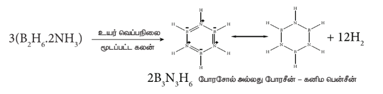

**டைபோரேன் வடிவமைப்பு:**

டைபோரேனில், இரண்டு \( BH_2 \) அலகுகள் இரண்டு ஹைட்ரஜன் பாலங்களால் பிணைக்கப்பட்டுள்ளன. எனவே இது எட்டு B-H பிணைப்புகளைக் கொண்டுள்ளது. எனினும், டைபோரேன் 12 இணைதிற எலக்ட்ரான்களை மட்டுமே கொண்டுள்ளது. இவை இயல்பான சகப்பிணைப்பிற்கு போதுமானதாக இல்லை. இதில் காணப்படும் நான்கு முனைய (terminal) B-H பிணைப்புகள் இயல்பான சகப்பிணைப்புகளாகும் (இரு மைய – இரு எலக்ட்ரான் பிணைப்பு அல்லது 2c-2e பிணைப்பு). எஞ்சியுள்ள நான்கு எலக்ட்ரான்கள் பால பிணைப்புகளுக்கு (bridged bonds) பயன்படுத்திக்கொள்ளப்பட வேண்டும். அதாவது, இரண்டு மூன்று மைய B-H-B பிணைப்புகள் ஒவ்வொன்றும் இரண்டு எலக்ட்ரான்களைப் பயன்படுத்திக்கொள்கின்றன. எனவே, இவை மூன்று மைய இரு எலக்ட்ரான் (3c-2e) பிணைப்புகளாகும். படம் 2.3 இல் காட்டியுள்ளவாறு பிணைப்புப் பாலங்களிலுள்ள ஹைட்ரஜன் அணுக்கள் ஒரே தளத்தில் அமைகின்றன. டைபோரேனில், போரான் அணுவானது \( sp^3 \) இனக்கலப்பிலுள்ளது. நான்கு \( sp^3 \) இனக்கலப்பு ஆர்பிட்டால்களில் மூன்று ஆர்பிட்டால்கள் ஒற்றை எலக்ட்ரானைக் கொண்டுள்ளன, நான்காம் ஆர்பிட்டால் காலியாக உள்ளது. ஒவ்வொரு போரான் அணுவிலிருந்தும், இரண்டு பாதி நிரம்பிய இனக்கலப்பு ஆர்பிட்டால்கள், இரண்டு ஹைட்ரஜன் அணுக்களின் 1s ஆர்பிட்டால்களுடன் மேற்பொருந்தி நான்கு 2c-2e முனைய பிணைப்புகளை உருவாக்குகின்றன. இந்நிலையில் ஒவ்வொரு போரான் அணுவிலும் ஒரு காலி ஆர்பிட்டாலும், ஒரு பாதி நிரம்பிய இனக்கலப்பு ஆர்பிட்டாலும் காணப்படுகின்றன. ஒரு போரான் அணுவின் பாதி நிரம்பிய இனக்கலப்பு ஆர்பிட்டாலும், மற்றொரு போரான் அணுவின் காலியாக உள்ள இனக்கலப்பு ஆர்பிட்டாலும், ஹைட்ரஜன் அணுவின் பாதி நிரம்பிய 1s ஆர்பிட்டாலும் ஒன்றோடொன்று மேற்பொருந்துவதால் B-H-B பிணைப்பு (மூமைய-இரு எலக்ட்ரான் பிணைப்பு) உருவாகிறது.

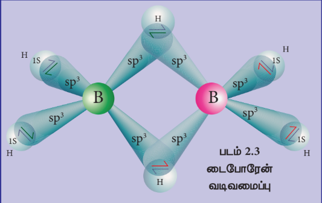

**டைபோரேனின் பயன்கள்:**

1. உந்திகளில், உயர் ஆற்றல் எரிபொருளாக டைபோரேன் பயன்படுகிறது.
2. இது கரிம வேதியியலில் ஒடுக்கும் காரணியாக பயன்படுகிறது.
3. இது உலோகங்களை ஒட்டவைக்கும் சுடரில் (welding torch) பயன்படுகிறது.

## 2.2.7 போரான் ட்ரைபுளூரைடு:

**தயாரித்தல்:**

அடர் கந்தக அமிலத்தின் முன்னிலையில் கால்சியம் புளூரைடை, போரான் ட்ரை ஆக்சைசைடுடன் வினைப்படுத்தும்போது போரான் ட்ரைபுளூரைடு பெறப்படுகிறது.

\[ B_2O_3 + 3CaF_2 + 3H_2SO_4 \xrightarrow{\Delta} 2BF_3 + 3CaSO_4 + 3H_2O \]

போரான் ட்ரை ஆக்சைடை கார்பன் மற்றும் புளூரின் ஆகியவற்றுடன் வினைப்படுத்தியும் இதனைப் பெற முடியும்.

\[ B_2O_3 + 3C + 3F_2 \rightarrow 2BF_3 + 3CO \]

ஆய்வகத்தில் பென்சீன் டையசோனியம் டெட்ராஃபுளூரோ போரேட்டை வெப்பச் சிதைத்தலின் மூலம் தூய \( BF_3 \) தயாரிக்கப்படுகிறது.

\[ C_6H_5N_2BF_4 \xrightarrow{\Delta} BF_3 + C_6H_5F + N_2 \]

**பண்புகள்:**

போரான் ட்ரைபுளூரைடு ஒருதள அமைப்பைப் பெற்றுள்ளது. இது ஒரு எலக்ட்ரான் குறைச் சேர்மமாகும், மேலும் எலக்ட்ரான் இரட்டைகளை ஏற்றுக்கொண்டு ஈதல் சகப்பிணைப்புகளை உருவாக்குகிறது. இவை \( [BX_4]^- \) வகை அணைவுச் சேர்மத்தை உருவாக்குகின்றன.

\[ BF_3 + NH_3 \rightarrow F_3B \leftarrow NH_3 \]

\[ BF_3 + H_2O \rightarrow F_3B \leftarrow OH_2 \]

நீராற் பகுத்தலில் போரிக் அமிலம் கிடைக்கிறது. இது பின்னர் ஹைட்ரோ புளூரோபோரிக் அமிலமாக மாற்றப்படுகிறது.

$$
4\text{BF}_3 + 12\text{H}_2\text{O} \rightarrow 4\text{H}_3\text{BO}_3 + 12\text{HF}
$$

$$
3\text{H}_3\text{BO}_3 + 12\text{HF} \rightarrow 3\text{H}^+ + 3[\text{BF}_4]^- + 9\text{H}_2\text{O}
$$

---
$$
4\text{BF}_3 + 3\text{H}_2\text{O} \rightarrow \text{H}_3\text{BO}_3 + 3\text{H}^+ + 3[\text{BF}_4]^-
$$

**போரான் ட்ரைபுளூரைடின் பயன்கள்:**

1. கரிம வேதியியலில் வினைவேக மாற்றியாக பயன்படும் \( HBF_4 \) ஐ தயாரிக்க போரான் ட்ரைபுளூரைடு பயன்படுகிறது.
2. இது புளூரினேற்ற காரணியாகவும் பயன்படுகிறது.

## 2.2.8 அலுமினியம் குளோரைடு:

**தயாரித்தல்:**

உலோக அலுமினியம் அல்லது அலுமினியம் ஹைட்ராக்சைடை, ஹைட்ரோ குளோரிக் அமிலத்துடன் வினைப்படுத்தும்போது அலுமினியம் ட்ரைகுளோரைடு கிடைக்கிறது. இந்த வினைக்கலவையானது ஆவியாக்கப்பட்டு நீரற்ற அலுமினியம் குளோரைடு பெறப்படுகிறது.

\[ 2Al + 6HCl \rightarrow 2AlCl_3 + 3H_2 \]
\[ Al(OH)_3 + 3HCl \rightarrow AlCl_3 + 3H_2O \]

**மெக்காஃபி செயல்முறை:**

அலுமினா மற்றும் கல்கரி சேர்ந்த கலவையை குளோரினுடன் சேர்த்து வெப்பப்படுத்தி அலுமினியம் குளோரைடு பெறப்படுகிறது.

\[ 2Al_2O_3 + 3C + 6Cl_2 \rightarrow 4AlCl_3 + 3CO_2 \]

இது, தொழிற் முறையில், ஏறக்குறைய 1000K வெப்பநிலையில் அலுமினியத்தை குளோரினேற்றம் செய்து பெறப்படுகிறது.

\[ 2Al + 3Cl_2 \xrightarrow{1000 \, K} 2AlCl_3 \]

**பண்புகள்:**

நீரற்ற அலுமினியம் குளோரைடு நிறமற்ற, நீர் உறிஞ்சும் பொருளாகும். அலுமினியம் குளோரைடின் நீர்க்கரைசல் அமிலத்தன்மை கொண்டது. இது ஈரக்காற்றில் புகைந்து ஹைட்ரஜன் குளோரைடை உருவாக்குகிறது.

\[ AlCl_3 + 3H_2O \rightarrow Al(OH)_3 + 3HCl \]

இது அம்மோனியம் ஹைட்ராக்சைடுடன் வினைப்பட்டு அலுமினியம் ஹைட்ராக்சைடைத் தருகிறது.

\[ AlCl_3 + 3NH_4OH \rightarrow Al(OH)_3 + 3NH_4Cl \]

இது, அதிகளவு சோடியம் ஹைட்ராக்சைடுடன் வினைப்பட்டு சோடியம் அலுமினேட்டை உருவாக்குகிறது.

\[ AlCl_3 + 4NaOH \rightarrow NaAlO_2 + 2H_2O + 3NaCl \]

இது லூயி அமிலங்களைப் போல செயல்படுகிறது, அம்மோனியா, பாஸ்பீன் மற்றும் கார்பனைல் குளோரைடு போன்றவற்றுடன் சேர்க்கைச் சேர்மங்களை உருவாக்குகின்றன. எடுத்துக்காட்டு: \( AlCl_3.6NH_3 \).

**அலுமினியம் குளோரைடின் பயன்கள்:**

1. நீரற்ற அலுமினியம் குளோரைடு, பிரீடல் கிராஃப்ட் வினைகளில் வினைவேக மாற்றியாக பயன்படுகிறது.
2. இது, கனிம எண்ணெய்களை சிதைத்து பெட்ரோல் தயாரித்தலில் பயன்படுகிறது.
3. இது, சாயங்கள், மருந்துகள் மற்றும் வாசனைத் திரவியங்கள் தயாரிப்பில் வினைவேக மாற்றியாக பயன்படுகிறது.

## 2.2.9 படிகாரங்கள்:

பொட்டாசியம், அலுமினியம் சல்பேட்டின் இரட்டை உப்பானது \( [K_2SO_4.Al_2(SO_4)_3.24H_2O] \) படிகாரம் என பெயரிடப்பட்டுள்ளது. தற்போது, \( M'_2SO_4.M''_2(SO_4)_3.24H_2O \), வாய்ப்பாடு கொண்ட அனைத்து இரட்டை உப்புகளுக்கும் இப்பெயர் பயன்படுத்தப்படுகிறது. இங்கு M' என்பது ஒற்றை நேர்மின் கொண்ட உலோக அயனி அல்லது \( [NH_4]^+ \) மற்றும் M" என்பது மூன்று நேர்மின்சுமை கொண்ட உலோக அயனி ஆகும்.

**எடுத்துக்காட்டுகள்:**

பொட்டாஷ் படிகாரம் \( [K_2SO_4.Al_2(SO_4)_3.24H_2O] \); சோடியம் படிகாரம் \( [Na_2SO_4.Al_2(SO_4)_3.24H_2O] \), அம்மோனியம் படிகாரம் \( [(NH_4)_2SO_4.Al_2(SO_4)_3.24H_2O] \), குரோம் படிகாரம் \( [K_2SO_4.Cr_2(SO_4)_3.24H_2O] \). பொதுவாக படிகாரங்கள் குளிர்ந்த நீரைவிட, வெந்நீரில் அதிகமாக கரையக்கூடியவை.கரைசல்களில் அவை அவற்றின் உட்கூறு அயனிகளின் பண்புகளை வெளிக்காட்டுகின்றன.

**தயாரித்தல்:**

அலுனைட் – படிகாரக் கல் என்பது இயற்கையில் காணப்படும் படிகமாகும், இதன் வாய்ப்பாடு \( K_2SO_4.Al_2(SO_4)_3.4Al(OH)_3 \), படிகாரக் கல்லை அதிகளவு கந்தக அமிலத்துடன் வினைப்படுத்தும்போது, அலுமினியம் ஹைட்ராக்சைடு முற்றிலும் அலுமினியம் சல்பேட்டாக மாற்றப்படுகிறது. இதனுடன் கணக்கிடப்பட்ட அளவு பொட்டாசியம் சல்பேட் சேர்த்து கரைசலை படிகமாக்கும்போது பொட்டாஷ் படிகாரம் கிடைக்கிறது. இது மறுபடிகமாக்கல் மூலம் தூய்மைப்படுத்தப்படுகிறது.

\[ K_2SO_4.Al_2(SO_4)_3.4Al(OH)_3 + 6H_2SO_4 \rightarrow K_2SO_4 + 3Al_2(SO_4)_3 + 12H_2O \]
\[ K_2SO_4 + Al_2(SO_4)_3 + 24H_2O \rightarrow K_2SO_4Al_2(SO_4)_3.24H_2O \]

**பண்புகள்:**

பொட்டாஷ் படிகாரம் ஒரு வெண்மையான படிகமாகும், இது நீரில் கரைகிறது ஆனால் ஆல்கஹாலில் கரைவதில்லை. இதன் நீர்க்கரைசலில் அலுமினியம் சல்பேட் நீராற்பகுப்படைவதால் கரைசல் அமிலத்தன்மை கொண்டதாக மாறுகிறது. பொட்டாஷ் படிகாரத்தை வெப்பப்படுத்தும்போது 365K வெப்பநிலையில் உருகுகிறது. 475 K வெப்பநிலையில் படிக நீரை இழந்து உருப்பெருக்கம் அடைகிறது. இது எரிக்கப்பட்ட படிகாரம் என அழைக்கப்படுகிறது. இதை செஞ்சூட்டு நிலைக்கு வெப்பப்படுத்தும்போது சிதைந்து பொட்டாசியம் சல்பேட், அலுமினா மற்றும் சல்பர் ட்ரை ஆக்சைடு ஆகியவற்றைத் தருகிறது.

\[ K_2SO_4.Al_2(SO_4)_3.24H_2O \xrightarrow{500K} K_2SO_4.Al_2(SO_4)_3 + 24H_2O \]
\[ K_2SO_4.Al_2(SO_4)_3 \xrightarrow{\text{செஞ்சூட்டு வெப்பநிலை}} K_2SO_4 + Al_2O_3 + 3SO_3 \]

பொட்டாஷ் படிகாரத்தை, அம்மோனியம் ஹைட்ராக்சைடுடன் வினைப்படுத்தும்போது அலுமினியம் ஹைட்ராக்சைடு கிடைக்கிறது.

\[ K_2SO_4.Al_2(SO_4)_3.24H_2O + 6NH_4OH \rightarrow K_2SO_4 + 3(NH_4)_2SO_4 + 24H_2O + 2Al(OH)_3 \]

**படிகாரத்தின் பயன்கள்**

1. இது நீர் சுத்திகரிப்பில் பயன்படுகிறது.
2. இது நீர் ஒட்டா ஆடைகள் தயாரித்தலிலும், ஜவுளித் துறையிலும் பயன்படுகிறது.
3. இது சாயமிடுதல், காகிதம் மற்றும் தோல் பதனிடும் தொழிற்சாலைகளில் பயன்படுகிறது.
4. இது இரத்தக் கசிவை நிறுத்தும் "குருதி தடுப்பான்" ஆக பயன்படுகிறது.

## 2.3 தொகுதி 14 (கார்பன் தொகுதி) தனிமங்கள்:

## 2.3.1 வளம்:

கார்பன், தனித்த நிலையில் கிராஃபைட்டாக காணப்படுகிறது. நிலக்கரி, கச்சா எண்ணெய் மற்றும் கால்சைட், மேக்னசைட் போன்ற கார்பனேட் பாறைகளில் கார்பன் மற்ற தனிமங்களுடன் சேர்ந்த நிலையில் மிக அதிகளவில் காணப்படுகிறது. சிலிக்கான் ஆனது சிலிக்காவாக (மணல் மற்றும் குவார்ட்ஸ் படிகம்) காணப்படுகிறது. கனிம சிலிக்கேட்டுகள் மற்றும் களிமண் ஆகியன சிலிக்கானின் மற்ற முக்கியமான மூலங்களாகும்.

## 2.3.2 இயற் பண்புகள்:

14 ஆம் தொகுதி தனிமங்களின் சில இயற் பண்புகள் கீழே அட்டவணைப்படுத்தப்பட்டுள்ளன.

**அட்டவணை 2.4 - 14 ஆம் தொகுதி தனிமங்களின் இயற் பண்புகள்**

| பண்பு | கார்பன் | சிலிக்கான் | ஜெர்மானியம் | டின் | லெட் |
|---|---|---|---|---|---|
| 293 K இல் இயற் நிலைமை | திண்மம் | திண்மம் | திண்மம் | திண்மம் | திண்மம் |
| அணு எண் | 6 | 14 | 32 | 50 | 82 |
| ஐசோடோப்புகள் | \( ^{12}C, ^{13}C, ^{14}C \) | \( ^{28}Si, ^{30}Si \) | \( ^{73}Ge, ^{74}Ge \) | \( ^{120}Sn \) | \( ^{208}Pb \) |
| அணு நிறை (g.mol\(^{-1}\) at 293 K) | 12.01 | 28.09 | 72.63 | 118.71 | 207.2 |
| எலக்ட்ரான் அமைப்பு | \( [He]2s^2 2p^2 \) | \( [Ne]3s^2 3p^2 \) | \( [Ar]3d^{10} 4s^2 4p^2 \) | \( [Kr]4d^{10} 5s^2 5p^2 \) | \( [Xe] 4f^{14} 5d^{10} 6s^2 6p^2 \) |
| அணு ஆரம் (Å) | 1.70 | 2.10 | 2.11 | 2.17 | 2.02 |
| அடர்த்தி (g.cm\(^{-3}\) at 293 K) | 3.51 | 2.33 | 5.32 | 7.29 | 11.30 |
| உருகுநிலை (K) | 4098K | 1687 | 1211 | 505 | 601 |
| கொதிநிலை(K) | வெப்பநிலையில் பதங்கமாகிறது | 3538 | 3106 | 2859 | 2022 |

## 2.3.3 சங்கிலித் தொடராக்கும் திறன்

சங்கிலித் தொடராக்கம் என்பது, ஒரு தனிமத்தின் அணுச் சங்கிலி உருவாக்கும் திறன் ஆகும். சங்கிலித் தொடராக்கத்திற்கு பின்வரும் நிபந்தனைகள் அத்தியாவசியமானவையாகும்.
(i) தனிமத்தின் இணைதிறன் இரண்டோ அல்லது அதற்கு அதிகமாகவோ இருந்தால் வேண்டும்.
(ii) ஒரு தனிமம், அதே தனிம அணுவுடன் சுய பிணைப்பை ஏற்படுத்தும் திறனை கொண்டிருக்க வேண்டும்.
(iii) சுய பிணைப்பின் வலிமையானது, மற்ற தனிமங்களுடன் உருவாக்கும் பிணைப்புகளைப் போலவே வலிமையானதாக இருத்தல் வேண்டும்.
(iv) மற்ற மூலக்கூறுகளுடன், சங்கிலித் தொடர் மூலக்கூறுகள் வேதிவினை மந்தத்தன்மை கொண்டிருத்தல் வேண்டும்.
கார்பன் அணுவானது மேற்கூறிய அனைத்து பண்புகளையும் பெற்றுள்ளது, மேலும் தங்களுக்குள் பிணைப்பை ஏற்படுத்தும் தன்மையினையும் மற்றும் H, O, N, S , ஹேலஜன்கள் போன்ற பிற அணுக்களுடன் இணைந்து பல சேர்மங்களை உருவாக்கும் இயல்பினையும் பெற்றுள்ளது.

## 2.3.4 கார்பனின் புறவேற்றுமை வடிவங்கள்

கார்பன் பல்வேறு புறவேற்றுமை வடிவங்களில் காணப்படுகிறது. கிராஃபைட் மற்றும் வைரம் ஆகியன பொதுவாக காணப்படும் புறவேற்றுமை வடிவங்களாகும். கிராஃபீன், ஃபுல்லரீன்கள் மற்றும் கார்பன் நானோ குழாய்கள் ஆகியன முக்கியமான புறவேற்றுமை வடிவங்களாகும்.

கிராஃபைட், சாதாரண வெப்ப அழுத்த நிலையில், அதிக நிலைப்புத் தன்மை கொண்ட கார்பனின் புறவேற்றுமை வடிவமாகும். இது மிருதுவானது மற்றும் மின்சாரத்தை கடத்துகிறது. இது கார்பன் அணுக்களால் ஆன இருபரிமாண, தட்டையான, தாள் (sheet) போன்ற அமைப்புகளால் உருவாக்கப்பட்டுள்ளது. ஒவ்வொரு தாளும் \( sp^2 \) இனக்கலப்பைடந்த கார்பன் அணுக்களால் உருவான அறுகோண வலையாகும். இதில் C-C பிணைப்பு நீளம் 1.41 Å, இது பென்சீனில் காணப்படும் C-C பிணைப்பு நீளத்தை (1.40 Å) ஒத்துள்ளது. ஒவ்வொரு கார்பன் அணுவும், தன் இணைதிறன் கூட்டிலுள்ள நான்கு எலக்ட்ரான்களில் மூன்றைப் பயன்படுத்தி சுற்றியுள்ள மற்ற மூன்று கார்பன் அணுக்களுடன் மூன்று σ பிணைப்புகளை உருவாக்குகின்றன. இனக்கலப்பில் ஈடுபடாத p ஆர்பிட்டாலில் உள்ள நான்காவது எலக்ட்ரான் π பிணைப்பை உருவாக்குகிறது. இந்த π எலக்ட்ரான்கள் முழுத்தாள் அமைப்பின்மீது உள்ளடங்காத் தன்மையை பெற்றுள்ளன, இதுவே இதன் மின்கடத்துத் திறனுக்கு காரணமாக அமைகிறது. அடுத்தடுத்த கார்பன் தாள்கள் வலிமை குறைந்த வாண்டர் வால்ஸ் விசைகளால் ஒருங்கே இருத்தி வைக்கப்பட்டுள்ளன. அடுத்தடுத்த தாள்களுக்கு இடைப்பட்ட தூரம் 3.40 Å. கிராஃபைட் தனித்து அல்லது எண்ணெய்களுடன் கலந்து உயவுப்பொருளாக பயன்படுத்தப்படுகிறது.

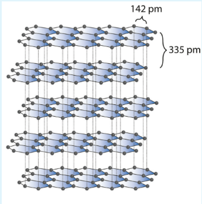

கிராஃபைட் போலல்லாமல் வைரம் மிகக்கடினமானது. வைரத்திலுள்ள கார்பன் அணுக்கள் \( sp^3 \) இனக்கலப்பிலுள்ளன, மேலும் ஒவ்வொரு கார்பன் அணுவும் அதனைச் சுற்றியுள்ள நான்கு வெவ்வேறு கார்பன் அணுக்களுடன் 1.54 Å பிணைப்பு நீளமுள்ள C-C ஒற்றை பிணைப்புகளால் பிணைக்கப்பட்டுள்ளன. இதனால், படம் 2.5 இல் காட்டியவாறு ஒவ்வொரு கார்பனைச் சுற்றியும், நான்முகி அமைப்பானது படிகம் முழுவதும் விரிந்து பரவிக் காணப்படுகிறது. கார்பனின் நான்கு இணைதிற எலக்ட்ரான்களும் பிணைப்பில் ஈடுபட்டுள்ளன. தனி எலக்ட்ரான்கள் ஏதுமில்லாததால் மின்கடத்தும் திறனைப் பெற்றிருக்கவில்லை. மிகக்கடினமான படிகமாக இருப்பதால், கடினமான கருவிகளை கூர்மையாக்கவும், கண்ணாடிகளை வெட்டவும், துளைப்பான்கள் செய்யவும், பாறைகளைத் துளையிடவும் பயன்படுத்தப்படுகிறது.

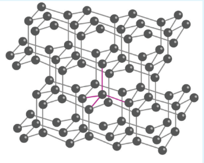

ஃபுல்லரீன்கள் புதியதாக தொகுக்கப்பட்ட கார்பனின் புறவேற்றுமை வடிவங்களாகும். கிராஃபைட் மற்றும் வைரத்தைப் போல அல்லாமல் இந்த புறவேற்றுமை வடிவங்களானவை \( C_{32} \), \( C_{50} \), \( C_{60} \), \( C_{70} \), \( C_{76} \) etc. போன்ற தனித்த மூலக்கூறுகளாக உள்ளன. இந்த மூலக்கூறுகள் படத்தில் காட்டியுள்ளவாறு

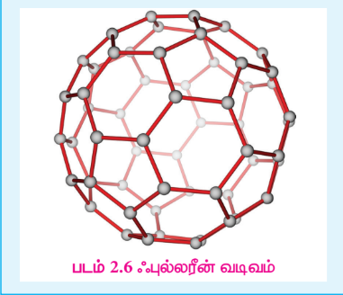

கூண்டு வடிவ அமைப்புகளை கொண்டுள்ளன. \( C_{60} \) மூலக்கூறுகள் கால்பந்து போன்ற அமைப்பைப் பெற்றுள்ளன. இவை பக்மின்ஸ்டர் ஃபுல்லரீன் அல்லது பக்கிபால் என்றழைக்கப்படுகின்றன. இது 20 ஆறணு வளையங்களும், 12 ஐந்தணு வளையங்களும் இணைந்த வளைய அமைப்பைப் பெற்றுள்ளது. ஒவ்வொரு கார்பன் அணுவும் \( sp^2 \) இனக்கலப்படைந்து மூன்று σ பிணைப்புகளை உருவாக்குகின்றன. உள்ளடங்கா π பிணைப்பை உருவாக்கி இந்த மூலக்கூறுகளுக்கு அரோமேட்டிக் தன்மையைப் பெற்றுத் தருகின்றன. C-C ஒற்றை பிணைப்பின் நீளம் 1.44 Å மற்றும் C=C இரட்டை பிணைப்பின் நீளம் 1.38 Å ஆகும்.

கார்பன் நானோகுழாய்கள் என்பவை புதியதாக கண்டறியப்பட்ட புறவேற்றுமை வடிவங்களாகும், இவை கிராஃபைட் போன்ற குழாய் அமைப்பையும், ஃபுல்லரீன் முனைகளையும் கொண்டுள்ளன. அச்சின் வழியாக இந்த நானோகுழாய்கள், எஃகைவிட அதிக வலிமை கொண்டவைகளாக உள்ளன, மேலும் மின்சாரத்தை கடத்துகின்றன. இவை நானோ மின்னணுவியல், வினைவேகமாற்றம், பலபடிகள் மற்றும் மருந்துகள் உருவாக்கம் ஆகியவற்றில் பயன்படுகின்றன.

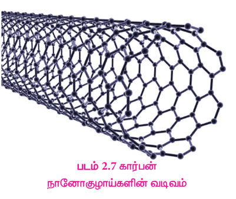

கிராஃபீன் என்பது கார்பனின் மற்றொரு புறவேற்றுமை வடிவமாகும். இது, \( sp^2 \) இனக்கலப்படைந்த கார்பன் அணுக்களால் ஒற்றைத்தளத் தாள் வடிவமைப்பைப் பெற்றுள்ளது. கார்பன் அணுக்கள் தேன்கூடு போன்ற படிக அமைப்பில் நெருக்கமாக பொதிக்கப்பட்டுள்ளன.

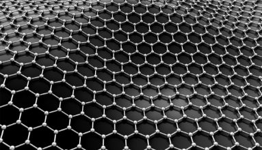

  

## 2.3.5 கார்பன் மோனாக்சைடு [\(CO\)]:

**தயாரித்தல்:**

கட்டுப்படுத்தப்பட்ட அளவு ஆக்ஸிஜனுடன் கார்பனை வினைப்படுத்தி கார்பன் மோனாக்சைடை தயாரிக்க இயலும்.

\[ 2C + O_2 \rightarrow 2CO \]

தொழிற் முறையில், காற்றுடன் கார்பனை வினைப்படுத்தி கார்பன் மோனாக்சைடு தயாரிக்கப்படுகிறது. இவ்வாறு உருவாக்கப்பட்ட கார்பன் மோனாக்சைடில் நைட்ரஜன் வாயுவும் கலந்திருக்கும். நைட்ரஜன் மற்றும் கார்பன் மோனாக்சைடு சேர்ந்த கலவையானது உற்பத்தி வாயு (producer gas) என்றழைக்கப்படுகிறது.

\[ 2C + O_2/N_2 \text{(காற்று)} \rightarrow 2CO + N_2 \text{ (உற்பத்தி வாயு)} \]

இந்த உற்பத்தி வாயுவானது, அதிக அழுத்தத்தில், காப்பர்(I) குளோரைடு கரைசலின் வழியே செலுத்தும்போது \( CuCl(CO).2H_2O \) உருவாகிறது. குறைக்கப்பட்ட அழுத்தத்தில் இக்கரைசல் தூய கார்பன் மோனாக்சைடை வெளிவிடுகிறது.

மெத்தனாயிக் அமிலத்துடன் கந்தக அமிலத்தை சேர்த்து வெப்பப்படுத்தித் தூய கார்பன் மோனாக்சைடு தயாரிக்கப்படுகிறது. இங்கு, கந்தக அமிலம் நீர்நீக்கும் காரணியாக செயல்படுகிறது.

\[ HCOOH + H_2SO_4 \rightarrow CO + H_2SO_4 \cdot H_2O \]

**பண்புகள்**

இது நிறமற்ற, மணமற்ற, நச்சுத்தன்மை கொண்ட வாயுவாகும். இது நீரில் சிறிதளவு கரையும்.

இது காற்றில் நீல நிற சுவாலையுடன் எரிந்து கார்பன் டை ஆக்சைடை உருவாக்குகிறது.

\[ 2CO + O_2 \rightarrow 2CO_2 \]

கார்பன் மோனாக்சைடு ஒளி அல்லது மரக்கரியின் முன்னிலையில் குளோரினுடன் வினைப்படுத்தும்போது, விஷத்தன்மை கொண்ட கார்பனைல் குளோரைடு வாயுவை உருவாக்குகிறது. இது பாஸ்ஜீன் எனவும் அறியப்படுகிறது. இது ஐசோசயனேட்டுகளை தொகுக்க பயன்படுகிறது.

\[ CO + Cl_2 \rightarrow COCl_2 \]

கார்பன் மோனாக்சைடு வலிமை மிகுந்த ஒடுக்கும் காரணியாக செயலாற்றுகிறது.

\[ 3CO + Fe_2O_3 \rightarrow 2Fe + 3CO_2 \]

உயர் வெப்ப, அழுத்த நிலையில் கார்பன் மோனாக்சைடு மற்றும் ஹைட்ரஜன் கலவையானது (தொகுப்பு வாயு) மெத்தனாலைத் தருகிறது.

\[ CO + 2H_2 \rightarrow CH_3OH \]

ஆக்சோ செயல்முறையில் ,ஈத்தேன் ஆனது கார்பன் மோனாக்சைடு மற்றும் ஹைட்ரஜன் வாயுவுடன் கலக்கப்பட்டு, புரப்பனல் (propanal) தயாரிக்கப்படுகிறது.

\[ CO + C_2H_4 + H_2 \rightarrow CH_3CH_2CHO \]

**பிஷ்ஷர் ட்ரோப்ஷ் தொகுப்பு:**

கார்பன் மோனாக்சைடை, ஹைட்ரஜனுடன் சேர்த்து 50 atm க்கு குறைவான அழுத்தத்தில் உலோக வினைவேக மாற்றி முன்னிலையில் 500-700K வெப்பநிலையில் வினைப்படுத்தும்போது நிறைவுற்ற மற்றும் நிறைவுறா ஹைட்ரோகார்பன்கள் உருவாக்கப்படுகின்றன.

\[ nCO + (2n+1)H_2 \rightarrow C_nH_{(2n+2)} + nH_2O \]
\[ nCO + 2nH_2 \rightarrow C_nH_{2n} + nH_2O \]

இடைநிலை உலோகத் தனிமங்களுடன் சேர்ந்து கார்பன் மோனாக்சைடு பல்வேறு அணைவுச் சேர்மங்களை உருவாக்குகின்றன. இவற்றில் உலோகம் பூஜ்ஜிய ஆக்ஸிஜனேற்ற நிலையில் உள்ளன. உலோகத்தை, கார்பன் மோனாக்சைடுடன் வெப்பப்படுத்துவதன் மூலம் இச்சேர்மங்கள் பெறப்படுகின்றன. எடுத்துக்காட்டு: நிக்கல் டெட்ராகார்பனைல் \( [Ni(CO)_4] \),அயர்ன் பென்டாகார்பனைல் \( [Fe(CO)_5] \), குரோமியம் ஹெக்சாகார்பனைல் \( [Cr(CO)_6] \).

**வடிவமைப்பு:**

இது நேர்க்கோட்டு அமைப்பைப் பெற்றுள்ளது. கார்பன் மோனாக்சைடில், கார்பனுக்கும் ஆக்ஸிஜனுக்கும் இடையே மூன்று எலக்ட்ரான் இரட்டைகள் பங்கிடப்பட்டுள்ளன. XI வகுப்பில் கற்றறிந்தபடி மூலக்கூறு ஆர்பிட்டால் கொள்கையைப் பயன்படுத்தி கார்பன் மோனாக்சைடில் உள்ள பிணைப்பை விளக்க முடியும். C-O பிணைப்பு நீளம் 1.128Å. பின்வரும் இரண்டு நியதி வடிவங்களின் உடனிசைவு வடிவமாக கருதப்படுகிறது.

  

**கார்பன் மோனாக்சைடின் பயன்கள்:**

1. ஹைட்ரஜன் மற்றும் கார்பன் மோனாக்சைடின் சமமோலார் கலவை (நீர் வாயு), கார்பன் மோனாக்சைடு மற்றும் நைட்ரஜன் ஆகியவற்றின் சமமோலார் கலவை (உற்பத்தி வாயு) ஆகியன முக்கியமான தொழிற்சாலை எரிபொருளாகும்.
2. கார்பன் மோனாக்சைடு ஒரு சிறந்த ஒடுக்கும் காரணியாகும், இதனால், உலோக ஆக்சைடுகளை உலோகங்களாக ஒடுக்க முடியும்.
3. கார்பன் மோனாக்சைடு ஒரு சிறந்த ஈனியாகும், இது இடைநிலை உலோகங்களுடன் இணைந்து உலோக கார்பனைல் சேர்மங்களை உருவாக்குகிறது.

## 2.3.6 கார்பன் டை ஆக்சைடு:

கார்பன் டை ஆக்சைடு இயற்கையில் தனித்த நிலையிலும், கூட்டு சேர்மமாகவும் கிடைக்கிறது. இது காற்றின் பகுதிப் பொருளாக (0.03%) உள்ளது. இது பாறைகளில் கால்சியம் கார்பனேட்டாகவும், மெக்னீஷியம் கார்பனேட்டாகவும் காணப்படுகிறது.

**தயாரித்தல்**

தொழிற் முறையில், கல்கரியை அதிகளவு காற்று செலுத்தி எரித்து கார்பன் டை ஆக்சைடு பெறப்படுகிறது.

\[ C + O_2 \rightarrow CO_2 \quad \Delta H = -394 \text{ kJ mol}^{-1} \]

சுண்ணாம்பைக் காற்றில்லாச் சூழலில் வறுக்கும் போது கார்பன் டை ஆக்சைடு துணைப் பொருளாக கிடைக்கிறது.

\[ CaCO_3 \rightarrow CaO + CO_2 \]

ஆய்வகத்தில், உலோக கார்பனேட்டுகளின் மீது நீர்த்த ஹைட்ரோ குளோரிக் அமிலத்தை சேர்த்து வினைப்படுத்தி கார்பன் டை ஆக்சைடு தயாரிக்கப்படுகிறது.

\[ CaCO_3 + 2HCl \rightarrow CaCl_2 + H_2O + CO_2 \]

**பண்புகள்**

இது நிறமற்ற, தீப்பற்றாத வாயுவாகும். இது காற்றைவிட கனமானது. இதன் நிலைமாறு வெப்பநிலை \( 31^\circ C \). எனவே, இதை எளிதில் திரவமாக்க இயலும். கார்பன் டை ஆக்சைடு அதிக நிலைப்புத்தன்மை கொண்ட சேர்மமாகும். 3100 K வெப்பநிலையிலும் கூட வெறும் 76% மட்டுமே சிதைந்து கார்பன் மோனாக்சைடு மற்றும் ஆக்ஸிஜன் ஆகியவற்றை உருவாக்குகிறது. அதற்கும் அதிகமான வெப்பநிலையில் முற்றிலுமாக சிதைந்து கார்பன் மற்றும் ஆக்ஸிஜனைத் தருகிறது.

$$\text{CO}_2 \rightleftharpoons^{3100\text{ K}} \text{CO} + \frac{1}{2}\text{O}_2$$
$$\text{CO}_2 \rightleftharpoons^{\text{உயர் வெப்பநிலை}} \text{C} + \text{O}_2$$

**ஆக்சிஜனேற்றும் பண்பு:**

உயர் வெப்பநிலைகளில் இது ஆக்சிஜனேற்றியாக செயலாற்றுகிறது. எடுத்துக்காட்டாக,

\[ CO_2 + 2Mg \rightarrow 2MgO + C \]

**நீர் வாயுச் சமநிலை:**

கார்பன் டை ஆக்சைடு மற்றும் ஹைட்ரஜன் வாயுவிற்கு இடையே நிகழும் வினையில் உருவாகும் சமநிலையானது பல்வேறு தொழிற்சாலைப் பயன்களைக் கொண்டுள்ளது. இச்சமநிலையானது நீர்வாயுச் சமநிலை என்றழைக்கப்படுகிறது.

\[ CO_2 + H_2 \rightleftharpoons CO + H_2O \quad (\text{நீர் வாயு}) \]

**அமிலப் பண்பு:**

கார்பன் டை ஆக்சைடின் நீர்க்கரைசலில் கார்பானிக் அமிலம் உருவாவதால் சற்றே அமிலத்தன்மை கொண்டதாக உள்ளது.

\[ CO_2 + H_2O \rightleftharpoons H_2CO_3 \rightleftharpoons H^+ + HCO_3^- \]

**கார்பன் டையாக்சைடின் வடிவமைப்பு**

கார்பன் டை ஆக்சைடு மூலக்கூறு நேர்க்கோட்டு வடிவத்தைப் பெற்றுள்ளது, இதில் இரண்டு C-O பிணைப்புகளும் ஒரே நீளத்தைக் கொண்டுள்ளன. இந்த மூலக்கூறில் இரண்டு C-O சிக்மா பிணைப்பு உள்ளது. கூடுதலாக ஒரு மூன்று அணுக்களையும் பிணைக்கும் வகையில் ஒரு 3c-4e பிணைப்பும் காணப்படுகிறது.

  

**கார்பன் டையாக்சைடின் பயன்கள்**

1. சில வேதிச் செயல்முறைகளுக்கு தேவையான, மந்தமான சூழலை உருவாக்க கார்பன் டை ஆக்சைடு பயன்படுகிறது.
2. உயிரியல் ரீதியாக, இது ஒளிச்சேர்க்கைக்கு முக்கியமானது.
3. இது தீயணைப்பான்களிலும், உந்து வாயுவாகவும் பயன்படுகிறது.
4. இது, கார்பன் டை ஆக்சைடு ஏற்றப்பட்ட குளிர் பானங்கள் தயாரிக்கவும், நுரைப்புகள் தயாரிக்கவும் பயன்படுகிறது.

## 2.3.7 சிலிக்கான் டெட்ரா குளோரைடு:

**தயாரித்தல்:**

பீங்கான் குழாயில் வைக்கப்பட்டுள்ள சிலிக்கா மற்றும் கார்பன் கலந்த கலவையின்மீது உலர் குளோரின் வாயுவைச் செலுத்தி 1675K வெப்பநிலை வரை வெப்பப்படுத்தும்போது சிலிக்கான் டெட்ரா குளோரைடு பெறப்படுகிறது.

\[ SiO_2 + 2C + 2Cl_2 \rightarrow SiCl_4 + 2CO \]

தொழிற்முறையில், 600K க்கு அதிகமான வெப்பநிலையில் ஹைட்ரஜன் குளோரைடு வாயுடன் சிலிக்கான் வினைபுரிந்து சிலிக்கான் டெட்ரா குளோரைடு உருவாகிறது.

\[ Si + 4HCl \rightarrow SiCl_4 + 2H_2 \]

**பண்புகள்:**

சிலிக்கான் டெட்ரா குளோரைடு ஒரு நிறமற்ற புகையும் திரவமாகும், மேலும் இதன் உறைநிலை \( -70 ^\circ C \). சிலிக்கான் டெட்ரா குளோரைடு ஈரக்காற்றில் நீராற்பகுப்படைந்து சிலிக்கா மற்றும் ஹைட்ரோ குளோரிக் அமிலத்தைத் தருகிறது.

\[ SiCl_4 + 2H_2O \rightarrow 4HCl + SiO_2 \]

சிலிக்கான் டெட்ரா குளோரைடு, ஈதர் கலந்த ஈதர் முன்னிலையில் நீராற்பகுப்படைந்து, நேர்க்கோட்டுச் சங்கிலி அமைப்புடைய பெர்குளோரோ சிலாக்ஸேன்களை [\( Cl-(SiCl_2O)_nSiCl_3 \) இங்கு n=1-6] உருவாக்குகின்றன.

**ஆல்கஹால் கொண்டு பகுத்தல்**

சிலிக்கான் டெட்ரா குளோரைடில் உள்ள குளோரைடு அயனியை, பொருத்தமான வினைக்காரணிகளைப் பயன்படுத்தி, OH, OR போன்ற கருகவர் காரணிகளால் பதிலீடு செய்ய இயலும். எடுத்துக்காட்டாக, இது ஆல்கஹால்களுடன் சிலிசிக் எஸ்டர்களை உருவாக்குகிறது.

\[ SiCl_4 + 4C_2H_5OH \rightarrow Si(OC_2H_5)_4(டெட்ராஈதாக்சி சிலேன்) + 4HCl \]

**அம்மோனியா கொண்டு பகுத்தல்**

இதேபோல சிலிக்கான் டெட்ரா குளோரைடானது, அம்மோனியாவால் பகுக்கப்பட்டு குளோரோசிலாக்சேன்கள் உருவாகின்றன.

$$2\text{SiCl}_4 + \text{NH}_3 \xrightarrow[\text{ஈதர்}]{330\text{ K}} \text{Cl}_3\text{Si-NH-SiCl}_3 + 2\text{HCl}$$

**பயன்கள்:**

1. சிலிக்கான் குறைக்கடத்திகள் தயாரிப்பில் சிலிக்கான் டெட்ரா குளோரைடு பயன்படுகிறது.
2. சிலிக்கா ஜெல், பீங்கான் பொருட்களை ஒட்டவைக்கப் பயன்படும் சிலிசிக் எஸ்டர்கள் ஆகியவற்றை தொகுக்கும் வினைகளில் ஆரம்பப் பொருளாக சிலிக்கான் டெட்ரா குளோரைடு பயன்படுகிறது.

## 2.3.8 சிலிக்கோன்கள்:

சிலிக்கோன்கள் அல்லது பாலி சிலாக்சேன்கள் என்பவை கரிம சிலிக்கான் பலபடிகளாகும், இவற்றின் பொதுவான எளிய வாய்ப்பாடு \( (R_2SiO) \). இவற்றின் எளிய வாய்ப்பாடு, கீட்டோன்களைப் \( (R_2CO) \) போன்ற அமைப்பைப் பெற்றிருப்பதால் இவை சிலிக்கோன்கள் என பெயரிடப்பட்டுள்ளன. இந்த சிலிக்கோன்கள் நேர்க்கோட்டுப் பலபடிகளாகவோ அல்லது குறுக்கப் பலபடிகளாகவோ இருக்கலாம். இவற்றின் மிக அதிக வெப்ப நிலைப்புத் தன்மையின் காரணமாக, இவை உயர்வெப்பப் பலபடிகள் என்றழைக்கப்படுகின்றன.

**தயாரித்தல்:**

பொதுவாக, டைஆல்கைல்டைகுளோரோ சிலேன்கள் (\( R_2SiCl_2 \)) அல்லது டைஅரைல் டைகுளோரோ சிலேன்களை (\( Ar_2SiCl_2 \)), நீராற்பகுப்பதன் விளைவாக சிலிக்கோன்கள் தயாரிக்கப்படுகின்றன. இவை, காப்பர் வினைவேக மாற்றி முன்னிலையில், 570 K வெப்பநிலையில், சிலிக்கான் மீது ஆவிநிலையிலுள்ள RCl அல்லது ArCl ஐ செலுத்தித் தயாரிக்கப்படுகின்றன.

\[ 2RCl + Si \xrightarrow{Cu/570 K} R_2SiCl_2 \]

டைஆல்கைல்குளோரோ சிலேன்களை \( R_2SiCl_2 \) நீராற்பகுக்கும்போது சங்கிலித் தொடர் பலபடிகள் உருவாகின்றன. இவை இருமுனைகளிலும் நீண்டு கொண்டே செல்கின்றன.
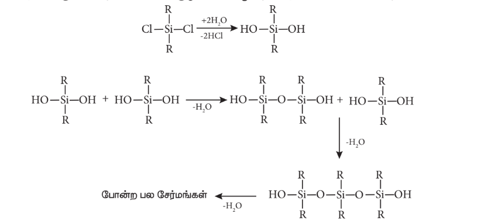
மோனோஆல்கைல்குளோரோ சிலேன்களை (\( RSiCl_3 \)) நீராற்பகுக்கும்போது மிகவும் சிக்கலான குறுக்குப் பலபடிகள் உருவாகின்றன. சங்கிலித் தொடர் சிலிக்கோன்களிலுள்ள முனைய -OH தொகுதிகளிலிருந்து நீர் மூலக்கூறுகளை நீக்குவதன் மூலம் அவற்றை வளைய சிலிக்கோன்களாக மாற்ற இயலும்.
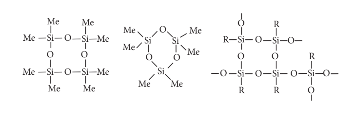
 

**சிலிக்கோன்களின் வகைகள்:**

**(i) நேர்க்கோட்டு சிலிக்கோன்கள்:**

இவை டைஆல்க்கைல் அல்லது டைஅரைல் சிலிக்கான் குளோரைடுகளை நீராற்பகுத்தலைத் தொடர்ந்து குறுக்க வினைக்கு உட்படுத்திப் பெறப்படுகின்றன.

a) **சிலிக்கோன் இரப்பர்கள்:** இவ்வகை சிலிக்கோன்கள், மெத்திலீன் அல்லது அதைப் போன்ற தொகுதிகளைக் கொண்டு ஒன்றாக இணைக்கப்பட்டுள்ளன.

b) **சிலிக்கோன் பிசின்கள்:** சிலிக்கோன்களை, அக்ரிலிக் எஸ்டர்கள் போன்ற கரிம பிசின்களுடன் கலப்பதன் வாயிலாக இவை பெறப்படுகின்றன.

**(ii) வளைய சிலிக்கோன்கள்**

இவை \( R_2SiCl_2 \) ஐ நீராற்பகுப்பதன் மூலம் பெறப்படுகின்றன.

**(iii) குறுக்கு பிணைப்பு சிலிக்கோன்கள்:**

இவை \( RSiCl_3 \) ஐ நீராற்பகுப்பதன் மூலம் பெறப்படுகின்றன.

**பண்புகள்**

குறுக்கு பிணைப்புகளின் அளவும், ஆல்கைல் தொகுதியின் தன்மையும், பலபடியின் தன்மையை நிர்ணயிக்கின்றன. இவை எண்ணெய் போன்ற திரவம் முதல் ரப்பர் போன்ற திண்மங்கள் வரை வேறுபடுகின்றன. அனைத்து சிலிக்கோன்களும் நீர்வெறுக்கும் தன்மை கொண்டவைகளாகும். சிலிக்கானைச் சுற்றியுள்ள கரிம பக்கத் தொகுதிகள் மூலக்கூறுக்கு ஆல்கேன் போன்ற தோற்றத்தைத் தருகின்றன. இதனால் நீர்வெறுக்கும் பண்பு தோன்றுகிறது. இவை, வெப்பம் மற்றும் மின் கடத்தாப் பொருட்களாகும். இவை மந்த வேதித் தன்மை கொண்டவையாகும். சிறிய சிலிக்கோன்கள் எண்ணெய் போன்ற திரவங்களாகவும், நீண்ட சங்கிலி அமைப்பைக் கொண்ட உயர் சிலிக்கோன்கள் மெழுகு போன்ற திண்மங்களாகவும் உள்ளன. சிலிக்கோன் எண்ணெயின் பாகுநிலைத்தன்மை மாறாமல் நிலையாக உள்ளது. மேலும் வெப்பநிலையைப் பொறுத்து மாறுவதில்லை. சிலிக்கோன் எண்ணெய்கள் குளிர்காலங்களில் கெட்டியாவதில்லை.

**பயன்கள்:**

1. சிலிக்கோன்கள் குறைந்த வெப்பநிலை உயவுப் பொருளாகவும், வெற்றிட பம்புகள், உயர் வெப்பநிலை எண்ணெய்த் தொட்டிகளிலும் பயன்படுகின்றன.
2. இவை நீர்வெறுக்கும் ஆடைகள் தயாரித்தலில் பயன்படுகின்றன.
3. இவை, மின்மோட்டார்கள் மற்றும் மற்ற வீட்டு உபயோகப் பொருட்களில் மின்காப்பு பொருளாக பயன்படுகின்றன.
4. சிலிக்கோன்கள் சேர்க்கப்பட்ட பெயிண்ட் மற்றும் எனாமல், அதிக வெப்பநிலை, சூரிய ஒளி, ஈரப்பதம் (ஓதம்) மற்றும் வேதிப்பொருட்கள் தாக்குதல் ஆகியவற்றைத் தாக்குபிடிக்கின்றன.

## 2.3.9 சிலிக்கேட்டுகள்

சிலிக்கான் மற்றும் ஆக்ஸிஜன் ஆகியவற்றைக் கொண்ட நான்முகி \( [SiO_4]^{4-} \) அலகுகள் வெவ்வேறு வடிவங்களில் பிணைக்கப்பட்டுக் கிடைக்கும் கனிமங்கள் சிலிக்கேட்டுகள் என்றழைக்கப்படுகின்றன. ஏறத்தாழ 95% புவி மேற்பரப்பானது சிலிக்கேட் கனிமங்கள் மற்றும் சிலிக்கா ஆகியவற்றால் உருவாக்கப்பட்டுள்ளது. கண்ணாடி மற்றும் பீங்கான் தொழிற்சாலைகள் சிலிக்கேட் வேதியியலை அடிப்படையாகக் கொண்டு அமைந்துள்ளன.

**சிலிக்கேட்டுகளின் வகைகள்:**

\( [SiO_4]^{4-} \) நான்முகி அலகுகள் பிணைக்கப்பட்டுள்ள விதத்தின் அடிப்படையில் சிலிக்கேட்டுகள் பல்வேறு வகைகளாக வகைப்படுத்தப்படுகின்றன.

**ஆர்த்தோ சிலிக்கேட்டுகள் (நீசோ சிலிக்கேட்டுகள்):** 

தனித்த \( [SiO_4]^{4-} \) நான்முகி அலகுகளைக் கொண்ட எளிய வகை சிலிக்கேட்டுகள் ஆர்த்தோ சிலிக்கேடுகள் அல்லது நீசோ சிலிக்கேட்டுகள் என்றழைக்கப்படுகின்றன. 

எடுத்துக்காட்டு: 
பீனசைட் – $\text{Be}_2\text{SiO}_4$ ($\text{Be}^{2+}$ அயனிகள் $\text{O}^{2-}$ அயனிகளால் நான்முகி வடிவில் சூழப்பட்டுள்ளன),

ஆலுவீன் – $(\text{Fe/Mg})_2\text{SiO}_4$ ($\text{Fe}^{2+}$ மற்றும் $\text{Mg}^{2+}$ நேரயனிகள் $\text{O}^{2-}$ அயனிகளால் எண்முகி வடிவில் சூழப்பட்டுள்ளன)

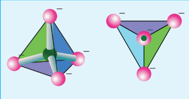

**பைரோ சிலிக்கேட்டுகள் (சோரோ சிலிக்கேட்டுகள்):**

\( [SiO_4]^{6-} \)அயனிகளைக் கொண்டுள்ள சிலிக்கேட்டுகள், பைரோ சிலிக்கேட்டுகள் அல்லது அல்லது சோரோ சிலிக்கேட்டுகள் என்றழைக்கப்படுகின்றன. இரண்டு \( [SiO_4]^{4-} \)  நான்முகி அலகுகள் ஒரு மூலையிலுள்ள ஒரு ஆக்ஸிஜன் அணுவை பங்கிட்டுக்கொள்ளும்போது இவை உருவாகின்றன.(இணையும்போது ஒரு ஆக்ஸிஜன் நீக்கப்படுகிறது)  எடுத்துக்காட்டு: தார்ட்விடைட் -  $\text{Sc}_2\text{Si}_2\text{O}_7$.

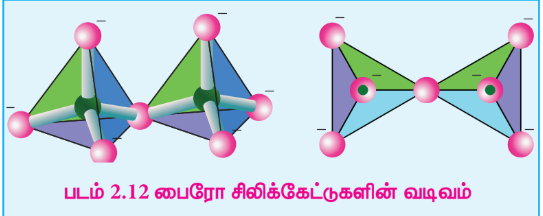

**வளைய சிலிக்கேட்டுகள் :** 

மூன்று அல்லது அதற்கு மேற்பட்ட $[\text{SiO}_4]^{4-}$ நான்முகி அலகுகள் வளைய அமைப்பில் இணைந்து உருவான $(\text{SiO}_3)_n^{2n-}$ அயனிகளைக் கொண்டுள்ள சிலிக்கேட்டுகள், வளைய சிலிக்கேட்டுகள் என்று அழைக்கப்படுகின்றன. ஒவ்வொரு சிலிக்கேட் அலகும் அதன் இரண்டு ஆக்சிஜன் அணுக்களை மற்ற அலகுகளுடன் பங்கீட்டுக் கொள்கிறது.

எடுத்துக்காட்டு: பெரைல் $[\text{Be}_3\text{Al}_2(\text{SiO}_3)_6]$ (இது ஒரு அலுமினோ சிலிக்கேட்டாகும், இதில் ஒவ்வொரு அலுமினியம் அயனியும் ஆறு ஆக்சிஜன் அணுக்களால் எண்முகி வடிவில் சூழப்பட்டுள்ளது)

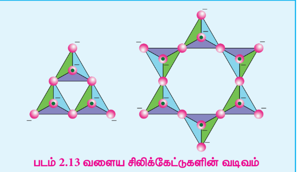

**ஐனோசிலிக்கேட்டுகள் :** 

இரண்டு அல்லது அதற்கு மேற்பட்ட ஆக்ஸிஜன் அணுக்களைப் பகிர்ந்துகொள்வதன் மூலம் பிணைக்கப்பட்ட n சிலிக்கேட் அலகுகளைக் கொண்ட சிலிக்கேட்டுகள் ஐனோசிலிக்கேட்டுகள் என்றழைக்கப்படுகின்றன. மேலும்,இவை சங்கிலி சிலிக்கேட்டுகள் மற்றும் இரட்டைச் சங்கிலி சிலிக்கேட்டுகள் என வகைப்படுத்தப்படுகின்றன.

**சங்கிலி சிலிக்கேட்டுகள்(அல்லது பைராக்சீன்கள்):**

இவ்வகை சிலிக்கேட்டுகள் ‘n’ எண்ணிக்கையிலான \([\text{SiO}_4]^{4-}\) நான்முகி அலகுகள் நேர்க்கோட்டு அமைப்பில் இணைந்து உருவான $[(\text{SiO}_3)_n]^{2n-}$ அயனிகளைக் கொண்டுள்ளன. ஒவ்வொரு சிலிக்கேட் அலகும் அதன் இரண்டு ஆக்சிஜன் அணுக்களை மற்ற அலகுகளுடன் பங்கீட்டுக்கொள்கிறது.

எடுத்துக்காட்டு: ஸ்பொடுமின் – $\text{LiAl}(\text{SiO}_3)_2$.

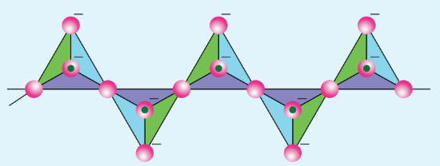

**இரட்டைச் சங்கிலி சிலிக்கேட்டுகள் (அல்லது ஆம்பிபோல்கள்):** 

இவ்வகை சிலிக்கேட்டுகள் \(\mathbf{[Si_4O_{11}]_n^{6n-}}\) அயனிகளைக் கொண்டுள்ளன. இவற்றில் இரண்டு வெவ்வேறு விதமான நான்முகி அமைப்புகள் காணப்படுகின்றன.
(i) மூன்று முனைகளைப் பங்கிட்டுக்கொண்டவை.
(ii) இரண்டு முனைகளை மட்டும் பங்கிட்டுக்கொண்டவை.

எடுத்துக்காட்டு:

1 ) கல்நார் (ஆஸ்பெஸ்டாஸ்): இவை நார்த்தன்மையுள்ள எளிதில் தீப்பற்றாத சிலிக்கேட்டுகள் ஆகும். எனவே, இவை வெப்பக் காப்பு பொருளாகவும், வேகத்தடை பட்டைகள் (brake linings), கட்டுமானப் பொருள் மற்றும் வடிகட்டிகளாகவும் பயன்படுத்தப்படுகின்றன. ஆஸ்பெஸ்டாஸ்கள் புற்றுநோய் உண்டாக்கும் சிலிக்கேட்டுகளாக இருப்பதால் இவற்றின் பயன்பாடு கட்டுப்படுத்தப்பட்டுள்ளது.

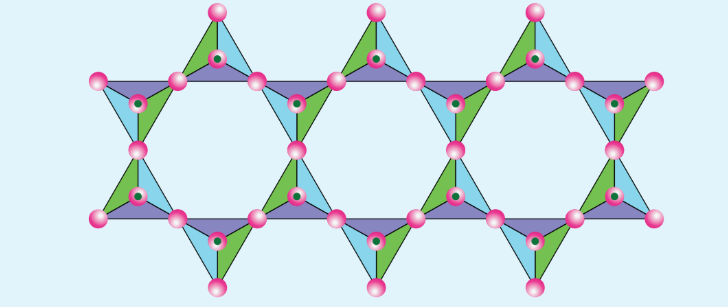

**தாள் அல்லது பைலோசிலிக்கேட்டுகள்:**

 \((Si_2O_5)^{2n-}_n \) அயனிகளைக் கொண்டுள்ள சிலிக்கேட்டுகள் தாள் சிலிக்கேட்டுகள் அல்லது பைலோ சிலிக்கேட்டுகள் என்றழைக்கப்படுகின்றன. இவற்றில், ஒவ்வொரு \( [SiO_4]^{4-} \) நான்முகி அலகும் மற்ற அலகுகளுடன் மூன்று ஆக்ஸிஜன் அணுக்களைப் பங்கிட்டுக்கொண்டு தாள் போன்ற அமைப்பை உருவாக்குகின்றன. இவ்வகை தாள் சிலிக்கேட்டுகளில், தாள்கள் ஒன்றன் மீது ஒன்றாக அடுக்கப்பட்டுள்ளன. இந்த அடுக்குகளுக்கிடையேயான கவர்ச்சி விசை மிகக் குறைவாக இருப்பதால் இவை கிராஃபைட் போன்ற எளிதில் பிளவுறுகின்றன. எடுத்துக்காட்டுகள்: டால்க் (Talc), மைக்கா (Mica), போன்றவை.

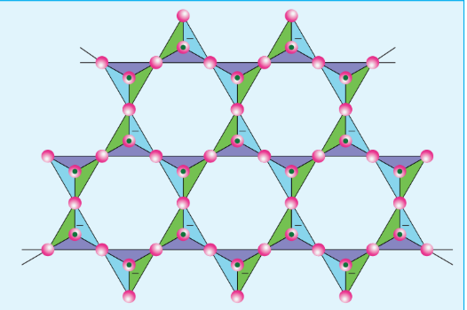

**முப்பரிமாண சிலிக்கேட்டுகள் (அல்லது டெக்டோ சிலிக்கேட்டுகள்):**

 \( [SiO_4]^{4-} \) நான்முகி அலகிலுள்ள அனைத்து ஆக்ஸிஜன் அணுக்களும் மற்ற நான்முகி அலகுகளுடன் பங்கிடப்பட்டு உருவாகும் முப்பரிமாண கட்டமைப்பைக் கொண்ட சிலிக்கேட்டுகள், முப்பரிமாண அல்லது டெக்டோ சிலிக்கேட்டுகள் என்றழைக்கப்படுகின்றன. இவற்றின் பொதுவான வாய்ப்பாடு \( (SiO_2)_n \). 
 
 எடுத்துக்காட்டு: குவார்ட்ஸ்.

\( [SiO_4]^{4-} \) அலகுகளை \( [AlO_4]^{5-} \) அலகுகளைக் கொண்டு பதிலீடு செய்வதன் மூலம் இந்த டெக்டோசிலிக்கேட்டுகளை முப்பரிமாண அலுமினோசிலிக்கேட்டுகளாக மாற்ற இயலும். எடுத்துக்காட்டுகள்: ஃபெல்ஸ்பர், ஜியோலைட்டுகள் போன்றவை.

## 2.3.10 ஜியோலைட்டுகள்:

ஜியோலைட்டுகள் என்பவை அலுமினியம், சிலிக்கான் மற்றும் ஆக்ஸிஜன் ஆகியவற்றை ஒழுங்கான முப்பரிமாண கட்டமான அமைப்பில் கொண்டுள்ள முப்பரிமாண படிகத் திண்மங்களாகும். இவை நீரேறிய சோடியம் அலுமினோ சிலிக்கேட்டுகளாகும், இவற்றின் பொதுவான வாய்ப்பாடு \( Na_2O.(Al_2O_3).x(SiO_2).yH_2O \) (x=2 முதல் 10; y=2 முதல் 6)

ஜியோலைட்டுகள் நுண்துளை அமைப்பைக் கொண்டுள்ளன. ஒற்றை நேர்மின்சுமை கொண்ட சோடியம் அயனிகளும், நீர் மூலக்கூறுகளும் இத்துளைகளில் தளர்வாக இருத்திவைக்கப்பட்டுள்ளன. பங்கிடப்பட்ட ஆக்ஸிஜன் அணுக்களின் மூலம் Si மற்றும் Al அணுக்கள் நான்முகி அமைப்பில் ஒன்றுடன் ஒன்று ஒருங்கிணைக்கப்பட்டுள்ளன. ஜியோலைட்டுகள், களிமண் கனிமத்தை ஒத்துள்ளன ஆனால் அவற்றின் படிக அமைப்பில் வேறுபடுகின்றன. ஒன்றுடன் ஒன்று இணைக்கப்பட்ட தடங்கள் மற்றும் கூடுகளைக் கொண்ட, தேன்கூட்டு அமைப்பை ஒத்த முப்பரிமாண படிக அமைப்பை ஜியோலைட்டுகள் பெற்றுள்ளன. ஜியோலைட்டு கட்டமைப்பு நகராமல் இறுக்கமாக உள்ளபோதிலும், நுண்துளைகளின் வழியாக நீர் மூலக்கூறுகள் உள்ளேயும், வெளியேயும் மிக எளிதாக நகர்கின்றன. ஏறத்தாழ ஒரே சீராக அமைந்திருக்கும் நுண்துளைகளின் உருவளவு இக்கட்டமைப்பின் மற்றொரு சிறப்பம்சமாகும், இது படிக்கட்டை மூலக்கூறு சல்வடை போன்று செயல்பட அனுமதிக்கிறது. ஜியோலைட்டுகளைப் பயன்படுத்தி நீரின் நிரந்தரக் கடினத்தன்மையை நீக்குதல் பற்றி நாம் ஏற்கனவே XI வகுப்பில் விவாதித்துள்ளோம்.

>**உங்களுக்குத் தெரியுமா?**
>
>**போரான் நியூட்ரான் கவர்தல் சிகிச்சை**
>
>போரான்-10 ஆனது நியூட்ரான் மீது கொண்டுள்ள நாட்டமே BNCT என அழைக்கப்படும் போரான் நியூட்ரான் கவர்தல் சிகிச்சையின் அடிப்படையாகும். இம்முறை மூளைக் கட்டிகளுக்கான ஒரு சிகிச்சை முறையாகும்.
>
>போரான்-10ஐ குறைந்த ஆற்றலுடைய வெப்ப நியூட்ரான்களைக் கொண்டு தாக்கும் போது உருவாகும் அதிக நேரிய ஆற்றலுடைய α துகள் மற்றும் Li துகளைத் தரும் அணுக்கரு வினையினை அடிப்படையாகக் கொண்டது.
>
>மூளையில் கட்டிகள் காணப்படும் நோயாளி ஒருவருக்கு போரானின் சேர்மங்கள் ஊசி வழி செலுத்தப்படுகின்றன. இவை மூளைப் புற்றுநோய்க் கட்டிகளில் சேகரமாகிறது. பின்னர் புற்றுக்கட்டிகள் காணப்படும் பகுதியினை வெப்ப நியூட்ரான்களைக் கொண்டு கதிர் வீச்சிற்கு உட்படுத்தும் போது α துகள் உருவாகிறது. இது புற்றுக் கட்டித் திசுக்களை அழிக்கிறது. ஒவ்வொரு முறை போரான்-10 நியூட்ரானைக் கவரும் போதும் இது நிகழ்கிறது. இவ்வாறாக, புற்றுநோய்க் கட்டிகள் மட்டும் தொடர்ந்து அழிக்கப்படுகின்றன. பிற மூளைத் திசுக்கள் குறைந்த அளவே பாதிக்கப்படுகின்றன. கழுத்து, மார்பு, கல்லீரல் போன்ற பிற இடங்களில் உருவாகும் புற்றுநோய்க் கட்டிகளின் சிகிச்சைக்கும் BNCT யைப் பயன்படுத்துவது தொடர்பான ஆய்வுகள் மேற்கொள்ளப்பட்டுள்ளன.

**பாடச்சுருக்கம்**

■ ஒரு தனிமத்தின் கடைசி எலக்ட்ரான் p-ஆர்பிட்டாலில் சென்று நிரம்புமாறு உள்ள தனிமங்கள் அடங்கிய தொகுதி p-தொகுதி என அழைக்கப்படுகின்றது.

■ p-தொகுதி தனிமங்கள் \( ns^2, np^{1-6} \) எனும் பொதுவான எலக்ட்ரான் அமைப்பைப் பெற்றுள்ளன. ஒரு தொகுதியிலுள்ள அனைத்துத் தனிமங்களும், ஒத்த வெளிக்கூட்டு எலக்ட்ரான் அமைப்பைப் பெற்றுள்ளன.

■ ஒரு தொகுதியில் மேலிருந்து கீழாக செல்லும்போது தனிமங்களின் அணு ஆரம் அதிகரிப்பதன் காரணமாக அவற்றின் அயனியாக்கும் என்தால்பி தொடர்ந்து குறைகிறது, எனவே உலோகத் தன்மை அதிகரிக்கின்றது.

■ எதிர்பார்த்ததைப் போலவே, தொடர்ந்து வரும் தொகுதிகளிலுள்ள தனிமங்களின் அயனியாக்கும் என்தால்பி மதிப்புகள் முந்தைய தொகுதி தனிமங்களைவிட அதிகமாக உள்ளன.

■ 13 ஆம் தொகுதியில் மேலிருந்து கீழாக செல்லும்போது, எலக்ட்ரான் கவர்திறன் மதிப்புகளானது போரானிலிருந்து அலுமினியத்திற்கு முதலில் குறைந்து பின்னர் காலியத்திற்கு சற்றே அதிகரிக்கிறது.

■ p-தொகுதி தனிமங்களில், ஒவ்வொரு தொகுதியிலும் உள்ள முதல் தனிமமானது, அத்தொகுதியிலுள்ள மற்ற தனிமங்களிலிருந்து வேறுபடுகின்றன.

■ இடைநிலைத்தனிமங்களைத் தொடர்ந்து வரும் கனமான தனிமங்களில் உள்ள வெளிக்கூட்டுச் s எலக்ட்ரான்கள் மந்தத் தன்மை கொண்டவைகளாக உள்ளன மேலும் பிணைப்பில் பங்கெடுக்க இயல்பாக முனைவதில்லை. இந்த விளைவு மந்த இணை விளைவு என அறியப்படுகிறது.

■ சில தனிமங்கள் ஒரே இயற் நிலைமையில், ஒன்றுக்கு மேற்பட்ட படிக அல்லது மூலக்கூறு வடிவங்களில் காணப்படுகின்றன. இந்நிகழ்வானது புறவேற்றுமை வடிவத்துவம் அல்லது அலோட்ரோபிசம் என்றழைக்கப்படுகிறது.

■ போராக்ஸ் என்பது டெட்ராபோரிக் அமிலத்தின் சோடிய உப்பாகும். இது கோலிமனைட் தாதுவை, சோடியம் கார்பனேட் கரைசலுடன் கொதிக்க வைப்பதன் மூலம் பெறப்படுகிறது.

■ போராக்ஸ் மற்றும் கோலிமனைட் ஆகியவற்றிலிருந்து போரிக் அமிலத்தைப் பிரித்தெடுக்க இயலும்.

■ போரிக் அமிலமானது, இருபரிமாண அடுக்கு அமைப்பைக் கொண்டுள்ளது. இது \( [BO_3]^{3-} \) அலகுகளைக் கொண்டுள்ளது, இந்த அலகுகள் ஹைட்ரஜன் பிணைப்புகளால் படம் 2.2 இல் காட்டியுள்ளவாறு ஒன்றுடன் ஒன்று பிணைக்கப்பட்டுள்ளன.

■ பொட்டாசியம், அலுமினியம் சல்பேட்டின் இரட்டை உப்பானது \( [K_2SO_4.Al_2(SO_4)_3.24H_2O] \) படிகாரம் என பெயரிடப்பட்டுள்ளது.

கார்பன், தனித்த நிலையில் கிராஃபைட்டாக காணப்படுகிறது.

■ சிலிக்கான் ஆனது சிலிக்காவாக (மணல் மற்றும் குவார்ட்ஸ் படிகம்) காணப்படுகிறது.

■ சங்கிலித் தொடராக்கம் என்பது, ஒரு தனிமத்தின் அணுச் சங்கிலி உருவாக்கும் திறன் ஆகும்.

■ கார்பன் நானோகுழாய்கள் என்பவை புதியதாக கண்டறியப்பட்ட புறவேற்றுமை வடிவங்களாகும், இவை கிராஃபைட் போன்ற குழாய் அமைப்பையும், ஃபுல்லரீன் முனைகளையும் கொண்டுள்ளன.

■ சிலிக்கோன்கள் அல்லது பாலி சிலாக்சேன்கள் என்பவை கரிம சிலிக்கான் பலபடிகளாகும், இவற்றின் பொதுவான எளிய வாய்ப்பாடு \( (R_2SiO) \). இவற்றின் மிக அதிக வெப்ப நிலைப்புத் தன்மையின் காரணமாக, இவை உயர்வெப்பப் பலபடிகள் என்றழைக்கப்படுகின்றன.

■ சிலிக்கான் மற்றும் ஆக்ஸிஜன் ஆகியவற்றைக் கொண்ட நான்முகி \( [SiO_4]^{4-} \) அலகுகள் வெவ்வேறு வடிவங்களில் பிணைக்கப்பட்டுக் கிடைக்கும் கனிமங்கள் சிலிக்கேட்டுகள் என்றழைக்கப்படுகின்றன.

■ சிலிக்கேட்டுகளின் வகைகள்:

    * ஆர்த்தோ சிலிக்கேட்டுகள் (நீசோ சிலிக்கேட்டுகள்): பைரோ சிலிக்கேட்டுகள் (சோரோ சிலிக்கேட்டுகள்): வளைய சிலிக்கேட்டுகள்
    *  ஐனோசிலிக்கேட்டுகள் : சங்கிலி சிலிக்கேட்டுகள் (அல்லது பைராக்சீன்கள்): தாள் அல்லது பைலோசிலிக்கேட்டுகள்
    *  முப்பரிமாண சிலிக்கேட்டுகள் ( அல்லது டெக்டோ சிலிக்கேட்டுகள்)

■ ஜியோலைட்டுகள் என்பவை அலுமினியம், சிலிக்கான் மற்றும் ஆக்ஸிஜன் ஆகியவற்றை ஒழுங்கான முப்பரிமாண கட்டமான அமைப்பில் கொண்டுள்ள முப்பரிமாண படிகத் திண்மங்களாகும்.

■ ஜியோலைட்டுகள் நுண்துளை அமைப்பைக் கொண்டுள்ளன. ஒற்றை நேர்மின்சுமை கொண்ட சோடியம் அயனிகளும், நீர் மூலக்கூறுகளும் இத்துளைகளில் தளர்வாக இருந்திழைக்கப்பட்டுள்ளன.
