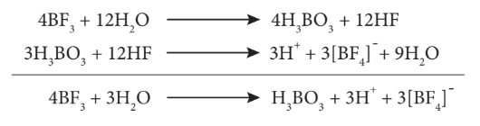

## 2.2 தொகுதி 13 (போரான் தொகுதி) தனிமங்கள்:

## 2.2.1 வளம்:

போரான், பொதுவாக போரேட்களாக காணப்படுகிறது. அதன் முக்கிய தாதுக்கள் போராக்ஸ் – \( Na_2[B_4O_5(OH)_4].8H_2O \) மற்றும் கெர்னைட் – \( Na_2[B_4O_5(OH)_4].2H_2O \) ஆகியனவாகும். அலுமினியம் மிக அதிகளவில் காணப்படும் உலோகமாகும், இது ஆக்சைடுகளாகவும், அலுமினோசிலிக்கேட் பாறைகளிலும் காணப்படுகிறது. அலுமினியத்தின் முக்கியமான தாதுவான பாக்சைட் (\( Al_2O_3.2H_2O \)) விருந்து அலுமினியம் வணிக ரீதியாக பிரித்தெடுக்கப்படுகிறது. இந்த தொகுதியின் மற்ற தனிமங்கள் மிகக் குறைந்த அளவிலேயே கிடைக்கின்றன. Ga, In மற்றும் Tl போன்ற மற்ற தனிமங்கள் அவற்றின் சல்பைடுகளாக கிடைக்கின்றன.

## 2.2.2 இயற் பண்புகள்:

13 ஆம் தொகுதித் தனிமங்களின் சில இயற் பண்புகள் கீழே அட்டவணைப்படுத்தப்பட்டுள்ளன.

**அட்டவணை 2.3 13 ஆம் தொகுதித் தனிமங்களின் சில இயற் பண்புகள்**

| பண்பு | போரான் | அலுமினியம் | காலியம் | இன்டியம் | தாலியம் |
|---|---|---|---|---|---|
| 293 K இல் இயற் நிலைமை | திண்மம் | திண்மம் | திண்மம் | திண்மம் | திண்மம் |
| அணு எண் | 5 | 13 | 31 | 49 | 81 |
| ஐசோடோப்புகள் | \( ^{11}B \) | \( ^{27}Al \) | \( ^{69}Ga \) | \( ^{115}In \) | \( ^{205}Tl \) |
| அணு நிறை (g.mol\(^{-1}\) at 293 K) | 10.81 | 26.98 | 69.72 | 114.82 | 204.38 |
| எலக்ட்ரான் அமைப்பு | \( [He]2s^2 2p^1 \) | \( [Ne]3s^2 3p^1 \) | \( [Ar]3d^{10} 4s^2 4p^1 \) | \( [Kr]4d^{10} 5s^2 5p^1 \) | \( [Xe] 4f^{14} 5d^{10} 6s^2 6p^1 \) |
| அணு ஆரம் (Å) | 1.92 | 1.84 | 1.87 | 1.93 | 1.96 |
| அடர்த்தி (g.cm\(^{-3}\) at 293 K) | 2.34 | 2.70 | 5.91 | 7.31 | 11.80 |
| உருகுநிலை (K) | 2350 | 933 | 302.76 | 429 | 577 |
| கொதிநிலை (K) | 4273 | 2792 | 2502 | 2300 | 1746 |

## 2.2.3 போரானின் வேதிப் பண்புகள்:

இந்தத் தொகுதியிலுள்ள ஒரே அலோகம் போரான் மட்டுமே, மேலும் இது வினைதிறன் குறைந்தது. எனினும், உயர் வெப்பநிலைகளில் போரான் அதிக வினைத்திறனைக் காட்டுகிறது. போரானின் பெரும்பாலான சேர்மங்கள் எலக்ட்ரான் குறைச் சேர்மங்களாகும், போரானின் சிறிய உருவளவு, உயர் அயனியாக்கும் ஆற்றல் மற்றும் கார்பன், ஹைட்ரஜன் ஆகியவற்றை ஒத்த எலக்ட்ரான் கவர்திறன் மதிப்பு ஆகிய காரணங்களால் வழக்கத்திற்கு மாறான புதிய வகை சகப்பிணைப்புகளை உருவாக்குகின்றன.

### உலோக போரைடுகள் உருவாதல்:

கார உலோகங்களைத் தவிர மற்ற பெரும்பாலான உலோகங்கள் \( M_xB_y \) (x மதிப்பு 11 வரையிலும், y மதிப்பு 66 அல்லது அதற்கும் அதிகமாக இருக்கும்) எனும் பொதுவாய்ப்பாட்டைக் கொண்ட போரைடுகளை உருவாக்குகின்றன.

### போரான் உடன் உலோகங்களின் நேரடி இணைதல்:

\[ Cr + nB \xrightarrow{1500 \, K} CrB_n \]

### போரான் ட்ரைஹேலைடுகளின் ஒடுக்கம்:

ஹைட்ரஜன் உதவியுடன், உலோகத்தை கொண்டு போரான் ட்ரைகுளோரைடை ஒடுக்கும்போது உலோக போரைடுகள் கிடைக்கின்றன.

$$2\text{BCl}_3 + 2\text{W} \xrightarrow[\text{H}_2]{1500\text{ K}} 2\text{WB} + 2\text{Cl}_2 + 2\text{HCl}$$

### ஹைட்ரைடுகள் உருவாதல்:

போரான் நேரடியாக ஹைட்ரஜனுடன் வினை புரிவதில்லை, எனினும் போரேன்கள் (boranes) எனும் புதுவகை ஹைட்ரைடுகளை உருவாக்குகிறது. டைபோரேன்- \( B_2H_6 \) ஒரு எளிய போரேன் ஆகும். டைபோரேனிலிருந்து மற்ற உயர் போரேன்களை உருவாக்க இயலும். வாயுநிலையிலுள்ள போரான் ட்ரைபுளூரைடை, 450K வெப்பநிலையில், சோடியம் ஹைட்ரைடுடன் வினைப்படுத்தும்போது டைபோரேன் கிடைக்கிறது. அதைத் தொடர்ந்து நிகழும் வெப்பச்சிதைவைத் தடுக்கும்பொருட்டு டைபோரேன் விளைபொருளானது உடனடியாக நீக்கப்படுகிறது.

\[ 2BF_3 + 6NaH \xrightarrow{450 \, K} B_2H_6 + 6NaF \]

### போரான் ட்ரைஹேலைடுகள் உருவாதல்:

போரான், உயர் வெப்பநிலைகளில் ஹேலஜன்களுடன் இணைந்து போரான் ட்ரைஹேலைடுகளை உருவாக்குகிறது.

\[ 2B + 3X_2 \xrightarrow{\Delta} 2BX_3 \]

### போரான் நைட்ரைடு உருவாதல்:

போரான், உயர் வெப்பநிலைகளில் டைநைட்ரஜனுடன் எரிந்து போரான் நைட்ரைடை உருவாக்குகிறது.

\[ 2B + N_2 \xrightarrow{\Delta} 2BN \]

### ஆக்சைடுகள் உருவாதல்:

ஏறத்தாழ 900K வெப்பநிலையில் ஆக்ஸிஜனுடன் வினைப்படுத்தும்போது போரான், அதன் ஆக்சைடை உருவாக்குகிறது.

\[ 4B + 3O_2 \xrightarrow{900 \, K} 2B_2O_3 \]

### அமிலங்கள் மற்றும் காரங்களுடன் வினை:

ஹேலோ அமிலங்களுடன் போரான் வினைபுரிவதில்லை. எனினும், சல்ஃபியூரிக் அமிலம் மற்றும் நைட்ரிக் அமிலம் போன்ற ஆக்ஸிஜனேற்ற காரணிகளுடன் வினைப்பட்டு போரிக் அமிலத்தை உருவாக்குகிறது.

\[ 2B + 3H_2SO_4 \rightarrow 2H_3BO_3 + 3SO_2 \]

\[ B + 3HNO_3 \rightarrow H_3BO_3 + 3NO_2 \]

போரான், உருகிய சோடியம் ஹைட்ராக்சைடுடன் வினைப்பட்டு சோடியம் போரேட்டைத் தருகிறது.

\[ 2B + 6NaOH \rightarrow 2Na_3BO_3 + 3H_2 \]

## போரானின் பயன்கள்:

1. போரான், நியூட்ரான்களை உறிஞ்சும் திறனைப் பெற்றுள்ளதால் அதன் \( ^{10}B_5 \) ஐசோடோப்பானது அணு உலைகளில் மட்டுப்படுத்தியாக பயன்படுகிறது.
2. படிகவடிவமற்ற போரான் – ராக்கெட் எரிபொருள் எரியூட்டியாக பயன்படுகிறது.
3. போரான், தாவர செல் சுவரின் முக்கிய பகுதிப் பொருளாக உள்ளது.
4. போரான் சேர்மங்கள் பல்வேறு பயன்பாடுகளை பெற்றுள்ளன. எடுத்துக்காட்டாக, கண் மருந்துகள், புரைதடுப்பான்கள், சலவைத் தூள் ஆகியவற்றில் போரிக் அமிலம் மற்றும் போராக்ஸ் உள்ளன. பைரக்ஸ் கண்ணாடி தயாரிப்பில் போரிக் அமிலம் பயன்படுகிறது.

## 2.2.4. போராக்ஸ் [\( Na_2B_4O_7.10H_2O \)]:

### தயாரித்தல்:

போராக்ஸ் என்பது டெட்ராபோரிக் அமிலத்தின் சோடிய உப்பாகும். இது கோலிமனைட் தாதுவை, சோடியம் கார்பனேட் கரைசலுடன் கொதிக்க வைப்பதன் மூலம் பெறப்படுகிறது.

\[ 2Ca_2B_6O_{11} + 3Na_2CO_3 + H_2O \xrightarrow{\Delta} 3Na_2B_4O_7 + 3CaCO_3 + Ca(OH)_2 \]

போராக்ஸ், பொதுவாக \( Na_2B_4O_7.10H_2O \) என குறிப்பிடப்படுகிறது. ஆனால், இது நான்கணு அலகுகளை \( [B_4O_5(OH)_4]^{2-} \) கொண்டுள்ளது. இந்த வடிவமானது பட்டக வடிவம் (prismatic form) என அறியப்படுகிறது. அணிகலன் அல்லது எண்முகி வடிவ போராக்ஸ் (\( Na_2B_4O_7.5H_2O \)) மற்றும் போராக்ஸ் கண்ணாடி (\( Na_2B_4O_7 \)) என மேலும் இரண்டு வடிவங்களில் போராக்ஸ் காணப்படுகிறது.

### பண்புகள்

போராக்ஸ் காரத்தன்மை கொண்டது, மேலும் அதன் வெந்நீர்க் கரைசல் சிதைந்து போரிக் அமிலம் மற்றும் சோடியம் ஹைட்ராக்சைடைத் தருவதால் காரத்தன்மை கொண்டது.

\[ Na_2B_4O_7 + 7H_2O \rightarrow 4H_3BO_3 + 2NaOH \]

இதை வெப்பப்படுத்தும்போது ஒளிபுகும் போராக்ஸ் மணிகள் உருவாகின்றன.

$$\text{Na}_2\text{B}_4\text{O}_7 \cdot 10\text{H}_2\text{O} \xrightarrow[-10\text{H}_2\text{O}]{\Delta} \text{Na}_2\text{B}_4\text{O}_7 \longrightarrow 2\text{NaBO}_2 + \text{B}_2\text{O}_3$$

போராக்ஸ், அமிலங்களுடன் வினைப்பட்டு சிறிதளவே கரையும் போரிக் அமிலத்தைத் தருகிறது.

\[ Na_2B_4O_7 + 2HCl + 5H_2O \rightarrow 4H_3BO_3 + 2NaCl \]

\[ Na_2B_4O_7 + H_2SO_4 + 5H_2O \rightarrow 4H_3BO_3 + Na_2SO_4 \]

இதை அம்மோனியம் குளோரைடுடன் வினைப்படுத்தும்போது போரான் நைட்ரைடை உருவாக்குகிறது.

\[ Na_2B_4O_7 + 2NH_4Cl \rightarrow 2NaCl + 2BN + B_2O_3 + 4H_2O \]

### போராக்ஸின் பயன்கள்:

1. நிறமுள்ள உலோக அயனிகளை கண்டறிவதில் போராக்ஸ் பயன்படுகிறது.
2. இது, கண் கண்ணாடி, போரோசிலிக்கேட் கண்ணாடி, எனாமல், மற்றும் பளபளப்பான மண்பாண்டங்கள் தயாரித்தலில் பயன்படுகிறது.
3. இது உலோகவியலில் இளக்கியாகப் பயன்படுகிறது.
4. உணவு பதப்படுத்தியாகவும் செயலாற்றும் தன்மையுடையது.

## 2.2.5. போரிக் அமிலம் [\( H_3BO_3 \) அல்லது \( B(OH)_3 \)]:

### தயாரித்தல்:

போராக்ஸ் மற்றும் கோலிமனைட் ஆகியவற்றிலிருந்து போரிக் அமிலத்தை பிரித்தெடுக்க இயலும்

\[ Na_2B_4O_7 + H_2SO_4 + 5H_2O \rightarrow Na_2SO_4 + 4H_3BO_3 \]

\[ Ca_2B_6O_{11} + 11H_2O + 4SO_2 \rightarrow 2Ca(HSO_3)_2 + 6H_3BO_3 \]

### பண்புகள்:

போரிக் அமிலமானது நிறமற்ற ஒளிபுகும் படிகமாகும். இது ஒரு வலிமை குறைந்த ஒருகாரத்துவ அமிலம். மேலும் இது புரோட்டானை வழங்குவதற்கு பதிலாக ஹைட்ராக்ஸில் அயனியை ஏற்றுக்கொள்கிறது.

\[ B(OH)_3 + 2H_2O \rightleftharpoons H_3O^+ + [B(OH)_4]^- \]

இது சோடியம் ஹைட்ராக்சைடுடன் வினைப்பட்டு சோடியம் மெட்டாபோரேட் மற்றும் சோடியம் டெட்ராபோரேட்டை உருவாக்குகிறது.

\[ H_3BO_3 + NaOH \rightarrow NaBO_2 + 2H_2O \]

\[ 4H_3BO_3 + 2NaOH \rightarrow Na_2B_4O_7 + 7H_2O \]

### வெப்பத்தின் விளைவு:

போரிக் அமிலத்தை வெப்பப்படுத்தும்போது, 373K வெப்பநிலையில் மெட்டா போரிக் அமிலத்தையும், 413K வெப்பநிலையில் டெட்ரா போரிக் அமிலத்தையும் தருகிறது. செஞ்சூடு நிலைக்கு வெப்பப்படுத்தும்போது கண்ணாடி போன்ற போரிக் நீரிலியை உருவாக்குகிறது.

$$4\text{H}_3\text{BO}_3 \xrightarrow{373\text{ K}} 4\text{HBO}_2 + 4\text{H}_2\text{O}$$

$$4\text{HBO}_2 \xrightarrow{413\text{ K}} \text{H}_2\text{B}_4\text{O}_7 + \text{H}_2\text{O}$$

$$\text{H}_2\text{B}_4\text{O}_7 \xrightarrow{\text{செஞ்சூட்டு வெப்பநிலை}} 2\text{B}_2\text{O}_3 + \text{H}_2\text{O}$$

### அம்மோனியாவுடன் வினை:

அம்மோனியா முன்னிலையில் யூரியாவுடன் போரிக் அமிலத்தை சேர்த்து 800 – 1200 K வெப்பநிலையில் உருக்கும்போது போரான் நைட்ரைடு கிடைக்கிறது.

\[ B(OH)_3 + NH_3 \xrightarrow{\Delta} BN + 3H_2O \]

### எத்தில் போரேட் ஆய்வு:

அடர் கந்தக அமிலத்தின் முன்னிலையில், போரிக் அமிலம் அல்லது போரேட் உப்பை எத்தில் ஆல்கஹாலுடன் வெப்பப்படுத்தும்போது ட்ரைஎத்தில்போரேட் எனும் எஸ்டர் உருவாகிறது. இந்த எஸ்டரின் ஆவி பச்சை நிற சுடருடன் எரிகிறது, மேலும் இது போரேட்டை கண்டறிய பயன்படும் ஒரு வினையாகும்.

$$\text{H}_3\text{BO}_3 + 3\text{C}_2\text{H}_5\text{OH} \xrightarrow[\text{H}_2\text{SO}_4]{\text{Conc.}} \text{B}(\text{OC}_2\text{H}_5)_3 + 3\text{H}_2\text{O}$$

**குறிப்பு:** ட்ரைஆல்க்கைல் போரேட் ஆனது டெட்ரா ஹைட்ரோ ஃபியூரானில் கரைந்த சோடியம் ஹைட்ரைடுடன் வினைப்பட்டு \( Na[BH(OR)_3] \) எனும் அணைவுச் சேர்மத்தைத் தருகிறது, இது வலிமை மிகுந்த ஒடுக்கும் காரணியாக செயல்படுகிறது.

### போரான் ட்ரைபுளூரைடு உருவாதல்:

போரிக் அமிலமானது அடர் கந்தக அமிலத்தின் முன்னிலையில் கால்சியம் புளூரைடுடன் வினைப்பட்டு போரான் ட்ரைபுளூரைடைத் தருகிறது.

\[ 3CaF_2 + 3H_2SO_4 + 2B(OH)_3 \rightarrow 3CaSO_4 + 2BF_3 + 6H_2O \]

போரிக் அமிலத்தை, சோடா சாம்பலுடன் வெப்பப்படுத்தும்போது போராக்ஸ் உருவாகிறது.

\[ Na_2CO_3 + 4B(OH)_3 \rightarrow Na_2B_4O_7 + CO_2 + 6H_2O \]

### போரிக் அமிலத்தின் அமைப்பு:

போரிக் அமிலமானது, இருபரிமாண அடுக்கு அமைப்பைக் கொண்டுள்ளது. இது \( [BO_3]^{3-} \) அலகுகளைக் கொண்டுள்ளது, இந்த அலகுகள் ஹைட்ரஜன் பிணைப்புகளால் படம் 2.2 இல் காட்டியுள்ளவாறு ஒன்றுடன் ஒன்று பிணைக்கப்பட்டுள்ளன.

படம் 2.2 போரிக் அமிலத்தின் அமைப்பு

  

### போரிக் அமிலத்தின் பயன்கள்:

1. பளபளப்பான மண்பாண்டங்கள், எனாமல், மற்றும் நிறமிகள் தயாரித்தலில் போரிக் அமிலம் பயன்படுகிறது.
2. இது புரைதடுப்பானாகவும்,, கண் மருந்தாகவும் பயன்படுகிறது.
3. இது உணவு பாதுகாப்பானாகவும் பயன்படுகிறது.

## 2.2.6 டைபோரேன்

### தயாரித்தல்:

உலோக ஹைட்ரைடை போரானுடன் வினைப்படுத்துவதன் மூலம் டைபோரேனைத் தயாரிக்க முடியும். இந்த முறையானது தொழிற்சாலை தயாரிப்பிற்காக பயன்படுத்தப்படுகிறது.

அயோடினை, டைக்லைமில் கரைந்துள்ள சோடியம் போரோஹைட்ரைடுடன் வினைப்படுத்துவதன் மூலமாகவும் சிறிதளவு டைபோரேனை தயாரிக்க முடியும்.

\[ 2NaBH_4 + I_2 \rightarrow B_2H_6 + 2NaI + H_2 \]

மெக்னீஷியம் போரைடு HCl உடன் வெப்பப்படுத்தும்போது எளிதில் ஆவியாகும் போரேன்கள் பெறப்படுகின்றன.

\[ 2Mg_3B_2 + 12HCl \rightarrow 6MgCl_2 + B_4H_{10} + H_2 \]
\[ B_4H_{10} + H_2 \rightarrow 2B_2H_6 \]

### பண்புகள்:

போரேன்கள் நிறமற்ற, டையா காந்தத் தன்மை கொண்ட சேர்மங்களாகும். இவை குறைந்த வெப்ப நிலைப்புத்தன்மை உடையவைகளாகும். அறை வெப்பநிலையில், டைபோரேன் நறுமணம் மிக்க, மிகவும் நச்சுத் தன்மை கொண்ட வாயுவாகும். மேலும் இது அதிக வினைத் திறன் கொண்டது.

இது உயர் வெப்பநிலைகளில், ஹைட்ரஜன் வாயுவை வெளியேற்றி உயர் போரேன்களைத் தருகின்றது.

$$5\text{B}_2\text{H}_6 \xrightarrow[\text{U-குழாய்}]{388\text{ K}} 2\text{B}_5\text{H}_{11} + 4\text{H}_2$$

$$2\text{B}_2\text{H}_6 \xrightarrow{198\text{ - }373\text{ K}} \text{B}_4\text{H}_{10} + \text{H}_2$$

$$5\text{B}_2\text{H}_6 \xrightarrow[\text{மூடப்பட்ட குழாய்}]{373\text{ K}} \text{B}_{10}\text{H}_{14} + 8\text{H}_2$$

$$5\text{B}_2\text{H}_6 \xrightarrow{473\text{ - }523\text{ K}} 2\text{B}_5\text{H}_9 + 6\text{H}_2$$

$$10\text{B}_2\text{H}_6 \xrightarrow{523\text{ K}} 2\text{B}_5\text{H}_9 + 2\text{B}_5\text{H}_{10} + 11\text{H}_2$$

$$\text{B}_2\text{H}_6 \xrightarrow{\text{செஞ்சூட்டு வெப்பநிலை}} 2\text{B} + 3\text{H}_2$$

டைபோரேன், நீர் மற்றும் காரங்களுடன் வினைப்பட்டு முறையே போரிக் அமிலம் மற்றும் மெட்டா போரேட்களைத் தருகின்றது.

\[ B_2H_6 + 6H_2O \rightarrow 2H_3BO_3 + 6H_2 \]
\[ B_2H_6 + 2NaOH + 2H_2O \rightarrow 2NaBO_2 + 6H_2 \]

### காற்றுடன் வினை:

அறை வெப்பநிலையில், தூய நிலையிலுள்ள டைபோரேன் காற்று அல்லது ஆக்ஸிஜனுடன் வினைபுரிவதில்லை. ஆனால் மாசு கலந்த நிலையில் அதிகளவு வெப்பத்தை உமிழ்ந்து, \( B_2O_3 \) ஐ உருவாக்குகிறது.

\[ B_2H_6 + 3O_2 \rightarrow B_2O_3 + 3H_2O \quad \Delta H = -2165 \text{ KJ mol}^{-1} \]

டைபோரேன், மெத்தில் ஆல்கஹாலுடன் வினைப்பட்டு ட்ரைமெத்தில் போரேட்டைத் தருகிறது.

\[ B_2H_6 + 6CH_3OH \rightarrow 2B(OCH_3)_3 + 6H_2 \]

### ஹைட்ரோபோரேனேற்றம்:

அறை வெப்பநிலையில், ஈதர் ஊடகத்தில், ஆல்கீன்கள் மற்றும் ஆல்க்கைன்களுடன் போரேன் சேர்க்கை (addition) வினைக்கு உட்படுகிறது. இவ்வினை ஹைட்ரோபோரோனேற்றம் என்றழைக்கப்படுகிறது. தொகுப்பு கரிமவேதியியலில், குறிப்பாக எதிர் மார்கோனிகாவ் சேர்க்கை வினைகளில் இது அதிகளவில் பயன்படுகிறது.

\[ B_2H_6 + 6RCH=CHR \rightarrow 2(RCH_2-CHR)_3B \]

### அயனி ஹைட்ரைடுகளுடன் வினை:

உலோக ஹைட்ரைடுகளுடன் வினைப்பட்டு உலோக போரோ ஹைட்ரைடுகளைத் தருகிறது.

\[ B_2H_6 + 2LiH \xrightarrow{\text{ஈதர்}} 2LiBH_4 \]
\[ B_2H_6 + 2NaH \xrightarrow{\text{டிகிலைம்}} 2NaBH_4 \]

### அம்மோனியாவுடன் வினை:

குறைந்த வெப்பநிலைகளில், டைபோரேன், அதிகளவு அம்மோனியாவுடன் வினைப்பட்டு டைபோரேன் டைஅம்மோனேட் உருவாகிறது. ஆனால் உயர் வெப்பநிலைகளில் வெப்பப்படுத்தும்போது, இது போராசோல் எனும் சேர்மத்தைத் தருகிறது.

\[ 3B_2H_6 + 6NH_3 \xrightarrow{-153K} 3(B_2H_6 \cdot 2NH_3) \text{ (or) } 3[BH_2(NH_3)_2]^+[BH_4]^-  \]

### டைபோரேன் வடிவமைப்பு:

டைபோரேனில், இரண்டு \( BH_2 \) அலகுகள் இரண்டு ஹைட்ரஜன் பாலங்களால் பிணைக்கப்பட்டுள்ளன. எனவே இது எட்டு B-H பிணைப்புகளைக் கொண்டுள்ளது. எனினும், டைபோரேன் 12 இணைதிற எலக்ட்ரான்களை மட்டுமே கொண்டுள்ளது. இவை இயல்பான சகப்பிணைப்பிற்கு போதுமானதாக இல்லை. இதில் காணப்படும் நான்கு முனைய (terminal) B-H பிணைப்புகள் இயல்பான சகப்பிணைப்புகளாகும் (இரு மைய – இரு எலக்ட்ரான் பிணைப்பு அல்லது 2c-2e பிணைப்பு). எஞ்சியுள்ள நான்கு எலக்ட்ரான்கள் பால பிணைப்புகளுக்கு (bridged bonds) பயன்படுத்திக்கொள்ளப்பட வேண்டும். அதாவது, இரண்டு மூன்று மைய B-H-B பிணைப்புகள் ஒவ்வொன்றும் இரண்டு எலக்ட்ரான்களைப் பயன்படுத்திக்கொள்கின்றன. எனவே, இவை மூன்று மைய இரு எலக்ட்ரான் (3c-2e) பிணைப்புகளாகும். படம் 2.3 இல் காட்டியுள்ளவாறு பிணைப்புப் பாலங்களிலுள்ள ஹைட்ரஜன் அணுக்கள் ஒரே தளத்தில் அமைகின்றன. டைபோரேனில், போரான் அணுவானது \( sp^3 \) இனக்கலப்பிலுள்ளது. நான்கு \( sp^3 \) இனக்கலப்பு ஆர்பிட்டால்களில் மூன்று ஆர்பிட்டால்கள் ஒற்றை எலக்ட்ரானைக் கொண்டுள்ளன, நான்காம் ஆர்பிட்டால் காலியாக உள்ளது. ஒவ்வொரு போரான் அணுவிலிருந்தும், இரண்டு பாதி நிரம்பிய இனக்கலப்பு ஆர்பிட்டால்கள், இரண்டு ஹைட்ரஜன் அணுக்களின் 1s ஆர்பிட்டால்களுடன் மேற்பொருந்தி நான்கு 2c-2e முனைய பிணைப்புகளை உருவாக்குகின்றன. இந்நிலையில் ஒவ்வொரு போரான் அணுவிலும் ஒரு காலி ஆர்பிட்டாலும், ஒரு பாதி நிரம்பிய இனக்கலப்பு ஆர்பிட்டாலும் காணப்படுகின்றன. ஒரு போரான் அணுவின் பாதி நிரம்பிய இனக்கலப்பு ஆர்பிட்டாலும், மற்றொரு போரான் அணுவின் காலியாக உள்ள இனக்கலப்பு ஆர்பிட்டாலும், ஹைட்ரஜன் அணுவின் பாதி நிரம்பிய 1s ஆர்பிட்டாலும் ஒன்றோடொன்று மேற்பொருந்துவதால் B-H-B பிணைப்பு (மூமைய-இரு எலக்ட்ரான் பிணைப்பு) உருவாகிறது.

## டைபோரேனின் பயன்கள்:

1. உந்திகளில், உயர் ஆற்றல் எரிபொருளாக டைபோரேன் பயன்படுகிறது.
2. இது கரிம வேதியியலில் ஒடுக்கும் காரணியாக பயன்படுகிறது.
3. இது உலோகங்களை ஒட்டவைக்கும் சுடரில் (welding torch) பயன்படுகிறது.

## 2.2.7 போரான் ட்ரைபுளூரைடு::

### தயாரித்தல்:

அடர் கந்தக அமிலத்தின் முன்னிலையில் கால்சியம் புளூரைடை, போரான் ட்ரை ஆக்சைசைடுடன் வினைப்படுத்தும்போது போரான் ட்ரைபுளூரைடு பெறப்படுகிறது.

\[ B_2O_3 + 3CaF_2 + 3H_2SO_4 \xrightarrow{\Delta} 2BF_3 + 3CaSO_4 + 3H_2O \]

போரான் ட்ரை ஆக்சைடை கார்பன் மற்றும் புளூரின் ஆகியவற்றுடன் வினைப்படுத்தியும் இதனைப் பெற முடியும்.

\[ B_2O_3 + 3C + 3F_2 \rightarrow 2BF_3 + 3CO \]

ஆய்வகத்தில் பென்சீன் டையசோனியம் டெட்ராஃபுளூரோ போரேட்டை வெப்பச் சிதைத்தலின் மூலம் தூய \( BF_3 \) தயாரிக்கப்படுகிறது.

\[ C_6H_5N_2BF_4 \xrightarrow{\Delta} BF_3 + C_6H_5F + N_2 \]

### பண்புகள்:

போரான் ட்ரைபுளூரைடு ஒருதள அமைப்பைப் பெற்றுள்ளது. இது ஒரு எலக்ட்ரான் குறைச் சேர்மமாகும், மேலும் எலக்ட்ரான் இரட்டைகளை ஏற்றுக்கொண்டு ஈதல் சகப்பிணைப்புகளை உருவாக்குகிறது. இவை \( [BX_4]^- \) வகை அணைவுச் சேர்மத்தை உருவாக்குகின்றன.

\[ BF_3 + NH_3 \rightarrow F_3B \leftarrow NH_3 \]

\[ BF_3 + H_2O \rightarrow F_3B \leftarrow OH_2 \]

நீராற் பகுத்தலில் போரிக் அமிலம் கிடைக்கிறது. இது பின்னர் ஹைட்ரோ புளூரோபோரிக் அமிலமாக மாற்றப்படுகிறது.

### போரான் ட்ரைபுளூரைடின் பயன்கள்:

1. கரிம வேதியியலில் வினைவேக மாற்றியாக பயன்படும் \( HBF_4 \) ஐ தயாரிக்க போரான் ட்ரைபுளூரைடு பயன்படுகிறது.
2. இது புளூரினேற்ற காரணியாகவும் பயன்படுகிறது.

## 2.2.8 அலுமினியம் குளோரைடு:

### தயாரித்தல்:

உலோக அலுமினியம் அல்லது அலுமினியம் ஹைட்ராக்சைடை, ஹைட்ரோ குளோரிக் அமிலத்துடன் வினைப்படுத்தும்போது அலுமினியம் ட்ரைகுளோரைடு கிடைக்கிறது. இந்த வினைக்கலவையானது ஆவியாக்கப்பட்டு நீரற்ற அலுமினியம் குளோரைடு பெறப்படுகிறது.

\[ 2Al + 6HCl \rightarrow 2AlCl_3 + 3H_2 \]
\[ Al(OH)_3 + 3HCl \rightarrow AlCl_3 + 3H_2O \]

### மெக்காஃபி செயல்முறை:

அலுமினா மற்றும் கல்கரி சேர்ந்த கலவையை குளோரினுடன் சேர்த்து வெப்பப்படுத்தி அலுமினியம் குளோரைடு பெறப்படுகிறது.

\[ 2Al_2O_3 + 3C + 6Cl_2 \rightarrow 4AlCl_3 + 3CO_2 \]

இது, தொழிற் முறையில், ஏறக்குறைய 1000K வெப்பநிலையில் அலுமினியத்தை குளோரினேற்றம் செய்து பெறப்படுகிறது.

\[ 2Al + 3Cl_2 \xrightarrow{1000 \, K} 2AlCl_3 \]

### பண்புகள்:

நீரற்ற அலுமினியம் குளோரைடு நிறமற்ற, நீர் உறிஞ்சும் பொருளாகும். அலுமினியம் குளோரைடின் நீர்க்கரைசல் அமிலத்தன்மை கொண்டது. இது ஈரக்காற்றில் புகைந்து ஹைட்ரஜன் குளோரைடை உருவாக்குகிறது.

\[ AlCl_3 + 3H_2O \rightarrow Al(OH)_3 + 3HCl \]

இது அம்மோனியம் ஹைட்ராக்சைடுடன் வினைப்பட்டு அலுமினியம் ஹைட்ராக்சைடைத் தருகிறது.

\[ AlCl_3 + 3NH_4OH \rightarrow Al(OH)_3 + 3NH_4Cl \]

இது, அதிகளவு சோடியம் ஹைட்ராக்சைடுடன் வினைப்பட்டு சோடியம் அலுமினேட்டை உருவாக்குகிறது.

\[ AlCl_3 + 4NaOH \rightarrow NaAlO_2 + 2H_2O + 3NaCl \]

இது லூயி அமிலங்களைப் போல செயல்படுகிறது, அம்மோனியா, பாஸ்பீன் மற்றும் கார்பனைல் குளோரைடு போன்றவற்றுடன் சேர்க்கைச் சேர்மங்களை உருவாக்குகின்றன. எடுத்துக்காட்டு: \( AlCl_3.6NH_3 \).

### அலுமினியம் குளோரைடின் பயன்கள்:

1. நீரற்ற அலுமினியம் குளோரைடு, பிரீடல் கிராஃப்ட் வினைகளில் வினைவேக மாற்றியாக பயன்படுகிறது.
2. இது, கனிம எண்ணெய்களை சிதைத்து பெட்ரோல் தயாரித்தலில் பயன்படுகிறது.
3. இது, சாயங்கள், மருந்துகள் மற்றும் வாசனைத் திரவியங்கள் தயாரிப்பில் வினைவேக மாற்றியாக பயன்படுகிறது.

## 2.2.9 படிகாரங்கள்:

பொட்டாசியம், அலுமினியம் சல்பேட்டின் இரட்டை உப்பானது \( [K_2SO_4.Al_2(SO_4)_3.24H_2O] \) படிகாரம் என பெயரிடப்பட்டுள்ளது. தற்போது, \( M'_2SO_4.M''_2(SO_4)_3.24H_2O \), வாய்ப்பாடு கொண்ட அனைத்து இரட்டை உப்புகளுக்கும் இப்பெயர் பயன்படுத்தப்படுகிறது. இங்கு M' என்பது ஒற்றை நேர்மின் கொண்ட உலோக அயனி அல்லது \( [NH_4]^+ \) மற்றும் M" என்பது மூன்று நேர்மின்சுமை கொண்ட உலோக அயனி ஆகும்.

### எடுத்துக்காட்டுகள்:

பொட்டாஷ் படிகாரம் \( [K_2SO_4.Al_2(SO_4)_3.24H_2O] \); சோடியம் படிகாரம் \( [Na_2SO_4.Al_2(SO_4)_3.24H_2O] \), அம்மோனியம் படிகாரம் \( [(NH_4)_2SO_4.Al_2(SO_4)_3.24H_2O] \), குரோம் படிகாரம் \( [K_2SO_4.Cr_2(SO_4)_3.24H_2O] \). பொதுவாக படிகாரங்கள் குளிர்ந்த நீரைவிட, வெந்நீரில் அதிகமாக கரையக்கூடியவை.கரைசல்களில் அவை அவற்றின் உட்கூறு அயனிகளின் பண்புகளை வெளிக்காட்டுகின்றன.

### தயாரித்தல்:

அலுனைட் – படிகாரக் கல் என்பது இயற்கையில் காணப்படும் படிகமாகும், இதன் வாய்ப்பாடு \( K_2SO_4.Al_2(SO_4)_3.4Al(OH)_3 \), படிகாரக் கல்லை அதிகளவு கந்தக அமிலத்துடன் வினைப்படுத்தும்போது, அலுமினியம் ஹைட்ராக்சைடு முற்றிலும் அலுமினியம் சல்பேட்டாக மாற்றப்படுகிறது. இதனுடன் கணக்கிடப்பட்ட அளவு பொட்டாசியம் சல்பேட் சேர்த்து கரைசலை படிகமாக்கும்போது பொட்டாஷ் படிகாரம் கிடைக்கிறது. இது மறுபடிகமாக்கல் மூலம் தூய்மைப்படுத்தப்படுகிறது.

\[ K_2SO_4.Al_2(SO_4)_3.4Al(OH)_3 + 6H_2SO_4 \rightarrow K_2SO_4 + 3Al_2(SO_4)_3 + 12H_2O \]
\[ K_2SO_4 + Al_2(SO_4)_3 + 24H_2O \rightarrow K_2SO_4Al_2(SO_4)_3.24H_2O \]

### பண்புகள்:

பொட்டாஷ் படிகாரம் ஒரு வெண்மையான படிகமாகும், இது நீரில் கரைகிறது ஆனால் ஆல்கஹாலில் கரைவதில்லை. இதன் நீர்க்கரைசலில் அலுமினியம் சல்பேட் நீராற்பகுப்படைவதால் கரைசல் அமிலத்தன்மை கொண்டதாக மாறுகிறது. பொட்டாஷ் படிகாரத்தை வெப்பப்படுத்தும்போது 365K வெப்பநிலையில் உருகுகிறது. 475 K வெப்பநிலையில் படிக நீரை இழந்து உருப்பெருக்கம் அடைகிறது. இது எரிக்கப்பட்ட படிகாரம் என அழைக்கப்படுகிறது. இதை செஞ்சூட்டு நிலைக்கு வெப்பப்படுத்தும்போது சிதைந்து பொட்டாசியம் சல்பேட், அலுமினா மற்றும் சல்பர் ட்ரை ஆக்சைடு ஆகியவற்றைத் தருகிறது.

\[ K_2SO_4.Al_2(SO_4)_3.24H_2O \xrightarrow{500K} K_2SO_4.Al_2(SO_4)_3 + 24H_2O \]
\[ K_2SO_4.Al_2(SO_4)_3 \xrightarrow{\text{செஞ்சூட்டு வெப்பநிலை}} K_2SO_4 + Al_2O_3 + 3SO_3 \]

பொட்டாஷ் படிகாரத்தை, அம்மோனியம் ஹைட்ராக்சைடுடன் வினைப்படுத்தும்போது அலுமினியம் ஹைட்ராக்சைடு கிடைக்கிறது.

\[ K_2SO_4.Al_2(SO_4)_3.24H_2O + 6NH_4OH \rightarrow K_2SO_4 + 3(NH_4)_2SO_4 + 24H_2O + 2Al(OH)_3 \]

### படிகாரத்தின் பயன்கள்

1. இது நீர் சுத்திகரிப்பில் பயன்படுகிறது.
2. இது நீர் ஒட்டா ஆடைகள் தயாரித்தலிலும், ஜவுளித் துறையிலும் பயன்படுகிறது.
3. இது சாயமிடுதல், காகிதம் மற்றும் தோல் பதனிடும் தொழிற்சாலைகளில் பயன்படுகிறது.
4. இது இரத்தக் கசிவை நிறுத்தும் "குருதி தடுப்பான்" ஆக பயன்படுகிறது.