# p-தொகுதி தனிமங்கள் II

**சர் வில்லியம் ராம்சே, (1852 – 1916)**

சர் வில்லியம் ராம்சே ஒரு ஸ்காட்லேண்டைச் சார்ந்த வேதியியல் அறிஞர் ஆவார். மந்த வாயுக்களைக் கண்டறிந்தவர் இவரே. 1885-1890 க்கு இடைப்பட்ட காலத்தில் இவர் நைட்ரஜனின் ஆக்ஸைடுகள் குறித்து பல முக்கியமான ஆய்வுக் கட்டுரைகளை வெளியிட்டார். ராம்சே காற்றிலிருந்து ஒரு கனமான தனிமத்தை பிரித்தெடுத்து அதற்கு ஆர்கான் (மந்தமான எனப்பொருள்படும் கிரேக்கச் சொல்) எனப் பெயரிட்டார். தொடர்ந்து மாரிஸ் ட்ராவெர்ஸ் எனும் அறிவியலாளருடன் இணைந்து பணியாற்றி நியான், கிரிப்டான் மற்றும் செனான் ஆகியவற்றைக் கண்டறிந்தார். இவர், 1910 ஆம் ஆண்டில் ரேடான் வாயுவை பிரித்தெடுத்து அதன் பண்புகளை ஆய்வு செய்தார். மந்த வாயுக்களை கண்டறிதலில் அவர் ஆற்றிய சேவையை போற்றும் வகையில், 1904 ஆம் ஆண்டில் வேதியியலுக்கான நோபல் பரிசு அவருக்கு வழங்கப்பட்டது. மந்த வாயுக்களை பிரித்தெடுத்தலில் இவர் ஆற்றிய மகத்தான பணியினால் தனிம வரிசை அட்டவணையில் ஒரு புதிய தொகுதி உருவாதற்கு வழிவகை ஏற்பட்டது.

## கற்றலின் நோக்கங்கள்

இப்பாடப்பகுதியைக் கற்றறிந்த பின்னர்,

- நைட்ரஜன் மற்றும் பாஸ்பரஸ் ஆகியவற்றின் முக்கியமான சேர்மங்களின் தயாரிப்பு மற்றும் பண்புகள் குறித்து விவாதித்தல்.

- ஆக்ஸிஜன் மற்றும் சல்பர் ஆகியவற்றின் முக்கியமான சேர்மங்களின் தயாரிப்பு மற்றும் பண்புகள் குறித்து விளக்குதல்.

- ஹேலஜன்கள் மற்றும் ஹைட்ரஜன் ஹேலைடுகள் ஆகியவற்றின் தயாரிப்பு மற்றும் பண்புகள் குறித்து விளக்குதல்.

- ஹேலஜன் இடைசேர்மங்களின் வேதியியலைப் பற்றி விளக்குதல்.

- மந்தவாயுக்களின் பண்புகள் மற்றும் பயன்களை விளக்குதல்.

- அன்றாட வாழ்வில் p-தொகுதி தனிமங்கள் மற்றும் அவற்றின் சேர்மங்களின் முக்கியத்துவத்தை பாராட்டுதல். ஆகிய திறன்களைப் மாணவர்கள் பெறலாம்.

## அறிமுகம்:

p-தொகுதி தனிமங்களின் பொதுப் பண்புகள், ஐகோசாஜன்கள் (போரான் தொகுதி) மற்றும் டெட்ராஜன்கள் (கார்பன் தொகுதி) ஆகிய முதல் இரண்டு தொகுதி தனிமங்கள் பற்றி முந்தைய பாடப்பகுதியில் கற்றறிந்தோம். இந்த அலகில் எஞ்சியுள்ள p-தொகுதிகளான நிக்டோஜன்கள், சால்கோஜன்கள், ஹேலஜன்கள் மற்றும் மந்த வாயுக்கள் பற்றிக் கற்றறிவோம்.

## 3.1 தொகுதி 15 (நைட்ரஜன் தொகுதி) தனிமங்கள்:

### 3.1.1 வளம்:

பூமியின் வளிமண்டலமானது ஏறத்தாழ 78% டைநைட்ரஜன் (\( N_2 \)) வாயுவைக் கொண்டுள்ளது. மேலும் இது சோடியம் நைட்ரேட்டாகவும் (சிலி வெடியுப்பு) பொட்டாசியம் நைட்ரேட்டாகவும் (இந்திய வெடியுப்பு) புவியின் மேற்பரப்பில் காணப்படுகிறது. அதிகமாக கிடைக்கக்கூடிய பதினோராவது தனிமமான பாஸ்பரஸ், பாஸ்பேட்களாக (புளூரபடைட், குளோரபடைட் மற்றும் ஹைட்ராக்ஸி அபடைட்) காணப்படுகிறது. மற்ற தனிமங்களான ஆர்சனிக், ஆண்டிமனி மற்றும் பிஸ்மத் ஆகியன அவற்றின் சல்பைடுகளாக காணப்படுகின்றன. ஆனால் இவை அதிகளவில் கிடைப்பதில்லை.

### 3.1.2 இயற் பண்புகள்:

15ஆம் தொகுதித் தனிமங்களின் சில இயற் பண்புகள் கீழே அட்டவணைப்படுத்தப்பட்டுள்ளன.

**அட்டவணை 3.1 : 15 ஆம் தொகுதித் தனிமங்களின் சில இயற் பண்புகள்**

| பண்பு | நைட்ரஜன் | பாஸ்பரஸ் | ஆர்சனிக் | ஆன்டிமனி | பிஸ்மத் |
| --- | --- | --- | --- | --- | --- |
| 293 K இல் இயற் நிலைமை | வாயு | திண்மம் | திண்மம் | திண்மம் | திண்மம் |
| அணு எண் | 7 | 15 | 33 | 51 | 83 |
| ஐசோடோப்புகள் | $^{14}\text{N}$, $^{15}\text{N}$ | $^{31}\text{P}$ | $^{75}\text{As}$ | $^{121}\text{Sb}$ | $^{209}\text{Bi}$ |
| அணு நிறை ($\text{g}\cdot\text{mol}^{-1}$ at 293 K) | 14 | 30.97 | 74.92 | 121.76 | 209.98 |
| எலக்ட்ரான் அமைப்பு | $[\text{He}]2\text{s}^2 2\text{p}^3$ | $[\text{Ne}]3\text{s}^2 3\text{p}^3$ | $[\text{Ar}]3\text{d}^{10} 4\text{s}^2 4\text{p}^3$ | $[\text{Kr}]4\text{d}^{10} 5\text{s}^2 5\text{p}^3$ | $[\text{Xe}] 4\text{f}^{14} 5\text{d}^{10} 6\text{s}^2 6\text{p}^3$ |
| அணு ஆரம் ($\text{\AA}$) | 1.55 | 1.80 | 1.85 | 2.06 | 2.07 |
| அடர்த்தி ($\text{g}\cdot\text{cm}^{-3}$ at 293 K) | $1.14 \times 10^{-3}$ | 1.82 வெண்ணிற பாஸ்பரஸ் | 5.75 | 6.68 | 9.79 |
| உருகுநிலை (K) | 63 | 317 | 889 K ல் பதங்கமாதல்| 904 | 544 |
| கொதிநிலை (K) | 77 | 554 | 889 K ல் பதங்கமாதல் | 1860 | 1837 |

### 3.1.3 நைட்ரஜன்:

**தயாரித்தல்:**

வளிமண்டலத்தின் முதன்மையான நைட்ரஜன் (78 % கனஅளவு) வாயுவானது, தொழிற்முறையில், பின்னவாலை வடித்தல் முறையில் திரவ காற்றிலிருந்து பிரித்தெடுக்கப்படுகிறது. ஏறத்தாழ 575 K வெப்பநிலையில் சோடியம் அசைடு சேர்மத்தை வெப்பச் சிதைவிற்கு உட்படுத்தி தூய நைட்ரஜனைப் பெற இயலும்.

\[
2NaN_3 \xrightarrow{} 2Na + 3N_2
\]

அம்மோனியாவை, புரோமின் நீர் கொண்டு ஆக்ஸிஜனேற்றம் செய்தும் இதை பெற இயலும்.

\[
8NH_3 + 3Br_2 \rightarrow 6NH_4Br + N_2
\]

**பண்புகள்**

நைட்ரஜன் வாயுவானது சற்றே மந்தத் தன்மை வாய்ந்தது. பூமியில் கிடைக்கும் நைட்ரஜன் வாயுவானது முறையே 14.5% நைட்ரஜன் - 14 மற்றும் 0.4% நைட்ரஜன் -15 ஐசோடோப்புகளைக் கொண்டுள்ளது. இவற்றில் நைட்ரஜன் -15 ஆனது ஐசோடோப் குறியிடுதலில் பயன்படுத்தப்படுகிறது. நைட்ரஜனின் மந்தத் தன்மைக்குக் காரணம், மூலக்கூறுகளின் அதிக பிணைப்பு ஆற்றல் மதிப்பே (225 cal mol\(^{-1}\) அல்லது 946 kJ mol\(^{-1}\)) ஆகும். இந்த முப்பிணைப்பு அமைப்பின் குறைந்த வினைதிறனை \( -C \equiv C- \), \( C \equiv O \), \( X-C \equiv N \), \( X-N \equiv C \), \( -C \equiv C- \) மற்றும் \( -C \equiv N \) போன்ற மற்ற முப்பிணைப்புகளைக் கொண்ட சம எலக்ட்ரான் அமைப்புகளுடன் ஒப்பிடும்போது ஆர்வத்தினைத் தூண்டுவதாக உள்ளது. இந்த தொகுதிகள் ஈனிகளாக செயல்படுகின்றன. ஆனால் டைநைட்ரஜன் ஈனியாக செயல்படுவதில்லை. எனினும், CO மூலக்கூறைப் போலவே, இதுவும் உலோகங்களுடன் இணைந்து குறைந்த அளவிலான அணைவுகளை \( (M \leftarrow N \equiv N) \) உருவாக்குகிறது. லித்தியத்துடன் வினைபுரிந்து \( Li_3N \) சேர்மத்தைத் தரும் வினைமட்டுமே அறைவெப்பநிலையில் நிகழும் நைட்ரஜனின் வினையாகும். மற்ற தனிமங்களுடன் நைட்ரஜன் உயர் வெப்பநிலைகளில் மட்டுமே வினைபுரிகிறது. தொகுதி-2 உலோகங்கள் மற்றும் Th ஆகியன அயனி நைட்ரைடுகளை உருவாக்குகின்றன.

$$6\text{Li} + \text{N}_2 \longrightarrow 2\text{Li}_3\text{N}$$

$$3\text{Ca} + \text{N}_2 \xrightarrow{\quad\substack{\text{செஞ்சூட்டு} \\ \text{வெப்பநிலை}}\quad} \text{Ca}_3\text{N}_2$$

$$2B + \text{N}_2 \xrightarrow{\quad\substack{\text{உயர் செஞ்சூட்டு} \\ \text{வெப்பநிலை}}\quad} 2\text{BN}$$

ஹைட்ரஜனுடன் நேரடியாக வினைபுரிந்து அம்மோனியாவைத் தருகிறது. இரும்பு வினைவேகமாற்றி முன்னிலையில், உகந்த வெப்பநிலையில், அதிகப்படியான அழுத்தம் இவ்வினைக்கு சாதகமாக அமைந்துள்ளது. இவ்வினையானது, ஹேபர்முறையில் அம்மோனியாவைத் தொகுத்தலுக்கான அடிப்படையாக அமைகிறது.

\[
\frac{1}{2} N_2 + \frac{3}{2} H_2 \rightleftharpoons NH_3 \quad H_f = -46.2 \, \text{kJ mol}^{-1}
\]

நைட்ரஜன் உயர்வெப்பநிலைகளில் ஆக்ஸிஜனுடன் வினைப்பட்டு நைட்ரஸ் ஆக்ஸைடை உருவாக்குகிறது. 3473 K வெப்பநிலையில் கூட வெறும் 4.4% நைட்ரிக் ஆக்ஸைடு மட்டுமே உருவாக்கப்படுகிறது.

\[
2N_2 + O_2 \rightarrow 2N_2O
\]

**நைட்ரஜனின் பயன்கள்**

1. அம்மோனியா, நைட்ரிக் அமிலம் மற்றும் கால்சியம் சயனமைடு ஆகியவற்றின் தயாரித்தலில் நைட்ரஜன் பயன்படுகிறது.
2. அதிகுளிர்நிலை அறுவைசிகிச்சைக்குத் தேவையான குறைந்த வெப்பநிலையை உருவாக்கவும், உயிரியல் பதப்படுத்தியாகவும் திரவ நைட்ரஜன் பயன்படுகிறது.

### 3.1.4 அம்மோனியா (\( NH_3 \))

**தயாரித்தல்:**

யூரியாவை நீராற் பகுப்பதன் மூலம் அம்மோனியா பெறப்படுகிறது.

\[
NH_4CONH_2 + H_2O \rightarrow 2NH_3 + CO_2
\]

ஆய்வகத்தில் அம்மோனியம் உப்புக்களை, காரங்களுடன் சேர்த்து வெப்பப்படுத்தி நைட்ரஜன் தயாரிக்கப்படுகிறது.

\[
NH_4^+ + OH^- \rightarrow NH_3 + H_2O
\]

\[
2NH_4Cl + CaO \rightarrow CaCl_2 + 2NH_3 + H_2O
\]

மெக்னீஷியம் நைட்ரைடு போன்ற உலோக நைட்ரைடுகளை நீருடன் சேர்த்து
வெப்பப்படுத்துவதன் மூலமும் இதை தயாரிக்க இயலும்.

\[
Mg_3N_2 + 6H_2O \rightarrow 3Mg(OH)_2 + 2NH_3
\]

இரும்பு வினைவேக மாற்றியின் மீது 750 K வெப்பநிலையில், 200 atm அழுத்தத்தில், நைட்ரஜன் மற்றும் ஹைட்ரஜன் வாயுக்கலவையை செயல்படுத்துவதன் மூலம் தொழில் முறையில் அம்மோனியா தயாரிக்கப்படுகிறது. (சமநிலையை விரைவாக அடைவதற்காக சிறிதளவு \( K_2O \) மற்றும் \( Al_2O_3 \) ஆகியனவும் பயன்படுத்தப்படுகின்றன). உண்மையில், இவ்வினைக்குத் தேவையான ஹைட்ரஜன் நீர் வாயுவிலிருந்தும், திரவ காற்றை பின்ன வாலை வடித்தும நைட்ரஜனும் பெறப்படுகின்றன.

**பண்புகள்**

அம்மோனியா காற்றைவிட இலேசானது, கார நடையுடைய வாயுவாகும். இதை, ஏறத்தாழ 9 வளிமண்டல அழுத்தத்தால் எளிதில் திரவமாக்க இயலும். இத்திரவத்தின் கொதிநிலை \( -38.4^\circ C \) மற்றும் உறைநிலை \( -77^\circ C \). திரவ அம்மோனியாவானது இயற் பண்புகளில் நீரை ஒத்துள்ளது. அதாவது, வலிமைமிக்க ஹைட்ரஜன் பிணைப்புகளால் மூலக்கூறுகள் ஒன்றிணைக்கப்படுள்ளன. அம்மோனியாவானது, \( 20^\circ C \) மற்றும் 760 mm அழுத்தத்தில் நீரில் மிக அதிகளவில் கரைகிறது. (1 கன அளவு நீரில் 702 கன அளவு வீதம்)

குறைந்த வெப்பநிலைகளில், \( NH_3.H_2O \) மற்றும் \( 2NH_3.H_2O \) ஆகிய கரையும் தன்மைகொண்ட இரு வெவ்வேறு நீரேறிய மூலக்கூறுகள் பிரித்தெடுக்கப்பட்டுள்ளன. இந்த மூலக்கூறுகளில், அம்மோனியா மற்றும் நீர் மூலக்கூறுகள் ஹைட்ரஜன் பிணைப்புகளால் பிணைக்கப்பட்டுள்ளன. அம்மோனியாவானது, நீர்க்கரைசல்களிலும் இதே போல நீரேற்றம் அடைகிறது, மேலும் இதை நாம் \( NH_3.H_2O \) என குறிப்பிடுகிறோம்.

\[
NH_3 + H_2O \rightleftharpoons NH_4^+ + OH^-
\]

நீரைப்போன்றே, உயர் மின்கடத்தாப் பொருள் மாறிலி மதிப்பானது அம்மோனியாவை சிறந்த அயனியுறும் கரைப்பானாக செயல்படவைக்கிறது.

\[
2NH_3 \rightleftharpoons NH_4^+ + NH_2^-
\]

\[
K_{-50^\circ C} = [NH_4^+][NH_2^-] = 10^{-30}
\]

\[
2H_2O \rightleftharpoons H_3O^+ + OH^-
\]

\[
K_{25^\circ C} = [H_3O^+][OH^-] = 10^{-14}
\]

**வேதிப் பண்புகள்**

**வெப்பத்தின் விளைவு:** \( 500^\circ C \)க்கு அதிகமான வெப்பநிலைகளில் அம்மோனியாவானது சிதைவடைந்து அதன் தனிமங்களாக மாறுகிறது. இந்த சிதைவு வினையானது நிக்கல், இரும்பு போன்ற உலோக வினைவேக மாற்றிகளினால் தூண்டப்படலாம். தொடர்ந்த மின்பாய்ச்சலின் போது அம்மோனியா முற்றிலுமாக சிதைவடைகிறது.

\[
2NH_3 \xrightarrow{>500^\circ C} N_2 + 3H_2
\]

**காற்று/ஆக்ஸிஜனுடன் வினை:** அம்மோனியா காற்றில் எரிவதில்லை, ஆனால், தூய ஆக்ஸிஜனில் மஞ்சள் சுவாலையுடன் எளிதாக எரிந்து நைட்ரஜன் வாயுவைத் தருகிறது.

\[
4NH_3 + 3O_2 \rightleftharpoons 2N_2 + 6H_2O
\]

இது, பிளாட்டினம் போன்ற வினைவேக மாற்றியின் முன்னிலையில் எரிந்து நைட்ரிக் ஆக்சைடை உருவாக்குகிறது. இவ்வினையானது நைட்ரிக் அமிலம் தயாரிக்க பயன்படுகிறது, மேலும் இது ஆஸ்வால்ட்முறை என்றழைக்கப்படுகிறது.

\[
4NH_3 + 5O_2 \rightleftharpoons 4NO + 6H_2O
\]

**ஒடுக்கும் பண்பு:** அம்மோனியா ஒடுக்கும் காரணியாக செயல்படுகிறது. வெப்பப்படுத்தப்பட்ட உலோக ஆக்சைடுகளின் மீது செலுத்தும்போது அவற்றை உலோகங்களாக ஒடுக்குகின்றன.

\[
3PbO + 2NH_3 \longrightarrow 3Pb + N_2 + 3H_2O
\]

**அமிலங்களுடன் வினை:** அமிலங்களுடன் வினைப்படுத்தும்போது இது அம்மோனியம் உப்புகளை உருவாக்குகிறது. புரோட்டான் மீதான அம்மோனியாவின் கவர்ச்சியானது நீரைவிட அதிகம் என்பதை இவ்வினை காட்டுகிறது.

**குளோரின் மற்றும் குளோரைடுகளுடன் வினை:** குளோரின் மற்றும் குளோரைடுகளுடன் அம்மோனியா வினைபுரிந்து இறுதி விளைபொருளாக அம்மோனியம் குளோரைடைத் தருகிறது. கீழே குறிப்பிட்டுள்ளவாறு, இந்த வினைகள் வெவ்வேறு சூழ்நிலைகளில் வெவ்வேறாக நிகழ்கின்றன.

அதிகளவு அம்மோனியா உடன்

\[
2NH_3 + 3Cl_2 \longrightarrow N_2 + 6HCl
\]

\[
6HCl + 6NH_3 \longrightarrow 6NH_4Cl
\]

அம்மோனியா, அதிகப்படியான குளோரினுடன் வினைப்பட்டு வெடிக்கும் தன்மையுடைய நைட்ரஜன் ட்ரைகுளோரைடைத் தருகிறது.

\[
2NH_3 + 6Cl_2 \longrightarrow 2NCl_3 + 6HCl
\]

\[
NH_3(g) + HCl(g) \longrightarrow NH_4Cl(s)
\]

**அமைடுகள் மற்றும் நைட்ரைடுகள் உருவாதல்:** அம்மோனியா, அதிக நேர்மின்தன்மை கொண்ட சோடியம் போன்ற உலோகங்களுடன் அமைடுகளை உருவாக்குகிறது, ஆனால் மெக்னீஷியம் போன்ற உலோகங்களுடன் நைட்ரைடைத் தருகிறது.

\[
2Na + 2NH_3 \longrightarrow 2NaNH_2 + H_2
\]

\[
3Mg + 2NH_3 \longrightarrow Mg_3N_2 + 3H_2
\]

**உலோக உப்புகளுடன் வினை:** அம்மோனியா, உலோக உப்புக்களுடன் வினைப்பட்டு உலோக ஹைட்ராக்சைடுகள் \( (Fe \) உடன்) அல்லது அணைவுச் சேர்மங்களை \( (Cu \) உடன்) உருவாக்குகிறது.

\[
\text{Fe}^{3+} + 3\text{NH}_4^+ \xrightarrow{3\text{OH}^-} \text{Fe(OH)}_3 + 3\text{NH}_4^+
\]

\[
\text{Cu}^{2+} + 4\text{NH}_3 \longrightarrow [\text{Cu(NH}_3\text{)}_4]^{2+}
\]
$$\quad\quad\quad\quad\quad\quad \scriptsize \text {டெட்ராஅம்மைன்காப்பர் (II) அயனி}$$

$$\quad\quad\quad\quad\quad\quad \scriptsize \text {(ஒரு அணைவுச் சேர்மம்)}$$

**அமீன்கள் உருவாதல்:** அயனி-இருமுனை கவர்ச்சியின் காரணமாக அம்மோனியா ஏற்றம் பெற்ற சேர்மங்களை அம்மோனியா உருவாக்குகிறது. எடுத்துக்காட்டு: \( [CaCl_2.8NH_3] \). இதில், அம்மோனியா இருமுனையின் எதிர்முனைகள் \( Ca^{2+} \) அ$யனியை நோக்கி கவரப்படுகின்றன. அம்மோனியா மூலக்கூறானது ஈனியாகவும் செயல்பட்டு \( [Co(NH_3)_6]^{3+} \), \( [Ag(NH_3)_2]^+ \) போன்ற அணைவுச் சேர்மங்களை உருவாக்குகிறது. எடுத்துக்காட்டாக, காப்பர் சல்பேட்டின் நீர்க்கரைசலுடன் அதிகளவு அம்மோனியாவைச் சேர்க்கும் போது அடர் நீல நிறம் கொண்ட சேர்மம் \( [Cu(NH_3)_4]^{2+} \) உருவாகிறது.

**அம்மோனியாவின் வடிவமைப்பு:**

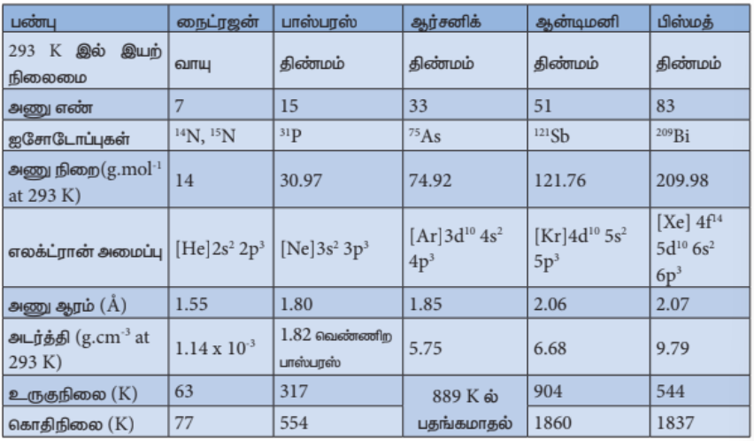

அம்மோனியா மூலக்கூறானது பிரமிடு வடிவத்தில் உள்ளது. இதில், N-H பிணைப்பு நீளம் 1.016 Å மற்றும் பிணைப்புக் கோண மதிப்பு \( 107^\circ \). ஒரு முனையில் ஒரு தனித்த இரட்டை எலக்ட்ரானைக் கொண்டுள்ள நான்முகி அமைப்பாக அம்மோனியாவின் வடிவமைப்பைக் கருத இயலும். எனவே இது படத்தில் காட்டியுள்ளவாறு பிரமிடு அமைப்புப் பெற்றுள்ளது.

### 3.1.5 நைட்ரிக் அமிலம்

**தயாரித்தல்**

சம அளவு பொட்டாசியம் அல்லது சோடியம் நைட்ரேட்டை, அடர் கந்தக அமிலத்துடன் சேர்த்து வெப்பப்படுத்தி நைட்ரிக் அமிலம் தயாரிக்கப்படுகிறது.

\[
KNO_3 + H_2SO_4 \longrightarrow KHSO_4 + HNO_3
\]

நைட்ரிக் அமிலம் சிதைவடைதலைத் தடுக்கும் பொருட்டு வெப்பநிலையானது முடிந்தவரை குறைவாக வைக்கப்படுகிறது. அமிலம் குளிர்ந்து புகையும் திரவமாக மாறுகிறது. நைட்ரிக் அமிலம் சிதைவடைந்து சிறிதளவு நைட்ரஜன் டை ஆக்சைடு உருவாவதால் இத்திரவம் பழுப்பு நிறமாக காட்சியளிக்கிறது.

\[
4HNO_3 \longrightarrow 4NO_2 + 2H_2O + O_2
\]

**வணிக ரீதியிலான தயாரிப்பு முறை**

ஆஸ்வால்ட் முறையைப் பயன்படுத்தி அதிகளவில் நைட்ரிக் அமிலம் தயாரிக்கப்படுகிறது. இம்முறையில், ஹேபர் முறையிலிருந்து உருவான அம்மோனியாவானது பத்து மடங்கு காற்றுடன் கலக்கப்படுகிறது. இக்கலவையானது வெப்பப்படுத்தப்பட்டு, வினைவேகமாற்றி வைக்கப்பட்டுள்ள தனி அறையினுள் செலுத்தப்படுகிறது, அங்கு பிளாட்டின கம்பி வலையுடன் தொடர்பு உண்டாக்கப்படுகிறது.

வெப்பநிலை 1275 K க்கு உயர்த்தப்படும்போது, உலோக வலையானது விரைவாக அம்மோனியாவை ஆக்ஸிஜனேற்றம் செய்து NO வாயுவை உருவாக்குகிறது, பின்னர் அது நைட்ரஜன் டையாக்சைடாக ஆக்ஸிஜனேற்றம் அடைகிறது.

\[
4NH_3 + 5O_2 \longrightarrow 4NO + 6H_2O + 120\ \text{kJ}
\]

\[
2NO + O_2 \longrightarrow 2NO_2
\]

இவ்வாறு தயாரிக்கப்பட்ட நைட்ரஜன் டை ஆக்சைடு வாயு வரிசையாக அமைக்கப்பட்டுள்ள பரப்புகவர் கோபுரங்களின் வழியாக செலுத்தப்படுகிறது. இது நீருடன் வினைப்பட்டு நைட்ரிக் அமிலத்தைத் தருகிறது. உருவாக்கப்பட்ட நைட்ரிக் அமிலமானது காற்று செலுத்தி வெளுக்கப்படுகிறது.

\[
3NO_2 + H_2O \longrightarrow 2HNO_3 + NO
\]

**பண்புகள்**

தூய நைட்ரிக் அமிலம் நிறமற்றது. இதன் கொதிநிலை \( 86^\circ C \). இந்த அமிலம், நீருடன் முழுமையாக கலந்து கொதிநிலை மாறா கலவையை உருவாக்குகிறது (98% \( HNO_3 \), கொதிநிலை \( 120.5^\circ C \)). புகையும் நைட்ரிக் அமிலம் நைட்ரஜனின் ஆக்ஸைடுகளை கொண்டுள்ளது. இது, சூரியஒளிக்கு வெளிப்படும்போதோ அல்லது வெப்பப்படுத்தப்படும்போதோ சிதைவடைந்து நைட்ரஜன் டை ஆக்சைடு, நீர் மற்றும் ஆக்ஸிஜனாக மாறுகிறது.

\[
4HNO_3 \longrightarrow 4NO_2 + 2H_2O + O_2
\]

இந்த வினையின் காரணமாக தூய அமிலம் அல்லது அதன் அடர்க் கரைசலானது மஞ்சள் நிறமாக மாறுகிறது. பெரும்பாலான வினைகளில் நைட்ரிக் அமிலம் ஆக்ஸிஜனேற்றியாக செயல்படுகிறது. எனவே, ஆக்ஸிஜனேற்ற நிலை +5 விருந்து குறைந்தபட்ச மதிப்பிற்கு மாற்றமடைகிறது. இது உலோகங்களுடன் வினைப்பட்டு ஹைட்ரஜனைத் தருவதில்லை. நைட்ரிக் அமிலமானது, அமிலமாகவும், ஆக்ஸிஜனேற்ற காரணியாகவும் மற்றும் நைட்ரோ ஏற்றக் காரணியாகவும் செயல்படுகிறது.

**அமிலமாக:** இது, மற்ற அமிலங்களைப் போன்று காரங்கள் மற்றும் கார ஆக்ஸைடுகளுடன் வினைப்பட்டு நீரையும் உப்புக்களையும் உருவாக்குகிறது.

\[
ZnO + 2HNO_3 \longrightarrow Zn(NO_3)_2 + H_2O
\]

\[
3FeO + 10HNO_3 \longrightarrow 3Fe(NO_3)_3 + NO + 5H_2O
\]

**ஆக்ஸிஜனேற்றுக் காரணியாக:** கார்பன், சல்பர், பாஸ்பரஸ் மற்றும் அயோடின் போன்ற அலோகங்கள் நைட்ரிக் அமிலத்தால் ஆக்ஸிஜனேற்றமடைகின்றன.

\[
C + 4HNO_3 \longrightarrow 2H_2O + 4NO_2 + CO_2
\]

\[
S + 2HNO_3 \longrightarrow H_2SO_4 + 2NO
\]

\[
P_4 + 20HNO_3 \longrightarrow 4H_3PO_4 + 4H_2O + 20NO_2
\]

\[
3I_2 + 10HNO_3 \longrightarrow 6HIO_3 + 10NO + 2H_2O
\]

\[
HNO_3 + F_2 \longrightarrow HF + NO_3F
\]

\[
3H_2S + 2HNO_3 \longrightarrow 3S + 2NO + 4H_2O
\]

**நைட்ரோ ஏற்றக் காரணியாக:** பொதுவாக கரிம சேர்மங்களில் ஒரு -H அணுவை \( -NO_2 \) தொகுதி கொண்டு பதிலீடு செய்தல் நைட்ரோ ஏற்றம் என குறிப்பிடப்படுகிறது. எடுத்துக்காட்டாக,

\[
C_6H_6 + HNO_3 \xrightarrow{H_2SO_4} C_6H_5NO_2 + H_2O
\]

நைட்ரோனியம் அயனி உருவாவதன் காரணமாக நைட்ரோ ஏற்றம் நிகழ்கிறது.

\[
HNO_3 + H_2SO_4 \rightarrow NO_2^+ + H_2O + HSO_4^-
\]

**உலோகங்கள் மீதான நைட்ரிக் அமிலத்தின் வினை**

தங்கம், பிளாட்டினம், ரோடியம், இரிடியம் மற்றும் டாண்டுலம் போன்றவற்றைத் தவிர மற்ற எல்லா உலோகங்களும் நைட்ரிக் அமிலத்துடன் வினைபுரிகின்றன. நைட்ரிக் அமிலம் உலோகங்களை ஆக்ஸிஜனேற்றம் அடையச் செய்கிறது. அலுமினியம், இரும்பு, கோபால்ட் மற்றும் குரோமியம் போன்ற சில உலோகங்கள் அடர் நைட்ரிக் அமிலத்துடன் வினைப்படும்போது, அவற்றின் உலோகப் பரப்பின் மீது ஆக்ஸைடு அடுக்கு உருவாவதால் வினை செயலற்றதாகிறது. தூய உலோகத்துடன் நைட்ரிக் அமிலம் தொடர்ந்து வினைபுரிவதை இந்த ஆக்சைடு அடுக்கு தடுக்கிறது.

நைட்ரிக் அமிலமானது டின், ஆர்சனிக், ஆண்டிமனி மற்றும் மாலிப்டினம் போன்ற குறைந்த நேர்மின் தன்மை கொண்ட உலோகங்களுடன் உலோக ஆக்ஸைடுகளை உருவாக்குகிறது. இந்த ஆக்ஸைடுகளை உலோகமானது உயர் ஆக்ஸிஜனேற்ற நிலையில் காணப்படுகிறது. மேலும் அமிலமானது குறைந்த ஆக்ஸிஜனேற்ற நிலைக்கு ஒடுக்கப்படுகிறது. நைட்ரிக் அமிலம் உலோகங்களுடன் வினைப்படும்போது \( NO_2 \), NO வாயு மற்றும் \( H_2O \) ஆகியன மிகப் பொதுவாக உருவாகும் விளைபொருட்களாகும். மிக அரிதாக \( N_2 \), \( NH_2OH \) மற்றும் \( NH_3 \) ஆகியவனவும் உருவாக்கப்படுகின்றன.

$$\overset{+5}{\text{HNO}_3} \quad \overset{+4}{\text{NO}_2} \quad \overset{+3}{\text{HNO}_2} \quad \overset{+2}{\text{NO}} \quad \overset{+1}{\text{N}_2\text{O}} \quad \overset{0}{\text{N}_2} \quad \overset{-3}{\text{NH}_3}$$

உலோகங்கள், நைட்ரிக் அமிலத்துடன் வினைபுரிவதை பின்வரும் மூன்று படிகளின் மூலம் விளக்கலாம்.

**முதல் நிலை வினை:** பிறவிநிலை ஹைட்ரஜன் வெளியேற்றப்பட்டு உலோக நைட்ரேட் உருவாக்கப்படுகிறது.

\[
M + HNO_3 \rightarrow MNO_3 + (H)
\]

**இரண்டாம் நிலை வினை:** பிறவிநிலை ஹைட்ரஜன், நைட்ரிக் அமிலத்தின் ஒடுக்க விளைப் பொருட்களை உருவாக்குகிறது.

\[
\begin{array}{rcl}
\mathrm{HNO_3 + 2(H)} & \longrightarrow &
\underset{\text{\tiny நைட்ரஸ் அமிலம்}}{\mathrm{HNO_2}}
+\mathrm{\,H_2O}
\end{array}
\]

\[
\begin{array}{rcl}
\mathrm{HNO_3 + 6(H)} & \longrightarrow &
\underset{\text{\tiny ஹைட்ராக்சிலமின்}}{\mathrm{NH_2OH}}
+\mathrm{\,2H_2O}
\end{array}
\]

\[
\begin{array}{rcl}
\mathrm{HNO_3 + 8(H)} & \longrightarrow &
\underset{\text{\tiny அம்மோனியா}}{\mathrm{NH_3}}
+\mathrm{\,3H_2O}
\end{array}
\]

\[
\begin{array}{rcl}
\mathrm{2HNO_3 + 8(H)} & \longrightarrow &
\underset{\text{\tiny ஹைப்போ நைட்ரஸ் அமிலம்}}{\mathrm{H_2N_2O_2}}
+\mathrm{\,4H_2O}
\end{array}
\]

**மூன்றாம் நிலை வினை:** இரண்டாம் நிலை விளைப் பொருட்கள் சிதைவடைந்தோ அல்லது தொடர்ந்து வினைபுரிந்தோ இறுதி விளைப் பொருட்களை தருகின்றன.

**இரண்டாம் நிலை விளை பொருட்களின் சிதைதல்:**

\[
\begin{array}{rcl}
\mathrm{3\,}
\underset{\text{\tiny நைட்ரஸ் அமிலம்}}{\mathrm{HNO_2}}
& \longrightarrow &
\underset{\text{\tiny நைட்ரிக் அமிலம்}}{\mathrm{HNO_3}}
+\mathrm{\,2\,}
\underset{\text{\tiny நைட்ரிக் ஆக்ஸைடு}}{\mathrm{NO}}
+\mathrm{\,H_2O}
\end{array}
\]

\[
\begin{array}{rcl}
\mathrm{2\,}
\underset{\text{\tiny நைட்ரஸ் அமிலம்}}{\mathrm{HNO_2}}
& \longrightarrow &
\underset{\text{\tiny டை நைட்ரஜன் டிரையாக்ஸைடு}}{\mathrm{N_2O_3}}
+\mathrm{\,H_2O}
\end{array}
\]

\[
\begin{array}{rcl}
\underset{\text{\tiny ஹைப்போ நைட்ரஸ் அமிலம்}}{\mathrm{H_2N_2O_2}}
& \longrightarrow &
\underset{\text{\tiny நைட்ரஸ் ஆக்ஸைடு}}{\mathrm{N_2O}}
+\mathrm{\,H_2O}
\end{array}
\]  

**இரண்டாம் நிலை விளை பொருட்களின் தொடர் வினை:**

\[
HNO_2 + NH_3 \rightarrow N_2 + 2H_2O
\]

\[
HNO_2 + NH_2OH \rightarrow N_2O + 2H_2O
\]

\[
HNO_2 + HNO_3 \rightarrow 2NO_2 + H_2O
\]

**எடுத்துக்காட்டுகள்:**

காப்பர், நைட்ரிக் அமிலத்துடன் பின்வருமாறு வினைபுரிகிறது:

\[
\begin{array}{l}
3Cu + 6HNO_3 \rightarrow 3Cu(NO_3)_2 + 6(H) \\[4pt]
6(H) + 3HNO_3 \rightarrow 3HNO_2 + 3H_2O \\[4pt]
3HNO_2 \rightarrow HNO_3 + 2NO + H_2O \\[10pt]
\text{ஒட்டுமொத்த வினை:} \\[4pt]
\boxed{3Cu + 8HNO_3 \rightarrow 3Cu(NO_3)_2 + 2NO + 4H_2O}
\end{array}
\]
அடர் அமிலமானது, நைட்ரஜன் டை ஆக்ஸைடை உருவாக்கும் திறனைப் பெற்றுள்ளது.

\[
\boxed{
Cu + 4HNO_3 \rightarrow Cu(NO_3)_2 + 2NO_2 + 2H_2O
}
\]

மெக்னீஷியம், நைட்ரிக் அமிலத்துடன் பின்வருமாறு வினைபுரிகிறது:

\[
\begin{array}{l}
4Mg + 8HNO_3 \rightarrow 4Mg(NO_3)_2 + 8(H) \\[4pt]
HNO_3 + 8(H) \rightarrow NH_3 + 3H_2O \\[4pt]
HNO_3 + NH_3 \rightarrow NH_4NO_3
\end{array}
\]

ஒட்டுமொத்த வினை:

\[
\boxed{
4Mg + 10HNO_3 \rightarrow 4Mg(NO_3)_2 + NH_4NO_3 + 3H_2O
}
\]

அமிலம் நீர்க்கப்பட்டிருந்தால், \( N_2O \) பெறப்படுகிறது:

\[
\boxed{
4Mg + 10HNO_3 \rightarrow 4Mg(NO_3)_2 + N_2O + 5H_2O
}
\]

**நைட்ரிக் அமிலத்தின் பயன்கள்:**

1. இராஜ திராவகம் தயாரித்தலில் ஆக்சிஜனேற்றியாக நைட்ரிக் அமிலம் பயன்படுகிறது.
2. நைட்ரிக் அமில உப்புகள் புகைப்படத் தொழிலிலும் \( (AgNO_3) \), துப்பாக்கிகளுக்கு தேவையான வெடிமருந்துகளிலும் \( (NaNO_3) \) பயன்படுகின்றன.

> **தன் மதிப்பீடு:**
>
>ஜிங்க் உடன் நைட்ரிக் அமிலம் (நீர்த்த மற்றும் அடர்) வினைப்படும் போது உருவாகும் விளைப் பொருட்களை எழுதுக.

### 3.1.6 நைட்ரஜனின் ஆக்சைடுகள் மற்றும் ஆக்சோ அமிலங்கள்

**நைட்ரஜனின் ஆக்சைடுதல் தயாரிப்பு**

| பெயர் | வாய்ப்பாடு | ஆக்ஸிஜனேற்ற நிலை | இயற் பண்புகள் | தயாரித்தல் |
| --- | --- | --- | --- | --- |
| நைட்ரஸ் ஆக்சைடு | $\text{N}_2\text{O}$ | +1 | நிறமற்ற வாயு & நடுநிலைத் தன்மை கொண்டது | $\text{NH}_4\text{NO}_3 \rightarrow \text{N}_2\text{O} + 2\text{H}_2\text{O}$ |
| நைட்ரிக் ஆக்சைடு | $\textbf{NO}$ | +2 | நிறமற்ற வாயு & நடுநிலைத் தன்மை கொண்டது | $2\text{NaNO}_2 + 2\text{FeSO}_4 + 3\text{H}_2\text{SO}_4 \rightarrow \text{Fe}_2(\text{SO}_4)_3 + 2\text{NaHSO}_4 + 2\text{H}_2\text{O} + 2\text{NO}$ |
| டை நைட்ரஜன் ட்ரை ஆக்சைடு (அ) நைட்ரஜன் செஸ்கியூஆக்சைடு | $\textbf{N}_2\textbf{O}_3$ | +3 | நீலநிறத் திண்மம் & அமிலத்தன்மை கொண்டது | $2\text{NO} + \text{N}_2\text{O}_4 \rightarrow 2\text{N}_2\text{O}_3$ |
| நைட்ரஜன் டை ஆக்சைடு | $\textbf{NO}_2$ | +4 | பழுப்புநிற வாயு & அமிலத்தன்மை கொண்டது | $$2\text{Pb(NO}_3)_2 \rightarrow 4\text{NO}_2 + 2\text{PbO} + \text{O}_2$$ |
| நைட்ரஜன் டெட்ராக்சைடு | $\textbf{N}_2\textbf{O}_4$ | +4 | நிறமற்ற திண்மம் & அமிலத்தன்மை கொண்டது | $$2\text{NO}_2 \rightarrow \text{N}_2\text{O}_4$$ |
| நைட்ரஜன் பென்டாக்சைடு | $\textbf{N}_2\textbf{O}_5$ | +5 | நிறமற்ற திண்மம் & அமிலத்தன்மை கொண்டது | $$2\text{HNO}_3 + \text{P}_2\text{O}_5 \rightarrow \text{N}_2\text{O}_5 + 2\text{HPO}_3$$ |

**நைட்ரஜனின் ஆக்சைடுகளின் அமைப்பு வாய்ப்பாடுகள்:**

| பெயர் | வாய்ப்பாடு | அமைப்பு வாய்ப்பாடு |
| --- | --- | --- |
| நைட்ரஸ் ஆக்சைடு | $\text{N}_2\text{O}$ | 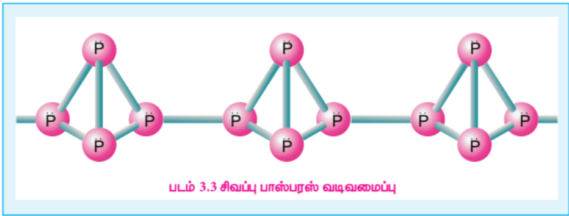 |
| நைட்ரிக் ஆக்சைடு | **NO** | 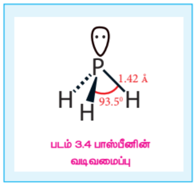 |
| டை நைட்ரஜன் ட்ரை ஆக்சைடு (அ) நைட்ரஜன் செஸ்கியூஆக்சைடு | $\textbf{N}_2\textbf{O}_3$ | 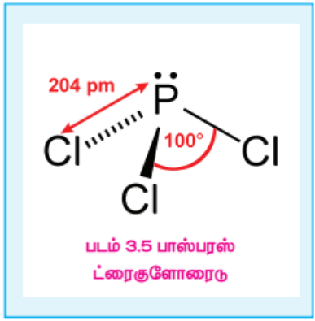 |
| நைட்ரஜன் டை ஆக்சைடு |$\textbf{NO}_2$| 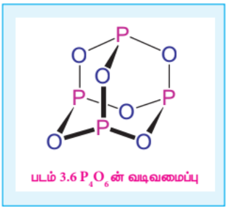 |
| நைட்ரஜன் டெட்ராக்சைடு | $\textbf{N}_2\textbf{O}_4$ | 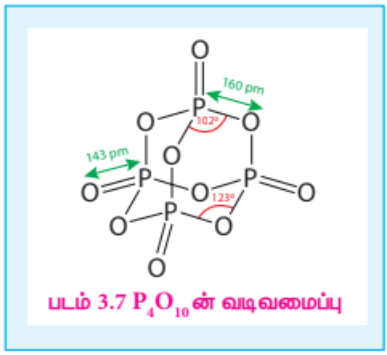 |
| நைட்ரஜன் பென்டாக்சைடு | $\textbf{N}_2\textbf{O}_5$ | 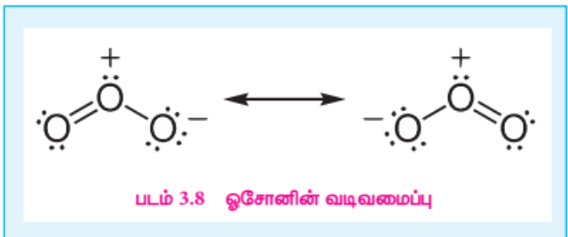 |

**நைட்ரஜனின் ஆக்சோ அமிலங்களின் அமைப்பு வாய்ப்பாடுகள்:**

| பெயர் | வாய்ப்பாடு | அமைப்பு வாய்ப்பாடு |
| --- | --- | --- |
| ஹைப்போநைட்ரஸ் அமிலம் | $\text{H}_2\text{N}_2\text{O}_2$ | $\text{HO}-\text{N}=\text{N}-\text{OH}$ |
| ஹைட்ரோநைட்ரஸ் அமிலம்| $\text{H}_4\text{N}_2\text{O}_4$ | 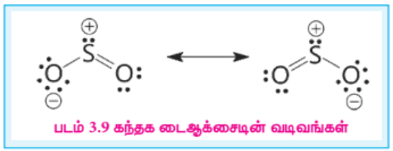|
| நைட்ரஸ் அமிலம் | $\text{HNO}_2$ |  |
| பெர் நைட்ரஸ் அமிலம் | $\text{HOONO}$ |  |
| நைட்ரிக் அமிலம்| $\text{HNO}_3$ |  |
| பெர்நைட்ரிக் அமிலம் | $\text{HNO}_4$ |  |

**நைட்ரஜனின் ஆக்சோ அமிலங்களின் தயாரிப்பு:**

| பெயர் | வாய்ப்பாடு | ஆக்ஸிஜனேற்ற நிலை | தயாரித்தல் |
| --- | --- | --- | --- |
| ஹைப்போநைட்ரஸ் அமிலம் | $\text{H}_2\text{N}_2\text{O}_2$ | +1 | $\text{Ag}_2\text{N}_2\text{O}_2 + 2\text{HCl} \longrightarrow 2\text{AgCl} + \text{H}_2\text{N}_2\text{O}_2$ |
| நைட்ரஸ் அமிலம் | $\text{HNO}_2$ | +3 | $\text{Ba}(\text{NO}_2)_2 + \text{H}_2\text{SO}_4 \longrightarrow 2\text{HNO}_2 + \text{BaSO}_4$ |
| பெர் நைட்ரஸ் அமிலம் | $\text{HOONO}$ | +3 | $\text{H}_2\text{O}_2 + \text{ON}(\text{OH}) \longrightarrow \text{ON}(\text{OOH}) + \text{H}_2\text{O}$ |
| நைட்ரிக் அமிலம் | $\text{HNO}_3$ | +5 | $\begin{array}{l} 4\text{NH}_3 + 5\text{O}_2 \longrightarrow 4\text{NO} + 6\text{H}_2\text{O}, \\ 2\text{NO} + \text{O}_2 \longrightarrow \text{NO}_2 ,\\ 2\text{NO}_2 \longrightarrow \text{N}_2\text{O}_4 ,\\ 2\text{N}_2\text{O}_4 + 2\text{H}_2\text{O} + \text{O}_2 \longrightarrow 4\text{HNO}_3 \end{array}$ |
| பெர் நைட்ரிக் அமிலம் | $\text{HNO}_4$ | +5 | $\text{H}_2\text{O}_2 + \text{N}_2\text{O}_5 \longrightarrow \text{NO}_2\text{OOH} + \text{HNO}_3$ |

### 3.1.7 பாஸ்பரஸின் புறவேற்றுமை வடிவங்கள்:

பாஸ்பரஸ் பல்வேறு புறவேற்றுமை வடிவங்களைப் பெற்றுள்ளது, அவற்றில் வெண்ணிற பாஸ்பரஸ், சிவப்பு பாஸ்பரஸ் மற்றும் கருமை நிற பாஸ்பரஸ் ஆகியன மிகப் பொதுவானவை ஆகும்.

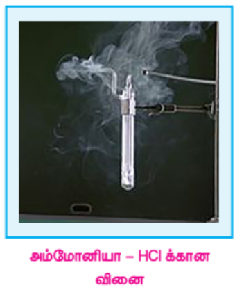

**வெண் பாஸ்பரஸ்:** புதிதாக தயாரிக்கப்பட்ட வெண் பாஸ்பரஸ் நிறமற்றது ஆனால், சிறிது நேரத்தில் சிவப்பு பாஸ்பரஸ் அடுக்கு உருவாவதால் வெளியே மஞ்சள் நிறமாக மாறுகிறது. இது விஷத்தன்மை கொண்டது. மேலும், இது உள்ளிப்பூண்டின் மணமுடையது. இது ஆக்ஸிஜனேற்றமடைவதன் காரணமாக இருளில் ஒளிர்கிறது. இந்நிகழ்ச்சி நின்றொளிர்தல் என்றழைக்கப்படுகிறது. இதன் எரியூட்டு வெப்பநிலை மிகக் குறைவாக இருப்பதனால், அறைவெப்பநிலையில் காற்றில் தானாக பற்றி எரிந்து \( P_2O_5 \) ஐ தருகிறது.

**சிவப்பு பாஸ்பரஸ்:** காற்று மற்றும் ஒளியில்லா சூழ்நிலையில் \( 420^\circ C \) வெப்பநிலைக்கு வெப்பப்படுத்துவதன் மூலம் வெண்பாஸ்பரஸை சிவப்பு பாஸ்பரஸாக மாற்ற இயலும். வெண்பாஸ்பரஸ் போலல்லாமல் இது விஷத்தன்மையற்றது. மேலும், சிவப்பு பாஸ்பரஸ் நின்றொளிர்தலை காட்டுவதில்லை. இது குறைந்த வெப்பநிலைகளில் தீப்பற்றுவதில்லை. மந்தவாயுச் சூழலில், சிவப்பு பாஸ்பரை கொதிக்கவைத்து ஆவியை நீரினால் குளிர்விப்பதன் மூலம் மீளவும் வெண்பாஸ்பரஸாக மாற்ற இயலும்.

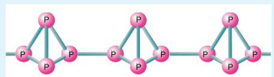

பாஸ்பரஸ் அடுக்கு அமைப்பைப் பெற்றுள்ளது மேலும் இது குறைக்கடத்தியாக செயல்படுகிறது. நான்கு பாஸ்பரஸ் அணுக்களால் ஆன \( P_4 \) நான்முகி அலகுகள் இணைந்து உருவான சங்கிலிப் பலபடி அமைப்பில் உள்ளன. நைட்ரஜனைப் போலல்லாமல் P-P ஒற்றைப் பிணைப்புகளைவிட \( P≡P \) முப்பிணைப்புகள் வலிமை குறைந்தவை. அதாவது, பாஸ்பரஸ் அணுக்கள் முப்பிணைப்புகளுக்கு பதிலாக ஒற்றை பிணைப்புகளால் பிணைக்கப்பட்டுள்ளன. இந்த இரண்டு புறவேற்றுமை வடிவங்களைத் தவிர ஸ்கார்லெட் பாஸ்பரஸ், ஊதா நிற பாஸ்பரஸ் என மேலும் இரண்டு புறவேற்றுமை வடிவங்களை பாஸ்பரஸ் பெற்றுள்ளது.

### 3.1.8 பாஸ்பரஸின் பண்புகள்

பாஸ்பரஸ் அதிக வினைத்திறன் கொண்டது. இது பின்வரும் முக்கிய வேதிப்பண்புகளைப் பெற்றுள்ளது.

**ஆக்ஸிஜனுடன் வினை:** மஞ்சள் நிற பாஸ்பரஸ், காற்றில் தானாக தீப்பற்றி எரிந்து பாஸ்பரஸ் பென்டாக்சைடு வெண்புகையைத் தருகிறது. சிவப்பு பாஸ்பரஸும் வெப்பப்படுத்தும்போது ஆக்ஸிஜனுடன் வினைப்பட்டு பாஸ்பரஸ் ட்ரை ஆக்ஸைடு அல்லது பாஸ்பரஸ் பென்டாக்சைடைத் தருகிறது.

\[
\begin{array}{rcl}
P_4 + 3O_2 & \xrightarrow{\Delta} &
\underset{\text{\tiny பாஸ்பரஸ் ட்ரை ஆக்சைடு}}{\mathrm{P_4O_6}}
\\[12pt]
P_4 + 5O_2 & \xrightarrow{\Delta} &
\underset{\text{\tiny பாஸ்பரஸ் பென்டாக்சைடு}}{\mathrm{P_4O_{10}}}
\end{array}
\]

**குளோரினுடன் வினை:** பாஸ்பரஸ், குளோரினுடன் வினைப்பட்டு ட்ரை மற்றும் பென்டா குளோரைடுகளைத் தருகிறது. அறை வெப்பநிலையில் மஞ்சள் பாஸ்பரஸ் தீவிரமாக வினைபுரிகிறது, ஆனால் சிவப்பு பாஸ்பரஸ் வெப்பப்படுத்தும்போது மட்டும் வினைபுரிகிறது.

\[
\begin{array}{rcl}
P_4 + 6Cl_2 & \xrightarrow{} &
\underset{\text{\tiny பாஸ்பரஸ் ட்ரை குளோரைடு}}{\mathrm{4PCl_3}}
\\[12pt]
P_4 + 10Cl_2 & \xrightarrow{} &
\underset{\text{\tiny பாஸ்பரஸ் பென்டாகுளோரைடு}}{\mathrm{4PCl_5}}
\end{array}
\]

**காரங்களுடன் வினை:** மஞ்சள் பாஸ்பரஸை, மந்த வாயுச் சூழலில் காரங்களுடன் சேர்த்து கொதிக்க வைக்கும்போது பாஸ்பீன் வாயுவை வெளியேற்றுகிறது. இதில் பாஸ்பரஸ் ஒடுக்கும் காரணியாக செயல்படுகிறது.

\[
\begin{array}{rcl}
P_4 + 3NaOH + 3H_2O & \xrightarrow{} &
\underset{\text{\tiny சோடியம் ஹைப்போ பாஸ்பைட்}}{\mathrm{3NaH_2PO_2}}
+
\underset{\text{\tiny பாஸ்பீன்}}{\mathrm{PH_3}}\uparrow
\end{array}
\]

**நைட்ரிக் அமிலத்துடன் வினை:** பாஸ்பரஸை அடர் நைட்ரிக் அமிலத்துடன் வினைப்படுத்தும் போது, பாஸ்பாரிக் அமிலமாக ஆக்ஸிஜனேற்றமடைகிறது. இவ்வினையில் படிக அயோடின் வினைவேகமாற்றியாக செயல்படுகிறது.

\[
\begin{array}{rcl}
P_4 + 20HNO_3 & \xrightarrow{} &
\underset{\text{\tiny ஆர்த்தோ பாஸ்பாரிக் அமிலம்}}{\mathrm{4H_3PO_4}}
+{\mathrm{20NO_2}}
+
\mathrm{4H_2O}
\end{array}
\]

**உலோகங்களுடன் வினை:** Ca மற்றும் Mg போன்ற உலோகங்களுடன் பாஸ்பரஸ் வினைப்பட்டு பாஸ்பைடுகளைத் தருகிறது. சோடியம் மற்றும் பொட்டாசியம் போன்ற உலோகங்கள் வீரியமுடன் வினைபுரிகின்றன.

\[
\begin{array}{rcl}
P_4 + 6Mg & \xrightarrow{} &
\underset{\text{\tiny மெக்னீசியம் பாஸ்பைடு}}{\mathrm{2Mg_3P_2}}
\\[12pt]
P_4 + 6Ca & \xrightarrow{} &
\underset{\text{\tiny கால்சியம் பாஸ்பைடு}}{\mathrm{2Ca_3P_2}}
\\[12pt]
P_4 + 12Na & \xrightarrow{} &
\underset{\text{\tiny சோடியம் பாஸ்பைடு}}{\mathrm{4Na_3P}}
\end{array}
\]

**பாஸ்பரஸின் பயன்கள்:**

1. தீப்பெட்டிகளில் சிவப்பு பாஸ்பரஸ் பயன்படுகிறது.
2. இது, பாஸ்பரஸ் வெண்கலம் போன்ற உலோகக் கலவைகள் தயாரிப்பிலும் பயன்படுத்தப்படுகிறது.

### 3.1.9 பாஸ்பீன் (\( PH_3 \))

பாஸ்பரஸின் ஹைட்ரைடுகளில் மிக முக்கியமானது பாஸ்பீன் ஆகும்.

**தயாரித்தல்:**

கார்பன் டை ஆக்சைடு அல்லது ஹைட்ரஜன் மந்தச் சூழலில் வெண்பாஸ்பரஸை சோடியம் ஹைட்ராக்சைடுடன் வினைப்படுத்தி பாஸ்பீன் தயாரிக்கப்படுகிறது.

\[
\begin{array}{rcl}
P_4 + 3NaOH + 3H_2O & \rightarrow &
\underset{\text{\tiny சோடியம் ஹைப்போ பாஸ்பைட்}}{\mathrm{3NaH_2PO_2}}
+
\underset{\text{\tiny பாஸ்பீன்}}{\mathrm{PH_3}}\uparrow
\end{array}
\]

இவ்வினையில் உருவாகும் பாஸ்பீனுடன் கலந்துள்ள பாஸ்பீன் டைஹைட்ரைடை \( P_2H_4 \) நீக்கும் பொருட்டு, உறை கலவையின் வழியாக செலுத்தப்படுகிறது. பாஸ்பீன் டைஹைட்ரைடு உறைந்து விடுகிறது. அவ்வாறு உறையாத பாஸ்பீன் பிரித்தெடுக்கப்படுகிறது.

நீர் அல்லது நீர்த்த கனிம அமிலங்களைக் கொண்டு உலோக பாஸ்பைடுகளை நீராற் பகுப்பதன் மூலமாகவும் பாஸ்பீனைத் தயாரிக்க இயலும்.

\[
\begin{array}{rcl}
Ca_3P_2 + 6H_2O & \rightarrow &
\underset{\text{\tiny பாஸ்பீன்}}{\mathrm{2PH_3}}\uparrow
+\mathrm{\,3Ca(OH)_2}
\\[12pt]
AlP + 3HCl & \rightarrow &
\underset{\text{\tiny பாஸ்பீன்}}{\mathrm{PH_3}}\uparrow
+\mathrm{\,AlCl_3}
\end{array}
\]

பாஸ்பரஸ் அமிலத்தை வெப்பப்படுத்துவதன் மூலம் பாஸ்பீன் தூய நிலையில் பெறப்படுகிறது.

\[
\begin{array}{rcl}
\underset{\text{\tiny பாஸ்பரஸ் அமிலம்}}{\mathrm{4H_3PO_3}}
& \xrightarrow{\Delta} &
\underset{\text{\tiny ஆர்த்தோ பாஸ்பாரிக் அமிலம்}}{\mathrm{3H_3PO_4}}
+
\underset{\text{\tiny பாஸ்பீன்}}{\mathrm{PH_3}}\uparrow
\end{array}
\]

காஸ்டிக் சோடா கரைசலுடன் பாஸ்போனியம் அயோடைடைச் சேர்த்து வெப்பப்படுத்தி தூய பாஸ்பீன் பெறப்படுகிறது.

\[
\begin{array}{rcl}
PH_4I + NaOH & \xrightarrow{\Delta} &
\underset{\text{\tiny பாஸ்பீன்}}{\mathrm{PH_3}}\uparrow + \mathrm{NaI} + \mathrm{H_2O}
\end{array}
\]

**இயற் பண்புகள்:**

இது நிறமற்ற, விஷத்தன்மை கொண்ட, அழகிய மீன் நாற்றமுடைய வாயுவாகும். இது நீரில் சிறிதளவே கரைகிறது மேலும் விட்ஸ் சோதனையில் நிலைப்புத் தன்மையைக் காட்டுகிறது. இது 188 K வெப்பநிலையில் குளிர்ந்து நிறமற்ற திரவமாகிறது. 139.5 K வெப்பநிலையில் உறைந்து திண்மமாகிறது.

**வேதிப் பண்புகள்:**

**வெப்ப நிலைப்புத்தன்மை:** காற்றில்லா சூழலில் 317 K வெப்பநிலைக்கு வெப்பப்படுத்தும்போது அல்லது அதன் வழியே மின் பாய்ச்சலை நிகழ்த்தும்போது பாஸ்பீன் வாயுவானது அதன் தனிமங்களாக சிதைவடைகிறது.

\[
4PH_3 \xrightarrow{317K} P_4 + 6H_2
\]

**எரித்தல்:** பாஸ்பீன் வாயுவை காற்று அல்லது ஆக்சிஜனுடன் வெப்பப்படுத்தும்போது எரிந்து மெட்டா பாஸ்பாரிக் அமிலத்தைத் தருகிறது.

\[
4PH_3 + 8O_2 \xrightarrow{\Delta} P_4O_{10} + 6H_2O
\]

\[
P_4O_{10} + 6H_2O \xrightarrow{\Delta} 4HPO_3 + 4H_2O
\]

**காரப் பண்பு:** பாஸ்பீன் ஒரு வலிமை குறைந்த காரமாகும், இது ஹைட்ரஹாலிக் அமிலங்களுடன் வினைப்பட்டு பாஸ்போனியம் உப்புக்களை உருவாக்குகிறது.

\[
PH_3 + HI \rightarrow PH_4I
\]

\[
\begin{array}{rcl}
PH_4I + H_2O & \xrightarrow{\Delta} &
\underset{\text{\tiny பாஸ்பீன்}}{\mathrm{PH_3}} + \mathrm{H_3O^+} + \mathrm{I^-}
\end{array}
\]

இது, ஹாலஜன்களுடன் வினைப்பட்டு பாஸ்பரஸ் பென்டா ஹேலைடுகளைத் தருகிறது.

\[
PH_3 + 4Cl_2 \rightarrow PCl_5 + 3HCl
\]

**ஒடுக்கும் பண்பு:** பாஸ்பீன், சில உலோகங்களை அவற்றின் உலோக பாஸ்பைடுகளாக உப்புக் கரைசல்களிலிருந்து வீழ்படிவாக்குகிறது.

\[
3AgNO_3 + PH_3 \rightarrow Ag_3P + 3HNO_3
\]

இது, போரான் ட்ரைகுளோரைடு போன்ற லூயி அமிலங்களுடன் இணைந்து அணைவுச் சேர்மங்களை உருவாக்குகிறது.

\[
\begin{array}{rcl}
BCl_3 + PH_3 & \rightarrow &
\underset{\text{\tiny அணைவுச் சேர்மம்}}
{[Cl_3B \leftarrow :PH_3]}
\end{array}
\]

**வடிவமைப்பு:**

பாஸ்பீனில், பாஸ்பரஸ் அணு \( sp^3 \) இனக்கலப்பிலுள்ளது. மூன்று ஆர்பிட்டால்கள் பிணைப்பு எலக்ட்ரான் இரட்டைகளால் நிரப்பப்பட்டுள்ளது. மேலும், நான்முகியின் நான்காம் மூலை தனித்த எலக்ட்ரான் இரட்டையால் நிரப்பப்பட்டுள்ளது. எனவே பிணைப்புக் கோணம் \( 93.5^\circ \)க்கு குறைக்கப்பட்டுள்ளது. பாஸ்பீன் பிரமிடு வடிவத்தைப் பெற்றுள்ளது.

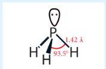

பாஸ்பீன் அதிகளவில் புகையை உருவாக்குவதால் புகைத்திரை உருவாக்க பயன்படுகிறது. கப்பல்களில், கால்சியம் கார்பைடு மற்றும் கால்சியம் பாஸ்பைடு கலவையை வைக்கப்பட்டுள்ள, துணையிடப்பட்ட கலனை கடலில் வீசியெறியும்போது அது பாஸ்பீன் மற்றும் அசிட்டிலீன் வாயு கலவையை வெளியேற்றுகிறது. வெளியேற்றப்பட்ட பாஸ்பீன் வாயு தீப்பற்றி எரிந்து அசிட்டிலீனையும் எரியவைக்கிறது. இவ்வாறு எரியும் வாயுக்கள் தொடர்ந்து வரும் கப்பல்களுக்கு சமிக்கையாக செயல்படுகின்றன. இது ஹாலோஜன் முன்னறிவிப்பான் என அறியப்படுகிறது.

### 3.1.10 பாஸ்பரஸ் ட்ரைகுளோரைடு மற்றும் பென்டாகுளோரைடு:

**பாஸ்பரஸ் ட்ரைகுளோரைடு:**

**தயாரித்தல்:**

வெண் பாஸ்பரஸ் மீது குளோரின் வாயுவை மெதுவாக செலுத்தும்போது பாஸ்பரஸ் ட்ரைகுளோரைடு உருவாகிறது. வெண்பாஸ்பரஸை தயோனைல் குளோரைடுடன் வினைப்படுத்தியும் இதைப் பெற இயலும்.

\[
P_4 + 8SOCl_2 \rightarrow 4PCl_3 + 4SO_2 + 2S_2Cl_2
\]

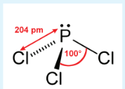

           

**பண்புகள்**

பாஸ்பரஸ் ட்ரை குளோரைடு, குளிர்ந்த நீரில் நீராற் பகுப்படைந்து பாஸ்பரஸ் அமிலத்தைத் தருகிறது.

\[
PCl_3 + 3H_2O \rightarrow H_3PO_3 + 3HCl
\]

\( SiCl_4 \) நீராற் பகுப்பைப் போலவே, இந்த வினையிலும் பாஸ்பரஸ் அணுவிலுள்ள காலியான 3d ஆர்பிட்டாலைப் பயன்படுத்தி நீர் மூலக்கூறுடன் சகப் பிணைப்பு உருவாக்கப்படுவதைத் தொடர்ந்து HCl நீக்கப்படுகிறது.

\[
PCl_3 + H_2O \rightarrow PCl_3.H_2O \rightarrow P(OH)Cl_2 + HCl
\]

இவ்வினையானது தொடர்ந்து வரும் இரண்டு படிகளில் \( P(OH)_3 \) அல்லது \( H_3PO_3 \) ஐத் தருகிறது.

\[
HPOCl_2 + H_2O \rightarrow H_2PO_2Cl + HCl
\]

\[
H_2PO_2Cl + H_2O \rightarrow H_3PO_3 + HCl
\]

ஆல்கஹால் மற்றும் கார்பாக்சிலிக் அமில தொகுதிகளைக் கொண்ட மற்ற மூலக்கூறுகளுடனும் இதே போன்ற வினைகள் நிகழ்கின்றன.

\[
3C_2H_5OH + PCl_3 \rightarrow 3C_2H_5Cl + H_3PO_3
\]

\[
3C_2H_5COOH + PCl_3 \rightarrow 3C_2H_5COCl + H_3PO_3
\]

**பாஸ்பரஸ் ட்ரைகுளோரைடின் பயன்கள்:**

குளோரினேற்றும் காரணியாகவும், \( H_3PO_3 \) தயாரித்தலிலும் பாஸ்பரஸ் ட்ரைகுளோரைடு பயன்படுகிறது.

**பாஸ்பரஸ் பென்டாகுளோரைடு:**

**தயாரித்தல்**

\( PCl_3 \) ஐ அதிகளவு குளோரினுடன் வினைப்படுத்தும் போது பாஸ்பரஸ் பென்டாகுளோரைடு பெறப்படுகிறது.

\[
PCl_3 + Cl_2 \rightarrow PCl_5
\]

**வேதி பண்புகள்**

வெப்பப்படுத்தும்போது பாஸ்பரஸ் பென்டாகுளோரைடு சிதைவடைந்து பாஸ்பரஸ் ட்ரை குளோரைடு மற்றும் குளோரின் ஆகியவற்றை உருவாக்குகிறது.

\[
PCl_5(g) \rightarrow PCl_3(g) + Cl_2(g)
\]

நீருடன், பாஸ்பரஸ் பென்டாகுளோரைடு வினைப்பட்டு பாஸ்போரைல் குளோரைடு மற்றும் ஆர்த்தோ பாஸ்பாரிக் அமிலத்தைத் தருகிறது.

\[
PCl_5 + H_2O \rightarrow POCl_3 + 2HCl
\]

\[
POCl_3 + 3H_2O \rightarrow H_3PO_4 + 3HCl
\]

ஒட்டுமொத்த வினை:

\[
PCl_5 + 4H_2O \rightarrow H_3PO_4 + 5HCl
\]

பாஸ்பரஸ் பென்டாகுளோரைடு, உலோகங்களுடன் வினைப்பட்டு உலோக குளோரைடுகளைத் தருகிறது. பாஸ்பரஸ் ட்ரை குளோரைடைப் போலவே இதுவும் கரிம சேர்மங்களை குளோரினேற்றம் அடையச் செய்கிறது.

\[
2Ag + PCl_5 \rightarrow 2AgCl + PCl_3
\]

\[
Sn + 2PCl_5 \rightarrow SnCl_4 + 2PCl_3
\]

\[
C_2H_5OH + PCl_5 \rightarrow C_2H_5Cl + HCl + POCl_3
\]

\[
C_2H_5COOH + PCl_5 \rightarrow C_2H_5COCl + HCl + POCl_3
\]

**பாஸ்பரஸ் பென்டாகுளோரைடின் பயன்கள்**

பாஸ்பரஸ் பென்டாகுளோரைடு ஒரு சிறந்த குளோரினேற்றும் காரணியாகும். இது ஹைட்ராக்சில் தொகுதிகளை குளோரின் அணுக்கள் கொண்டு பதிலீடு செய்யப் பயன்படுகிறது.

### 3.1.11 பாஸ்பரஸின் ஆக்சைடுகள் மற்றும் ஆக்சோ                           அமிலங்களின் அமைப்பு வாய்ப்பாடுகள்

பாஸ்பரஸ் ஆனது பாஸ்பரஸ் ட்ரை ஆக்சைடு, மற்றும் பாஸ்பரஸ் பென்டாக்சைடு ஆகியவற்றை உருவாக்குகிறது. பாஸ்பரஸ் ட்ரை ஆக்சைடில் நான்கு பாஸ்பரஸ் அணுக்கள் நான்முகியின் மூலைகளிலும், ஆறு ஆக்சிஜன் அணுக்கள் விளிம்புகளிலும் அமைந்துள்ளன. P-O பிணைப்பு நீளம் 165.6 pm இது P-O (184 pm) ஒற்றை பிணைப்பின் நீளத்தை விட குறைவாகும். \( p\pi-d\pi \) பிணைப்பின் காரணமாக இதில் குறிப்பிடத்தக்க அளவு இரட்டை பிணைப்புத் தன்மை உருவாகிறது.

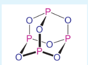

\( P_4O_{10} \) மூலக்கூறில் ஒவ்வொரு பாஸ்பரஸ் அணுவும் மூன்று ஆக்ஸிஜன் அணுக்களுடன் மூன்று பிணைப்புகளையும், கூடுதலாக ஒரு ஆக்ஸிஜன் அணுவுடன் ஈதல் சகப் பிணைப்பையும் உருவாக்குகின்றன. முனைய P-O பிணைப்பின் நீளம் 143 pm, இது எதிர்பார்க்கப்பட்ட ஒற்றை பிணைப்பு நீளத்தைவிட குறைவான மதிப்பாகும். ஆக்ஸிஜன் அணுவின் நிரம்பிய p ஆர்பிட்டால்களும், பாஸ்பரஸின் காலியான d ஆர்பிட்டாலும் மேற்பொதிவு அடைவதே இதற்கு காரணமாக இருக்கலாம்.

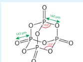

**பாஸ்பரஸின் ஆக்ஸோ அமிலங்களின் அமைப்பு வாய்ப்பாடுகள்:**

| பெயர் | வாய்ப்பாடு | அமைப்பு வாய்ப்பாடு |
| --- | --- | --- |
| ஹைப்போ பாஸ்பரஸ் அமிலம் | $\text{H}_3\text{PO}_2$ | $$\begin{array}{c} \text{H} \\ \vert{} \\ \text{H}-\text{P}-\text{OH} \\ \vert{}\vert{} \\ \text{O} \end{array}$$ |
| ஆர்த்தோ பாஸ்பரஸ் அமிலம் | $\text{H}_3\text{PO}_3$ | $$\begin{array}{c} \text{O} \\ \vert{}\vert{} \\ \text{HO}-\text{P}-\text{OH} \\ \vert{} \\ \text{H} \end{array}$$ |
| ஹைப்போபாஸ்பாரிக் அமிலம் | $\text{H}_4\text{P}_2\text{O}_6$ |$$\begin{array}{ccc} \text{O} & & \text{O} \\ \vert{}\vert{} & & \vert{}\vert{} \\ \text{HO}-\text{P} & - & \text{P}-\text{OH} \\ \vert{} & & \vert{} \\ \text{HO} & & \text{OH} \end{array}$$ |
| ஆர்த்தோ பாஸ்பாரிக் அமிலம்| $\text{H}_3\text{PO}_4$ | $$\begin{array}{c} \text{O} \\ \vert{}\vert{} \\ \text{HO}-\text{P}-\text{OH} \\ \vert{} \\ \text{OH} \end{array}$$ |
| பைரோ பாஸ்பாரிக் அமிலம் | $\text{H}_4\text{P}_2\text{O}_7$ | $$\begin{array}{ccccc} \text{O} & & & & \text{O} \\ \vert{}\vert{} & & & & \vert{}\vert{} \\ \text{HO}-\text{P} & - & \text{O} & - & \text{P}-\text{OH} \\ \vert{} & & & & \vert{} \\ \text{HO} & & & & \text{OH} \end{array}$$ |

**பாஸ்பரஸின் ஆக்ஸோ அமிலங்களின் தயாரிப்பு:**

| பெயர் | வாய்ப்பாடு | ஆக்ஸிஜனேற்ற நிலை | தயாரித்தல் |
| --- | --- | --- | --- |
| ஹைப்போ பாஸ்பரஸ் அமிலம் | $\text{H}_3\text{PO}_2$ | +1 | $\text{P}_4 + 6\text{H}_2\text{O} \longrightarrow 3\text{H}_3\text{PO}_2 + \text{PH}_3$ |
| ஆர்த்தோ பாஸ்பரஸ் அமிலம் | $\text{H}_3\text{PO}_3$ | +3 | $\text{P}_4\text{O}_6 + 6\text{H}_2\text{O} \longrightarrow 4\text{H}_3\text{PO}_3$ |
| ஹைப்போபாஸ்பாரிக் அமிலம் | $\text{H}_4\text{P}_2\text{O}_6$ | +4 | $2\text{P} + 2\text{O}_2 + 2\text{H}_2\text{O} \longrightarrow \text{H}_4\text{P}_2\text{O}_6$ |
| ஆர்த்தோ பாஸ்பாரிக் அமிலம் | $\text{H}_3\text{PO}_4$ | +5 | \( \mathrm{P_4O_{10} + 6H_2O \rightarrow 4H_3PO_4} \)  |
| பைரோ பாஸ்பாரிக் அமிலம் | $\text{H}_4\text{P}_2\text{O}_7$ | +5 | $2\text{H}_3\text{PO}_4 \longrightarrow \text{H}_4\text{P}_2\text{O}_7 + \text{H}_2\text{O}$ |

**தொகுதி 16 (ஆக்ஸிஜன் தொகுதி) தனிமங்கள்**

**வளம்:**

16 ஆம் தொகுதியைச் சார்ந்த தனிமங்கள் சால்கோஜன்கள் அல்லது தாதீனிகள் என அழைக்கப்படுகின்றன. ஏனெனில், பெரும்பாலான தாதுக்கள் ஆக்சைடுகளாக அல்லது சல்பைடுகளாக உள்ளன. முதல் தனிமமான ஆக்சிஜன் மிக அதிக வளம் கொண்ட தனிமமாகும், இது காற்றில் டை ஆக்ஸிஜனாகவும் (20 % நிறை, மற்றும் கன அளவுச் சதவீதத்திற்கும் அதிகமாக) ஆக்சைடுகளாக சேர்ம நிலையிலும் காணப்படுகிறது. புவிப்பரப்பில் ஆக்சிஜனும், கந்தகமும் முறையே 46.6 % & $0.034\%$ சதவீதம் நிறையை உருவாக்குகின்றன. சல்பர் தனிமமானது சல்பேட்டுகளாகவும்(ஜிப்சம்,82எப்சம் போன்றவை...)சல்பைடுகளாகவும் (கலீனா, ஜிங்க் பிளெண்ட் போன்றவை...) காணப்படுகிறது. இது எரிமலை சாம்பலிலும் காணப்படுகிறது. இத்தொகுதியைச் சார்ந்த மற்ற தனிமங்கள் மிகக் குறைந்தளவே கிடைக்கின்றன மேலும் இவை செலீனைடுகள் , டெல்லூரைடுகளாக சல்பைடு தாதுக்களுடன் சேர்ந்து கிடைக்கின்றன.  

**இயற் பண்புகள்:**

16 ஆம் தொகுதியைச் சார்ந்த தனிமங்களின் இயற்பண்புகள் கீழே உள்ள அட்டவணையில் அட்டவணைப்படுத்தப்பட்டுள்ளன.

**அட்டவணை 3.2 : 16 ஆம் தொகுதித் தனிமங்களின் சில இயற்பண்புகள்**

| பண்பு | ஆக்ஸிஜன் | சல்பர் | செலினியம் | டெல்லூரியம் | பொலோனியம் |
| --- | --- | --- | --- | --- | --- |
| 293 K இல் இயற் நிலைமை | வாயு | திண்மம் | திண்மம் | திண்மம் | திண்மம் |
| அணு எண் | 8 | 16 | 34 | 52 | 84 |
| ஐசோடோப்புகள் | $^{16}\text{O}$ | $^{32}\text{S}$ | $^{80}\text{Se}$ | $^{130}\text{Te}$ | $^{209}\text{Po}$, $^{210}\text{Po}$ |
| அணு நிறை (293 K ல் $\text{g}\cdot\text{mol}^{-1}$) | 15.99 | 32.06 | 78.97 | 127.60 | 209 |
| எலக்ட்ரான் அமைப்பு | $[\text{He}]2\text{s}^2 2\text{p}^4$ | $[\text{Ne}]3\text{s}^2 3\text{p}^4$ | $[\text{Ar}]3\text{d}^{10} 4\text{s}^2 4\text{p}^4$ | $[\text{Kr}]4\text{d}^{10} 5\text{s}^2 5\text{p}^4$ | $[\text{Xe}] 4\text{f}^{14} 5\text{d}^{10} 6\text{s}^2 6\text{p}^4$ |
| அணு ஆரம் ($\text{\AA}$) | 1.52 | 1.80 | 1.90 | 2.06 | 1.97 |
| அடர்த்தி (293 K ல் $\text{g}\cdot\text{cm}^{-3}$) | $1.3 \times 10^{-3}$ | 2.07 | 4.81 | 6.23 | 9.20 |
| உருகுநிலை (K) | 54 | 388 | 494 | 723 | 527 |
| கொதிநிலை (K) | 90 | 718 | 958 | 1261 | 1235 |

## 3.2 ஆக்சிஜன்:

 **தயாரித்தல்**: வளிமண்டல காற்று மற்றும் நீர் ஆகியன முறையே 23% மற்றும் 83% நிறைச் சதவீதம் ஆக்ஸிஜனைக் கொண்டுள்ளன. உலகில் காணப்படும் பெரும்பாலான பாறைகள் ஆக்ஸிஜனை சேர்ம நிலையில் கொண்டுள்ளன. தொழில் முறையில், திரவமாக்கப்பட்ட காற்றை பின்னக் காய்ச்சி வடிப்பதன் மூலம் ஆக்ஸிஜன் பெறப்படுகிறது. ஆய்வகத்தில், ஹைட்ரஜன் பெராக்சைடை வினைவேக மாற்றி \( (MnO_2) \) முன்னிலையில் சிதைத்தோ அல்லது பொட்டாசியம் பெர்மாங்கனேட் கொண்டு ஆக்ஸிஜனேற்றம் அடையச் செய்தோ ஆக்ஸிஜன் தயாரிக்கப்படுகிறது.

\[2H_2O_2 \rightleftharpoons 2H_2O + O_2\]

\[
5H_2O_2 + 2MnO_4^- + 6H^+ \rightarrow 5O_2 + 8H_2O + 2Mn^{2+}
\]

சில குறிப்பிட்ட உலோக ஆக்சைடுகள் அல்லது ஆக்சோ எதிரயனிகள் வெப்பச்சிதைவடைந்து ஆக்ஸிஜனை வெளியேற்றுகின்றன.

\[
2HgO \xrightarrow{\Delta} 2Hg + O_2
\]

\[
2BaO_2 \xrightarrow{\Delta} 2BaO + O_2
\]

\[
2KClO_3 \xrightarrow[\mathrm{MnO_2}]{\Delta} 2KCl + 3O_2
\]

\[
2KNO_3 \xrightarrow{\Delta} 2KNO_2 + O_2
\]

**தயாரித்தல்**

சாதாரண நிலையில், டை ஆக்சிஜன் ஈரணு வாயு மூலக்கூறாக காணப்படுகிறது. ஆக்சிஜன் பாரா காந்தத் தன்மை கொண்டது. நைட்ரஜன் மற்றும் புளூரினைப் போலவே ஆக்சிஜன் வலிமையான ஹைட்ரஜன் பிணைப்புகளை உருவாக்குகிறது.

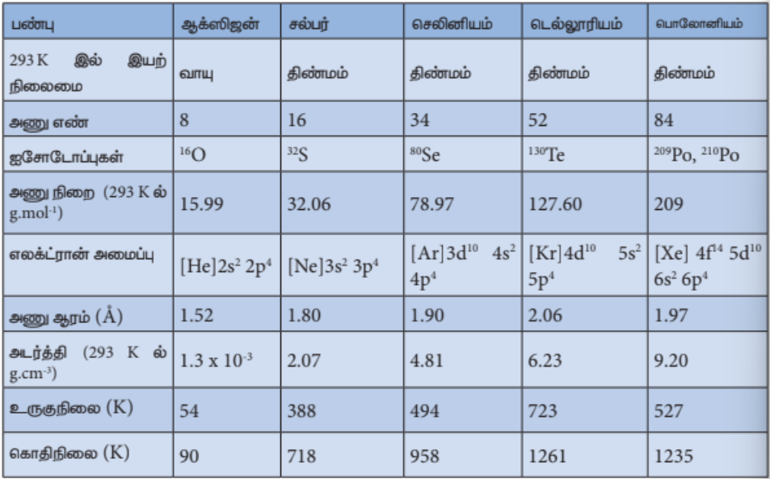

டை ஆக்சிஜன் \( (O_2) \) மற்றும் ஓசோன் அல்லது ட்ரை ஆக்சிஜன் \( (O_3) \) என இரண்டு புறவேற்றுமை வடிவங்களில் ஆக்சிஜன் காணப்படுகிறது. கடல் மட்டத்தில் ஒதுக்கத்தக்க அளவு ஓசோன் காணப்பட்டாலும், இது புறஊதாக் கதிர்களின் வினையால் உயர் வளிமண்டலத்தில், உருவாக்கப்படுகிறது. ஆய்வகத்தில், ஆக்சிஜன் வாயுவின் வழியே மின்பாய்ச்சலை உருவாக்கி ஓசோன் தயாரிக்கப்படுகிறது. 20,000 V மின்னழுத்தத்தில் ஏறத்தாழ 10% ஆக்சிஜன், ஓசோனாக மாற்றப்படுகிறது, இதனால் ஓசோன் கலந்த ஆக்சிஜன் கலவை கிடைக்கிறது. திரவமாக்கப்பட்ட ஓசோன் கலந்த ஆக்சிஜனை பின்னக் காய்ச்சி வடித்தலின் போது ஓசோன் தூய நிலையில் வெளிர் நீல நிற வாயுவாக கிடைக்கிறது.

\[
\underset{\text{\tiny ஆக்சிஜன்}}{O_2}
\rightleftharpoons
2\underset{\text{\tiny அணுநிலை ஆக்சிஜன்}}{(O)}
\]

\[
O_2 + (O) \rightleftharpoons
\underset{\text{\tiny ஓசோன்}}{O_3}
\]

ஓசோன் மூலக்கூறு வளைந்த வடிவத்தையும், ஆக்சிஜன் அணுக்களுக்கிடையே சீர்மையான உள்ளடங்கா பிணைப்பையும் பெற்றுள்ளது.

**வேதிப் பண்புகள்**

ஓசோன் மற்றும் ஆக்சிஜனின் வேதிப்பண்புகள் பெருமளவில் வேறுபடுகின்றன. ஆக்சிஜன் பல்வேறு உலோகங்கள் மற்றும் அலோகங்களுடன் சேர்ந்து ஆக்சைடுகளை உருவாக்குகின்றன. S தொகுதி தனிமங்களைப் போன்ற சில தனிமங்கள் அறை வெப்பநிலையில் ஆக்சிஜனுடன் வினைப்படுகின்றன. வினைத் திறன் குறைந்த சில உலோகங்கள் நன்கு தூள் செய்யப்பட்ட நிலையில் வினைப்படுகின்றன. இத்தகைய நன்கு தூள் செய்யப்பட்ட உலோகங்கள் பைரோஃபோரிக் என அழைக்கப்படுகின்றன. இவைகள் தீப்பற்றி எரியும் போது நிகழும் வினையினால் வெப்பம் வெளியிடப்படுகிறது.

மாறாக, ஓசோனானது ஒரு வலிமையான ஆக்சிஜனேற்றும் காரணியாகும். மேலும், ஆக்சிஜன் வினைபுரியாத பல சேர்மங்களுடன் ஓசோன் அதே நிபந்தனைகளில் வினைபுரிகிறது. எடுத்துக்காட்டாக, இது பொட்டாசியம் அயோடைடை அயோடினாக ஆக்சிஜனேற்றம் அடையச் செய்கிறது. இவ்வினை ஓசோனை அளந்தறியப் பயன்படுகிறது.

\[
O_3 + 2KI + H_2O \longrightarrow 2KOH + O_2 + I_2
\]

வழக்கமாக இது கரிமச் சேர்மங்களை ஆக்சிஜனேற்றம் அடையச் செய்ய பயன்படுகிறது. அமிலக் கரைசலில் இதனுடைய ஆக்சிஜனேற்ற திறனானது புளூரின் மற்றும் அணுநிலை ஆக்சிஜனை விஞ்சியிருந்தது. காரக் கரைசலில் ஓசோனின் சிதைவடையும் வீதம் குறைகிறது.

**பயன்கள்**

1. உயிரினங்கள் வாழ்வதற்கு ஆக்சிஜன் மிக இன்றியமையாததாகும்.
2. ஆக்சிஅசிட்டிலீன் பற்றவைப்பாளில் பயன்படுகிறது.
3. திரவ ஆக்சிஜன் ராக்கெட்டுகளில் எரிபொருளாகப் பயன்படுகிறது.

### 3.2.1 கந்தகத்தின் புறவேற்றுமை வடிவங்கள்

கந்தகமானது படிக வடிவமுடைய மற்றும் படிக வடிவமற்ற புறவேற்றுமை வடிவங்களைக் கொண்டுள்ளது. சாய்சதுர கந்தகம் \( (\alpha\ sulphur  கந்தகம்) \) மற்றும் ஒருசரிவு கந்தகம் \( (\beta\ sulphur கந்தகம்) \) ஆகியன படிக உருவமுடையவை. நெகிழி கந்தகம் \( (\gamma\ sulphur கந்தகம்) \) கந்தகப் பால்மம் மற்றும் கூழ்ம கந்தகம் ஆகியன படிக உருவமற்றவை.

சாதாரண வெப்ப அழுத்த நிலைகளில் வெப்ப இயக்கவியல் நிலைப்புத் தன்மையுடைய ஒரே புறவேற்றுமை வடிவம் சாய்சதுர கந்தகமாகும். இவற்றின் படிகங்கள் \( S_8 \) வளையங்களால் ஆனவை. மேலும் குறிப்பிட்ட மஞ்சள் நிறத்தைப் பெற்றுள்ளன. \( 96^\circ C \) வெப்பநிலைக்கு மேல் மெதுவாக வெப்பப்படுத்தும் போது இது ஒருசரிவு கந்தகமாக மாற்றமடைகிறது. \( 96^\circ C \) வெப்பநிலைக்கு கீழ் குளிர்விக்கும் போது \( \beta \) வடிவம் மீளவும் \( \alpha \) வடிவமாக மாற்றமடைகிறது. ஒருசரிவு கந்தகமும், சிறிதளவு \( S_6 \) வளையங்களுடன், \( S_8 \) மூலக்கூறுகளைக் கொண்டுள்ளன. இது நீண்ட ஊசி போன்ற பட்டக அமைப்பைப் பெற்றுள்ளது. \( 96^\circ C - 119^\circ C \) வெப்பநிலை எல்லையில் இது நிலைபெற்றுத் தன்மையுடையது. மேலும், மெதுவாக சாய்சதுர கந்தகமாக மாற்றமடைகிறது.

உருகிய நிலையில் உள்ள கந்தகமானது குளிர்ந்த நீரில் சேர்க்கப்படும் போது இரப்பர் சுருள் போன்ற மஞ்சள் நிற நெகிழி கந்தகம் உருவாகிறது. இவைகள் மிகவும் மென்மையானவை. மேலும் எளிதில் நீட்டிப்படையும் தன்மையைப் பெற்றுள்ளது. மெதுவாக குளிர்விக்கப்படும் போது கடினமாகி, நிலையான சாய்சதுர கந்தகமாக மாற்றமடைகிறது.

கந்தகமானது திரவ மற்றும் வாய்நிலைகளிலும் காணப்படுகின்றது. 140°C வெப்பநிலையில் நிறமற்ற திரவ கந்தகமானது உருகும். நடுநிலை வெப்பம் மேலும் உயர்ந்த நீர் λ கந்தகம் எனப்படும். இது குளிர்விக்கப்படும் போது மீளமைவு சல்பர் நிலையை அடையும். 90% S8, S7 மற்றும் S6 ஆகியனவும் S2, S3, S4, S5 மூலக்கூறுகளின் கலவையினாலும் காணப்படுகிறது.

### 3.2.2 கந்தக டை ஆக்சைடு

**தயாரித்தல்**

**கந்தகத்திலிருந்து தயாரித்தல்:** கந்தகத்தை காற்றில் எரிப்பதன் மூலம் பெருமளவில் கந்தக டை ஆக்சைடு தயாரிக்கப்படுகிறது. 6 – 8 % கந்தகமானது கந்தக ட்ரை ஆக்சைடாக \( (SO_3) \) ஆக்சிஜனேற்றம் அடைகிறது.

\[
S + O_2 \longrightarrow SO_2
\]

\[
2S + 3O_2 \longrightarrow 2SO_3
\]

**சல்பைடுகளிலிருந்து தயாரித்தல்:** கலீனா \( (PbS) \), ஜிங்க் பிளண்ட் \( (ZnS) \) போன்ற சல்பைடு தாதுக்களை காற்றில் வறுக்கும் போது கந்தக டை ஆக்சைடு வெளியேற்றப்படுகிறது. கந்தக அமிலம் தயாரிப்பதற்கும் மற்ற தொழிற் செயல்முறைகளுக்கும் பெருமளவில் தேவைப்படும் கந்தக டை ஆக்சைடு இம்முறையில் தயாரிக்கப்படுகிறது.

\[
2ZnS + 3O_2 \xrightarrow{\Delta} 2ZnO + 2SO_2
\]

\[
4FeS_2 + 11O_2 \xrightarrow{\Delta} 2Fe_2O_3 + 8SO_2
\]

**ஆய்வகத் தயாரிப்பு:** உலோகம் அல்லது உலோக சல்பைட்டினை கந்தக அமிலத்துடன் வினைப்படுத்தி கந்தக டை ஆக்சைடு ஆய்வகத்தில் தயாரிக்கப்படுகிறது.

\[
Cu + 2H_2SO_4 \rightarrow CuSO_4 + SO_2 + 2H_2O
\]

\[
SO_3^- + 2H^+ \rightarrow H_2O + SO_2
\]

**பண்புகள்**

எரிமலை வெடித்தலில் வெளியேறும் வாயுவில் கந்தக டை ஆக்சைடு காணப்படுகிறது. கரி மற்றும் எண்ணெயைப் பயன்படுத்தும் ஆற்றல் உற்பத்தி நிலையங்கள் மற்றும் காப்பர் உருக்கு ஆலைகள் பெருமளவில் கந்தக டை ஆக்சைடு வாயுவை வளிமண்டத்தில் வெளியேற்றுகின்றன. இது நிறமற்ற மூச்சு திணறலை ஏற்படுத்தும் மணமுடைய வாயு. இது அதிக அளவில் நீரில் கரைகிறது. காற்றைவிட 2.2 மடங்கு கனமானது. கந்தக டை ஆக்சைடை 2.5 atm வளி அழுத்தத்தில் 288 K வெப்பநிலையில் திரவமாக்கலாம் (கந்தக டை ஆக்சைடின் கொதிநிலை 263K).

**வேதிப் பண்புகள்**

கந்தக டை ஆக்சைடு ஒரு அமில ஆக்சைடு ஆகும். இது நீரில் கரைந்து சல்பியூரஸ் அமிலத்தைத் தருகிறது.

\[
SO_2 + H_2O \rightleftharpoons
\underset{\text{\tiny சல்பியூரஸ் அமிலம்}}{H_2SO_3}
\]

\[
H_2SO_3 \rightleftharpoons 2H^+ + SO_3^{2-}
\]

**சோடியம் ஹைட்ராக்சைடு மற்றும் சோடியம் கார்பனேட்டுடன் வினை:** கந்தக டை ஆக்சைடு, சோடியம் ஹைட்ராக்சைடு மற்றும் சோடியம் கார்பனேட்டுடன் வினைப்படும் போது முறையே சோடியம் பைசல்பைட் மற்றும் சோடியம் சல்பைட்டைத் தருகிறது.

\[
SO_2 + NaOH \longrightarrow
\underset{\text{\tiny சோடியம் பை சல்பைட்}}{NaHSO_3}
\]

\[
2SO_2 + Na_2CO_3 + H_2O \longrightarrow 2NaHSO_3 + CO_2
\]

\[
2NaHSO_3 \longrightarrow
\underset{\text{\tiny சோடியம் சல்பைட்}}{Na_2SO_3} + H_2O + SO_2
\]

**ஆக்சிஜனேற்றும் பண்பு:** கந்தக டை ஆக்சைடு ஹைட்ரஜன் சல்பைடை, கந்தகமாக ஆக்சிஜனேற்றமடையச் செய்கிறது. மேலும் மெக்னீசியத்தை மெக்னீசியம் ஆக்சைடாக மாற்றுகிறது.

\[
2H_2S + SO_2 \rightarrow 3S + 2H_2O
\]

\[
2Mg + SO_2 \rightarrow 2MgO + S
\]

**ஒடுக்கும் பண்பு:** இது எளிதில் ஆக்சிஜனேற்றம் அடையும் என்பதால் ஒடுக்கும் காரணியாக செயல்படுகிறது. இது குளோரினை ஹைட்ரோகுளோரிக் அமிலமாக ஒடுக்கம் அடையச் செய்கிறது.

\[
SO_2 + 2H_2O + Cl_2 \longrightarrow H_2SO_4 + 2HCl
\]

இது பொட்டாசியம் பெர்மாங்கனேட் மற்றும் டைகுரோமேட் ஆகியனவற்றை முறையே \( Mn^{2+} \) மற்றும் \( Cr^{3+} \) ஆக ஒடுக்கம் அடையச் செய்கிறது.

\[
2KMnO_4 + 5SO_2 + 2H_2O \longrightarrow K_2SO_4 + 2MnSO_4 + 2H_2SO_4
\]

\[
K_2Cr_2O_7 + 3SO_2 + H_2SO_4 \longrightarrow K_2SO_4 + Cr_2(SO_4)_3 + H_2O
\]

**ஆக்சிஜனுடன் வினை:** கந்தக டை ஆக்சைடை ஆக்சிஜனுடன் சேர்த்து அதிக வெப்பநிலையில் வெப்பப்படுத்தும் போது கந்தக ட்ரை ஆக்சைடு உருவாகிறது. இவ்வினை கந்தக அமிலத்தை தயாரிக்கப் பயன்படும் தொடு முறையில் பயன்படுகிறது.

\[
2SO_2(g) + O_2(g) \xrightarrow[450^\circ C]{V_2O_5} 2SO_3(g)
\]

**கந்தக டை ஆக்சைடின் வெளுக்கும் பண்பு:** நீரின் முன்னிலையில் நிறமுடைய கம்பளி, பட்டு, ஸ்பாஞ்சுகள் ஆகியனவற்றை கந்தக டை ஆக்சைடானது தனது ஒடுக்கும் பண்பினால் நிறமற்றவைகளாக மாற்றுகிறது.

\[
SO_2 + 2H_2O \longrightarrow H_2SO_4 + 2(H)
\]

\[
\underset{\text{\tiny நிறமுள்ளது}}{X} + 2(H)
\longrightarrow
\underset{\text{\tiny நிறமற்றது}}{XH_2}
\]

எனினும், வெளுக்கப்பட்ட பொருளை காற்றில் வைத்திருக்கும் போது, வளிமண்டல ஆக்சிஜனால் மீளவும் ஆக்சிஜனேற்றமடைந்து அதன் உண்மையான நிறம் பெறப்படுகிறது. எனவே, கந்தக டை ஆக்சைடின் வெளுக்கும் தன்மையானது ஒரு தற்காலிக பண்பாகும்.

**பயன்கள்**

1. முடி, பட்டு, கம்பளி போன்றவற்றை வெளுக்கப் பயன்படுகிறது.
2. விவசாயத்தில் தாவரங்கள் மற்றும் பயிர்களில் காணப்படும் தொற்றுகளை நீக்க பயன்படுத்தலாம்.

**கந்தக டை ஆக்சைடின் வடிவமைப்பு**

கந்தக டை ஆக்சைடில் கந்தக அணு \( sp^2 \) இனக்கலப்பு அடைந்துள்ளது. S மற்றும் O ஆகியனவற்றிற்கிடையே ஏற்படும் \( p\pi-d\pi \) மேற்பொருந்துதலால் அவைகளுக்கிடையே ஒரு இரட்டைப் பிணைப்பு உருவாகிறது.

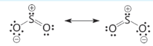

### 3.2.3 கந்தக அமிலம் (Sulphuric acid \( H_2SO_4) \)

**தயாரித்தல்**

காரீய சிற்றறை முறையில் கந்தக அமிலம் பெருமளவில் தயாரிக்கப்படுகிறது. தொடு முறை, அடுக்கு முறை ஆகியனவற்றின் மூலமும் கந்தக அமிலத்தை தயாரிக்கலாம். தொடு முறையில் கந்தக அமிலம் தயாரிக்கும் முறை இங்கு விளக்கப்பட்டுள்ளது. இதில் பின்வரும் படிநிலைகள் உள்ளன.

(i) தொடக்கத்தில், கந்தகம் அல்லது இரும்பு பைரைடுகளை காற்றில் எரித்து கந்தக டை ஆக்சைடு பெறப்படுகிறது.

\[
S + O_2 \longrightarrow SO_2
\]

\[
4FeS_2 + 11O_2 \longrightarrow 2Fe_2O_3 + 8SO_2
\]

(ii) உருவான கந்தக டை ஆக்சைடானது \( V_2O_5 \) அல்லது பிளாட்டினம் ஏற்றப்பட்ட ஆஸ்பெஸ்டாஸ் ஆகியவற்றின் முன்னிலையில் கந்தக ட்ரை ஆக்சைடாக காற்றினால் ஆக்சிஜனேற்றம் அடைகிறது.

(iii) கந்தக ட்ரை ஆக்சைடானது அடர் கந்தக அமிலத்தில் உறிஞ்சப்பட்டு ஓலியத்தை \( (H_2S_2O_7) \)த் தருகிறது. இதனுடன் நீரைச் சேர்த்து கந்தக அமிலமாக மாற்றப்படுகிறது.

\[
SO_3 + H_2SO_4 \longrightarrow H_2S_2O_7 \xrightarrow{H_2O} 2H_2SO_4
\]

அதிக விளைப்பொருளைப் பெற 2 bar அழுத்தம் மற்றும் 720 K வெப்பநிலையில் பராமரிக்கப்படுகிறது. இம்முறையில் தயாரிக்கப்படும் கந்தக அமிலம் 96% தூய்மையானது.

**இயற்பண்புகள்**

தூய கந்தக அமிலம் நிறமற்றது. பாகுநிலையுடைய திரவம் (298 K அடர்த்தி 1.84 g/mL 298 K). ஹைட்ரஜன் பிணைப்பின் காரணமாக மூலக்கூறுகளுக்கிடையே இணைவுத் தன்மை காணப்படுகிறது.

283.4 K வெப்பநிலையில் இந்த அமிலம் உறைகிறது. மேலும் 590 K வெப்பநிலையில் கொதிக்கிறது. இது நீரில் அதிகம் கரைகிறது. மேலும் நீரின் மீது அதிக நாட்டத்தினைப் பெற்றுள்ளது. எனவே இதனை நீர் நீக்கும் வினைப்பொருளாகப் பயன்படுத்தலாம். நீரில் கரைக்கும் போது மோனோ ஹைட்ரேட் \( (H_2SO_4.H_2O) \) மற்றும் டைஹைட்ரேட்டுகளை \( (H_2SO_4.2H_2O) \) தருகிறது. இந்த வினையானது ஒரு வெப்ப உமிழ் வினையாகும். கரிமச் சேர்மங்களான ஆக்சாலிக் அமிலம், ஃபார்மிக் அமிலம் போன்றவற்றை எடுத்துக்காட்டாகக் கொண்டு இதன் ஒடுக்கும் தன்மையினை அறிந்துகொள்ளலாம்.

\[
C_{12}H_{22}O_{11} + H_2SO_4 \longrightarrow 12C + H_2SO_4.11H_2O
\]

\[
HCOOH + H_2SO_4 \longrightarrow CO + H_2SO_4.H_2O
\]

\[
(COOH)_2 + H_2SO_4 \longrightarrow CO + CO_2 + H_2SO_4.H_2O
\]

**வேதிப் பண்புகள்**

கந்தக அமிலம் அதிக வினைதிறன் உடையது. இது வலிமைமிக்க அமிலம் மற்றும் ஆக்சிஜனேற்றியாக செயல்படுகிறது.

**சிதைவடைதல்:** கந்தக அமிலம் நிலைப்புத்தன்மை உடையது. எனினும் உயர் வெப்பநிலைகளில் கந்தக ட்ரை ஆக்சைடாக சிதைவடைகிறது.

\[
H_2SO_4 \longrightarrow H_2O + SO_3
\]

**அமிலத் தன்மை:** இது இரு காரத்துவ அமிலமாகும். எனவே காரத்துடன் சல்பேட்கள் மற்றும் பைசல்பேட்கள் ஆகிய இருவகை உப்புக்களை உருவாக்குகிறது.

\[
H_2SO_4 + NaOH \longrightarrow
\underset{\text{\tiny சோடியம் பை சல்பேட்}}{NaHSO_4} + H_2O
\]

\[
H_2SO_4 + 2NaOH \longrightarrow
\underset{\text{\tiny சோடியம் சல்பேட்}}{Na_2SO_4} + 2H_2O
\]

\[
H_2SO_4 + 2NH_3 \longrightarrow
\underset{\text{\tiny அம்மோனியம் சல்பேட்}}{(NH_4)_2SO_4}
\]

கந்தக அமிலமானது பின்வருமாறு வினை நிகழ்விட ஆக்சிஜனின் வாயுவைத் தருவதால் இது ஆக்சிஜனேற்றியாகும்.

\[
H_2SO_4 \longrightarrow H_2O + SO_2 +
\underset{\text{\tiny வினை நிகழ்விட ஆக்சிஜன்}}{(O)}
\]

கந்தக அமிலமானது கார்பன், கந்தகம் மற்றும் பாஸ்பரஸ் போன்ற தனிமங்களை ஆக்சிஜனேற்றம் அடையச் செய்கிறது. மேலும் இது புரோமைடு மற்றும் அயோடைடுகளை முறையே புரோமினாகவும், அயோடினாகவும் ஆக்சிஜனேற்றம் அடையச் செய்கிறது.

\[
C + 2H_2SO_4 \longrightarrow 2SO_2 + 2H_2O + CO_2
\]

\[
S + 2H_2SO_4 \longrightarrow 3SO_2 + 2H_2O
\]

\[
P_4 + 10H_2SO_4 \longrightarrow 4H_3PO_4 + 10SO_2 + 4H_2O
\]

\[
H_2S + H_2SO_4 \longrightarrow SO_2 + 2H_2O + S
\]

\[
H_2SO_4 + 2HI \longrightarrow SO_2 + 2H_2O + I_2
\]

\[
H_2SO_4 + 2HBr \longrightarrow SO_2 + 2H_2O + Br_2
\]

**உலோகங்களுடன் வினை:** கந்தக அமிலமானது உலோகங்களுடன் வினைபடும் போது வினை நிகழ் நிபந்தனைகளைப் பொருத்து வெவ்வேறு விளைப் பொருளைத் தருகின்றன. நீர்த்த கந்தக அமிலமானது வெள்ளீயம் (Sn), அலுமினியம், துத்தநாகம் போன்ற உலோகங்களுடன் வினைப்பட்டு அவைகளின் சல்பேட்டைத் தருகிறது.

\[
Zn + H_2SO_4 \longrightarrow ZnSO_4 + H_2 \uparrow
\]

\[
2Al + 3H_2SO_4 \longrightarrow Al_2(SO_4)_3 + 3H_2 \uparrow
\]

சூடான அடர் கந்தக அமிலம் தாமிரம் மற்றும் காரீயம் ஆகிய தனிமங்களுடன் வினைப்பட்டு அவைகளின் சல்பேட்டுகளைத் தருகிறது.

\[
Cu + 2H_2SO_4 \longrightarrow CuSO_4 + 2H_2O + SO_2 \uparrow
\]

\[
Pb + 2H_2SO_4 \longrightarrow PbSO_4 + 2H_2O + SO_2 \uparrow
\]

கந்தக அமிலமானது, உயரிய உலோகங்களான தங்கம், வெள்ளி மற்றும் பிளாட்டினம் ஆகியனவற்றுடன் வினைபுரிவதில்லை.

**உப்புகளுடன் வினை:** வெவ்வேறு உலோக உப்புகளுடன் இது வினைப்பட்டு உலோக சல்பேட்டுகள் மற்றும் பைசல்பேட்டுகளைத் தருகிறது.

\[
KCl + H_2SO_4 \longrightarrow KHSO_4 + HCl
\]

\[
KNO_3 + H_2SO_4 \longrightarrow KHSO_4 + HNO_3
\]

\[
Na_2CO_3 + H_2SO_4 \longrightarrow Na_2SO_4 + H_2O + CO_2
\]

\[
2NaBr + 3H_2SO_4 \longrightarrow 2NaHSO_4 + 2H_2O + Br_2 + SO_2
\]

**கரிமச் சேர்மங்களுடன் பிணை:** இது பென்சீன் போன்ற கரிமச் சேர்மங்களுடன் வினைப்பட்டு, சல்போனிக் அமிலங்களைத் தருகிறது.

\[
\underset{\text{\tiny பென்சீன்}}{C_6H_6} + H_2SO_4
\longrightarrow
\underset{\text{\tiny பென்சீன் சல்போனிக் அமிலம்}}{C_6H_5SO_3H} + H_2O
\]

**கந்தக அமிலத்தின் பயன்கள்**

1. அமோனியம் சல்பேட் மற்றும் சூப்பர் பாஸ்பேட் போன்ற உரங்களை பெருமளவில் தயாரிக்கும் தொழிற்சாலைகளில் கந்தக அமிலம் பயன்படுகிறது. மேலும் ஹைட்ரோகுளோரிக் அமிலம், நைட்ரிக் அமிலம் போன்ற வேதிப் பொருட்கள் தயாரிப்பிலும் பயன்படுகிறது.
2. இது உலர்த்தும் காரணியாக பயன்படுகிறது. மேலும், நிறமி பொருட்கள், வெடிப் பொருட்கள் போன்ற தயாரிப்பில் பயன்படுகிறது.

**சல்பேட்கள் / கந்தக அமிலத்திற்கான சோதனை**

கந்தக அமிலத்தின் நீர்த்த கரைசல் / சல்பேட்களின் நீர் கரைசல் ஆகியன பேரியம் குளோரைடு கரைசலுடன் சேர்ந்து வெண்மை நிற பேரியம் சல்பேட் வீழ்படிவைத் தருகிறது. இதனை வெள்ளீய அசிடேட் கரைசலைக் கொண்டும் கண்டறியலாம். இங்கு வெண்மை நிற வெள்ளீய சல்பேட் வீழ்படிவாகிறது.

\[
BaCl_2 + H_2SO_4 \longrightarrow
\underset{\begin{gathered}
\text{\tiny பேரியம் சல்பேட்}\\
\text{\tiny வெண்மை நிற வீழ்படிவு}
\end{gathered}}{BaSO_4}\downarrow + 2HCl
\]

\[
(CH_3COO)_2Pb + H_2SO_4 \longrightarrow
\underset{\begin{gathered}
\text{\tiny வெள்ளீய சல்பேட்}\\
\text{\tiny வெண்மை நிற வீழ்படிவு}
\end{gathered}}{PbSO_4}\downarrow + 2CH_3COOH
\]

**கந்தகத்தின் ஆக்சோ அமிலங்களின் வடிவமைப்புகள்**

கந்தகமானது பல்வேறு ஆக்சோ அமிலங்களை உருவாக்குகிறது. அவற்றுள் மிக முக்கியமானது கந்தக அமிலமாகும். சல்பியூரஸ் மற்றும் டைதயோனிக் அமிலங்கள் அல்லவைகளின் உப்பு நிலையில் மட்டுமே காணப்படுகிறது. ஏனெனில் அல்லவைகளின் தனித்த நிலையிலுள்ள அமிலங்கள் நிலைபெற்றுத் தன்மையற்றவை. கந்தகத்தின் பல்வேறு ஆக்சோ அமிலங்களின் வடிவமைப்புகள் பின்வருமாறு.

| பெயர் | மூலக்கூறு வாய்ப்பாடு | வடிவமைப்பு |
| --- | --- | --- |
| சல்பியூரஸ் அமிலம் | $\text{H}_2\text{SO}_3$ | $$\begin{array}{ccc} & \text{O} & \\ & \parallel & \\ \text{HO}- & \text{S} & -\text{OH} \end{array}$$ |
| சல்பியூரிக் அமிலம் | $\text{H}_2\text{SO}_4$ | $$\begin{array}{ccc} & \text{O} & \\ & \parallel & \\ \text{HO}- & \text{S} & -\text{OH} \\ & \parallel & \\ & \text{O} & \end{array}$$ |
| தயோசல்பியூரிக் அமிலம் | $\text{H}_2\text{S}_2\text{O}_3$ | $$\begin{array}{ccc} & \text{S} & \\ & \parallel & \\ \text{HO}- & \text{S} & -\text{OH} \\ & \parallel & \\ & \text{O} & \end{array}$$ |
| டைதயோனஸ் அமிலம் | $\text{H}_2\text{S}_2\text{O}_4$ | $$\begin{array}{ccccc} & \text{O} & & \text{O} & \\ & \parallel & & \parallel & \\ \text{HO}- & \text{S} & - & \text{S} & -\text{OH} \end{array}$$ |
| டைசல்பியூரஸ் அமிலம் (அல்லது) பைரோ சல்பியூரஸ் அமிலம் | $\text{H}_2\text{S}_2\text{O}_5$ | $$\begin{array}{ccccc} & \text{O} & & \text{O} & \\ & \parallel & & \parallel & \\ \text{HO}- & \text{S} & - & \text{S} & -\text{OH} \\ & \parallel & & & \\ & \text{O} & & & \end{array}$$ |

| பெயர் | மூலக்கூறு வாய்ப்பாடு | வடிவமைப்பு |
| --- | --- | --- |
| டைசல்பியூரிக் அமிலம் (அல்லது) பைரோசல்பியூரிக் அமிலம் | $\text{H}_2\text{S}_2\text{O}_7$ | $$\begin{array}{ccccccc} & \text{O} & & & & \text{O} & \\ & \parallel & & & & \parallel & \\ \text{HO}- & \text{S} & - & \text{O} & - & \text{S} & -\text{OH} \\ & \parallel & & & & \parallel & \\ & \text{O} & & & & \text{O} & \end{array}$$ |
| பெராக்சி மோனோ சல்பியூரிக் அமிலம் (அல்லது) கேரோஸ் அமிலம் | $\text{H}_2\text{SO}_5$ | $$\begin{array}{ccc} & \text{O} & \\ & \parallel & \\ \text{HO}- & \text{S} & -\text{O}-\text{OH} \\ & \parallel & \\ & \text{O} & \end{array}$$ |
| பெராக்சோ டைசல்பியூரிக் அமிலம் (மார்ஷல் அமிலம்) | $\text{H}_2\text{S}_2\text{O}_8$ | $$\begin{array}{ccccccc} & \text{O} & & & & \text{O} & \\ & \parallel & & & & \parallel & \\ \text{HO}- & \text{S} & - & \text{O}-\text{O} & - & \text{S} & -\text{OH} \\ & \parallel & & & & \parallel & \\ & \text{O} & & & & \text{O} & \end{array}$$ |
| டைதயோனிக் அமிலம் | $\text{H}_2\text{S}_2\text{O}_6$ | $$\begin{array}{ccccc} & \text{O} & & \text{O} & \\ & \parallel & & \parallel & \\ \text{HO}- & \text{S} & - & \text{S} & -\text{OH} \\ & \parallel & & \parallel & \\ & \text{O} & & \text{O} & \end{array}$$ |
| பாலி தயோனிக் அமிலம் | $$\text{H}_2\text{S}_{n+2}\text{O}_6$$ | $$\begin{array}{ccccc} & \text{O} & & \text{O} & \\ & \parallel & & \parallel & \\ \text{HO}- & \text{S} & -(\text{S})_n- & \text{S} & -\text{OH} \\ & \parallel & & \parallel & \\ & \text{O} & & \text{O} & \end{array}$$ |

## 3.3 தொகுதி 17 (ஹேலஜன் தொகுதி)

### 3.3.1 குளோரின்

இவைகள் அதிக வினைத்திறன் உடையதால் இணைந்த நிலையில் மட்டுமே காணப்படுகின்றன. புளூரினின் முக்கியமான மூலம் புளூரோஸ்பார் அல்லது புளூரைட். புளூரினின் பிற தாதுக்கள் கிரையோலைட் புளூரோஅபடைட். குளோரினின் முக்கியமான மூலம் கடல் நீரில் காணப்படும் சோடியம் குளோரைடாகும். கடல் நீரில் புரோமைடுகள் மற்றும் அயோடைடுகளும் காணப்படுகின்றன.

**இயற்பண்புகள்**

17ஆம் தொகுதியைச் சேர்ந்த தனிமங்களின் பொதுப் பண்புகள் பின்வருமாறு அட்டவணைப்படுத்தப்பட்டுள்ளன.

**அட்டவணை 3.3 17ஆம் தொகுதி தனிமங்களின் பொதுப் பண்புகள்**

| பண்பு | புளூரின் | குளோரின் | புரோமின் | அயோடின் | அஸ்டடின் |
| --- | --- | --- | --- | --- | --- |
| இல் இயற் நிலைமை 293 K | வாயு | வாயு | திரவம் | திண்மம் | திண்மம் |
| அணு எண் | 9 | 17 | 35 | 53 | 85 |
| ஐசோடோப்புகள் | $^{19}\text{F}$ | $^{35}\text{Cl}$, $^{37}\text{Cl}$ | $^{79}\text{Br}$ | $^{127}\text{I}$ | $^{210}\text{At}$, $^{211}\text{At}$ |
| அணு நிறை ($\text{g}\cdot\text{mol}^{-1}$ ல் 293 K) | 18.99 | 35.45 | 79.9 | 126.9 | 210 |
| எலக்ட்ரான் அமைப்பு | $[\text{He}]2\text{s}^2 2\text{p}^5$ | $[\text{Ne}]3\text{s}^2 3\text{p}^5$ | $[\text{Ar}]3\text{d}^{10} 4\text{s}^2 4\text{p}^5$ | $[\text{Kr}]4\text{d}^{10} 5\text{s}^2 5\text{p}^5$ | $[\text{Xe}] 4\text{f}^{14} 5\text{d}^{10} 6\text{s}^2 6\text{p}^5$ |
| அணு ஆரம் ($\text{\AA}$) | 1.47 | 1.75 | 1.85 | 1.98 | 2.02 |
| அடர்த்தி ($\text{g}\cdot\text{cm}^{-3}$ ல் 293 K) | $1.55 \times 10^{-3}$ | $2.89 \times 10^{-3}$ | 3.10 | 4.93 | - |
| உருகுநிலை (K) | 53 | 171 | 266 | 387 | 573 |
| கொதிநிலை (K) | 85 | 239 | 332 | 457 | 623 |

**பண்புகள்**

குளோரின் அதிக வினைத்திறன் மிக்கது. எனவே இயற்கையில் இது தனித்து கிடைப்பதில்லை. வழக்கமாக இது உலோக குளோரைடுகளாகக் கிடைக்கிறது. மிக முக்கியமான குளோரைடு சோடியம் குளோரைடு ஆகும். இது கடல் நீரில் காணப்படுகிறது.

**தயாரித்தல்**

மாங்கனீஸ் டை ஆக்சைடு முன்னிலையில் குளோரைடுகளை அடர் கந்தக அமிலத்துடன் வினைப்படுத்தி குளோரின் தயாரிக்கப்படுகிறது.

\[
4NaCl + MnO_2 + 4H_2SO_4 \longrightarrow Cl_2 + MnCl_2 + 4NaHSO_4 + 2H_2O
\]

மாங்கனீஸ் டை ஆக்சைடு, லெட் டை ஆக்சைடு, பொட்டாசியம் பெர்மாங்கனேட் அல்லது டைகுரோமேட் போன்ற பல்வேறு ஆக்சிஜனேற்றிகளை பயன்படுத்தி ஹைட்ரோகுளோரிக் அமிலத்தை ஆக்சிஜனேற்றம் அடையச் செய்து குளோரினைப் பெறலாம்.

\[
PbO_2 + 4HCl \longrightarrow PbCl_2 + 2H_2O + Cl_2
\]

\[
MnO_2 + 4HCl \longrightarrow MnCl_2 + 2H_2O + Cl_2
\]

\[
2KMnO_4 + 16HCl \longrightarrow 2KCl + 2MnCl_2 + 8H_2O + 5Cl_2
\]

\[
K_2Cr_2O_7 + 14HCl \longrightarrow 2KCl + 2CrCl_3 + 7H_2O + 3Cl_2
\]

சலவைத் தூளை கனிம அமிலங்களுடன் வினைப்படுத்தும் போது குளோரின் வெளியேறுகிறது.

\[
CaOCl_2 + 2HCl \longrightarrow CaCl_2 + H_2O + Cl_2
\]

\[
CaOCl_2 + H_2SO_4 \longrightarrow CaSO_4 + H_2O + Cl_2
\]

### 3.3.1 பெருமளவில் குளோரினைத் தயாரித்தல்

சோடியம் குளோரைடு மின்னாற் பகுத்தல் அல்லது HCl ஐக் காற்றைக் கொண்டு ஆக்சிஜனேற்றம் அடையச் செய்தல் ஆகிய முறைகளில் இதனை பெருமளவில் தயாரிக்கலாம்.

**மின்னாற் பகுத்தல் செயல்முறை:** சோடியம் குளோரைடு \( (NaCl) \) கரைசலை மின்னாற் பகுக்கும் போது \( Na^+ \) மற்றும் \( Cl^- \) அயனிகள் உருவாகின்றன. உருவாகும் \( Na^+ \) அயனிகள் நீரின் \( OH^- \) அயனிகளோடு சேர்ந்து சோடியம் ஹைட்ராக்சைடைத் தருகிறது. ஹைட்ரஜன் மற்றும் குளோரின் ஆகிய வாயுக்கள் வெளியேறுகின்றன.

|  | எதிர்மின்வாயில், | நேர்மின்வாயில், |
| --- | --- | --- |
| $\text{NaCl} \longrightarrow \text{Na}^+ + \text{Cl}^-$ | $\text{H}^+ + \text{e}^- \longrightarrow \text{H}$ | $\text{Cl}^- \longrightarrow \text{Cl} + \text{e}^-$ |
| $\text{H}_2\text{O} \longrightarrow \text{H}^+ + \text{OH}^-$ | $\text{H} + \text{H} \longrightarrow \text{H}_2$ | $\text{Cl} + \text{Cl} \longrightarrow \text{Cl}_2$ |
| $\text{Na}^+ + \text{OH}^- \longrightarrow \text{NaOH}$ |  |  |

**டெக்கான் முறை:** பல அடுக்குகளை உடைய கலனின் வழியே காற்று மற்றும் ஹைட்ரோகுளோரிக் அமிலம் ஆகியனவற்றின் கலவை செலுத்தப்படுகிறது. குப்பஸ் குளோரைடில் நடைபெற்ற படிகக்கலவைகளின் அடுக்குகளில் வைக்கப்பட்டுள்ளன. 723 K வெப்பநிலையில் அறையைச் சுற்றியுள்ள மூடப்பட்ட பகுதியின் வழியே சூடான வாயுக்கள் செலுத்தப்படுகின்றன.

\[
4HCl + O_2 \xrightarrow[Cu_2Cl_2]{400^\circ C} 2H_2O + 2Cl_2 \uparrow
\]

இம்முறையில் உருவான குளோரின் நீர்த்த நிலையில் உள்ளது. இதனை சலவைத் தூள் தயாரிக்கப் பயன்படுத்தலாம்.

\[
2Cu_2Cl_2 + O_2 \longrightarrow
\underset{\text{\tiny குப்பஸ் ஆக்சி குளோரைடு}}{2Cu_2OCl_2}
\]

\[
Cu_2OCl_2 + 2HCl \longrightarrow
\underset{\text{\tiny குப்பிரிக் குளோரைடு}}{2CuCl_2} + H_2O
\]

\[
\underset{\text{\tiny குப்பிரிக் குளோரைடு}}{2CuCl_2}
\longrightarrow
\underset{\text{\tiny குப்பஸ் குளோரைடு}}{Cu_2Cl_2} + Cl_2
\]

**இயற்பண்புகள்**

குளோரின் ஒரு பசுமை கலந்த மஞ்சள் நிற வாயு. எரிச்சலூட்டும் மணமுடையது. மிகச் சிறிதளவு நுகரப்பட்டாலும் தலைவலியினை ஏற்படுத்துகிறது. ஆனால், அதிக அளவு நுகரப்பட்டால் மரணம் நிகழலாம். காற்றை விட 2.5 மடங்கு கனமாகிறது. குளோரின் நீரில் கரைகிறது. இதன் கரைசல் குளோரின் நீர் என அழைக்கப்படுகிறது. இது பசுமைக் கலந்த மஞ்சள் நிற குளோரின் டெக்கா ஹைட்ரேட்டாகப் படிகிறது \( (Cl_2.8H_2O) \). இதனை திரவமாகவும் (கொதிநிலை \( -34.6^\circ C \)), மஞ்சள் நிற திண்ம படிகங்களாகவும் (உருகுநிலை \( -102^\circ C \)) மாற்றலாம்.

**வேதிப் பண்புகள்**

**உலோகங்கள் மற்றும் அலோகங்களுடன் வினை:** இது உலோகங்கள் மற்றும் அலோகங்களுடன் வினைப்பட்டு அவற்றின் குளோரைடுகளைத் தருகிறது.

\[
2Na + Cl_2 \rightarrow 2NaCl
\]

\[
2Fe + 3Cl_2 \rightarrow 2FeCl_3
\]

\[
2Al + 3Cl_2 \rightarrow 2AlCl_3
\]

\[
Cu + Cl_2 \rightarrow CuCl_2
\]

\[
H_2 + Cl_2 \longrightarrow 2HCl \quad ; \quad \Delta H = -44\ \text{kcal}
\]

\[
2B + 3Cl_2 \longrightarrow 2BCl_3
\]

\[
2S + Cl_2 \longrightarrow
\underset{\text{\tiny சல்பர் டை குளோரைடு}}{S_2Cl_2}
\]

\[
P_4 + 6Cl_2 \longrightarrow 4PCl_3
\]

\[
2As + 3Cl_2 \longrightarrow 2AsCl_3
\]

\[
2Sb + 3Cl_2 \longrightarrow 2SbCl_3
\]

**ஹைட்ரஜன் மீதான நாட்டம்:** டர்பபென்டைனுடன் எரிக்கும் போது கார்பன் மற்றும் ஹைட்ரோ குளோரிக் அமிலத்தைத் தருகிறது.

\[
C_{10}H_{16} + 8Cl_2 \longrightarrow 10C + 16HCl
\]

சூரிய ஒளியின் முன்னிலையில் நீருடன் வினையும் போது ஆக்சிஜனைத் தருகிறது. நீரில் உள்ள குளோரின் சூரிய ஒளியின் தாக்கத்திற்கு உட்படும் போது குளோரினானது ஹைட்ரோகுளோரிக் அமிலமாக மாற்றமடைவதால் அதன் நிறம் மற்றும் மணத்தை இழக்கிறது.

\[
2Cl_2 + 2H_2O \longrightarrow O_2 + 4HCl
\]

குளோரின் அம்மோனியாவுடன் வினைப்பட்டு அம்மோனியம் குளோரைடு மற்றும் இதர வினைப்பொருட்களை பின்வருமாறு தருகிறது.

அதிகளவு அம்மோனியாவுடன்,

\[
2NH_3 + 3Cl_2 \longrightarrow N_2 + 6HCl
\]

\[
6HCl + 6NH_3 \longrightarrow 6NH_4Cl
\]

ஒட்டுமொத்த வினை:

\[ \boxed{
8NH_3 + 3Cl_2 \longrightarrow N_2 + 6NH_4Cl}
\]

அதிக அளவு குளோரினுடன்,

\[
NH_3 + 3Cl_2 \longrightarrow NCl_3 + 3HCl
\]

\[
3HCl + 3NH_3 \longrightarrow 3NH_4Cl
\]

ஒட்டுமொத்த வினை:

\[ \boxed{
4NH_3 + 3Cl_2 \longrightarrow NCl_3 + 3NH_4Cl}
\]

குளோரின், ஹைட்ரஜன் சல்பைடை கந்தகமாக ஆக்சிஜனேற்றம் அடையச் செய்கிறது. புரோமைடு மற்றும் அயோடைடு ஆகியனவற்றின் உப்புகளை முறையே புரோமின் மற்றும் அயோடினாகவும் ஆக்சிஜனேற்றம் அடையச் செய்கிறது. எனினும் புளோரைடுகளை இது ஆக்சிஜனேற்றம் அடையச் செய்வதில்லை.

\[
H_2S + Cl_2 \longrightarrow 2HCl + S
\]

\[
Cl_2 + 2KBr \longrightarrow 2KCl + Br_2
\]

\[
Cl_2 + 2KI \longrightarrow 2KCl + I_2
\]

**காரங்களுடன் வினை:** குளோரின் குளிர்ந்த நீர்த்தக் காரத்துடன் வினைப்பட்டு குளோரைடுகள் மற்றும் ஹைப்போ குளோரைடுகளைத் தருகிறது. சூடான அடர் காரங்களுடன் வினைப்பட்டு குளோரைடுகள் மற்றும் குளோரேடுகள் உருவாகின்றன.

\[
Cl_2 + H_2O \rightarrow HCl + HOCl
\]

\[
HCl + NaOH \rightarrow NaCl + H_2O
\]

\[
HOCl + NaOH \rightarrow NaOCl + H_2O
\]

ஒட்டுமொத்த வினை:

\[ \boxed{
Cl_2 + 2NaOH \rightarrow NaCl + NaOCl + H_2O}
\]

\[
(Cl_2 + H_2O \rightarrow HCl + HOCl) \times 3
\]

\[
(HCl + NaOH \rightarrow NaCl + H_2O) \times 3
\]

\[
(HOCl + NaOH \rightarrow NaOCl + H_2O) \times 3
\]

\[
3NaOCl \rightarrow NaClO_3 + 2NaCl
\]

ஒட்டுமொத்த வினை:

\[ \boxed{
3Cl_2 + 6NaOH \rightarrow NaClO_3 + 5NaCl + 3H_2O}
\]

**ஆக்சிஜனேற்றம் மற்றும் வெளுக்கும் பண்பு:** பிறவிநிலை ஆக்சிஜன் காரணமாக, குளோரின் ஒரு வலிமைமிக்க ஆக்சிஜனேற்றி மற்றும் வெளுக்கும் காரணியாகும்.

\[
H_2O + Cl_2 \longrightarrow HCl +
\underset{\text{\tiny ஹைப்போ குளோரஸ் அமிலம்}}{HOCl}
\]

\[
HOCL \rightarrow HCl + (O)
\]
நிறமுள்ள பொருள் + பிறவிநிலை ஆக்சிஜன் → நிறமற்ற விளைப்பொருள்

குளோரினின் வெளுக்கும் பண்பு நிலையானது. இது ஃபெர்ரஸ் உப்புகளை ஃபெரிக் உப்புகளாகவும் சல்பைடுகளை சல்பேடுகளாகவும் மேலும் ஹைட்ரஜன் சல்பைடை கந்தகமாகவும் ஆக்சிஜனேற்றம் அடையச் செய்கிறது.

\[
2FeCl_2 + Cl_2 \rightarrow 2FeCl_3
\]

\[
Cl_2 + H_2O \rightarrow HCl + HOCl
\]

\[
2FeSO_4 + H_2SO_4 + HOCl \rightarrow Fe_2(SO_4)_3 + HCl + H_2O
\]

ஒட்டுமொத்த வினை:

\[ \boxed{
2FeSO_4 + H_2SO_4 + Cl_2 \rightarrow Fe_2(SO_4)_3 + 2HCl}
\]

\[
Cl_2 + H_2O \rightarrow HCl + HOCl
\]

\[
Na_2SO_3 + HOCl \rightarrow Na_2SO_4 + HCl
\]

ஒட்டுமொத்த வினை:

\[ \boxed{
Na_2SO_3 + H_2O + Cl_2 \rightarrow Na_2SO_4 + 2HCl}
\]

\[
Cl_2 + H_2S \rightarrow 2HCl + S
\]

**சலவைத் தூளைத் தயாரித்தல்:** குளோரின் வாயுவை உரிந்த கால்சியம் ஹைட்ராக்சைடு கரைசலின் வழியாக செலுத்தும் போது சலவைத் தூள் உருவாகிறது.

\[
    Ca(OH)_2 + Cl \rightarrow CaOCl_2 + H_2O
\]

**இடப்பெயர்ச்சி ஆக்சிஜனேற்ற ஒடுக்க வினைகள்:** குளோரினானது புரோமைடு மற்றும் அயோடைடு உப்புகளிலிருந்து புரோமினையும் அயோடினையும் இடப்பெயர்ச்சி செய்கிறது.

\[
Cl_2 + 2KBr \longrightarrow 2KCl + Br_2
\]

\[
Cl_2 + 2KI \longrightarrow 2KCl + I_2
\]

**சேர்க்கை சேர்மங்கள் உருவாதல்:** குளோரினானது கந்தக டை ஆக்சைடு, கார்பன் மோனாக்சைடு மற்றும் எத்தீன் ஆகியனவற்றுடன் சேர்க்கை விளைப் பொருளைத் தருகிறது. ஆல்கேன்கள் மற்றும் அரீன்களுடன் பதிலீடு விளைப் பொருளைத் தருகிறது.

\[
SO_2 + Cl_2 \longrightarrow
\underset{\text{\tiny சல்பூரைல் குளோரைடு}}{SO_2Cl_2}
\]

\[
CO + Cl_2 \longrightarrow
\underset{\begin{gathered}
\text{\tiny கார்போனைல் குளோரைடு}
\end{gathered}}{COCl_2}
\]

\[
C_2H_4 + Cl_2 \longrightarrow
\underset{\text{\tiny எத்திலீன் டைகுளோரைடு}}{C_2H_4Cl_2}
\]

\[
CH_4 + Cl_2 \longrightarrow CH_3Cl + HCl
\]

\[
C_6H_6 + Cl_2 \xrightarrow{FeCl_3} C_6H_5Cl + HCl
\]

**குளோரினின் பயன்கள்**

1. குடிநீரைத் தூய்மையாக்கல்
2. பருத்தி துணிகள், காகிதம் மற்றும் ரேயான் ஆகியனவற்றை வெளுக்க
3. தங்கம் மற்றும் பிளாட்டினம் ஆகியனவற்றின் பிரித்தெடுத்தல் போன்றவற்றில் பயன்படுகிறது

### 3.3.2 ஹைட்ரோகுளோரிக் அமிலம்

**ஆய்வகத் தயாரிப்பு**

சோடியம் குளோரைடு மற்றும் அடர் கந்தக அமிலத்தை வினைப்படுத்தி இது தயாரிக்கப்படுகிறது.

\[
NaCl + H_2SO_4 \longrightarrow NaHSO_4 + HCl
\]

\[
NaHSO_4 + NaCl \longrightarrow Na_2SO_4 + HCl
\]

HCl வாயுவினை அடர் கந்தக அமிலத்தின் வழியாக செலுத்தி உலர் ஹைட்ரோகுளோரிக் அமிலம் பெறப்படுகிறது.

**பண்புகள்**

ஹைட்ரஜன் குளோரைடு ஒரு நிறமற்ற, மூக்கைத் துளைக்கும் நெடியுடைய வாயு. எளிதாக நிறமற்ற திரவமாகிறது (கொதிநிலை 189K) மற்றும் வெண்மை நிற திண்ம படிகமாக உறைகிறது (உருகுநிலை 159K). இது நீரில் அதிகளவு கரைகிறது.

\[
HCl(g) + H_2O(l) \longrightarrow H_3O^+ + Cl^-
\]

**வேதிப் பண்புகள்**

அனைத்து அமிலங்களைப் போலவே இது உலோகங்களுடன் ஹைட்ரஜன் வாயுவை வெளியேற்றுகிறது. மேலும் கார்பனேட் மற்றும் பைகார்பனேட் உப்புகளுடன் வினைப்பட்டு கார்பன் டை ஆக்சைடு வாயுவை வெளியேற்றுகிறது.

\[
Zn + 2HCl \rightarrow ZnCl_2 + H_2
\]

\[
Mg + 2HCl \rightarrow MgCl_2 + H_2
\]

\[
Na_2CO_3 + 2HCl \rightarrow 2NaCl + CO_2 + H_2O
\]

\[
CaCO_3 + 2HCl \rightarrow CaCl_2 + CO_2 + H_2O
\]

\[
NaHCO_3 +2HCl \rightarrow 2NaCl + CO_2 + H_2O
\]

சோடியம் சல்பைட்டிலிருந்து கந்தக டை ஆக்சைடை வெளியேற்றுகிறது.

\[
Na_2SO_3 + 2HCl \rightarrow 2NaCl + H_2O + SO_2
\]

மூன்று பங்கு அடர் ஹைட்ரோகுளோரிக் அமிலம் மற்றும் ஒரு பங்கு அடர் நைட்ரிக் அமிலம் கலந்த கலவை இராஜதிராவகம் என அழைக்கப்படுகிறது. இது தங்கம் மற்றும் பிளாட்டினம் போன்றவற்றைக் கரைக்கப் பயன்படுகிறது.

\[
Au + 4H^+ + NO_3^- + 4Cl^- \rightarrow AuCl_4^- + NO + 2H_2O
\]

\[
3Pt + 16H^+ + 4NO_3^- + 18Cl^- \longrightarrow
3[PtCl_6]^{2-} + 4NO + 8H_2O
\]

**ஹைட்ரோ குளோரிக் அமிலத்தின் பயன்கள்**

1. குளோரின், அம்மோனியம் குளோரைடு, ஸ்டார்ச்சிலிருந்து குளுக்கோஸ் போன்றவை தயாரிப்பில் ஹைட்ரோ குளோரிக் அமிலம் பயன்படுகிறது.
2. எலும்பிலிருந்து பசை தயாரிக்கப் பயன்படுகிறது.

### 3.3.3 ஹைட்ரஜன் ஹைலைடுகளின் இயற் மற்றும் வேதிப் பண்புகளில் காணப்படும் போக்கு

**தயாரித்தல்**

ஹைட்ரஜன் குளோரைடை நேரடி இணைவின் மூலம் தயாரிக்கலாம். ஹைட்ரஜன் மற்றும் புளூரின் ஆகியவற்றிற்கிடையேயான வினை அதி தீவிரமானது. அதேநேரத்தில் புரோமின் மற்றும் அயோடின் ஆகியன ஹைட்ரஜனுடன் வினைபுரிதல் மீள்வினைகளாகும்.

**இடப்பெயர்ச்சி வினைகள்:** அடர் கந்தக அமிலம் அயனிக் குளோரைடுகளிலிருந்து ஹைட்ரஜன் குளோரைடை இடப்பெயர்ச்சி செய்கிறது. உயர் வெப்பநிலையில் உருவாகும் ஹைட்ரஜன் சல்பேட் மேலும் அயனி குளோரைடுடன் வினைபுரிகிறது. அயனி புளூரைடுகளிலிருந்து ஹைட்ரஜன் புளூரைடைத் தயாரிக்க இடப்பெயர்ச்சி வினை பயன்படுகிறது. ஹைட்ரஜன் புரோமைடு மற்றும் ஹைட்ரஜன் அயோடைடு ஆகியன அடர் கந்தக அமிலத்தால் ஆக்சிஜனேற்றம் அடைகின்றன. எனவே அவைகளை இம்முறையில் தயாரிக்க இயலாது.

**பாஸ்பரஸ் ட்ரைஹைலைடுகளின் நீராற் பகுப்பு:** பாஸ்பரஸ் ட்ரைபுளூரைடைத் தவிர்த்த பிற பாஸ்பரஸ் ஹைலைடுகளில் நீரைத் துளி துளியாக சேர்க்கும் போது வாயுநிலையில் உள்ள ஹைட்ரஜன் ஹைலைடுகள் உருவாகின்றன.

\[
PX_3 + 3H_2O \longrightarrow H_3PO_3 + 3HX
\]

சிகப்பு பாஸ்பரஸின் நீர்க்கலவையுடன் புரோமினைத் துளி துளியாக சேர்க்கும் போது ஹைட்ரஜன் புரோமைடு உருவாகிறது. இதைப் போலவே சிவப்பு பாஸ்பரஸ் மற்றும் அயோடினுடன் நீரைத் துளி துளியாக சேர்க்க ஹைட்ரஜன் அயோடைடு உருவாகிறது.

\[
2P + 3X_2 \rightarrow 2PX_3
\]

\[
2PX_3 + 3H_2O \rightarrow H_3PO_3 + 3HX\ (X = Br\ \text{அல்லது}\ I)
\]

வாயுகளை ஈரமான சிகப்பு பாஸ்பரஸ் எடுத்துக்கொள்ளப்பட்ட கலத்தின் வழியே செலுத்தும் போது ஹைட்ரஜன் ஹேலைடு வெளியேறும் ஹேலஜன் ஆவிகள் நீக்கப்படுகின்றன.

**சகப்பிணைப்பு ஹைட்ரைடுகள்**

சகப்பிணைப்பு ஹைட்ரைடுகளிலிருந்து பெறுதல்: ஹேலஜன்கள் ஹைட்ரஜன் சல்பைடால் ஹைட்ரஜன் ஹேலைடுகளாக ஒடுக்கப்படுகின்றன.

\[
H_2S + X_2 \rightarrow 2HX + S
\]

ஹைட்ரோ கார்பன் மற்றும் ஹேலஜன்களுக்கிடையேயான வினையில் துணை வினைப்பொருளாக ஹைட்ரஜன் குளோரைடு உருவாகிறது.

|  | **HF** | **HCl** | **HBr** | **HI** |
| --- | --- | --- | --- | --- |
| பிணைப்பு பிளவுறுதல் என்தால்பி $\text{KJmol}^{-1}$ | +562 | +431 | +366 | +299 |
| அயனித் தன்மையின் சதவீதம் % | 43 | 17 | 13 | 7 |

**அட்டவணை 3.4 பொதுப் பண்புகள்**

பிணைப்பு பிளவுறு என்தால்பி மதிப்பு குறைவதிலிருந்து ஹைட்ரஜன் ஹேலைடுகளின் வெப்பநிலைப் புத்தன்மையானது புளூரைடுகளிலிருந்து அயோடைடை நோக்கி வரும்போது குறைகிறது.

எடுத்துக்காட்டாக, ஹைட்ரஜன் அயோடைடு \( 400^\circ C \) யில் சிதைவுறுகிறது. அதே வெப்பநிலையில் ஹைட்ரஜன் புளோரைடு மற்றும் ஹைட்ரஜன் குளோரைடு ஆகியன நிலைப்புத் தன்மையைப் பெற்றுள்ளன.

அறை வெப்பநிலையில், ஹைட்ரஜன் ஹேலைடுகள் வாயுக்கள் ஆனால் ஹைட்ரஜன் புளூரைடை எளிதில் திரவமாக்கலாம். இவ்வாயுக்கள் நிறமற்றவை. ஆனால் ஈரமான காற்றில் ஹைட்ரோ ஹேலிக் அமிலங்கள் உருவாவதால் அடர் புகையைத் தருகின்றன. HF யில் வலிமையான ஹைட்ரஜன் பிணைப்புக் காணப்படுவதால் அது உயர் உருகுநிலை மற்றும் கொதிநிலை மதிப்புகளைப் பெற்றுள்ளது. இப்பிணைப்பு மற்ற ஹைட்ரஜன் ஹேலைடுகளில் காணப்படுவதில்லை.

**அமிலப் பண்புகள்**

அயனியாதல் காரணமாக ஹைட்ரஜன் ஹேலைடுகள் நீரில் நன்கு கரைகின்றன.

\[
HX + H_2O \longrightarrow H_3O^+ + X^-
\]
\[
(X - F, Cl, Br, \text{அல்லது}\ I)
\]

ஹைட்ரஜன் ஹேலைடுகளின் நீர்க்கரைசல்கள் அமிலத் தன்மையுடையவை. மேலும் இவைகள் ஹைட்ரோ ஹேலிக் அமிலங்கள் என அழைக்கப்படுகின்றன. ஹைட்ரோ குளோரிக், ஹைட்ரோ புரோமிக், ஹைட்ரோ அயோடிக் அமிலங்கள் ஏறத்தாழ முழுவதும் அயனியுறுகின்றன. எனவே அவைகள் வலிமைமிக்க அமிலங்களாகும். ஆனால் HF ஆனது வலிமை குறைந்த அமிலம். அதாவது 0.1M கரைசலில் 10% மட்டுமே அயனியுறுகிறது. ஆனால் 5M மற்றும் 15M HF கரைசல்கள் பின்வரும் வேதிச் சமநிலையின் காரணமாக வலிமையான அமிலமாக செயல்படுகின்றன.

\[
HF + H_2O \rightleftharpoons H_3O^+ + F^-
\]

\[
HF + F^- \rightleftharpoons HF_2^-
\]

அதிகச் செறிவில், சமநிலையில் புளோரைடு அயனிகள் நீக்கப்படுதல் முக்கியத்துவம் பெறுகிறது. ஏனெனில் இது ஹைட்ரஜன் புளோரைடின் பிரிகையுறுவதை பாதிக்கிறது. மேலும் ஹைட்ரஜன் அயனியின் செறிவை அதிகரிக்கிறது. \( NaHF_2, KHF_2 \) மற்றும் \( NH_4HF_2 \) போன்ற பல நிலையான உப்புகள் அறியப்படுகின்றன. பிற ஹைட்ரஜன் ஹேலைடுகள் ஹைட்ரஜன் டைஹேலைடுகளை உருவாக்குவதில்லை.

ஹைட்ரோ ஹேலிக் அமிலங்கள் வழக்கமான அமில பண்புகளைப் பெற்றுள்ளன. இவைகள் காரங்களுடன் உப்புகளைத் தருகின்றன. மேலும் உலோகங்களுடன் வினைப்பட்டு ஹைட்ரஜனைத் தருகின்றன. ஈரமான ஹைட்ரோ புளூரிக் அமிலமானது (உலர்ந்தது அல்ல) சிலிக்கா மற்றும் கண்ணாடியுடன் விரைவாக வினைபுரிகிறது.

\[
SiO_2 + 4HF \rightarrow SiF_4 + 2H_2O
\]

\[
Na_2SiO_3 + 6HF \rightarrow Na_2SiF_6 + 3H_2O
\]

**ஆக்சிஜனேற்றம்:** ஹைட்ரஜன் அயோடைடு எளிதாக அயோடினாக ஆக்சிஜனேற்றமடைகிறது. எனவே இது ஒரு ஒடுக்கும் காரணியாகும்.

\[
2HI \rightleftharpoons 2H^+ + I_2 + 2e^-
\]

அயோடைடுகளின் அமிலக் கரைசல் எளிதில் ஆக்சிஜனேற்றம் அடையும். அயோடின் வெளியேறுவதால் ஸ்டார்ச்சுடன் சேர்ந்து கரு நீல நிறம் உருவாகிறது.

ஹைட்ரஜன் அயோடைடுடன் ஒப்பிடும் போது ஹைட்ரஜன் புரோமைடை ஆக்சிஜனேற்றம் அடையச் செய்தல் மிகக் கடினமானதாகும். HBr ஆனது \( H_2SO_4 \) ஐ மெதுவாக ஒடுக்கி கந்தக டை ஆக்சைடாக மாற்றுகிறது.

\[
2HBr + H_2SO_4 \rightarrow 2H_2O + Br_2 + SO_2
\]

ஆனால் ஹைட்ரஜன் அயோடைடு மற்றும் அயனி தன்மையுடைய அயோடைடுகள் \( H_2SO_4 \) ஆல் விரைவாக ஒடுக்கமடைந்து \( H_2S \) ஆக மாற்றமடைகிறது.

\[
8HI + H_2SO_4 \rightarrow 4H_2O + 4I_2 + H_2S
\]

ஆல்கஹால்களை ஈத்தேனாக மாற்றும் வினையில் ஹைட்ரஜன் அயோடைடு பயன்படுத்தப்படுகிறது. இவ்வினையிலிருந்து இதன் ஒடுக்கும் பண்பை விளக்கலாம். இது நைட்ரிக் அமிலத்தை நைட்ரஸ் அமிலமாகவும் மாற்றுகிறது. ஹைட்ரஜன் குளோரைடானது அடர் கந்தக அமிலத்தால் பாதிக்கப்படுவதில்லை. வலிமையான ஆக்சிஜனேற்றியான \( MnO_2 \), பொட்டாசியம் பெர்மாங்கனேட் போன்றவற்றால் பாதிக்கப்படுகிறது. இந்த போக்குகளை பின்வரும் அட்டவணையில் சுருக்கமாக பார்க்கலாம்.

**அட்டவணை 3.5**

| பண்பு | வரிசை |
| --- | --- |
| 1. ஹைட்ரஜன் வினைதிறன் | புளூரினிலிருந்து அயோடினுக்கு செல்லும்போது குறைகிறது |
| 2. நிலைப்புத் தன்மை | HF யிலிருந்து HI நோக்கிச் செல்லும் போது நிலைப்புத் தன்மை குறைகிறது |

|  |  |
| --- | --- |
| ஹைட்ரைடுகளின் ஆவியாகும் தன்மை | $\text{HF} < \text{HI} < \text{HBr} < \text{HCl}$ |
| வெப்ப நிலைப்புத் தன்மை | $\text{HF} > \text{HCl} > \text{HBr} > \text{HI}$ |
| கொதிநிலை | $\text{HCl} < \text{HBr} < \text{HI} < \text{HF}$ |
| அமில வலிமை | HF யிலிருந்து HI க்கு அதிகரிக்கிறது. |

### 3.3.4 ஹேலஜன் இடைச் சேர்மங்கள்

ஒவ்வொரு ஹேலஜனும் மற்ற ஹேலஜன்களுடன் வினைப்பட்டு ஹேலஜன் இடைச் சேர்மங்களை உருவாக்குகின்றன. பின்வரும் அட்டவணையில் A ஆனது B யைக் காட்டிலும் குறைவான எலக்ட்ரான் கவர்த் தன்மையைப் பெற்றிருப்பதாகக் கருதினால் அவைகள் உருவாக்கும் ஹேலஜன் இடைச் சேர்மங்கள் அட்டவணையில் காட்டப்பட்டுள்ளன.

| $\text{AB}$ | $\text{AB}_3$ | $\text{AB}_5$ | $\text{AB}_7$ |
| --- | --- | --- | --- |
| $\text{ClF}$ | $\text{ClF}_3$ | $\text{IF}_5$ | $\text{IF}_7$ |
| $\text{BrF}$ | $\text{BrF}_3$ | $\text{BrF}_5$ |  |
| $\text{IF}$ | $\text{IF}_3$ |  |  |
| $\text{BrCl}$ | $\text{ICl}_3$ |  |  |
| $\text{ICl}$ |  |  |  |
| $\text{IBr}$ |  |  |  |

**ஹேலஜன் இடைச் சேர்மங்களின் பண்புகள்**

(i) மைய அணுவானது பெரிய அணுவாக அமைய வேண்டும்.

(ii) இரு ஹேலஜன்களுக்கிடையே மட்டுமே இது உருவாகிறது.

(iii) இரண்டிற்கும் மேற்பட்ட வெவ்வேறு விதமான ஹேலஜன்கள் இணைந்து இச் சேர்மங்களை உருவாக்குவதில்லை.

(iv) புளூரின் மிகச் சிறிய உருவளவினைப் பெற்றிருப்பதால் அதனால் மைய அணுவாக செயல்பட இயலாது.

(v) அதிக எலக்ட்ரான் கவர்த் தன்மை மற்றும் சிறிய உருவளவு ஆகியனவற்றை புளூரின் பெற்றிருப்பதால் மைய அணுவானது அதிகபட்ச அணைவு எண்ணைப் பெறுகிறது.

(vi) இவைகள் சுய அயனியாதலுக்கு உட்படுகின்றன.

\[
2ICl \rightleftharpoons I^+ + ICl_2^-
\]

\[
2ICl_3 \rightleftharpoons ICl_2^+ + ICl_4^-
\]

(vii) இவைகள் வலிமையான ஆக்சிஜனேற்றிகள் ஆகும்.

**காரங்களுடன் வினை**

காரங்களுடன் வெப்பப்படுத்தும் போது உருவானவற்றில் பெரிய ஹேலஜன் ஆக்சி ஹேலஜனையும் சிறிய ஹேலஜனானது ஹேலைடுகளையும் தருகிறது.

\[
BrF_5 \xrightarrow{OH^-} 5F^- + BrO_3^-
\]

\[
ICl \xrightarrow{OH^-} Cl^- + OI^-
\]

**ஹேலஜன் இடைச் சேர்மங்களின் வடிவங்கள்**

பல்வேறு ஹேலஜன் இடைச் சேர்மங்களின் வடிவங்களை VSEPR கொள்கையைப் பயன்படுத்தி விளக்கலாம். வடிவங்கள் பின்வரும் அட்டவணையில் தரப்பட்டுள்ளன.

**அட்டவணை 3.7**

| வகை | வடிவமைப்பு | இனக்கலப்பு | பிணைப்பு இரட்டை / தனித்த இரட்டை |
| --- | --- | --- | --- |
| $\text{AX}$ | நேர்கோடு | $\text{sp}^3$ | 1 / 3 |
| $\text{AX}_3$ | T வடிவம் | $\text{sp}^3\text{d}$ | 3 / 2 |
| $\text{AX}_5$ | சதுர பிரமிடு | $\text{sp}^3\text{d}^2$ | 5 / 1 |
| $\text{AX}_7$ | ஐங்கோண இருபிரமிடு | $\text{sp}^3\text{d}^3$ | 7 / 0 |

### 3.3.5 ஹேலஜனின் ஆக்சைடுகள்

புளூரின் ஆக்சிஜனுடன் எளிதில் வினைபுரிந்து ஆக்சிஜன் டைஃபுளூரைடு \( (OF_2) \) மற்றும் டைஆக்சிஜன் டைஃபுளூரைடு \( (O_2F_2) \) தருகிறது. இச்சேர்மங்களில் இது -1 ஆக்சிஜனேற்ற நிலையைப் பெற்றுள்ளது. மற்ற ஹேலஜன்கள் ஆக்சிஜனுடன் எளிதில் வினைபுரிவதில்லை. எனினும் பின்வரும் ஆக்சைடுகளை மறைமுக முறையில் தயாரிக்கலாம். புளூரினைத் தவிர மற்ற அனைத்து ஹேலஜன்களும் நேர்மறை ஆக்சிஜனேற்ற நிலைகளில் காணப்படுகின்றன.

**அட்டவணை 3.8**

| வகை | $\text{X}_2\text{O}$ | $\text{XO}_2$ | $\text{X}_2\text{O}_5$ | $\text{X}_2\text{O}_6$ | $\text{X}_2\text{O}_7$ | மற்றவை |
| --- | --- | --- | --- | --- | --- | --- |
| **ஆக்ஸிஜனேற்ற நிலை** | +1 | +4 | +5 | +6 | +7 | - |
| **F** | - | - | - | - | - | $\begin{array}{c} \text{OF}_2 \text{ (-1)} ,\\ \text{O}_2\text{F}_2 \text{ (-1)} ,\\ \text{O}_4\text{F}_2 \text{ (-1)} \end{array}$ |
| **Cl** | $\text{Cl}_2\text{O}$ | $\text{ClO}_2$ | - | $\text{Cl}_2\text{O}_6$ | $\text{Cl}_2\text{O}_7$ | $\text{Cl}_2\text{O}_4 \text{ (+4)}$ |
| **Br** | $\text{Br}_2\text{O}$ | $\text{BrO}_2$ | - | - | - | - |
| **I** | - | - | $\text{I}_2\text{O}_5$ | - | - | $\begin{array}{c} \text{I}_4\text{O}_9 ,\\ \text{I}_2\text{O}_4 \text{ (+4)} \end{array}$ |

### 3.3.6 ஹேலஜன்களின் ஆக்சோ அமிலங்கள்

குளோரினானது ஹைபோ குளோரஸ் அமிலம், குளோரஸ் அமிலம், குளோரிக் அமிலம் மற்றும் பெர்குளோரிக் அமிலத்தை தருகிறது. ஹேலஸ் அமிலங்களைத் தவிர்த்து புரோமின் மற்றும் அயோடின் ஆகியன மேற்கண்டுள்ளவற்றை ஒத்த அமிலங்களை தருகின்றன. எனினும், புளூரினானது ஹைபோ புளூரஸ் அமிலத்தை தருகிறது. ஆக்சோ அமிலங்களின் ஆக்சிஜனேற்றும் திறன் பின்வரும் வரிசையில் அமைகிறது.

$$\text{HOX} > \text{HXO}_2 > \text{HXO}_3 > \text{HXO}_4$$

**அட்டவணை 3.9**

| வகை | $\text{HOX}$ | $\text{HXO}_2$ | $\text{HXO}_3$ | $\text{HXO}_4$ |
| --- | --- | --- | --- | --- |
| X=Cl,Br மற்றும் I |  |  |
| **பொதுவான பெயர்** | **ஹைபோ ஹேலஸ் அமிலம்** | **ஹேலஸ் அமிலம்** | **ஹேலிக்அமிலம்** | **பெர்ஹேலிக் அமிலம்** |
| **ஆக்ஸிஜனேற்ற நிலை** | +1 | +3 | +5 | +7 |
| **F** | $\text{HOF}$ | - | - | - |
| **Cl** | $\text{HOCl}$ | $\text{HClO}_2$ | $\text{HClO}_3$ | $\text{HClO}_4$ |
| **Br** | $\text{HOBr}$ | - | $\text{HBrO}_3$ | $\text{HBrO}_4$ |
| **I** | $\text{HOI}$ | - | $\text{HIO}_3$ | $\text{HIO}_4$ |

## 3.4 பதினெட்டாவது தொகுதி தனிமங்கள் (மந்த வாயுக்கள்)

### 3.4.1 கிடைக்கப்பெறுதல்

அனைத்து மந்த வாயுக்களும் வளிமண்டலத்தில் காணப்படுகின்றன.

**இயற் பண்புகள்**

மந்தவாயுத் தொகுதி தனிமங்களில் மேலிருந்து கீழாக ஹீலியத்திலிருந்து, ரேடானை நோக்கி வரும் போது அவற்றின் அயனி ஆரங்கள் மற்றும் கொதிநிலைகள் அதிகரிக்கின்றன. முதல் அயனியாக்கும் ஆற்றல் ஹீலியத்திலிருந்து ரேடானை நோக்கி வரும் குறைகிறது. மந்த வாயுக்கள் அவை இடம்பெற்றுள்ள வரிசையில் உள்ள மற்ற அனைத்து தனிமங்களைக் காட்டிலும் அதிகமான அயனியாக்கும் ஆற்றலை பெற்றுள்ளன. ஏனெனில், இவை தங்கள் வெளிக்கூட்டில் முழுவதும் நிரப்பப்பட்ட ஆர்பிட்டால்களை பெற்றுள்ளன. இவை மிகவும் நிலைப்புத் தன்மையுடையவை எலக்ட்ரானை ஏற்கும் அல்லது இழக்கும் தன்மையினை மிகக் குறைந்தளவே பெற்றுள்ளன. பதினெட்டாம் தொகுதி தனிமங்களின் இயற்பண்புகள் பின்வரும் அட்டவணையில் தரப்பட்டுள்ளன.

| பண்பு | நியான் | ஆர்கான் | கிரிப்டான் | செனான் | ரேடான் |
| --- | --- | --- | --- | --- | --- |
| 293 K இல் இயற் நிலைமை | வாயு | வாயு | வாயு | வாயு | வாயு |
| அணு எண் | 10 | 18 | 36 | 54 | 86 |
| ஐசோடோப்புகள் | $^{20}\text{Ne}$ | $^{40}\text{Ar}$ | $^{84}\text{Kr}$ | $^{132}\text{Xe}$ | $^{211}\text{Rn}$, $^{220}\text{Rn}$, $^{222}\text{Rn}$ |
| அணு நிறை ($\text{g.mol}^{-1}$ ல் 293 K) | 20.18 | 39.95 | 77.92 | 131.29 | [222] |
| எலக்ட்ரான் அமைப்பு | $[\text{He}]2\text{s}^2 2\text{p}^6$ | $[\text{Ne}]3\text{s}^2 3\text{p}^6$ | $[\text{Ar}]3\text{d}^{10} 4\text{s}^2 4\text{p}^6$ | $[\text{Kr}]4\text{d}^{10} 5\text{s}^2 5\text{p}^6$ | $[\text{Xe}] 4\text{f}^{14} 5\text{d}^{10} 6\text{s}^2 6\text{p}^6$ |
| அணு ஆரம் ($\text{\AA}$) | 1.54 | 1.88 | 2.02 | 2.16 | 2.20 |
| அடர்த்தி ($\text{g.cm}^{-3}$ ல் 293 K) | $8.25 \times 10^{-4}$ | $1.63 \times 10^{-3}$ | $3.42 \times 10^{-3}$ | $5.37 \times 10^{-3}$ | $9.07 \times 10^{-3}$ |
| உருகுநிலை (K) | 24.56 | 83.81 | 115.78 | 161.4 | 202 |
| கொதிநிலை (K) | 27.104 | 87.30 | 119.74 | 165.05 | 211.5 |

**அட்டவணை 3.10 பதினெட்டாம் தொகுதி தனிமங்களின் இயற்பண்புகள்**

**மந்த வாயுக்களின் பண்புகள்**

**இயற்பண்புகள்**

மந்தவாயுக்கள் அனைத்தும் ஓரணு மூலக்கூறுகளைக் கொண்டவை. நிறம், மணம் மற்றும் சுவை அற்றவை. இவைகள் எளிதில் தீப்பற்றி எரியாத் தன்மையுடையவை. இவைகள் அதிகளவு வினைத்திறன் அற்றவை. உலோகத் தன்மையற்றவை.

**வேதிப் பண்புகள்**

செனான் மற்றும் கிரிப்டான் ஆகியன மட்டும் குறைந்த அளவு வேதி வினைத்திறனைப் பெற்றுள்ளன. செனானை புளூரினுடன் கீழ்கண்டுள்ளவாறு வெவ்வேறு நிபந்தனைகளில் வினைப்படுத்தும் போது செனான் புளூரைடுகள் உருவாகின்றன.

\[
Xe + F_2 \xrightarrow[400^\circ C]{} XeF_2
\]
\[
Xe + 2F_2 \xrightarrow[400^\circ C]{Ni/\text{அசிட்டோன்}} XeF_4
\]

\[
Xe + 3F_2 \xrightarrow[400^\circ C]{Ni/200\ atm} XeF_6
\]

\( XeF_6 \) ஐ ஒரு மூடப்பட்ட குவார்ட்ஸ் கலனில் \( 50^\circ C \) வெப்பநிலையில் வெப்பப்படுத்தும் போது, \( XeOF_4 \) உருவாகிறது.

\[
2XeF_6 + SiO_2 \xrightarrow{50^\circ C} 2XeOF_4 + SiF_4
\]

வினையைத் தொடர்ந்து நிகழ்த்தும் போது பின்வரும் வினைகள் நடைபெறுகின்றன.

\[
2XeOF_4 + SiO_2 \rightarrow 2XeO_2F_2 + SiF_4
\]

\[
2XeO_2F_2 + SiO_2 \rightarrow 2XeO_3 + SiF_4
\]

நீராவியால் நீராற் பகுப்பின் போது \( XeF_6 \) ஆனது \( XeO_3 \) ஐத் தருகிறது.

\[
XeF_6 + 3H_2O \rightarrow XeO_3 + 6HF
\]

\( XeF_6 \) ஐ 2.5M NaOH யுடன் வினைப்படுத்தும் போது சோடியம் பெர்செனேட் உருவாகிறது.

\[
2XeF_6 + 16NaOH \rightarrow Na_4XeO_6 + Xe + O_2 + 12NaF + 8H_2O
\]

சோடியம் பெர்செனேட் ஒரு வலிமையான ஆக்சிஜனேற்றும் வினைப்பொருளாகும். எடுத்துக்காட்டாக இது மாங்கனீஸ் (II) அயனியை வினைவேக மாற்றி ஏதும் இல்லாத நிலையில் கூட பெர்மாங்கனேட் அயனியாக ஆக்சிஜனேற்றம் அடையச் செய்கிறது.

\[
5XeO_6^{4-} + 2Mn^{2+} + 14H^+ \longrightarrow 2MnO_4^- + 5XeO_3 + 7H_2O
\]

செனான் \( PtF_6 \) யுடன் வினைப்பட்டு ஆரஞ்சு மஞ்சள் நிற திண்மம் \( [XePtF_6] \) தருகிறது. இது \( CCl_4 \) இல் கரைவது இல்லை.

செனான் டைபுளோரைடானது \( XeF_2.2SbF_5 \) மற்றும் \( XeF_2.2TaF_5 \) ஆகிய சேர்க்கைச் சேர்மங்களைத் தருகிறது. செனான் ஹெக்சாபுளோரைடானது போரான் மற்றும் கார உலோகங்களுடன் \( XeF_6.BF_3, XeF_6.MF \) சேர்மங்களைத் தருகிறது. (M - கார உலோகங்கள்)

செனான் டைகுளோரைடு இருப்பதற்கான சில ஆதாரங்கள் உள்ளன.

கிரிப்டான் மற்றும் புளூரின் ஆகியனவற்றின் வழியே \( -183^\circ C \)ல் மின்பாய்ச்சலை செலுத்தும் போது கிரிப்டான் டைபுளோரைடு உருவாகிறது. கிரிப்டான் வாயுவை \( SbF_5 \) சேர்த்து கதிர்வீச்சுக்கு உட்படுத்தி வினைப்படுத்தும் போது \( KrF_2.2SbF_5 \) உருவாகிறது.

**அட்டவணை 3.11 செனான் சேர்மங்களின் வடிவமைப்புகள்**

| சேர்மம் | இனக்கலப்பு | வடிவமைப்பு |
| --- | --- | --- |
| $\text{XeF}_2$ | $\text{sp}^3\text{d}$ | நேர்க்கோடு |
| $\text{XeF}_4$ | $\text{sp}^3\text{d}^2$ | தள சதுரம் |
| $\text{XeF}_6$ | $\text{sp}^3\text{d}^3$ | ஒழுங்கற்ற எண்முக்கி |
| $\text{XeOF}_2$ | $\text{sp}^3\text{d}$ | T வடிவம் |
| $\text{XeOF}_4$ | $\text{sp}^3\text{d}^2$ | சதுர பிரமிடு |
| $\text{XeO}_3$ | $\text{sp}^3$ | பிரமிடு |

**மந்த வாயுக்களின் பயன்கள்**

மந்தவாயுக்களின் முக்கிய பயன்பாட்டிற்கு அவற்றின் வேதியியல் மந்தத்தன்மையே காரணமாகும்.

**ஹீலியம்**

1. ஹீலியம் மற்றும் ஆக்சிஜன் கலவையானது காற்றும் மற்றும் ஆக்சிஜன் கலவைக்கு மாற்றாக நீர் மூழ்குவோரால் பயன்படுத்தப்படுகிறது. இது வளைவு என்று அழைக்கப்படும் ஆபத்தான வலி ஏற்படுத்தும் நிகழ்வினைத் தடுக்கிறது.
2. மின் வில் முறையில் உலோகங்களை ஒட்டும் செயல்முறையில் மந்த வினைபுரியா சூழலை ஏற்படுத்த ஹீலியம் பயன்படுகிறது.
3. ஹீலியமானது குறைவான கொதிநிலையைக் கொண்டிருப்பதால் கிரையோஜனிக் நுட்பங்களில் பயன்படுகிறது.
4. காற்றைவிட இலேசானது என்பதால் காற்றில் மிதக்கும் பலூன்களிலும் நிரப்பப் பயன்படுகிறது.

**நியான்**

குறைந்த அழுத்தத்தில், நியான் வாயுவின் வழியே மின்சாரத்தை செலுத்துவதால் பிரகாசமான சிவப்பு நிற ஒளித்தல் ஏற்படுகிறது. இப்பண்பினால் நியான் விளம்பரப் பலகைகளில் பயன்படுகிறது.

**ஆர்கான்**

சூடான மின்னிழைகளில் ஆக்சிஜனேற்றம் ஏற்படுவதை ஆர்கான் தடுக்கிறது. இதனால் பல்புகளில் காணப்படும் மின்னிழைகளின் ஆயுள் நீட்டிக்கப்படுகிறது.

**கிரிப்டான்**

ஒளிரும் பல்புகள், ஒளிவீச்சு பல்புகள் ஆகியனவற்றில் பயன்படுகிறது. கிரிப்டான் நிரப்பப்பட்ட விளக்குகளின் ஒளிரும் ஒளியானது அடர்ந்த பனிப்புகையினையும் ஊடுருவும் தன்மையுடையதால் இத்தகைய விளக்குகள் விமான நிலையங்களில் அணுகும் விளக்குகளாக பயன்படுகின்றன.

**செனான்**

ஒளிரும் பல்புகள், ஒளிவீச்சு பல்புகள் மற்றும் லேசர்கள் ஆகியனவற்றில் பயன்படுகிறது. மின்னிறக்க குழாய்களில் செனான் உடனடியாக செறிவு மிக்க ஒளியை உமிழும் தன்மையைக் கொண்டது. இப்பண்பின் காரணமாக புகைப்பட நிபுணர்கள் பயன்படுத்தும் அதிவேக மின்பாய்ச்சல் விளக்குகளில் பயன்படுகிறது.

**ரேடான்**

ரேடான் கதிரியக்கத் தன்மையுடையது. மேலும் காமா கதிர்வீச்சிற்கு ஒரு மூலமாக பயன்படுகிறது. ரேடான் வாயுவானது சிறிய குப்பிகளில் அடைக்கப்பட்டு புற்று நோயாளிகளின் உடலினுள் வைக்கப்படும் போது அவை புற்று நோய் செல்களை அழிக்கின்றன.

>## பாடச்சுருக்கம்
>
>■ பூமியின் வளிமண்டலமானது ஏறத்தாழ 78% நைட்ரஜன் \( (N_2) \) வாயுவைக் கொண்டுள்ளது. மேலும் இது சோடியம் நைட்ரேட்டாகவும் (சிலி வெடியுப்பு) பொட்டாசியம் நைட்ரேட்டாகவும் (இந்திய வெடியுப்பு) புவியின் மேற்பரப்பில் காணப்படுகிறது.
>
>■ வளிமண்டலத்தின் முதன்மையான நைட்ரஜன் (78% கனஅளவு) வாயுவானது, தொழில் முறையில், பின்னவாலை வடித்தல் முறையில் திரவ காற்றிலிருந்து பிரித்தெடுக்கப்படுகிறது.
>
>■ யூரியாவை நீராற் பகுப்பதன் மூலம் அம்மோனியா பெறப்படுகிறது.
>
>■ சம அளவு பொட்டாசியம் அல்லது சோடியம் நைட்ரேட்டை, அடர் கந்தக அமிலத்துடன் சேர்த்து வெப்பப்படுத்தி நைட்ரிக் அமிலம் தயாரிக்கப்படுகிறது.
>
>■ பெரும்பாலான வினைகளில் நைட்ரிக் அமிலம் ஆக்ஸிஜனேற்றியாக செயல்படுகிறது. எனவே, ஆக்ஸிஜனேற்ற நிலை +5 விருந்து குறைந்தபட்ச மதிப்புக்கு மாற்றமடைகிறது. இது உலோகங்களுடன் வினைப்பட்டு ஹைட்ரஜனைத் தருவதில்லை.
>
>■ உலோகங்கள், நைட்ரிக் அமிலத்துடன் வினைபுரிவதை பின்வரும் மூன்று படிகளின் மூலம் விளக்கலாம்.
>
>■ முதல் நிலை வினை: பிறவிநிலை ஹைட்ரஜனை வெளியேற்றப்பட்டு உலோக நைட்ரேட் உருவாக்கப்படுகிறது.
>
>■ இரண்டாம் நிலை வினை: பிறவிநிலை ஹைட்ரஜன், நைட்ரிக் அமிலத்தின் ஒடுக்க விளைப் பொருட்களை உருவாக்குகிறது.
>
>■ மூன்றாம் நிலை வினை: இரண்டாம் நிலை விளைப் பொருட்கள் சிதைவடைந்தோ அல்லது தொடர்ந்து வினைபுரிந்தோ இறுதி விளைப் பொருட்களை தருகின்றன.
>
>■ பாஸ்பரஸ் பல்வேறு புறவேற்றுமை வடிவங்களைப் பெற்றுள்ளது, அவற்றில் வெண்ணிற பாஸ்பரஸ், சிவப்பு பாஸ்பரஸ் மற்றும் கருமை நிற பாஸ்பரஸ் ஆகியன மிகப் பொதுவானவை ஆகும்.
>
>■ புதிதாக தயாரிக்கப்பட்ட வெண் பாஸ்பரஸ் நிறமற்றது ஆனால், சிறிது நேரத்தில் சிவப்பு பாஸ்பரஸ் அடுக்கு உருவாவதால் வெளியே மஞ்சள் நிறமாக மாறுகிறது. இது விஷத்தன்மை கொண்டது மேலும் உள்ளிப்பூண்டின் மணத்தைப் பெற்றுள்ளது.
>
>■ கார்பன் டை ஆக்சைடு அல்லது ஹைட்ரஜன் மந்தச் சூழலில் வெண்பாஸ்பரஸை சோடியம் ஹைட்ராக்சைடுடன் வினைப்படுத்தி பாஸ்பீன் தயாரிக்கப்படுகிறது.
>
>■ பாஸ்பீன் அதிகளவில் புகையை உருவாக்குவதால் புகைத்திரை உருவாக்க பயன்படுகிறது.
>
>■ வெண் பாஸ்பரஸ் மீது குளோரின் வாயுவை மெதுவாக செலுத்தும் போது பாஸ்பரஸ் ட்ரைகுளோரைடு உருவாகிறது.
>
>■ பாஸ்பரஸ் ட்ரைகுளோரைடு மற்றும் பாஸ்பரஸ் பென்டாகுளோரைடு ஆகியவை குளோரினேற்றம் செய்ய பயன்படுகின்றன.
>
>■ ஆக்சிஜன் பாரா காந்தத் தன்மை கொண்டது. டை ஆக்சிஜன் \( (O_2) \) மற்றும் ஓசோன் அல்லது ட்ரை ஆக்சிஜன் \( (O_3) \) என இரண்டு புறவேற்றுமை வடிவங்களில் ஆக்சிஜன் காணப்படுகிறது.
>
>■ மாறாக, ஓசோனானது ஒரு வலிமையான ஆக்சிஜனேற்றும் காரணியாகும்.
>
>■ கந்தகமானது படிக வடிவமுடைய மற்றும் படிக வடிவமற்ற புறவேற்றுமை வடிவங்களைக் கொண்டுள்ளது. சாய்சதுர கந்தகம் \( (\alpha\ \text{kandagam}) \) மற்றும் ஒருசரிவு கந்தகம் \( (\beta\ \text{kandagam}) \) ஆகியன படிக உருவமுடையவை. நெகிழி கந்தகம் \( (\gamma\ \text{kandagam}) \) கந்தகப் பால்மம் மற்றும் கூழ்ம கந்தகம் ஆகியன படிக உருவமற்றவை.
>
>■ காரீய சிற்றறை முறையில் கந்தக அமிலம் பெருமளவில் தயாரிக்கப்படுகிறது. தொடு முறை, அடுக்கு முறை ஆகியனவற்றின் மூலமும் கந்தக அமிலத்தை தயாரிக்கலாம்.
>
>■ நீரில் கரைக்கும் போது மோனோ ஹைட்ரேட் \( (H_2SO_4.H_2O) \) மற்றும் டைஹைட்ரேட்டுகளை \( (H_2SO_4.2H_2O) \) தருகிறது.
>
>■ ஹேலஜன்கள் அதிக வினைத்திறன் உடையதால் இணைந்த நிலையில் மட்டுமே காணப்படுகின்றன.
>
>■ ஆக்சிஜனேற்றம் மற்றும் வெளுக்கும் பண்பு பிறவிநிலை ஆக்சிஜனின் காரணமாக, குளோரின் ஒரு வலிமைமிக்க ஆக்சிஜனேற்றி மற்றும் வெளுக்கும் காரணியாகும்.
>
>■ மூன்று பங்கு அடர் ஹைட்ரோகுளோரிக் அமிலம் மற்றும் ஒரு பங்கு அடர் நைட்ரிக் அமிலம் கலந்த கலவை இராஜதிராவகம் என அழைக்கப்படுகிறது. இது தங்கம் மற்றும் பிளாட்டினம் போன்றவற்றைக் கரைக்கப் பயன்படுகிறது.
>
>■ அதிக அயனியாக்கும் திறன் பெற்றுள்ளதால் ஹைட்ரஜன் ஹேலைடுகள் நீரில் அதிக அளவில் கரைகின்றன.
>
>■ ஒவ்வொரு ஹேலஜனும் மற்ற ஹேலஜன்களுடன் வினைப்பட்டு ஹேலஜன் இடைச் சேர்மங்களை உருவாக்குகின்றன.
>
>■ புளூரின் ஆக்சிஜனுடன் எளிதில் வினைபுரிந்து ஆக்சிஜன் டைஃபுளூரைடு \( (OF_2) \) மற்றும் டைஆக்சிஜன் டைஃபுளூரைடு \( (O_2F_2) \) தருகிறது.
>
>■ அனைத்து மந்த வாயுக்களும் வளிமண்டலத்தில் காணப்படுகின்றன.
>
>■ சோடியம் பெர்செனேட் ஒரு வலிமையான ஆக்சிஜனேற்றும் வினைப்பொருளாகும்.
>
>■ மந்தவாயுக்களின் வேதியியல் மந்தத்தன்மையே அவைகளின் முக்கிய பயன்பாட்டிற்கான காரணமாகும்.
