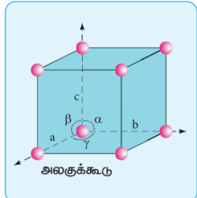

## 6.4 படிக அணிக்கோவைத்தளம் மற்றும் அலகுக்கூடு

முப்பரிமாண வடிவமைப்பில் அணுக்கள், மூலக்கூறுகள் அல்லது அயனிகள் ஒன்றினைப் பொறுத்து மற்றொன்று வரையறுக்கப்பட்ட சீரான ஒரு அமைப்பில் காணப்படுவது படிக திடப்பொருட்களின் ஒரு குறிப்பிடத்தக்க பண்பாகும். இவ்வாறு படிகம் முழுமையும் சீராக காணப்படும் இந்த ஒழுங்கமைப்பு படிக அணிக்கோவைத்தளம் என அழைக்கப்படுகிறது. ஒரு படிக திடப்பொருளில், மீண்டும் மீண்டும் தோன்றக்கூடிய, முப்பரிமாண எளிய அடிப்படை வடிவமைப்பு அலகுக்கூறு என அழைக்கப்படுகிறது.பின்வரும் படத்தின் மூலம் அணிக்கோவை புள்ளிகள் மற்றும்  அலகுக்கூட்டினைப் புரிந்து கொள்ளலாம்.

ஒரு படிகத்தினைக், கணக்கற்ற அலகுக்கூடுகள் ஒவ்வொன்றும் மற்ற அருகாமைக் கூடுகளுடன் நேரடியாக இணைக்கப்பட்டு முப்பரிமாண வெளியில் ஒரே மாதிரியான திசை அமைப்பை பெற்றுள்ள ஒரு அமைப்பாகக் கருதலாம். படிகத்தில் ஒரு குறிப்பிட்ட துகளைச் சூழ்ந்து காணப்படும் அருகாமை துகள்களின் எண்ணிக்கை அக்குறிப்பிட்ட துகளின் அணைவு எண் என அழைக்கப்படுகிறது.ஒரு அலகுக்கூட்டானது அதன் விளிம்பு நீளங்கள் அல்லது அணிக்கோவை மாறிலிகள் $a, b$ மற்றும் $c$ ஆகியனவற்றாலும், விளிம்பிடைக் கோணங்கள் $\alpha, \beta$ மற்றும் $\gamma$ ஆகியனவற்றாலும் வரையறுக்கப்படுகிறது.
