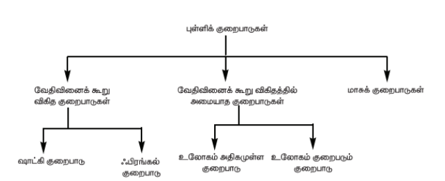
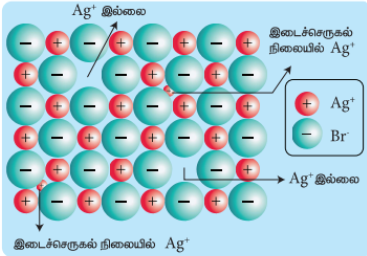
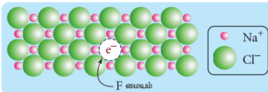

## 6.7 படிக குறைபாடுகள்

இயற்கையில் காணப்படும் எவையும் மிகச் சரியாக இருக்கும் என்பதற்கில்லை. அதேபோலவே படிகங்களும் சரியாக அமைந்திருக்க வேண்டும் என்ற அவசியமில்லை. படிகங்கள் எப்போதும் அவைகளின் உட்கூறுகளில் ஒழுங்கமைப்பில் சில குறைபாடுகளைக் கொண்டிருக்கின்றன. இத்தகைய குறைபாடுகள் அவைகளின் இயற் மற்றும் வேதிப் பண்புகளில் பாதிப்புகளை ஏற்படுத்துவதோடு மட்டுமல்லாமல் பல்வேறு செயல்முறைகளில் முக்கியப் பங்காற்றுகின்றன. எ.கா சிலிக்கன் போன்ற படிகங்களுடன் மாசுகளைச் சேர்த்து படிகுறைபாட்டினை ஏற்படுத்தும் போது அவற்றின் குறை மின்கடத்தும் திறன் அதிகரிக்கிறது. படிக குறைபாட்டினைப் பொறுத்து இரும்பு நிக்கல் போன்ற ஃபெர்ரோ காந்தப் பொருட்களை காந்தத்தன்மை பெறச் செய்யவோ அல்லது காந்தத் தன்மையை இழக்கச் செய்யவோ இயலும். படிகக் குறைபாடுகளை பின்வருமாறு வகைப்படுத்தலாம்.

1) புள்ளிக் குறைபாடுகள்
2) கோட்டுக் குறைபாடுகள்
3) இடைச் செருகல் குறைபாடுகள்
4) கனஅளவு குறைபாடுகள்

இப்பாடப் பகுதியில் நாம் புள்ளிக் குறைபாடுகளை, குறிப்பாக அயனி படிகங்களில் காணப்படும் புள்ளிக் குறைபாடுகளைப் பற்றி கற்றறிய உள்ளோம். புள்ளிக் குறைபாடுகளைப் பின்வருமாறு மேலும் வகைப்படுத்தலாம்.

#### அயனி படிகங்களில் வேதிவினைக் கூறு விகித குறைபாடுகள்

இக்குறைபாடுகள் உள்ளார்ந்த அல்லது வெப்ப இயக்கவியல் குறைபாடுகள் எனவும் அழைக்கப்படுகின்றன. வேதி வினைக் கூறு விகிதத்தில் அமைந்த அயனிப் படிகங்களில் ஒரு அயனியால் ஏற்படும் வெற்றிடம் எப்போதும் அதற்கு எதிர் மின் சுமையுடைய அயனி இல்லாமல் இருப்பதால் ஈடுபெய்யப்படலாம் அல்லது வெற்றிடம் ஏற்படக் காரணமான அதே மின்சுமையுடைய அயனி இடைச்செருகல் நிலையில் காணப்படுவதால் ஈடு செய்யப்படலாம். இது எவ்வாறு இருப்பினும் மின் நடுநிலை தன்மை பாதுகாக்கப்படுகிறது.

### 6.7.1 ஷாட்கி குறைபாடு

அயனி படிகங்களின் அணிக்கோவை புள்ளிகளில் சம எண்ணிக்கையில் நேர்மற்றும் எதிர் அயனிகள் இல்லாமல் வெற்றிடம் காணப்படுவதால் ஏற்படும் படிகக் குறைபாடு ஷாட்கி குறைபாடு எனப்படும். இக்குறைபாடு படிகத்தின் வேதி வினைக் கூறு விகிதத்தினை மாற்றியமைப்பதில்லை. நேரயனியின் உருவளவானது எதிரயனியின் உருவளவினை ஏறத்தாழ ஒத்திருக்கும் அயனிகளைக் கொண்டுள்ள அயனி படிகங்களில் இக்குறைபாடு காணப்படுகிறது. எ.கா சோடியம் குளோரைடு.

ஷாட்கி குறைபாடு

படிகங்களில் அதிக அளவு ஷாட்கி குறைபாடு காணப்படின் அவைகளின் அடர்த்தி குறையும். எ.கா அலகுக்கூட்டு விளிம்பு நீளத்தை பயன்படுத்தி கணக்கிடப்பட்ட வனேடியம் மோனாக்சைடின்  கருத்தியலான அடர்த்தி \( 6.5 \ \mathrm{g\ cm^{-3}} \) ஆனால் சோதனை முடிவின் அடிப்படையிலான அதன் உண்மையான அடர்த்தி \( 5.6 \ \mathrm{g\ cm^{-3}} \). இதிலிருந்து VO படிகத்தில் 14% ஷாட்கி குறைபாடு காணப்படுகின்றது என அறிய முடிகிறது. ஷாட்கி குறைபாடானது, படிகங்களில் அணுக்கள் அல்லது அயனிகள் படிக அணிக்கோவைத் தளம் முழுமைக்கும் நகர்வதற்கு ஒரு எளிய வழியினை ஏற்படுத்துகிறது.

### 6.7.2 ஃபிராங்கல் குறைபாடு

படிக அணிக்கோவைத் தளத்தில் இடம்பெற வேண்டிய ஒரு அயனியானது அவ்விடத்தில் அமையாமல் மற்றொரு இடைச்செருகல் நிலையில் அமைந்திருப்பதால் ஏற்படும் குறைபாடு ஃபிராங்கல் குறைபாடு எனப்படும். உருவ அளவில் அதிக வேறுபாடு காணப்படும் நேர் மற்றும் எதிர் அயனிகளைக் கொண்டுள்ள அயனிப் படிகங்களில் இக்குறைபாடு காணப்படுகிறது. ஷாட்கி குறைபாட்டினைப் போல் அல்லாமல் இக்குறைபாடு படிக அடர்த்தியில் பாதிப்பை ஏற்படுத்துவதில்லை. எ.கா சில்வர் புரோமைடு. இந்நேர்வில் சிறிய உருவளவுள்ள \( Ag^+ \) அயனியானது அதன் வழக்கமான அணிக்கோவைப் புள்ளிகளில் இடம்பெறாமல் படத்தில் காட்டியுள்ளவாறு இடைச்செருகல் நிலைகளில் காணப்படுகிறது.

ஃபிராங்கல் குறைபாடு

### 6.7.3 உலோகம் அதிகமுள்ள குறைபாடு

படிகங்களில், எதிர் அயனிகளோடு ஒப்பிடும்போது உலோக அயனிகளின் எண்ணிக்கை அதிகமாக காணப்படுவதால் ஏற்படும் குறைபாடு உலோகம் அதிகமுள்ள குறைபாடு எனப்படும். கார உலோக ஹாலைடுகளான NaCl, KCl போன்றவை இத்தகைய குறைபாட்டினைக் கொண்டுள்ளன. இக்குறைபாடு காணப்படும் படிகங்களில் எதிர் அயனிகளால் ஏற்படும் வெற்றிடங்களுக்குச் சமமான எண்ணிக்கையில் கூடுதலான உலோக அயனிகள் (அல்லது) கூடுதலான நேர் அயனிகள் மற்றும் எலக்ட்ரான் ஆகியன இடைச்செருகல் நிலைகளில் காணப்படுவதால் மின் நடுநிலைத் தன்மை பாதுகாக்கப்படுகிறது.

உலோகம் அதிகமுள்ள குறைபாடு

எடுத்துக்காட்டாக, சோடியம் குளோரைடு படிகங்களைச் சோடியத்தின் ஆவியுடன் வெப்பப்படுத்தும் போது \( Na^+ \) அயனிகள் உருவாகின்றன. மேலும் அவை படிகத்தின் புறப்பரப்பில் படிகின்றன. இந்நிலையில் குளோரைடு அயனிகள் அணிக்கோவை புள்ளிகளிலிருந்து இடம்பெயர்ந்து படிகத்தின் புறப்பரப்பிற்கு விரவி \( Na^+ \) அயனிகளுடன் இணைகிறது. மேலும் ஆவி நிலையில் உள்ள சோடியத்தால் இழக்கப்பட்ட எலக்ட்ரான்கள் படிக அணிக்கோவைத் தளத்தில் ஊடுருவி \( Cl^- \) அயனிகளால் ஏற்படுத்தப்பட்ட வெற்றிடத்தில் இடம் கொள்கின்றன. இத்தகைய இணையாகாத தனித்த எலக்ட்ரான்களால் நிரப்பப்பட்டுள்ள எதிர் அயனி வெற்றிடங்கள் F மையங்கள் என அழைக்கப்படுகின்றன. எனவே அதிகப்படியான \( Na^+ \) அயனிகளை கொண்டுள்ள NaCl-ன் வாய்பாடானது \( Na^+Cl^- \) எனக் குறிப்பிடப்படுகிறது. மேலும் ஒரு எடுத்துக்காட்டு: அறை வெப்பநிலையில் ZnO நிறமற்றதாகும். இதனை வெப்பப்படுத்தும் போது இது மஞ்சள் நிறமுடையதாகிறது. வெப்பப்படுத்தும்போது துத்தநாக ஆக்சைடு ஆக்சிஜனை இழந்து தனித்த \( Zn^{2+} \) அயனிகளை உருவாக்குகிறது. இத்தகைய அதிகப்படியான \( Zn^{2+} \) அயனிகள் படிகத்தினுள் இடைச்செருகல் நிலையில் இடம்பெறுகின்றன. அதைப்போலவே எலக்ட்ரான்களும் இடைச்செருகல் நிலைகளில் இடம் பெறுகின்றன.

### 6.7.4 உலோகம் குறைவுபடும்  குறைபாடு

எதிர் அயனிகளைக் காட்டிலும் நேர் அயனிகளின் எண்ணிக்கை குறைவாக காணப்படுவதால் ஏற்படும் குறைபாடு உலோகம் குறைவுபடும் குறைபாடு எனப்படும். நேர் அயனியானது மாறுபடும் ஆக்சிஜனேற்ற நிலைகளைப் பெற்றிருக்கும் படிகங்களில் இக்குறைபாடு காணப்படுகிறது. எடுத்துக்காட்டாக, FeO படிகங்களைக் கருதுவோம்.

உலோகம் குறைவுபடும் குறைபாடு

இதில் படிக அணிக்கோவை புள்ளிகளில் சில \( Fe^{2+} \) அயனிகள் இடம்பெற்றிருப்பதில்லை. இந்நேர்வில் மின் நடுநிலைத் தன்மையைப் பாதுகாக்கும் பொருட்டு படிகத்தில் உள்ள இடம்பெறாத \( Fe^{2+} \) அயனிகளின் எண்ணிக்கையைப் போல இருமடங்கு எண்ணிக்கையில் படிகத்தில் உள்ள மற்ற \( Fe^{2+} \) அயனிகள், \( Fe^{3+} \) அயனிகளாக ஆக்சிஜனேற்றம் அடைகின்றன. ஒட்டுமொத்தமாக \( O^{2-} \) அயனிகளின் எண்ணிக்கையோடு ஒப்பிடும் போது ஒட்டுமொத்த \( Fe^{2+} \) மற்றும் \( Fe^{3+} \) அயனிகளின் எண்ணிக்கையின் கூடுதல் குறைவாக இருக்கும். சோதனையின் மூலம் கண்டறியப்பட்ட ஃபெர்ரஸ் ஆக்சைடின் பொதுவான வாய்ப்பாட்டினை \( Fe_xO \) எனக் குறிப்பிடப்படுகிறது. இங்கு x இன் மதிப்பு 0.93 முதல் 0.98 வரை அமைந்திருக்கலாம்.

### 6.7.5 மாசுக் குறைபாடுகள்

ஒரு அயனிப்படிகத்தில் குறைபாட்டினை ஏற்படுத்த ஒரு எளிய பொதுவான முறை அதனுடன் அயனி மாசுகளைச் சேர்ப்பதாகும். இவ்வாறு மாசுகளைச் சேர்க்கும் போது, சேர்க்கப்படும் மாசு அயனியின் இணைதிறனானது சேரும் படிகத்தில் உள்ள அயனியின் இணைதிறனிலிருந்து வேறுபட்டிருப்பின் படிக அணிக்கோவைத் தளங்களில் வெற்றிடங்கள் உருவாக்கப்படுகின்றன. எடுத்துக்காட்டாக, AgCl படிகத்தில் \( CdCl_2 \) மாசாகச் சேர்ப்பதால் உருவாகும் திடக் கரைசலில் \( Cd^{2+} \) அயனியானது படிகத்தில் \( Ag^+ \) அயனி இடம்பெற்றிருந்த இடத்தில் இடம் பெறுகிறது. இதன் காரணமாக படிகத்தின் மின் நடுநிலை தன்மை பாதிக்கப்படுகிறது. இதனைப் பாதுகாக்கும் பொருட்டு அதற்கு இணையான எண்ணிக்கையில் \( Ag^+ \) அயனிகள் படிக அணிக்கோவை தளத்திலிருந்து வெளியேறுகின்றன. இதனால் படிக அணிக்கோவைத் தளத்தில் நேர் அயனி வெற்றிடங்கள் ஏற்படுகின்றன. இத்தகைய படிகக் குறைபாடுகள் மாசுக் குறைபாடுகள் என்று அழைக்கப்படுகின்றன.

### அழுத்தமின் படிகங்களின் மூலம் ஆற்றல் அறுவடை

Piezoelectricity – அழுத்தமின்சாரம் (அழுத்த மின் விளைவு எனவும் அழைக்கப்படுகிறது) என்பது ஒரு படிகத்தை எந்திரவியல் அழுத்தத்திற்கு உட்படுத்தும் போது, அதன் பக்கங்களுக்கிடையே உண்டாக்கப்படும் மின்னழுத்தமாகும். அழுத்தம் மற்றும் உள்ளுறை வெப்பம் ஆகியவற்றின் விளைவாக உருவான மின்சாரம் என்பதே piezoelectricity எனும் சொல்லின் பொருளாகும். இதன் நேர்மாறும் சாத்தியமாகும். அது எதிர் அழுத்தமின் விளைவு என அறியப்படுகிறது.

ஒரு அழுத்தமின் படிகத்தை ஒரு முறை அழுத்தி சிறிதளவு மின்சாரத்தை உங்களால் உருவாக்க இயலுமானால், பல படிகங்களை மீண்டும் மீண்டும் பலமுறை அழுத்தி குறிப்பிடத் தகுந்தளவு மின்சாரத்தை உருவாக்க இயலுமா? கடந்து செல்லும் வாகனங்களிலிருந்து ஆற்றலைப் பெற நாம் அழுத்தமின் படிகங்களை சாலைகளில் புதைத்து வைத்தால் என்ன நிகழும்?

ஆற்றல் அறுவடை என அறியப்படும் இந்த கருத்தானது பலரின் கவனத்தை ஈர்த்தது. இதன் பயன்பாட்டை பெரிய அளவில் செயல்படுத்துவதில் சில வரம்புகள் இருப்பினும், நடந்து செல்வதன் மூலமாகவே உங்களின் சைப்பேசியை சார்ஜ் செய்ய போதுமான மின்சாரத்தை நீங்கள் உற்பத்தி செய்ய முடியும். அடிப்பகுதியில் அழுத்த மின் படிகங்கள் பொருத்தப்பட்ட, ஆற்றல் உற்பத்தி செய்யும் காலணிகள் உருவாக்கப்பட்டுள்ளன. இவற்றால், பேட்டரிகள் மற்றும் USB சாதனங்களை சார்ஜ் செய்ய போதுமான மின்சாரத்தை உருவாக்க இயலும்.

## பாடச்சுருக்கம்

■ திடப்பொருட்களில் அணுக்கள் அல்லது மூலக்கூறுகள் அல்லது அயனிகள் ஒரு ஒழுங்கான வடிவமைப்பில் இறுக்கமாக பிணைத்து வைக்கப்பட்டுள்ளன.

■ திடப்பொருட்களை அவைகளில் காணப்படும் உட்கூறுகளின் அமைப்பினை பொறுத்து பின்வரும் இரு பெரும் பிரிவுகளாகப் பிரிக்கலாம். (i) படிக வடிவமுடைய திடப்பொருட்கள் (ii) படிக வடிவமற்ற திடப்பொருட்கள்

■ திடப்பொருட்களின் உட்கூறுகள் (அணுக்கள், அயனிகள் அல்லது மூலக்கூறுகள்) நீண்ட எல்லை வரையில் ஒரு ஒழுங்கான கட்டமைப்பினைப் பெற்றிருக்குமாயின் படிக வடிவமுடைய திடப்பொருட்கள் என அழைக்கப்படுகின்றன.

■ படிக வடிவமற்ற திடப் பொருட்களில், அவற்றின் உட்கூறுகள் அங்கும் இங்கும் ஒழுங்கின்றி அமைக்கப்பட்டுள்ளன

■ முப்பரிமாண வடிவமைப்பில் அணுக்கள், மூலக்கூறுகள் அல்லது அயனிகள் ஒன்றினைப் பொறுத்து மற்றொன்று வரையறுக்கப்பட்ட சீரான ஒரு அமைப்பில் காணப்படுவது படிக திடப்பொருட்களின் ஒரு குறிப்பிடத்தக்க பண்பாகும். இவ்வாறு படிகம் முழுமையும் சீராக காணப்படும் இந்த ஒழுங்கமைப்பு படிக அணிக்கோவைத் தளம் என அழைக்கப்படுகிறது.

■ ஒரு அலகுக்கூடானது அதன் விளிம்பு நீளங்கள் அல்லது அணிக்கோவை மாறிலிகள் a, b மற்றும் c ஆகியனவற்றாலும் விளிம்பிடைக் கோணங்கள் \( \alpha \), \( \beta \) மற்றும் \( \gamma \) ஆகியனவற்றாலும் வரையறுக்கப்படுகிறது.

■ முதல் நிலை எளிய அலகுக்கூட்டில் ஏழு படிக அமைப்புகள் காணப்படுகின்றன. அவையாவன, கனச்சதுரம், நான்கோண அமைப்பு, அறுங்கோண அமைப்பு, ஆர்த்தோராம்பிக், மோனோகிளினிக், ட்ரைகிளினிக் மற்றும் ராம்போஹீட்ரல். இவ்வமைப்புகள் அவைகளின் படிக அச்சுகள் மற்றும் கோணங்களில் வேறுபடுகின்றன. மேற்கண்டுள்ள ஏழு அமைப்புகளுக்கு இணையாக பதினான்கு படிக அமைப்புகள் உருவாக வாய்ப்புள்ளன என பிராவே வரையறுத்தார்.

■ எளிய கனச்சதுர அலகுக்கூட்டில், ஒவ்வொரு மூலையிலும் ஒத்த அணுக்கள், (அயனிகள் அல்லது மூலக்கூறுகள்) காணப்படுகின்றன. இந்த அணுக்கள் கனச் சதுரத்தின் விளிம்பின் வழியே ஒன்றையொன்று தொட்டுக் கொண்டிருக்கின்றன. மேலும் இவை கனச் சதுரத்தின் மூலைவிட்டத்தின் வழியே தொட்டுக் கொண்டிருப்பதில்லை. இவ்வமைப்பில் உள்ள ஒவ்வொரு அணுவின் அணைவு எண் 6.

■ பொருள் மைய கனச்சதுர அலகுக்கூட்டில், எளிய கனச்சதுர அமைப்பில் உள்ளவாறு கனச் சதுரத்தின் ஒவ்வொரு மூலையிலும் ஒத்த அணுக்கள் காணப்படுவதுடன் கனச் சதுரத்தினுள் அதன் மையத்தில் மேலும் ஒரு அணு காணப்படுகின்றது. இவ்வமைப்பில் எளிய கனச்சதுர அமைப்பில் உள்ளவாறு கனச் சதுரத்தின் மூலைகளில் அமைந்துள்ள அணுக்கள் ஒன்றையொன்று தொட்டுக் கொண்டிருப்பதில்லை. எனினும் மூலையில் காணப்படும் அணுக்கள் அனைத்தும், பொருள் மையத்தில் காணப்படும் அணுவினைத் தொட்டுக் கொண்டுள்ளன. இவ்வமைப்பில் ஒரு அணுவைச் சுற்றி எட்டு அருகாமை அணுக்கள் காணப்படுகின்றன. எனவே அணைவு எண் 8.

■ முகப்பு மைய அலகுக்கூட்டில் ஒத்த அணுக்கள் கனச்சதுரத்தின் ஒவ்வொரு மூலைகளிலும் காணப்படுவதுடன், அதன் முகப்பு மையங்களிலும் காணப்படுகின்றன. மூலையில் காணப்படும் அணுக்கள் முகப்பு மையத்தில் காணப்படும் அணுவைத் தொட்டுக் கொண்டுள்ளன ஆனால் இவை ஒன்றுடன் ஒன்று தொட்டுக்கொள்ளவில்லை. இதன் அணைவு எண் 12.

■ படிக வடிவமைப்பினைத் தீர்மானிப்பதற்கு, X கதிர் விளிம்பு விளைவு ஆய்வு ஒரு சிறந்த முறையாகும். X – கதிர் விளிம்பு விளைவு ஆய்வு முடிவுகளின் அடிப்படையில் பின்வரும் சமன்பாட்டைப் பயன்படுத்தி அணுக்கள் அடங்கிய இரு அடுத்தடுத்த அணிக்கோவைத் தளங்களுக்கு இடைப்பட்ட தொலைவு (d) யைக் கணக்கிடலாம். \( 2d \sin \theta = n\lambda \)

■ அயனிச் சேர்மங்களின் வடிவங்கள், அதில் அடங்கியுள்ள அயனிகளின் உருவளவு மற்றும் வேதிவினைக்கூறு விகிதங்களின் அடிப்படையில் அமையும். பொதுவாக அயனிப்படிகங்களில், பெரிய உருவளவுள்ள எதிரயனிகள் நெருங்கிப் பொதிந்த அமைப்பிலும், நேரயனிகள் அவ்வமைப்பின் வெற்றிடங்களிலும் காணப்படுகின்றன. நேர் மற்றும் எதிர் அயனி ஆகியவைகளுக்கிடையேயான ஆர விகிதம் \( \left( \frac{r_+}{r_-} \right) \) ஆனது படிக வடிவமைப்பைத் தீர்மானிப்பதில் முக்கியப் பங்காற்றுகிறது.

■ இயற்கையில் காணப்படும் எவையும் மிகச் சரியாக இருக்கும் என்பதற்கில்லை. அதேபோலவே படிகங்களும் சரியாக அமைந்திருக்க வேண்டும் என்ற அவசியமில்லை. படிகங்கள் எப்போதும் அவைகளின் உட்கூறுகளில் ஒழுங்கமைப்பில் சில குறைபாடுகளைக் கொண்டிருக்கின்றன.

■ அயனி படிகங்களின் அணிக்கோவை புள்ளிகளில் சம எண்ணிக்கையில் நேர் மற்றும் எதிர் அயனிகள் இல்லாமல் வெற்றிடம் காணப்படுவதால் ஏற்படும் படிகக் குறைபாடு ஷாட்கி குறைபாடு எனப்படும்.

■ படிகங்களில், எதிர் அயனிகளோடு ஒப்பிடும்போது உலோக அயனிகளின் எண்ணிக்கை அதிகமாக காணப்படுவதால் ஏற்படும் குறைபாடு உலோகம் அதிகமுள்ள குறைபாடு எனப்படும்.

■ எதிர் அயனிகளைக் காட்டிலும் நேர் அயனிகளின் எண்ணிக்கை குறைவாக காணப்படுவதால் ஏற்படும் குறைபாடு உலோகம் குறைவுபடும் குறைபாடு எனப்படும்.