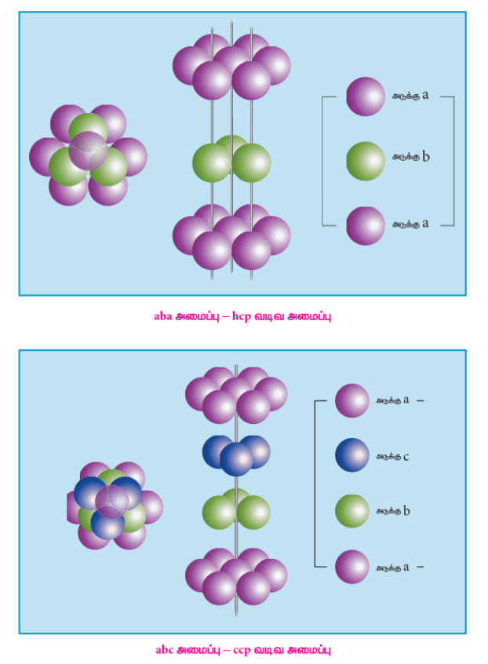
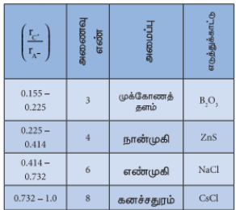

## 6.6 படிகங்களில் பொதிவு

பழக்கடைகளில் பழங்கள் அடுக்கி வைக்கப்பட்டுள்ளதை நாம் கருதுவோம். பின்வரும் படத்தில் காட்டியுள்ளவாறு அவை நெருக்கமாக அமையும் வகையில் அடுக்கி வைக்கப்பட்டுள்ளன. நாம் இந்த ஒப்புமையினை, படிகங்களில் அவற்றின் உட்கூறுகளை (அணுக்கள், மூலக்கூறுகள் அல்லது அயனிகள்) திடக் கோளங்களாகக் கருத்திற்கொண்டு அவை பொதிந்து வைக்கப்பட்டுள்ள அமைப்பினைக் காட்சிப்படுத்திப் புரிந்துக் கொள்ளப் பயன்படுத்தலாம். பொதுவாக படிகங்களில், அவற்றின் உட்கூறுகள், தங்களுக்கிடையேயான கவர்ச்சி விசையினைப் பெருமமாக்கும் வகையில் அவை ஒன்றிற்கொன்று எவ்வளவு அருகாமையில் இருக்க வாய்ப்புள்ளதோ அந்த அளவிற்கு நெருங்கிப் பொதிந்திருக்க முற்படுகின்றன.

இப்பாடப்பகுதியில் ஒரே மாதிரியான கோளங்களைக் கொண்டு கனச்சதுர மற்றும் அறுங்கோண நெருங்கிப் பொதிந்த அலகுக்கூட்டினை எவ்வாறு உருவாக்குவது என்பதனைக் கற்றறிவோம். பாடக்கருத்தினை நன்கு புரிந்துகொள்ளும் பொருட்டு, முப்பரிமாண நெருங்கிப் பொதிந்த அமைப்பினைப் பற்றி படிக்கும் முன்னர், முதலில் இரு பரிமாணத்தில் கோளங்களை எவ்வாறு அடுக்குவது என்பதனைக் கற்போம்.

### 6.6.1 ஒரு குறிப்பிட்ட திசையில் நேர்கோட்டில் கோளங்களை வரிசைப்படுத்துதல்

ஒரு பரிமாணத்தில் ஒரு குறிப்பிட்ட திசையில், படத்தில் காட்டியுள்ளவாறு ஒரே ஒரு வகையில் மட்டுமே கோளங்களை வரிசைப்படுத்த இயலும். இந்த அமைப்பில் உள்ள ஒவ்வொரு கோளமும் தனக்கு அருகாமையில் இருபுறமும் அமைந்துள்ள இரு கோளங்களைத் தொடருக் கொண்டிருக்கிறது.

### 6.6.2 இருபரிமாண நெருங்கிப் பொதிந்த அமைப்பு

இரு பரிமாணத்தில் ஒரு தள அமைவில் பின்வரும் ஏதேனும் ஒரு வகையில் நெருங்கிப் பொதிந்த அமைப்பினை நாம் உருவாக்க இயலும்.

#### (i) AAA... வகை

ஒரு திசையில் நேர்க்கோட்டில் கோளங்களை அடுக்கியதைப் போன்று இரு பரிமாணத்தில் அதே வரிசை மீண்டும் மீண்டும் தோன்றும் வகையில் அடுக்குதல். அதாவது படத்தில் காட்டியவாறு, ஒரு பரிமாண அமைப்பினைப் போன்று, வெவ்வேறு வரிசைகளில் அடுக்கப்பட்டுள்ள அனைத்துக் கோளங்களும் செங்குத்து மற்றும் கிடைமட்ட வாக்கில் ஒரே திசையில் அமைந்திருக்குமாறு பல வரிசைகளை உருவாக்குதல். முதலாவது வரிசையினை நாம் A என குறிப்பிட்டால், பின் மேற்கண்டுள்ளவாறு பொதிந்து வைக்கப்பட்டுள்ள அமைப்பானது AAA வகை என அழைக்கப்படுகிறது ஏனெனில் அனைத்து வரிசைகளும், முதல் வரிசையினை ஒத்து அமைகின்றன. இவ்வகை அமைப்பில், ஒவ்வொரு கோளமும் தனக்கு அருகாமையில் சூழ்ந்துள்ள நான்கு கோளங்களைத் தொடருக் கொண்டுள்ளது.

#### (ii) ABAB... வகை

படத்தில் காட்டியுள்ளவாறு, இம்முறையில் முதல் வரிசையில் உள்ள கோளங்களின் தொடுப்புள்ளிகளுக்குக் கீழ் காணப்படும் இடைவெளிப் பகுதிகளில் கோளங்கள் பொருத்தி வைக்கப்பட்டு இரண்டாவது வரிசை உருவாக்கப்படுகிறது. முதல் வரிசையினை A வரிசை எனவும், இரண்டாவது வரிசையினை B வரிசை எனவும் குறிப்பிட்டால், இம்முறையில் மூன்றாவது வரிசை மீண்டும் A முறையிலும், நான்காவது வரிசை B முறையிலும் அமைக்கப்படுகின்றன. அதாவது AB AB என வரிசை தொடர்ந்து அமையுமாறு இம்முறை அமைந்துள்ளது. மேலும் இம்முறையில் ஒவ்வொரு கோளமும் தனக்கு அருகாமையில் தன்னைச் சூழ்ந்துள்ள ஆறு கோளங்களைத் தொடருக் கொண்டுள்ளன. AAAA... முறை மற்றும் ABAB... முறை ஆகியனவற்றை ஒப்பிடும் போது, ABAB... முறையானது நெருங்கிப் பொதிந்த அமைப்பினைப் பெற்றுள்ளது என நாம் அறிந்துணர முடியும்.

### 6.6.3 எளிய கனச்சதுர அமைப்பு

முப்பரிமாணத்தில், ஒவ்வொரு அடுக்கும், AAAA வகை இருபரிமாண அமைப்பினை ஒத்திருக்குமாறு ஒரு அமைப்பினை உருவாக்கினால், அவ்வாறு உருவாகும் அமைப்பு எளிய கனச்சதுர அமைப்பாகும். படத்தில் காட்டியுள்ளவாறு, இரண்டாம் அடுக்கில் அமையும் அனைத்துக் கோளங்களும் முதல் அடுக்கில் அமையப் பெற்றுள்ள கோளங்களுக்கு நேராக அவற்றின் மேற்புறங்களில் அமைகின்றன. எனவே இதன் விளைவாக உருவாகும் அமைப்பில் அனைத்து அடுக்குகளும் ஒரே மாதிரியாக உள்ளன. வெவ்வேறு அடுக்குகளில் காணப்படும் அனைத்துக் கோளங்களும், அனைத்து திசைகளிலும் ஒரே வரிசையில் அமைகின்றன. இவ்வாறான அமைப்பில் ஒரு அலகுக்கூடானது எளிய கனச் சதுர அமைப்பினைப் பெறுகிறது.

எளிய கனச்சதுர அமைப்பில் உள்ள ஒவ்வொரு கோளமும், தான் அமைந்துள்ள அடுக்கில் தன்னைச் சுற்றி அருகாமையில் அமைந்துள்ள நான்கு கோளங்களைத் தொட்டுக் கொண்டிருப்பதுடன், அதற்கு மேல் உள்ள அடுக்கில் ஒரு கோளத்தினையும், கீழ்புறம் அமைந்துள்ள அடுக்கில் ஒரு கோளத்தினையும் தொட்டுக் கொண்டுள்ளது. எனவே, எளிய கனச்சதுர அமைப்பில் உள்ள ஒரு கோளத்தின் அணைவு எண் 6.

#### பொதிவுத் திறன்

ஒவ்வொரு வரிசையிலும் கோளங்களுக்கு இடையே இடைவெளிகள் காணப்படுகின்றன. மேலும், பல அடுக்குகள் அமையும் போது, அடுத்தடுத்த அடுக்குகளுக்கு இடையேயும் இடைவெளிகள் ஏற்படுகின்றன. ஒரு அமைப்பில் இடம் பெற்றுள்ள அனைத்துக் கோளங்களின் ஒட்டு மொத்த கன அளவானது அவ்வமைப்பின் பொதிவுத் திறனை (Packing efficiency) தருகிறது. முதலில் நாம் ஒரு எளிய கனச்சதுர அமைப்பின் பொதிவுத் திறனைக் கணக்கிடுவோம்.

\[
\text{பொதிவுத் திறன் அல்லது பொதிவு பின்னம்} = \frac{\text{ஒரு அலகுக்கூட்டில் உள்ள கோளங்களின் மொத்த கனஅளவு}}{\text{அலகுக்கூட்டின் கனஅளவு}} \times 100
\]

படத்தில் காட்டியுள்ளவாறு விளிம்பு நீளம் ‘a’ உடைய கனச்சதுரத்தினைக் கருதுவோம்.

விளிம்பு நீளம் a உடைய கனச்சதுரத்தின் கனஅளவு \( = a \times a \times a = a^3 \) ...(1)

கோளத்தின் ஆரம் ‘r’ எனக்கொண்டால், படத்திலிருந்து \( a = 2r \Rightarrow r = \frac{a}{2} \)

∴ ஆரம் ‘r’ உடைய கோளத்தின் கனஅளவு \( = \frac{4}{3} \pi r^3 \)

ஒரு எளிய கனச்சதுர அமைப்பில், ஒரு அலகுக்கூட்டிற்குச் சொந்தமான கோளங்களின் எண்ணிக்கை ஒன்று.

எனவே, ஒரு SC அலகுக்கூட்டில் உள்ள கோளங்களின் மொத்த கனஅளவு

\[
= \frac{4}{3} \pi r^3
= \frac{4}{3} \pi \left( \frac{a}{2} \right)^3
= \frac{4}{3} \pi \left( \frac{a^3}{8} \right)
= \frac{\pi a^3}{6} \quad ...(2)
\]

(2) ஐ (1) ஆல் வகுக்க,

\[
\text{பொதிவு பின்னம்} = \frac{\left( \frac{\pi a^3}{6} \right) \times 100}{a^3} = \frac{100\pi}{6} = 52.38\%
\]

அதாவது எளிய கனச்சதுர நெருங்கிப் பொதிந்த அமைப்பில் கிடைக்கும் கனஅளவில் 52.38% மட்டுமே கோளங்களால் நிரப்பப்பட்டுள்ளது, மீதமுள்ள இடம் காலியாக உள்ளது. எனவே இவ்வமைப்பில் வெற்றிடங்கள் அதிகம் உள்ளதால் அணுக்களுக்கிடையே வலுவான கவர்ச்சி ஏற்படும் வாய்ப்பு குறைவாக உள்ளது.

தனிம வரிசை அட்டவணையில் காணப்படும் உலோகங்களில், பொலோனியம் மட்டுமே எளிய கனச்சதுர அமைப்பில் படிகமாகிறது.

### 6.6.4 பொருள் மைய கனச்சதுர அமைப்பு

இந்த அமைப்பில், முதல் வரிசையான வகை A வரிசையில் உள்ள கோளங்கள் ஒன்றையொன்று நேரடியாகத் தொட்டுக் கொண்டிருக்காமல் சிறிது விலகி அமைந்துள்ளன. படத்தில் காட்டியுள்ளவாறு, இந்த A அடுக்கில் உள்ள கோளங்களுக்கு இடையே ஏற்பட்டுள்ள இடைவெளிகளில் இரண்டாம் அடுக்கு உருவாக்கப்படுகிறது.

மூன்றாவது அடுக்கு முதல் அடுக்கினை ஒத்திருக்குமாறு அமைக்கப்படுகிறது. அதாவது படிகம் முழுமையும் இந்த அமைப்பானது ABAB... என மீண்டும் மீண்டும் அமையுமாறு இவ்வமைப்பு உள்ளது. இந்த அமைப்பில் உள்ள எந்த ஒரு கோளத்தின் அணைவு எண் 8 ஆகும். அதாவது ஒரு குறிப்பிட்ட கோளமானது, அது அமைந்துள்ள அடுக்கிற்கு மேற்புறம் அமைந்துள்ள அடுக்கில் இடம்பெற்றுள்ள நான்கு கோளங்களைத் தொட்டுக் கொண்டிருப்பதுடன், அதற்கு கீழ்புறம் அமைந்துள்ள அடுக்கில் நான்கு கோளங்களையும் தொட்டுக் கொண்டிருப்பதால் அதன் அணைவு எண் 8 ஆகும்.

#### பொதிவுத் திறன்

இவ்வமைப்பில், படத்தில் காட்டியுள்ளவாறு கோளங்கள் கனச்சதுரத்தின் முதன்மை மூலைவிட்டத்தின் வழியே தொட்டுக் கொண்டுள்ளன.

\( \triangle ABC \),

\[
AC^2 = AB^2 + BC^2
\]
\[
AC^2 = a^2 + a^2 = 2a^2
\]
\[
AC = \sqrt{2}a
\]

\( \triangle ACG \),

\[
AG^2 = AC^2 + CG^2
\]
\[
AG^2 = (\sqrt{2}a)^2 + a^2 = 2a^2 + a^2 = 3a^2
\]
\[
AG = \sqrt{3}a
\]

அதாவது,

\[
\sqrt{3}a = 4r
\]
\[
r = \frac{\sqrt{3}}{4}a
\]

ஃ ‘r’ ஆரமுடைய கோளத்தின் கனஅளவு

\[
= \frac{4}{3} \pi r^3
= \frac{4}{3} \pi \left( \frac{\sqrt{3}}{4}a \right)^3
= \frac{4}{3} \pi \left( \frac{3\sqrt{3}}{64} a^3 \right)
= \frac{\sqrt{3} \pi a^3}{16} \quad ...(2)
\]

bcc வடிவமைப்பில் ஒரு அலகுக்கூட்டில் காணப்படும் கோளங்களின் எண்ணிக்கை இரண்டு என நாம் அறிவோம். எனவே

அனைத்துக் கோளங்களின் கனஅளவு

\[
= 2 \times \frac{\sqrt{3} \pi a^3}{16} = \frac{\sqrt{3} \pi a^3}{8} \quad ...(3)
\]

சமன்பாடு (3) ஐ (1) ஆல் வகுக்க,

\[
\text{பொதிவு பின்னம்} = \frac{\left( \frac{\sqrt{3} \pi a^3}{8} \right) \times 100}{a^3}
\]
\[
= \frac{\sqrt{3} \pi}{8} \times 100
\]
\[
= \frac{1.732 \times 3.14}{8} \times 100
\]
\[
= 68\%
\]

அதாவது ஒரு அலகுக்கூட்டின் மொத்த கனஅளவில் 68% கனஅளவு கோளங்களால் நிரம்பியுள்ளது. எளிய கனச்சதுர அமைப்பினைக் காட்டிலும் இம்முறையில், அணுக்களால் அதிக கனஅளவு நிரப்பப்பட்டுள்ளதால் வெற்றிடம் குறைவாக உள்ளது.

### 6.6.5 அறுங்கோண மற்றும் முகப்பு மைய கனச்சதுர அமைப்பு

#### முதல் அடுக்கை உருவாக்குதல்

இத்தகைய அமைப்புகளில், முதல் அடுக்கானது, இருபரிமாணத்தில் ABAB வரிசை முறையில் அமைக்கப்பட்டது போன்று அமைக்கப்படுகிறது. அதாவது முதல் வரிசையில் உள்ள கோளங்களின் தொடுபுள்ளிகளுக்குக் கீழ் அமையும் இடைவெளிகளில் இரண்டாம் வரிசைக் கோளங்கள் அமைக்கப்படுகின்றன. இந்த முதல் அடுக்கினை ‘a’ எனக் குறிப்பிடுக. முதல் அடுக்கில் காணப்படும் இடைவெளிகளில் கோளங்களை அடுக்கி இரண்டாவது அடுக்கு உருவாக்கப்படுகிறது. இரண்டாவது அடுக்கினை ‘b’ என்க.

#### இரண்டாவது அடுக்கை உருவாக்குதல்

முதல் அடுக்கு (a) இல் இரண்டு வகையான வெற்றிடங்கள் (துளைகள்) காணப்படுகின்றன. படத்தில் குறிப்பிட்டுள்ளவாறு, அவற்றினை x மற்றும் y எனக் குறிப்பிடுவோம்.

இந்த வெற்றிடம் / துளை, x அல்லது y ன் மீது கோளங்களை அடுக்குவதன் மூலம் இரண்டாவது அடுக்கினை உருவாக்கலாம். இடைவெளி (வெற்றிடம்) x ன் மீது கோளங்களை அடுக்கி இரண்டாவது அடுக்கினை உருவாக்கும் ஒரு நேர்வினை நாம் கருதுவோம்.

முதலாவது அடுக்கில் உள்ள வெற்றிடம் x ன் மீது எங்கெங்கெல்லாம் இரண்டாவது அடுக்கின் கோளங்கள் அமைகின்றனவோ, அங்கெங்கெல்லாம் ஒரு நான்முகி வெற்றிடம் (tetrahedral hole) உருவாகிறது. இந்த நான்முகி வெற்றிடம் நான்கு கோளங்களை உள்ளடக்கியது அதாவது கீழ் அடுக்கு (a) ல்மூன்று கோளங்கள் மற்றும் மேல் உள்ள அடுக்கு (b) – ல் ஒரு கோளம். இந்த நான்கு கோளங்களின் மையங்களையும் இணைக்கும் போது ஒரு நான்முகி உருவாதலால் இவைகளுக்கு இடையேயான வெற்றிடம் நான்முகி வெற்றிடம் எனப்படுகிறது.

அதே நேரத்தில், முதல் அடுக்கு ‘a’ ல் காணப்படும் மற்றொரு வெற்றிடமான ‘y’ ஆனது இரண்டாவது அடுக்கில் (b) உள்ள கோளங்களால் பகுதியளவு மறைக்கப்படுகிறது. தற்போது ‘a’ ல் காணப்படும் இத்தகைய வெற்றிடங்கள் எண்முகி வெற்றிடங்கள் என அழைக்கப்படுகின்றன.

நெருங்கிப் பொதிந்த கோளங்களின் எண்ணிக்கையினைப் பொறுத்து உருவாகும் வெற்றிடங்கள்/துளைகளின் எண்ணிக்கை அமைகிறது. நெருங்கிப் பொதிந்த கோளங்களின் எண்ணிக்கை ‘n’ எனில், உருவாகும் எண்முகி வெற்றிடங்களின் எண்ணிக்கை n மற்றும் நான்முகி வெற்றிடங்களின் எண்ணிக்கை 2n ஆகும்.

இந்த வெற்றிடம் ஆறு கோளங்களை உள்ளடக்கியது [அதாவது கீழ் அடுக்கு (a) ல் மூன்று கோளங்கள் மற்றும் மேல் அடுக்கு (b) ல் மூன்று கோளங்கள்]. இந்த ஆறு கோளங்களின் மையங்களையும் இணைக்கும் போது எண்முகி அமைப்பு உருவாகிறது. மேலும் இதே நேரத்தில் இரண்டாவது அடுக்கு (b) ல் புதிய நான்முகித் துளைகள் உருவாகின்றன. அதாவது (b) அடுக்கில் உள்ள மூன்று கோளங்கள் மற்றும் (a) அடுக்கில் உள்ள ஒரு கோளம் ஆகியனவற்றிற்கிடையே இந்த புதிய நான்முகி வெற்றிடங்கள் படத்தில் காட்டியுள்ளவாறு உருவாகின்றன.

#### மூன்றாவது அடுக்கினை உருவாக்குதல்

நெருங்கிப் பொதிந்த அமைப்பினைப் பெறும் வகையில் மூன்றாவது அடுக்கினைப் பின்வரும் இரு வழிகளில் உருவாக்கலாம்.

(i) aba அமைப்பு – hcp வடிவ அமைப்பு

(ii) abc அமைப்பு – ccp வடிவ அமைப்பு

இரண்டாவது அடுக்கில் காணப்படும் இடைவெளிகளின் மீது முதல் அடுக்கான ‘a’ வை ஒத்திருக்கும் வகையில் மூன்றாவது அடுக்கு படத்தில் காட்டியுள்ளவாறு அமைக்கப்படுகிறது. இந்த aba அமைப்பானது, அறுங்கோண நெருங்கிப் பொதிந்த அமைப்பு (hcp) என அழைக்கப்படுகின்றது. இந்த அமைப்பில், மூன்றாவது அடுக்கில் உள்ள கோளங்கள் இரண்டாவது அடுக்கில் காணப்படும் நான்முகித் துளைகளை மறைக்கும் வகையில் அமைந்துள்ளன.

மாறாக, இரண்டாவது அடுக்கின் மேல், எண்முகித் துளைகளில் பொருந்துமாறு மூன்றாவது அடுக்கின் கோளங்களை அடுக்கலாம். இவ்வாறு அமைக்கும் போது மூன்றாவது அடுக்கானது முதல் இரண்டு அடுக்குகளான (a) மற்றும் (b) ஆகியனவற்றிலிருந்து மாறுபட்டிருக்கும், இந்த மூன்றாவது அடுக்கு (c) என குறிப்பிடப்படுகிறது. தொடர்ந்து abc abc... என்ற அமைப்பில் அடுத்தடுத்த அடுக்குகளால் உருவாக்கப்படும் கனச்சதுர நெருங்கிப் பொதிந்த அமைப்பு (ccp) என அழைக்கப்படுகிறது.

hcp மற்றும் ccp ஆகிய இரு நெருங்கிப் பொதிந்த அமைப்புகளிலும் அவற்றில் காணப்படும் கோளங்கள் ஒவ்வொன்றின் அணைவு எண்ணும் 12 ஆகும். அதாவது ஒரு குறிப்பிட்ட கோளத்தினைச் சூழ்ந்து அதே அடுக்கில் ஆறு கோளங்கள், மேல் உள்ள அடுக்கில் மூன்று கோளங்கள் மற்றும் கீழ் உள்ள அடுக்கில் மூன்று கோளங்கள் என மொத்த 12 கோளங்களைத் தொட்டுக் கொண்டிருப்பதால் அக்குறிப்பிட்ட கோளத்தின் அணைவு எண் 12 ஆகும். இதுவே மிகச் சிறந்த நெருங்கிப் பொதிந்த அமைப்பாகும்.

கனச்சதுர நெருங்கிப் பொதிந்த அமைப்பானது முகப்புமைய கனச்சதுர அலகுக்கூட்டினை அடிப்படையாகக் கொண்டது. முகப்புமைய கனச்சதுர அலகுக்கூட்டில், பொதிவுத் திறனை நாம் கணக்கிடுவோம்.

படத்திலிருந்து, \( AC = 4r \)

\( 4r = \sqrt{2}a \)

\( r = \frac{\sqrt{2}}{4}a \)

$\Delta ABC$ ல்$$AC^2 = AB^2 + BC^2$$$$AC = \sqrt{AB^2 + BC^2}$$$$AC = \sqrt{a^2 + a^2} = \sqrt{2a^2} = \sqrt{2}a$$
r அலகு ஆரமுடைய கோளத்தின் கன அளவு

\[
= \frac{4}{3} \pi r^3
= \frac{4}{3} \pi \left( \frac{\sqrt{2}}{4}a \right)^3
= \frac{4}{3} \pi \left( \frac{2\sqrt{2}}{64}a^3 \right)
= \frac{\sqrt{2} \pi a^3}{24} \quad ...(2)
\]

ஒரு fcc அலகுக்கூட்டிற்கு உரிய கோளங்களின் எண்ணிக்கை = 4

ஃ fcc அலகுக்கூட்டில் உள்ள அனைத்து கோளங்களின் கனஅளவு

\[
= 4 \times \frac{\sqrt{2} \pi a^3}{24} = \frac{\sqrt{2} \pi a^3}{6} \quad ...(3)
\]

சமன்பாடு (3) ஐ (1) ஆல் வகுக்க,

\[
\text{பொதிவுத் திறன்} = \frac{\left( \frac{\sqrt{2} \pi a^3}{6} \right) \times 100}{a^3} = \frac{\sqrt{2} \pi}{6} \times 100 = \frac{1.414 \times 3.14 \times 100}{6} = 74\%
\]

### ஆர விகிதம் (Radius ratio)

அயனிச் சேர்மங்களின் வடிவங்கள், அதில் அடங்கியுள்ள அயனிகளின் உருவளவு மற்றும் வேதிவினைக்கூறு விகிதங்களின் அடிப்படையில் அமையும். பொதுவாக அயனிப்படிகங்களில், பெரிய உருவளவுள்ள எதிரயனிகள் நெருங்கிப் பொதிந்த அமைப்பிலும், நேரயனிகள் அவ்வமைப்பின் வெற்றிடங்களிலும் காணப்படுகின்றன. நேர் மற்றும் எதிர் அயனி ஆகியவைகளுக்கிடையேயான ஆர விகிதம் $$\text{ஆர விகிதம்} = \frac{r_{C^+}}{r_{A^-}}$$ஆனது படிக வடிவமைப்பைத் தீர்மானிப்பதில் முக்கியப் பங்காற்றுகிறது. பின்வரும் அட்டவணையானது ஆர விகிதம் மற்றும் அயனிப் படிகங்களின் வடிவமைப்பு ஆகியவற்றிற்கிடையேயான தொடர்பினைத் தருகிறது.

**அட்டவணை 6.3 ஆர விகிதம்**

