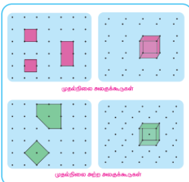
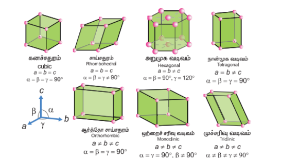
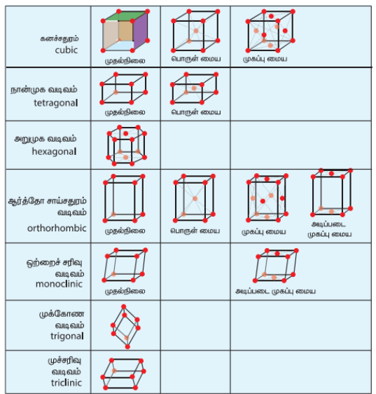
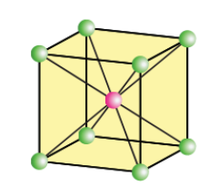

## 6.5 முதல்நிலை மற்றும் முதல்நிலை அற்ற அலகுக்கூடுகள் (primitive and non primitive unit cells) 

அலகுக்கூடுகளில் இரு வகைகள் உள்ளன. அவையாவன, முதல் நிலை எளிய அலகுக்கூடு மற்றும் முதல் நிலையற்ற அலகுக்கூடுகள். ஒரே ஒரு வகை அணிக்கோவை புள்ளியை மட்டும் கொண்டுள்ள அலகுக்கூடு முதல் நிலை அலகுக்கூடு எனப்படும். இவை ஒவ்வொரு முனையிலும் அணிக்கோவைப் புள்ளிகளைப் பெற்றுள்ளன. முதல் நிலையற்ற அலகுக்கூடுகளில் அலகுக்கூட்டினுள் அல்லது அலகுக்கூட்டின் முகப்பில் கூடுதலாக அணிக்கோவைப் புள்ளிகள் காணப்படுகின்றன. முதல் நிலை எளிய அலகுக்கூட்டில் ஏழு படிக அமைப்புகள் காணப்படுகின்றன. அவையாவன, கனச்சதுரம் (cubic), சாய்சதுரம் (Rhombohedral), அறுமுக வடிவம் (Hexagonal), நான்முக வடிவம் (Tetragonal), ஆர்த்தோசாய்சதுரம் (Orthorhombic), ஒற்றைச் சரிவு வடிவம் (Monoclinic), முச்சரிவு வடிவம் (Triclinic). இவ்வமைப்புகள் அவற்றின் படிக அச்சுகள் மற்றும் கோணங்களில் வேறுபடுகின்றன. மேற்கண்டுள்ள ஏழு அமைப்புகளுக்கு இணையாக பதினான்கு படிக அமைப்புகள் உருவாக வாய்ப்புள்ளன என பிராவே வரையறுத்தார். பிராவேயின் படிக அமைப்புகள் கீழ்கண்டுள்ள படத்தில் காட்டப்பட்டுள்ளன.

ஒரு படிகத்தினை, கணக்கற்ற பல அலகுக்கூடுகள் ஒவ்வொன்றும் மற்ற அருகாமைக் கூடுகளுடன் நேரடியாக இணைக்கப்பட்ட முப்பரிமான வெளியில் ஒரே மாதிரியான திசை அமைப்பை பெற்றுள்ள ஒரு அமைப்பாகக் கருதலாம். படிகத்தில் ஒரு குறிப்பிட்ட துகளைச் சூழ்ந்து காணப்படும் அருகாமை துகள்களின் எண்ணிக்கை அக்குறிப்பிட்ட துகளின் அணைவு எண் என அழைக்கப்படுகிறது. ஒரு அலகுக்கூடானது அதன் விளிம்பு நீளங்கள் அல்லது அணிக்கோவை மாறிலிகள் a, b மற்றும் c ஆகியனவற்றாலும் விளிம்பிடைக் கோணங்கள் \( \alpha \), \( \beta \) மற்றும் \( \gamma \) ஆகியனவற்றாலும் வரையறுக்கப்படுகிறது.

கனச்சதுர அலகுக்கூட்டில் காணப்படும் அணுக்களின் எண்ணிக்கையைக்  கணக்கிடுதல் 

முதல் நிலை எளிய அலகுக்கூடுகள்

படம் 6.2 பதினான்கு பிராவே அணிக்கோவை தளங்கள்

### 6.5.1 எளிய கனச்சதுர அலகுக்கூடு (SC)

எளிய கனச்சதுர அலகுக்கூட்டில், ஒவ்வொரு மூலையிலும் ஒத்த அணுக்கள், (அயனிகள் அல்லது மூலக்கூறுகள்) காணப்படுகின்றன. இந்த அணுக்கள் கனச் சதுரத்தின் விளிம்பின் வழியே ஒன்றையொன்று தொட்டுக் கொண்டிருக்கின்றன. மேலும் இவை கனச் சதுரத்தின் மூலைவிட்டத்தின் வழியே தொட்டுக் கொண்டிருப்பதில்லை. இவ்வமைப்பில் உள்ள ஒவ்வொரு அணுவின் அணைவு எண் 6.

கனச் சதுரத்தின் மூலையில் உள்ள ஒவ்வொரு அணுவும் அதன் அருகாமையில் அதனைச் சூழ்ந்துள்ள எட்டு அலகுக்கூறுகளால் பகிர்ந்துக் கொள்ளப்படுகின்றன. எனவே ஒரு அலகுக்கூட்டில் உள்ள அணுக்களின் எண்ணிக்கை  $\frac{N_c}{8}$ க்குச் சமம். இங்கு $N_c$  என்பது கன சதுர அலகூட்டின் மூலைகளில் காணப்படும் அணுக்களின் எண்ணிக்கை.

$\therefore$ ஒரு எளிய கனச் சதுர அலகுக்கூட்டில் காணப்படும் அணுக்களின் எண்ணிக்கை$$= \left( \frac{N_c}{8} \right)$$$$= \left( \frac{8}{8} \right) = 1$$

### 6.5.2 பொருள் மைய கனச் சதுர அலகுக்கூடு (BCC)

பொருள் மைய கனச்சதுர அலகுக்கூட்டில், எளிய கனச்சதுர அமைப்பில் உள்ளவாறு கனச் சதுரத்தின் ஒவ்வொரு மூலையிலும் ஒத்த அணுக்கள் காணப்படுவதுடன் கனச் சதுரத்தினுள் அதன் மையத்தில் மேலும் ஒரு அணு காணப்படுகின்றது. இவ்வமைப்பில் எளிய கனச்சதுர அமைப்பில் உள்ளவாறு கனச் சதுரத்தின் மூலைகளில் அமைந்துள்ள அணுக்கள் ஒன்றையொன்று தொட்டுக் கொண்டிருப்பதில்லை. எனினும் மூலையில் காணப்படும் அணுக்கள் அனைத்தும், பொருள் மையத்தில் காணப்படும் அணுவினைத் தொட்டுக் கொண்டுள்ளன. இவ்வமைப்பில் ஒரு அணுவைச் சுற்றி எட்டு அருகாமை அணுக்கள் காணப்படுகின்றன. எனவே அணைவு எண் 8.

கனச்சதுரத்தின் பொருள் மையத்தில் காணப்படும் அணுவானது மற்ற பிற அலகுக்கூடுகளால் பகிர்ந்துகொள்ளப்படுவதில்லை. எனவே அவ்வணு அது அமைந்துள்ள அலகுக்கூட்டிற்கு மட்டுமே உரியது.

$\therefore$ பொருள் மைய கனச்சதுர அலகுக்கூட்டில் காணப்படும் அணுக்களின் எண்ணிக்கை$$= \left( \frac{N_c}{8} \right) + \left( \frac{N_b}{1} \right)$$$$= \left( \frac{8}{8} + \frac{1}{1} \right)$$$$= (1 + 1)$$$$= 2$$

### 6.5.3 முகப்பு மைய கனச்சதுர அலகுக்கூடு (FCC)

முகப்புமைய கனச்சதுர அலகுக்கூட்டில் ஒத்த அணுக்கள் கனச்சதுரத்தின் ஒவ்வொரு மூலைகளிலும் காணப்படுவதுடன், அதன் முகப்பு மையங்களிலும் காணப்படுகின்றன. மூலைகளில் காணப்படும் அணுக்கள் முகப்பு மையத்தில் காணப்படும் அணுவைத் தொட்டுக் கொண்டுள்ளன ஆனால் அவை தங்களுக்குள் தொட்டுக் கொண்டிருப்பதில்லை. முகப்பு மையத்தில் காணப்படும் அணுவானது இரண்டு அலகுக்கூடுகளால் பகிர்ந்து கொள்ளப்படுகின்றது. எனவே முகப்பு மையத்தில் காணப்படும் ஒவ்வொரு அணுவும் $\left( \frac{1}{2} \right)$ பங்கினை ஒரு அலகுக்கூட்டிற்கு அளிக்கிறது.$\therefore$ முகப்புமைய கனச்சதுர அலகுக்கூட்டில் காணப்படும் அணுக்களின் எண்ணிக்கை$$= \left( \frac{N_c}{8} \right) + \left( \frac{N_f}{2} \right)$$$$= \left( \frac{8}{8} + \frac{6}{2} \right)$$$$= (1 + 3)$$$$= 4$$ஒரு படிக அலகுக்கூட்டினைத் தாளில் வரைவது என்பது எளிதானதல்ல. ஒரு அலகுக்கூட்டில் காணப்படும் உட்கூறுகள் ஒன்றையொன்று தொட்டுக்கொண்டிருக்கின்றன. மேலும் இவை ஒரு முப்பரிமாண அமைப்பினை உருவாக்குகின்றன. படிகத்தின் உட்கூறு துகள்களைச் சிறு வட்டங்களாகக் (கோளங்களாக spheres) குறிப்பிட்டு, அருகாமைத் துகள்களைச் சிறுகோட்டின் மூலம் இணைத்து படிக அமைப்பினைப் படத்தில் காட்டியுள்ளவாறு வரைவதன் மூலம் அலகு கூட்டினைத் தாளில் வரையும் செயல்முறையினை எளிதாக்கலாம்.

### 6.5.4 அலகுக்கூட்டு பரிமாணங்களின் அடிப்படையிலான கணக்கீடுகள்

படிகவடிவமைப்பினைத்தீர்மானிப்பதற்கு, X கதிர் விளிம்பு விளைவு ஆய்வு ஒரு சிறந்த முறையாகும். X-கதிர் விளிம்பு விளைவு ஆய்வு முடிவுகளின் அடிப்படையில் பின்வரும் சமன்பாட்டைப் பயன்படுத்தி அணுக்கள் அடங்கிய இரு அடுத்தடுத்த அணிக்கோவைத் தளங்களுக்கு இடைப்பட்ட தொலைவு (d) யைக் கணக்கிடலாம்.

\[
2d \sin \theta = n\lambda
\]

மேற்கண்டுள்ள சமன்பாடு பிராக் சமன்பாடு எனப்படும். இங்கு \( \lambda \) என்பது விளிம்பு விளைவிற்குப் பயன்படுத்தப்பட்ட X கதிரின் அலைநீளம், \( \theta \) என்பது விளிம்பு விளைவுக் கோணம் மற்றும் n என்பது எதிராளிப் படி ஆகும்.

\( \theta \), \( \lambda \) மற்றும் n மதிப்பு தெரிந்திருப்பின், d மதிப்பினை நாம் கண்டறிய இயலும்.

\[
d = \frac{n\lambda}{2\sin\theta}
\]

இம்மதிப்பானது அலகுக்கூட்டின் விளிம்பு நீளத்தைத் தருகிறது.

### 6.5.5 அடர்த்தியைக் கணக்கிடுதல்

ஒரு கனச்சதுர அலகுக்கூட்டினைக் கருத்திற்கொண்டு, அலகுக்கூட்டின் நீளத்தினைப் பயன்படுத்தி படிகத்தின் அடர்த்தியை (\( \rho \)) பின்வருமாறு கணக்கிடலாம்.

\[
\text{அலகுக்கூட்டின் அடர்த்தி} (\rho) = \frac{\text{அலகுக்கூட்டின் நிறை}}{\text{அலகுக்கூட்டின் கன அளவு}} \quad ...(1)
\]

\[
\text{அலகுக்கூட்டின் நிறை} = \text{ஒரு அலகுக்கூட்டிற்கு உரிய அணுக்களின் மொத்த எண்ணிக்கை} \times \text{ஒரு அணுவின் நிறை} \quad ...(2)
\]

\[
\text{ஒரு அணுவின் நிறை} = \frac{\text{மோலார் நிறை} (\mathrm{g\ mol^{-1}})}{\text{அவகாட்ரோ எண்} (\mathrm{mol^{-1}})} \quad ...(3)
\]

(3) ஐ (2) இல் பிரதியிட:

\[
\text{அலகுக்கூட்டின் நிறை} = \frac{n \times M}{N_A} \quad ...(4)
\]

ஒரு கனச்சதுர அலகுகூட்டிற்கு, அதன் அனைத்து விளிம்புநீளங்களும் சமம் அதாவது \( a = b = c \)

அலகுக்கூட்டின் கன அளவு \( = a \times a \times a = a^3 \) ...(5)

\[
\therefore \text{அலகுக்கூட்டின் அடர்த்தி} \rho = \frac{n M}{a^3 N_A} \quad ...(6)
\]

சமன்பாடு (6) ஆனது \( \rho \), n, M மற்றும் a ஆகிய நான்கு மாறிகளைக் கொண்டுள்ளது. இவைகளுள் ஏதேனும் மூன்றின் மதிப்புகள் தெரிந்திருப்பின் மற்றொன்றைக் கண்டறியலாம்.

#### எடுத்துக்காட்டு

பேரியம் பொருள் மைய கனச்சதுர அமைப்பை உடையது. மேலும் அதன் அலகுக்கூட்டின் ஒரு விளிம்பின் நீளம் 508 pm எனில் பேரியத்தின் அடர்த்தியை \( \mathrm{g\ cm^{-3}} \) இல் கண்டறிக.

#### தீர்வு:

\[
\rho = \frac{n M}{a^3 N_A}
\]

இன் நேர்வில், 

\( n = 2 \); \( M = 137.3 \ \mathrm{g\ mol^{-1}} \); \( a = 508 \ \mathrm{pm} = 5.08 \times 10^{-8} \ \mathrm{cm} \)

\[
\rho = \frac{2 atoms\times 137.3 \ \mathrm{g\ mol^{-1}}}{(5.08 \times 10^{-8} \ \mathrm{cm})^3 \times 6.023 \times 10^{23} \ \mathrm{mol^{-1}}}
\]

\[
\rho = \frac{2 \times 137.3}{(5.08)^3 \times 10^{-24} \times 6.023 \times 10^{23}} \ \mathrm{g\ cm^{-3}}
\]

\[
\rho = 3.5 \ \mathrm{g\ cm^{-3}}
\]

#### தன்மதிப்பீடு - 1

1. முகப்புமைய கனச்சதுர அலகுக்கூட்டினை பெற்றுள்ள ஒரு தனிமத்தின் அலகுக்கூட்டின் விளிம்பு நீளம் 352.4 pm. அதன் அடர்த்தி \( 8.9 \ \mathrm{g\ cm^{-3}} \) எனில் 100 g நிறையுடைய அத்தனிமத்தில் எத்தனை அணுக்கள் உள்ளன எனக் கண்டறிக.

2. CsCl ஆனது விளிம்பு நீளம் 412.1 pm உடைய பொருள் மைய கனச்சதுர அமைப்பில் படிகமாகிறது எனில் அதன் அடர்த்தியைக் கண்டறிக.

3. அணு நிறை 60 உடைய ஒரு தனிமத்தின் முகப்பு மைய கனச்சதுர அலகுக்கூட்டின் விளிம்பு நீளம் 4 Å எனில் அதன் அடர்த்தியைக் கண்டறிக.
