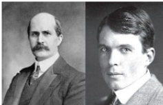

# திட நிலை 6

## சர் வில்லியம் ஹென்றி பிராக் (1862 - 1942) மற்றும் சர் லாரன்ஸ் பிராக் (1890 - 1971)

சர் வில்லியம் ஹென்றி பிராக், என்பார் இயற்பியல், வேதியியல் மற்றும் கணிதவியல் துறைகளில் நிபுணத்துவம் பெற்ற ஆங்கிலேய அறிஞர் ஆவார். இவரும் இவரது மகன் இலாரன்சும் X கதிர்கள் பற்றி ஆய்வுகளை மேற்கொண்டு X கதிர் நிறமாலைமானியைக் கண்டறிந்தார்கள். மேலும் படிகங்களின் வடிவமைப்புகளை X கதிர் விளிம்பு விளைவின் மூலம் கண்டறியும் நுட்பத்தினையும் உருவாக்கினார்கள். இக்கண்டுபிடிப்பிற்காக 1915 ஆம் ஆண்டிற்கான இயற்பியல் துறையின் நோபல் பரிசு இவர்களுக்கு வழங்கப்பட்டது. இவர்களுடைய பெயரால் பிளாட்டினம், பலேடியம், மற்றும் நிக்கல் ஆகியவைகளின் ஒரு வகை சல்பைடு தாதுவானது பிராக்கைட் தாது என அழைக்கப்படுகிறது.

## கற்றலின் நோக்கங்கள்

இப்பாடப்பகுதியை கற்றறிந்த பின்னர்,

* திடப்பொருட்களின் பொதுப்பண்புகளை விவரித்தல்,

* படிகவடிவமுடைய மற்றும் படிகவடிவமற்ற திடப்பொருட்களை வேறுபடுத்தி அறிதல்,

* அலகு கூட்டினை வரையறுத்தல்,

* வெற்றிடங்கள் மற்றும் நெருங்கிப் பொதிந்த அமைப்புகளை விவரித்தல்,

* வெவ்வேறு கனச்சதுர அலகு கூறுகளின் பொதிவுத்திறனைக் கணக்கிடல்,

* அலகுகூற பரிமாணங்கள் அடிப்படையிலான கணக்குகளைத் தீர்த்தல்,

* திடப்பொருட்களில் காணப்படும் புள்ளிக்குறைபாடுகளை விளக்குதல், ஆகிய திறன்களை மாணவர்கள் பெற இயலும்

## பாட அறிமுகம்

பருப்பொருட்கள் திட, திரவ, வாயு ஆகிய மூன்று நிலைமைகளில் காணப்படலாம். தாங்கள், தங்களைச் சுற்றி உற்று நோக்கினால் கண்ணுறக்கூடிய பெரும்பாலான பொருட்கள் திரவ மற்றும் வாயு நிலைமைகளைக் காட்டிலும் திட நிலைமையில் காணப்படுகின்றன என்பதனை அறிய முடியும். திடப்பொருட்களானவை வரையறுக்கப்பட்ட கன அளவு மற்றும் வடிவம் ஆகிய பண்புகளால், திரவ மற்றும் வாயு நிலைமைகளில் காணப்படும் பொருட்களிலிருந்து வேறுபடுகின்றன. திடப்பொருட்களில் அணுக்கள் அல்லது மூலக்கூறுகள் அல்லது அயனிகள் ஒரு ஒழுங்கான வடிவமைப்பில் இறுக்கமாக பிணைத்து வைக்கப்பட்டுள்ளன. மேலும், திடப்பொருட்களில் கடினமான, வைரம், உலோகங்கள், முதல் மென்மையான பலபடிகள் போன்று பல்வேறு வகைகள் காணப்படுகின்றன. நமது அன்றாட வாழ்வில் பயன்படுத்திவரும் பெரும்பாலான பொருட்கள் திடப் பொருட்களாக உள்ளன. வெவ்வேறு விதமான பண்புகளுடைய பல திடப் பொருட்கள் நமக்கு பல்வேறு பயன்பாடுகளுக்காக தேவைப்படுகின்றன. திடப்பொருட்களின் வடிவங்கள் மற்றும் அவைகளின் பண்புகளுக்கிடையேயான தொடர்பினைப் புரிந்துக் கொள்வதன் மூலம் வெவ்வேறு பண்புகளுடைய புதிய திடப் பொருட்களை நாம் உருவாக்கலாம்.

இப்பாட பகுதியில் திடப்பொருட்களின் பண்புகள், அவைகளை வகைப்படுத்துதல், அவற்றின் வடிவமைப்புகள் ஆகியனவற்றைக் கற்றறிவோம். மேலும் படிகக் குறைபாடுகள் மற்றும் அவற்றின் முக்கியத்துவத்தினையும் கற்றறிய உள்ளோம்.

