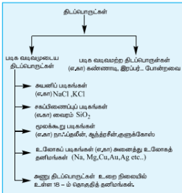

## 6.2 திடப்பொருட்களை வகைப்படுத்துதல்  Classification of solids: 

திடப்பொருட்களை அவைகளில் காணப்படும் உட்கூறுகளின் அமைப்பினை பொறுத்து பின்வரும் இரு பெரும் பிரிவுகளாகப் பிரிக்கலாம்.

(i) படிக வடிவமுடைய திடப்பொருட்கள்

(ii) படிக வடிவமற்ற திடப்பொருட்கள்

படிகம் (Crystal) என்ற வார்த்தையானது "Krystallos" என்ற கிரேக்க வார்த்தையிலிருந்து வருவிக்கப்பட்டதாகும். கிரேக்க மொழியில் இதன் பொருள் தெளிவான பனிக்கட்டி (Clear Ice) என்பதாகும். இவ்வார்த்தையானது முதன் முதலில் தெளிவான குவார்ட்ஸ் படிகங்களைக் குறிப்பிடப் பயன்படுத்தப்பட்டது. பின்னர் சீரான சமச்சீர்த் தன்மையுடைய முகப்புகளால் சூழப்பட்ட திடப்பொருட்களைக் குறிப்பிடப் பயன்படுத்தப்பட்டு வருகிறது.

திடப்பொருட்களின் உட்கூறுகள் (அணுக்கள், அயனிகள் அல்லது மூலக்கூறுகள்) நீண்ட எல்லை வரையில் ஒரு ஒழுங்கான கட்டமைப்பினைப் பெற்றிருக்குமாயின் அத்திடப்பொருட்கள் படிக வடிவமுடைய திடப்பொருட்கள் என அழைக்கப்படுகின்றன. படிகத்தின் நிலையாற்றலானது குறைந்தபட்ச மதிப்பினை பெற்றிருக்கும் வகையில் படிக வடிவமுடைய திடப்பொருட்களின் உட்கூறுகள் அமைக்கப்பட்டுள்ளன. மாறாக படிக வடிவமற்ற திடப் பொருட்களில், அவற்றின் உட்கூறுகள் அங்கும் இங்கும் ஒழுங்கின்றி அமைக்கப்பட்டுள்ளன (கிரேக்க மொழியில் amorphous என்பதற்கு no form எனப் பொருள்).

படிக வடிவமுடைய மற்றும் வடிவமற்ற திடப் பொருட்களுக்கிடையேயான வேறுபாடுகள் பின்வரும் பின்வரும் அட்டவணையில் கொடுக்கப்பட்டுள்ளது. 

### அட்டவணை 6.1 படிக மற்றும் படிக வடிவமற்ற திடப்பொருட்களுக்கு இடையேயான வேறுபாடுகள்

| வ.எண் | படிக வடிவமுடைய திடப் பொருள் | படிக வடிவமற்ற திடப் பொருள் |
|---|---|---|
| 1 | இதன் உட்கூறுகள் நீண்ட எல்லை வரையில் ஒழுங்காகக் கட்டமைக்கப்பட்டுள்ளன. | ஒழுங்குத் தன்மையின் எல்லை குறைவு. இதன் உட்கூறுகள் அங்கும் இங்கும் ஒழுங்கின்றி அமைந்துள்ளன. |
| 2 | குறிப்பிட்ட வடிவமுடையது | ஒழுங்கற்ற வடிவமுடையது |
| 3 | படிக வடிவமுடைய திடப் பொருட்கள் பொதுவாக திசையாய்ப்பு (anisotropic) பண்பற்றவை. | இவை திரவங்களைப் போன்று திசைவாய்ப்புப் பண்பு (isotropic) உடையவை. |
| 4 | இவை உண்மையான திடப்பொருட்களாகக் கருதப்படுகின்றன. | இவை போலி திடப்பொருட்கள் அல்லது அதிக குளிர்விக்கப்பட்ட திரவங்களாகக் கருதப்படுகின்றன. |
| 5 | வரையறுக்கப்பட்ட உருகுதல் வெப்ப மதிப்பினைப் பெற்றுள்ளன. | இவை வரையறுக்கப்பட்ட உருகுதல் வெப்பமதிப்பினைப் பெற்றிருப்பதில்லை. |
| 6 | இவை துல்லியமான உருகுநிலையைப் பெற்றுள்ளன. | வெப்பநிலை அதிகரிக்கும் போது இவை சீராக, மென்மையாக மாறும் இயல்புடையவை. எனவே இப்பொருட்களை எவ்வடிவமாகவும் வார்க்க இயலும். |
| 7 | எடுத்துக்காட்டு: NaCl, வைரம் போன்றவை | எடுத்துக்காட்டு: இரப்பர், கண்ணாடி போன்றவை |

### திசையொப்பு பண்பு (isotropy)

திசையொப்பு பண்பு என்பதன் பொருள் அனைத்து திசைகளிலும் சமமான பண்பினை பெற்றுள்ளத் தன்மை என்பதாகும். ஒரு திடப்பொருளின், ஒளிவிலக்க எண், மின்கடத்துதிறன் போன்ற இயற்பண்புகளின் மதிப்புகள் அளந்தறியும் திசையினைப் பொருத்து அமையாமல் அனைத்து திசைகளிலும் ஒரே மதிப்பினைப் பெற்றிருந்தால், அத்தன்மை திசையொப்பு பண்பு எனப்படும். மாறாக, ஒரு இயற்பண்பானது, அது அளந்தறியப்படும் திசையினைப் பொறுத்து அமையுமாயின் அத்தன்மை திசையொப்பு பண்பற்றத் தன்மை (anisotropy) எனப்படும். படிக வடிவமுடைய திடப்பொருட்கள் திசையொப்பு பண்பற்றத் தன்மையை பெற்றுள்ளன. மேலும் இப்பொருட்களில், இயற்பண்புகளை வெவ்வேறு திசைகளில் அளந்தறியும் போது, வெவ்வேறு மதிப்புகள் பெறப்படுகின்றன.

படிகங்களில், அதன் உட்கூறுகள், வெவ்வேறு திசைகளில், வெவ்வேறு விதமான அமைப்பில் அமைந்துள்ளதால் படிகங்கள் திசையொப்பு பண்பற்ற தன்மையைப் பெற்றுள்ளன. இதனைப் பின்வரும் விளக்கப் படத்திலிருந்து அறிந்து கொள்ளலாம்.

படிகங்களின் திசைவாய்ப்பு பண்பற்றத் தன்மை படிகவடிவற்ற திண்மங்களின் திசைவாய்ப்பு பண்பு

