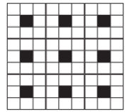
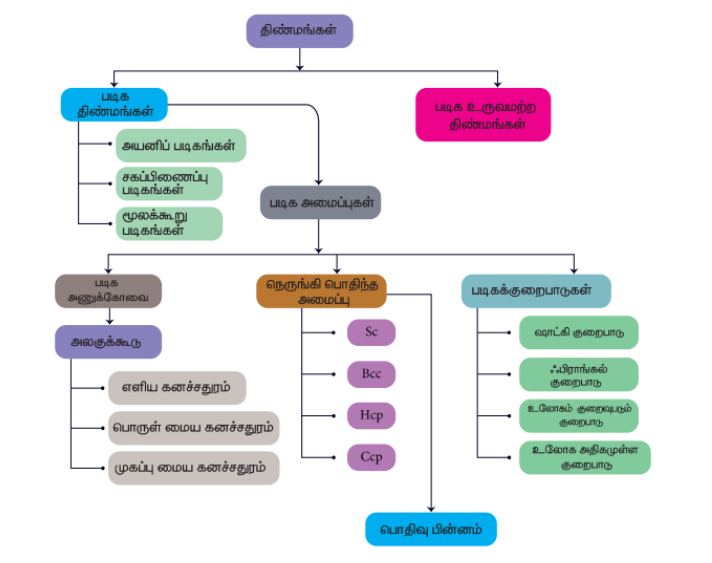

## மதிப்பிடுதல்

### சரியான விடையைத் தேர்ந்தெடுத்து எழுதுக.

1. கிராபைட் மற்றும் வைரம் ஆகியன முறையே

   அ) சகப்பிணைப்பு மற்றும் மூலக்கூறு படிகங்கள்

   ஆ) அயனி மற்றும் சகப்பிணைப்பு படிகங்கள்

   இ) இரண்டும் சகப்பிணைப்பு படிகங்கள்

   ஈ) இரண்டும் மூலக்கூறு படிகங்கள்

2. \( A_xB_y \) அயனிப்படிகம் fcc அமைப்பில் படிகமாகிறது. B அயனிகள் ஒவ்வொரு முகப்பின் மையத்திலும் A அயனியானது கனசதுரத்தின் மூலையிலும் அமைந்துள்ளது எனில், \( A_xB_y \) என்பதன் வாய்ப்பாடு

   அ) AB

   ஆ) \( AB_3 \)

  இ) $A_3B$

  ஈ) $A_8B_6$

3. கனசதுர நெருங்கிப் பொதிந்த அமைப்பில், நெருங்கிப் பொதிந்த அணுக்களுக்கும், நான்முகித் துளைகளுக்கும் இடையேயான விகிதம்

   அ) 1:1

   ஆ) 1:2

   இ) 2:1

   ஈ) 1:4

4. திண்ம \( CO_2 \) பின்வருவனவற்றுள் எதற்கான ஒரு எடுத்துக்காட்டு

   அ) சகப்பிணைப்பு திண்மம்

   ஆ) உலோகத் திண்மம்

   இ) மூலக்கூறு திண்மம்

   ஈ) அயனி திண்மம்

5. கூற்று: மோனோ கிளினிக் கந்தகம் என்பது மோனோ கிளினிக் படிக வகைக்கு ஒரு உதாரணம்.
   காரணம்: மோனோ கிளினிக் படிக அமைப்பிற்கு, \( a \neq b \neq c \) மேலும் \( \alpha = \gamma = 90^\circ \), \( \beta \neq 90^\circ \)

   அ) கூற்று மற்றும் காரணம் இரண்டும் சரி, மேலும் காரணமானது கூற்றிற்கு சரியான விளக்கமாகும்.

   ஆ) கூற்று மற்றும் காரணம் இரண்டும் சரி, ஆனால் காரணமானது கூற்றிற்கு சரியான விளக்கமல்ல.

   இ) கூற்று சரி ஆனால் காரணம் தவறு.

   ஈ) கூற்று மற்றும் காரணம் இரண்டும் தவறு.

6. ஃபுளூரைட் வடிவமைப்பைப் பெற்றுள்ள கால்சியம் ஃபுளூரைடில் காணப்படும் \( Ca^{2+} \) மற்றும் \( F^- \) அயனிகளின் அணைவு எண்கள் முறையே

   அ) 4 மற்றும் 2

   ஆ) 6 மற்றும் 6

   இ) 8 மற்றும் 4

   ஈ) 4 மற்றும் 8

7. அணு நிறை 40 உடைய 8g அளவுடைய X என்ற தனிமத்தின் அலகுக்கூடுகளின் எண்ணிக்கையினைக் கண்டறிக. இத்தனிமம் bcc வடிவமைப்பில் படிகமாகிறது.

   அ) \( 6.023 \times 10^{23} \)

   ஆ) \( 6.023 \times 10^{22} \)

   இ) \( 60.23 \times 10^{23} \)

   ஈ) \( \frac{6.023 \times 10^{23}}{8 \times 40} \)

8. ஒரு திண்மத்தின், M என்ற அணுக்கள் ccp அணிக்கோவைப் புள்ளிகளில் இடம் பெறுகின்றன. மேலும் \( \left( \frac{1}{3} \right) \) பங்கு நான்முகி வெற்றிடங்கள் N என்ற அணுவால் நிரப்பப்பட்டுள்ளது. M மற்றும் N ஆகிய அணுக்களால் உருவாகும் திண்மம்

   அ) MN

   ஆ) \( M_3N \)

   இ) \( MN_3 \)

   ஈ) \( M_3N_2 \)

9. \( A^+ \) மற்றும் \( B^- \) ஆகியனவற்றின் அயனி ஆர மதிப்புகள் முறையே \( 0.98 \times 10^{-10} \) m மற்றும் \( 1.81 \times 10^{-10} \) m ஆகும். \( AB^+ \) உள்ள ஒவ்வொரு அயனியின் அணைவு எண்

   அ) 8

   ஆ) 2

   இ) 6

   ஈ) 4

10. CsCl ஆனது bcc வடிவமைப்பினை உடையது. அதன் அலகு கூட்டின் விளிம்பு நீளம் 400 pm, அணுக்களுக்கு இடையேயான தொலைவு

    அ) 400 pm

    ஆ) 800 pm

    இ) \( \sqrt{3} \times 100 \) pm

    ஈ) \( \left( \frac{\sqrt{3}}{2} \right) \times 400 \) pm

11. XY என்ற திண்மம் NaCl வடிவமைப்பினை உடையது. நேரயனியின் ஆர மதிப்பு 100 pm எனில், எதிர் அயனியின் ஆர மதிப்பு

    அ) \( \left( \frac{100}{0.414} \right) \)

    ஆ) \( \left( \frac{0.732}{100} \right) \)
    
    இ) \( 100 \times 0.414 \)

    ஈ) \( \left( \frac{0.414}{100} \right) \)

12. bcc அலகு கூட்டில் காணப்படும் வெற்றிடத்தின் சதவீதம்

    அ) 48%

    ஆ) 23%

    இ) 32%

    ஈ) 26%

13. ஒரு அணுவின் ஆர மதிப்பு 300 pm அது முகப்புமைய கனச்சதுர அமைப்பில் படிகமானால், அலகு கூட்டின் விளிம்பு நீளம்

    அ) 488.5 pm

    ஆ) 848.5 pm

    இ) 884.5 pm

    ஈ) 484.5 pm

14. எளிய கனசதுர அமைப்பில் மொத்த கனஅளவில் அணுக்களால் அடைத்துக் கொள்ளப்படும் கனஅளவின் விகிதம்

    அ) \( \left( \frac{\pi}{4\sqrt{2}} \right) \)

    ஆ) \( \left( \frac{\pi}{6} \right) \)

    இ) \( \left( \frac{\pi}{4} \right) \)

    ஈ) \( \left( \frac{\pi}{3\sqrt{2}} \right) \)

15. NaCl படிகத்தின் மஞ்சள் நிறத்திற்கு காரணம்

    அ) F மையத்தில் உள்ள எலக்ட்ரான்கள் கிளர்வுறுதல்
    
    ஆ) புறப்பரப்பில் உள்ள \( Cl^- \) அயனிகளால் ஒளி எதிரொளிக்கப்படுதல்

    இ) \( Na^+ \) அயனிகளால் ஒளி விலகலடைதல்

    ஈ) மேற்கண்டுள்ள அனைத்தும்

16. SC, bcc மற்றும் fcc ஆகிய கனச்சதுர அமைப்புகளின் விளிம்பு நீளத்தினை 'a' எனக் குறிப்பிட்டால், அவ்வமைப்புகளில் காணப்படும் கோளங்களின் ஆரங்களின் விகிதங்கள் முறையே

    அ) \( \left( \frac{1}{2}a : \frac{\sqrt{3}}{2}a : \frac{\sqrt{2}}{2}a \right) \)

    ஆ) \( \left( \sqrt{1}a : \sqrt{3}a : \sqrt{2}a \right) \)

    இ) \( \left( \frac{1}{2}a : \frac{\sqrt{3}}{4}a : \frac{1}{2\sqrt{2}}a \right) \)

    ஈ) \( \left( \frac{1}{2}a : \sqrt{3}a : \frac{1}{\sqrt{2}}a \right) \)

17. ஒரு கனச்சதுரத்தின் விளிம்பு நீளம் ‘a’ எனில் பொருள் மைய கனச்சதுர அமைப்பின் மையத்தில் உள்ள அணுவிற்கும், கனச்சதுரத்தின் ஏதேனும் ஒரு மூலையில் உள்ள ஒரு அணுவிற்கும் இடையேயான தொலைவு

    அ) \( \left( \frac{2}{\sqrt{3}} \right)a \)

    ஆ) \( \left( \frac{4}{\sqrt{3}} \right)a \)

    இ) \( \left( \frac{\sqrt{3}}{4} \right)a \)

    ஈ) \( \left( \frac{\sqrt{3}}{2} \right)a \)

18. பொட்டாசியம் (அணு எடை 39 g mol\(^{-1}\)) bcc வடிவமைப்பை பெற்றுள்ளது. இதில் நெருங்கி அமைந்துள்ள இரு அடுத்தடுத்த அணுக்களுக்கிடையேயான தொலைவு 4.52 Å ஆக உள்ளது. அதன் அடர்த்தி

    அ) 915 kg m\(^{-3}\)

    ஆ) 2142 kg m\(^{-3}\)

    இ) 452 kg m\(^{-3}\)

    ஈ) 390 kg m\(^{-3}\)

19. ஒரு படிகத்தில் ஷாட்கி குறைபாடு பின்வரும் நிலையில் உணரப்படுகிறது.

    அ) சமமற்ற எண்ணிக்கையில் நேர் மற்றும் எதிர் அயனிகள் அணிக்கோவையில் இடம் பெறாதிருத்தல்

    ஆ) சமமான எண்ணிக்கையில் நேர் மற்றும் எதிர் அயனிகள் அணிக்கோவையில் இடம் பெறாதிருத்தல்

    இ) ஒரு அயனி அதன் வழக்கமான இடத்தில் இடம் பெறாமல் அணிக்கோவை இடைவெளியில் இடம் பெறுதல்

    ஈ) படிக அணிக்கோவையில் எந்த ஒரு அயனியும் இடம் பெறாத நிலை இல்லாதிருத்தல்

20. ஒரு படிகத்தின் நேர் அயனி அதன் வழக்கமான இடத்தில் இடம் பெறாமல், படிக அணிக்கோவை இடைவெளியில் இடம் பெற்றிருப்பின், அப்படிக குறைபாடு இவ்வாறு அழைக்கப்படுகிறது.

    அ) ஷாட்கி குறைபாடு

    ஆ) F-மையம்

    இ) பிராங்கல் குறைபாடு

    ஈ) வேதி வினைக்கூறு விகிதமற்ற குறைபாடு

21. கூற்று: பிராங்கல் குறைபாட்டின் காரணமாக, படிக திண்மத்தின் அடர்த்தி குறைகிறது.

    காரணம்: பிராங்கல் குறைபாட்டில் நேர் மற்றும் எதிர் அயனிகள் படிகத்தை விட்டு வெளியேறுகின்றன.

    அ) கூற்று மற்றும் காரணம் இரண்டும் சரி, மேலும் காரணமானது கூற்றிற்கு சரியான விளக்கமாகும்.

    ஆ) கூற்று மற்றும் காரணம் இரண்டும் சரி, ஆனால் காரணமானது கூற்றிற்கு சரியான விளக்கமல்ல

    இ) கூற்று சரி ஆனால் காரணம் தவறு

    ஈ) கூற்று மற்றும் காரணம் இரண்டும் தவறு.

22. உலோக குறையுள்ள குறைபாடு காணப்படும் படிகம்

    அ) NaCl

    ஆ) FeO

    இ) ZnO

    ஈ) KCl

23. X மற்றும் Y ஆகிய இரு வேறு அணுக்களைக் கொண்ட ஒரு இரு பரிமாண படிகத்தின் அமைப்பு கீழே தரப்பட்டுள்ளது. கருப்பு நிற சதுரம் மற்றும் வெண்மை நிற சதுரம் ஆகியன முறையே X மற்றும் Y அணுக்களைக் குறித்தால், இந்த அலகு கூட்டு அமைப்பின் அடிப்படையில், அச்சேர்மத்தின் எளிய வாய்ப்பாடு.

    

    அ) \( XY_8 \)

    ஆ) \( XY_2 \)
    
    இ) \( XY_4 \)

    ஈ) \( X_2Y \)

### பின்வரும் வினாக்களுக்கு விடையளி

1. அலகுக் கூட்டினை வரையறு.

2. அயனிப்படிகங்களின் ஏதேனும் மூன்று பண்புகளைக் கூறுக.

3. படிக திண்மங்களை படிக வடிவமற்ற திண்மங்களிலிருந்து வேறுபடுத்துக.

4. பின்வரும் திண்மங்களை வகைப்படுத்துக.
   அ) \( P_4 \)
   ஆ) பித்தளை
   இ) வைரம்
   ஈ) NaCl
   உ) அயோடின்

5. ஏழு வகையான அலகுக் கூடுகளை சுருக்கமாக விளக்குக.

6. அறுங்கோண நெருங்கிப் பொதிந்த அமைப்பினை கனச்சதுர நெருங்கிப் பொதிந்த அமைப்பிலிருந்து வேறுபடுத்துக.

7. எண்முகி மற்றும் நான்முகி வெற்றிடங்களை வேறுபடுத்துக.

8. புள்ளி குறைபாடுகள் என்றால் என்ன?

9. ஷாட்கி குறைபாடுகளை விளக்குக.

10. உலோகம் அதிகமுள்ள குறைபாடு மற்றும் உலோகம் குறைவுபடும் குறைபாடுகளை எடுத்துக்காட்டுடன் விளக்குக.

11. Fcc அலகுக்கூட்டில் காணப்படும் அணுக்களின் எண்ணிக்கையினைக் கணக்கிடுக.

12. AAAA, ABAB மற்றும் ABC ABC வகை முப்பரிமாண நெருங்கிப் பொதிந்த அமைப்புகளை தகுந்த படத்துடன் விளக்குக.

13. அயனிப்படிகங்கள் ஏன் கடினமாகவும், உடையும் தன்மையினையும் பெற்றுள்ளன?

14. பொருள் மைய கனச்சதுர அமைப்பில் பொதிவுத்திறன் சதவீதத்தினைக் கணக்கிடுக.

15. சதுர நெருங்கிப் பொதிந்த இரு பரிமாண அடுக்கில் ஒரு மூலக்கூறின் அணைவு எண் என்ன?

16. அணைவு எண் என்றால் என்ன? bcc அமைப்பில் உள்ள ஒரு அணுவின் அணைவு எண் யாது?

17. ஒரு தனிமம் bcc அமைப்பினை பெற்றுள்ளது. அதன் அலகு கூட்டின் விளிம்பு நீளம் 288 pm, அத்தனிமத்தின் அடர்த்தி \( 7.2 \ \mathrm{g\ cm^{-3}} \) எனில் 208 g தனிமத்தில் காணப்படும் அணுக்களின் எண்ணிக்கை யாது?

18. அலுமினியமானது கனச்சதுர நெருங்கிப் பொதிந்த அமைப்பில் படிகமாகிறது. அதன் உலோக ஆரம் 125 pm அலகுக்கூட்டின் விளிம்பு நீளத்தைக் கணக்கிடுக.

19. \( 10^{-2} \) mol சதவீதத்தில் ஸ்ட்ரான்சியம் குளோரைடானது NaCl படிகத்தில் மாசாக சேர்க்கப்படுகிறது. நேரயனி வெற்றிடத்தின் செறிவினைக் கண்டறிக.

20. KF ஆனது சோடியம் குளோரைடைப் போன்று fcc அமைப்பில் படிகமாகிறது. KF இன் அடர்த்தி \( 2.48 \ \mathrm{g\ cm^{-3}} \) எனில், KF-இல் உள்ள \( K^+ \) மற்றும் \( F^- \) அயனிகளுக்கிடையேயான தொலைவினைக் கண்டறிக.

21. ஒரு அணு fcc அமைப்பில் படிகமாகிறது. மேலும் அதன் அடர்த்தி \( 10 \ \mathrm{g\ cm^{-3}} \) மற்றும் அதன் அலகுக்கூட்டின் விளிம்பு நீளம் 100 pm. 1 g படிகத்தில் உள்ள அணுக்களின் எண்ணிக்கையினைக் கண்டறிக.

22. X மற்றும் Y ஆகிய அணுக்கள் bcc படிக அமைப்பினை உருவாக்குகின்றன. கனச்சதுரத்தின் மூலையில் X அணுக்களும் அதன் மையத்தில் Y அணுவும் இடம் பெறுகிறது. அச்சேர்மத்தின் வாய்ப்பாடு என்ன?

23. அலகு கூட்டின் விளிம்பு நீளம் \( 4.3 \times 10^{-8} \) cm ஆக உள்ள bcc வடிவமைப்பில் சோடியம் படிகமாகிறது. சோடியம் அணுவின் அணு ஆர மதிப்பினைக் கண்டறிக.

24. பிராங்கல் குறைபாடு பற்றி குறிப்பு வரைக.

