# மேற்பரப்பு வேதியியல் 10

## இர்விங் லாங்மியேர்

## கற்றலின் நோக்கங்கள் :

இர்விங் லாங்மியேர் என்பவர் அமெரிக்க நாட்டைச் சேர்ந்த ஒரு வேதியியல் மற்றும் இயற்பியல் அறிஞர் ஆவார். அவர் புறப்பப்பு வேதியியலில் அவர் ஆற்றிய பங்கிற்காக வேதியியலுக்கான நோபல் பரிசினை 1932 ஆம் ஆண்டு பெற்றார். அவர் அனு அமைப்பின் ஒரு மைய வட்டக் கொள்கையினை அளித்தார். உலோகங்களில் பற்ற வைத்தலில் ஹைட்ரஜனின் பயன் மற்றும் வாயு நிரப்பப்பட்ட ஒளி விளக்குகளை அவர் கண்டறிந்தார். நியூமெக்சிகோவில் செகோரோவிற்கு அருகில் அமைந்துள்ள ஆராய்ச்சி நிறுவனம் அவரைப் பெருமைபடுத்தும் வண்ணம் அவர் பெயரால் அழைக்கப்படுகிறது. லாங்கமயர் மற்றும் டாங்கல் அவர்களால் கண்டறியப்பட்ட பிளாஸ்மாவிலிருக்கும் எலக்ட்ரான் அடர்வு அலைகள் லாங்கமயர் அலைகள் என அறியப்படுகின்றன.

இந்த பாடப்பகுதியை கற்றறிந்த பின்னர் ,

* பரப்புகவர்தலை வகைப்பருத்துதல்,

* உறிஞ்சுதல் மற்றும் பரப்புகவர்தல்

ஆகியவற்றை வேறுபடுத்துதல்,

* ஃபிரண்ப்லிச் பரப்புகவர்தல்

சமவப்பக்கோருகளை விளக்குதல்,

* வினைவேக மாற்றம் மற்றும் வினைவேக மாற்றிகளின் சிறப்பியல்புகள் பற்றி புரிந்து கொள்ளுதல்,

* வினைவேக மாற்ற கொள்கைகள் மற்றும் நொதி வினைவேகமாற்றம் ஆகியவற்றை விளக்குதல்.

* கூழமங்களை வகைப்பருத்துதல்,

* கூழமங்களின் தயாரிப்பு முறைகள் மற்றும் கூழமங்களின் தூய்மையாக்கல் முறைகளை விளக்குதல்.

* கூழமக் கரைசலின் பண்புகளை விவாதித்தல்.

* நம் அன்றாட வாழ்வில் கூழமங்கள் மற்றும் பால்மங்களின் பங்களிப்பை விளக்குதல். ஆகிய திறன்களை மாணவர்கள் பெறுவர்.

## பாட அறிமுகம்

புறப்பரப்பு வேதியியல் என்பது இரண்டு வெவ்வேறு நிலைமைகளின் இடைப்பரப்பில் நிகழும் செயல்முறைகளைப் பற்றி விவரிக்கும் வேதியியலின் ஒரு பிரிவாகும். எடுத்துக்காட்டாக, திண்மம் மற்றும் நீர்மம், திண்மம் மற்றும் வாயு, நீர்மம் மற்றும் நீர்மம். நம் அன்றாட வாழ்விற்கும், பெயிண்டுக்கள் முதல் மருந்துகள் வரை பல்வேறு பொருட்களை தயாரிக்கும் நிறுவனங்களுக்கும், உயிர்தொழில் நுட்பவியல் துறைக்கும், இந்த பாடப் பகுதி அதிமுக்கியமானது. பலபடித்தானவினைவேக மாற்றம், கூழ்மங்களை தயாரித்தல் மற்றும் நிலைப்படுத்துதல், மின்முறை வினைகள் ஆகியவற்றில் புறப்பரபானது முக்கிய பங்காற்றுகிறது. திண்மங்களின் புறப்பரபானது, அதன் திரள் பகுதியிலிருந்து இயல்பாகவே வேறுபட்டதாக உள்ளது.புறப்பரப்பிலுள்ள அணுக்களுக்கிடையேயான பினைப்புகள், திரள் பகுதியிலுள்ளவற்றிலிருந்து வேறுபட்டது.விண்வெளியிலுள்ள ஹைட்ரஜன் முழுவதும் தூசி மற்றும் பாறைத் துகள்களின் புறப்பரப்பில் பரப்பு கவரப்பட்ட உருவானவையே ஆகும். கொசுக்கள் மற்றும் சிறிய பூச்சிகள் நீரின் மீது நடையியல் முடியும் ஆனால் அருகில் சோபுகளை சேர்க்கும்போது இந்த பூச்சிகள் நீரில் மூழ்கிவிருகின்றன. நீர் மற்றும் பாதரச துளிகளின் கோள வடிவம் நம்மை ஆச்சரியமூடுகின்றன.நீர் ஒட்டாத வண்ணத்துபூச்சியின் இறக்கைகளும், தாவர இலைகளும் நம்மை வியப்பில் ஆழ்த்தக்கூடியவை. வானத்தின் நீல நிறம் மற்றும் சூரிய அஸ்தமனத்தின் சிவப்பு நிறம் ஆகியனவும் நம்மை வெகுவாக கவரக்கூடியவைகளாக உள்ளன. இவை அனைத்திலும் பொருளின் புறப்பரப்பு முக்கிய பங்குவகிக்கிறது.பல்வேறு கிரீங்கள், களிம்புகள் மற்றும் அழகு சாதனப் பொருட்கள் ஆகியவை பால்மங்களாக உள்ளன.உணவுப் பொருள் தயாரிக்கும் நிறுவனங்கள், ஆரோக்கியமான, குவையிக்க மற்றும் நீண்டநாள் கெட்புபோகாத உணவுப் பொருட்களை தயாரிப்பதில் முனைப்பு காட்டுகின்றன.இவை அனைத்தும் கூழ்மங்கள் மற்றும் புறப்பரப்பு வேதியியல் கொள்கைகளை அடிப்படையாகக் கொண்டவை. எனவே, புறப்பரப்பு வேதியலானது கற்பதற்கு ஆர்வமூடும் பாடப்பகுதியாகும்.

## 10.1 பரப்பு கவர்தல் மற்றும் உறிஞ்சுதல்

திண்ம பரப்பில் உள்ள பிணைக்கப்படாத இணைதிறன் அல்லது எச்ச விணசகளின் காரணமாக திண்ம புறப்பரப்பானது அதன் அருகாமையிலுள்ள பொருட்களை கவர்ந்திழுக்கும் திறணைப் பெற்றுள்ளன.எடுத்துக்காட்டாக,

அம்மோனியாவை கரி பரப்பு கவர்தல், நீர் மூலக்கூறுகளை சிலிக்காளெல் பரப்புகவர்தல், சர்க்கரையிலுள்ள நிறமிகளை கரி பரப்பு கவர்தல்.

பரப்பு கவர்தல் என்பது ஒரு புறப்பரப்பு நிகழ்வு தான் என்பதை இந்த எடுத்துக்காட்டுகள் காட்டுகின்றன. பரப்பு கவர்தலுக்கு மாறாக, உறிஞ்சுதல் என்பது ஒரு திரள் நிகழ்வாகும்.அதாவது, பரப்புகவர் பொருள் மூலக்கூறுகள் பரப்பு பொருளின் திரள் முழுவதும் விரவியுள்ளது.

* எந்த பொருளின் மீது பரப்பு கவர்தல் நிகழ்கிறதோ அது பரப்புப் பொருள் ஆகும்.

* பரப்புகவரப்பட்ட பொருளானது பரப்புகவர் பொருள் எனவும் அழைக்கப்படுகின்றன.

* இரண்டு நிலைமைகளை பிரிக்கும் இடைபரப்பானது இடைப்பட்ட நிலைமை என அறியப்படுகிறது. மூலக்கூறுகள் பரப்பு கவரப்படுவதால், இடைமுகப்பில் மூலக்கூறுகளின் செறிவு அதிகரித்து காணப்படுகிறது.

* இடைமுகப்பில் பொருளின் செறிவு அதிகமாக காணப்படின் அது நேர்மறை பரப்பு கவர்தல் எனவும், மூலக்கூறுகளின் செறிவு குறைவாக காணப்படின் அது எதிர்மறை பரப்பு கவர்தல் என்றமழக்கப்படுகிறது.

* பரப்புகவரப்பட்ட பொருளானது புறப்பரப்பிலிருந்து நீக்கமடையச் செய்யும் செயல்முறையானது "பரப்பு நீக்கம்" என்றமைக்கப்படுகிறது.

* He, Ne, \( O_2 \), \( N_2 \), \( SO_2 \) மற்றும் \( NH_3 \) போன்ற வாயுக்களும், NaCl அல்லது KCl ஆகியவற்றின் கரைசல்களும் தகுந்த பரப்பு பொருட்களால் பரப்புகவரப்படுகின்றன.இந்தமூலக்கூறுகள் பரப்புகவர் பொருட்கள் என குறிப்பிடப்படுகின்றன.

* சிலிக்கா ஜல், Ni, Cu, Pt, Ag மற்றும் Pd போன்ற உலோகங்களும் மற்றும் சில கூழ்மங்களும் பரப்பு பொருட்களாக செயல்பட முடியும்.

### பரப்பு கவர்தனின் சிறப்பியல்புகள்:

1. பரப்பு கவர்தல் அனைத்து வகை இடைப்பரப்புகளிலும் நிகழ முடியும். அதாவது, வாயு-திண்மம், நீர்மம்- திண்மம், நீர்மம்-நீர்மம், திண்மம்- திண்மம் மற்றும் வாயு-நீர்மம் என எல்லா வகை இடைபரப்புகளுக்கிடையேயும் பரப்பு கவர்தல் நிகழ்கிறது.

2. பரப்பு கவர்தல் ஒரு தன்னிச்சையான செயல்முறையாகும், மேலும் இது எப்பொழுதும் கட்டினா ஆற்றல் குறையும் வகையில் நிகழ்கிறது. \( \Delta G \) மதிப்பு பூஜ்ஜியமாகும் போது, சமநிலை எப்பெபுகிறது. நாமறிந்தபடி, \( \Delta G = \Delta H - T \Delta S \) இங்கு \( \Delta G \) என்பது கட்டினா ஆற்றலில் ஏற்படும் மாற்றம், \( \Delta H \) என்பது என்தால்பி மாற்றம், மற்றும் \( \Delta S \) என்பது என்படோரி மாற்றம்.

3. மூலக்கூறுகள் பரப்புகவரப்பட்டுள்ள போது, மூலக்கூறுகளின் ஒழுங்கற்ற தன்மை எப்பொழுதும் குறைகிறது.அதாவது, \( \Delta S < 0 \) மற்றும் \( T \Delta S \) எதிர்குறி மதிப்பை பெறுகிறது, எனவே,பரப்பு கவர்த்தெரு வெப்பம் உமிழ் செயல்முறையாகும். பரப்பு கவர்தல் மிக விரைவான செயல்முறையாகும். ஆனால், உட்கவர்தல் மெதுவாக நிகழும் செயல்முறையாகும்.

M.C. ெபயின் என்பவர் ஒரே நேரத்தில் ஒன்றாக நிகழும் பரப்பு கவர்தல் மற்றும் உட்கவர்தலை குறிப்பிடுவதற்காக 'sorption' (கவர்தல்) என்ற சொல்லை பயன்படுத்தினார். உலோகப்பரப்புகளினில் நிகழும் வாயுக்களின் பரப்பு கவர்தல் மற்றும் உறிஞ்சதலை குறிப்பிட T. கிரஹாம் என்பவர் occlusion (மறைத்தல்) என்ற சொல்லை பயன்படுத்தினார்.

### 10.1.1 பரப்பு கவர்தனின் வகைகள்:

பரப்புப் பொருளுக்கும், பரப்புகவரப்படும் பொருளுக்கும் இடையே செயல்படும் விசைகளின் தன்மையைப் பொருத்து பரப்பு கவர்தலானது, இயற்புறப்படும் கவர்தல் மற்றும் வேதிப்புறப்படும் கவர்தல் என வகைப்படுத்தப்படுகிறது. வேதிப்புறப்படும் கவர்தலில், வாயுவலக்கூறுகள் புறப்படப்படன் வேதிப்பினைப்புகளை உருவாக்குவதன் மூலம் இறுத்தி வைக்கப்பட்டுள்ளன. வலுவான பினைப்பு உருவாவதால், பரப்பு கவர்தலின் போது ஏறத்தாழ \( 400 \ \mathrm{kJ/mol} \) ஆற்றல் வெப்பமாக உமிழ்ப்படுகிறது. எடுத்துக்காட்டுகள்:

* பங்ஸ்டனின் புறப்பரப்பின் மீது \( O_2 \) வாயு பரப்பு கவரப்பருத்த, நிக்கல் புறப்பரப்பின் மீது \( H_2 \) வாயு பரப்பு கவரப்பருத்த, நிக்கல் பறப்பரப்பின் மீது எத்தில் ஆல்கஹால் ஆவி பரப்பு கவரப்பருத்த.

இயற்புறப்படிப் கவர்தலில், பரப்பப் பொருளுக்கும், பரப்புகவரப்படும் பொருளுக்கும் இடையே வாண்டர் வால்ஸ் விசை, இருமுனை- இருமுனை இடையீருகள், சினதவு விசைகள் போன்ற இயற்விசைகள் செயல்படுகின்றன. இந்த விசைகள் வலிமை குனைந்தவைகளாக இருப்பதால் பரப்பு கவர்தல் வெப்பம் குனைவாக உள்ளது. மேலும், இயற்புறப்படிப் கவர்தல் குனைந்த வெப்பநிலைகளில் நிகழ்கிறது.எடுத்துக்காட்டுகள்:

(a) மைக்காவின் மீது \( N_2 \) வாயு பரப்பு கவரப்பருத்த.

(b) கரியின்மீது வாய்க்கள் பரப்பு கவரப்படுதல்.

பின்வரும் அட்டவணை 10.1 வேதி மற்றும் இயற்புறப்பரப்பு கவர்தலுக்கிடையேயான வேறுபாடுகளை விளக்குகிறது.

**அட்டவணை 10.1 வேதி மற்றும் இயற்புறப்பரப்பு கவர்தலுக்கிடையேயான வேறுபாடுகள்**

| | வேதிப்புறப்பரப்பு கவர்தல் அல்லது கிளர்வுறுத்தப்பட்ட பரப்பு கவர்தல் | இயற்புறப்பரப்பு கவர்தல் அல்லது வாண்டர்வாளல் பரப்பு கவர்தல் |
|---|---|---|
| 1. | இது மிக மெதுவாக நிகழ்கிறது. | இது கணப்பொழுதில் நிகழ்கிறது |
| 2. | இது அதிக தேர்ந்த செயல்முறையாகும். பரப்பு பொருள் மற்றும் பரப்புகவர் பொருள் ஆகியவற்றின் தன்னமைய பொருந்தமைக்கிறது. | இது தேர்ந்த செயல்முறை அல்ல. |
| 3. | அழுத்தம் அதிகரிக்கும்போது வேதிப்புறப்பரப்பு கவர்தல் வேகமாக நிகழ்கிறது, ஆனால், இது பரப்பு கவர்தலின் அளவை மாற்றுவதில்லை. | இயற்புறப்பரப்புக் கவர்ச்சியில் அழுத்தம் அதிகரிக்கும்போது, பரப்பு கவர்தலின் அளவும் அதிகரிக்கிறது. |
| 4. | வெப்பநிலையை அதிகரிக்கும்போது வேதிப்புறப்பரப்பு கவர்தல் முதலில் அதிகரித்து பின்னர் குறைகிறது. | வெப்பநிலை அதிகரிக்கும்போது இயற்புறப்புக் கவர்ச்சி குறைகிறது. |
| 5. | வேதிப்புறப்பரப்பு கவர்தலில் பரப்பு பொருளுக்கும், பரப்புகவர் பொருளுக்கும் இடையே எனக்கரான் இடமாற்றம் நிகழ்கிறது. | எலக்கரான்கள் இடமாற்றம் நிகழ்வதில்லை |
| 6. | பரப்பு கவர்தல் வெப்பம் அதிகம். அதாவது 40 முதல் \( 400 \ \mathrm{kJ/mol} \) வரை. | பரப்பு கவர்தல் வெப்பம் குறைவு. \( 40 \ \mathrm{kJ/mol} \) என்ற அளவிலேயே உள்ளது. |
| 7. | பரப்பின் மீது பரப்புகவர் பொருளின் ஒற்றை அடுக்கு உருவாகிறது. | பரப்பின் மீது பரப்புகவர் பொருளின் பலஅடுக்குகள் உருவாகின்றன. |
| 8. | கிளர்வு மையங்கள் என்றமைக்கப்படும் சில குறிப்பிட்ட அமைவிடங்களில் மட்டும் பரப்பு கவர்தல் நிகழ்கிறது. இது பரப்பரப்பின் பரப்பளவைப் பொருத்து அமைக்கிறது. | இது எல்லா இடங்களிலும் நிகழ்கிறது. |
| 9. | வேதிப்புறப்பரப்பு கவர்தலில், குறிப்பிடத்தைந்த கிளர்வுகள்ள் ஆற்றல் கொண்ட கிளர்வு அணைவு உருவாதல் நிகழ்கிறது. | கிளர்வு கொள் ஆற்றல் முக்கியமற்றது. |

### 10.1.2 பரப்பு கவர்தலை பாதிக்கும் காரணிகள்

பரப்பு கவர்தலை பாதிக்கும் பல்வேறு காரணிகளை கருதுவதன் மூலம் அதை தெளிவாக புரிந்து கொள்ள முடியும். பண்பியலாக, பரப்பு கவர்தலின் அளவு பின்வரும் காரணிகளை சார்ந்துள்ளது.

(i) பரப்புப் பொருளின் தன்மை (ii) பரப்புகவர் பொருளின் தன்மை
(iii) அழுத்தம்
(iv) குறிப்பிட்ட வெப்பநிலையில் செறிவு.

**1. பரப்புப் பொருளின் தன்மை:**
பரப்பு கவர்தல் என்பது ஒரு புறப்பரப்பு நிகழ்வாக இருப்பதால், அது பரப்புப் பொருளின் பரப்பளவை சார்ந்து அமைகிறது. அதாவது புறப்பரப்பு பரப்பளவு அதிகம் எனில், பரப்பு கவரப்பட்ட பொருளின் அளவும் அதிகமாக இருக்கும்.

**2. பரப்புகவர் பொருளின் தன்மை:**
பரப்புகவர் பொருளின் தன்மையும் பரப்பு கவர்தலை பாதிக்கிறது. \( SO_2 \), \( NH_3 \), HCl மற்றும் \( CO_2 \) போன்ற வாயுக்கள் அதிக வாண்டர்வால்ஸ் கவர்ச்சி விசையை கொண்டிருப்பதால் எளிதில் திரவமாகின்றன.அதே சமயம் நிரந்தர வாயுக்களான \( H_2 \), \( N_2 \) மற்றும் \( O_2 \) போன்றவை எளிதில் திரவமாவதில்லை. இந்த நிரந்தர வாயுகள் குறைந்த நிலைமாறு வெப்பநிலையை கொண்டுள்ளன மேலும் மெதுவாக பரப்புகவரப்படுகின்றன. ஆனால் உயர் நிலைமாறு வெப்பநிலையை கொண்டுள்ள வாயுக்கள் எளிதாக பரப்புகவரப்படுகின்றன.

**3. வெப்பநிலையின் விளைவு**
வெப்பநிலையை அதிகரிக்கும்போது வேதிப் புறப்பரப்பு கவர்தலானது முதலில் அதிகரித்து பின்னர் குறைகிறது. ஆனால் இயற்புறப்பரப்புக் கவர்தல் வெப்பநிலையை அதிகரிக்கும் போது குறைகிறது.

**4. அழுத்தத்தின் விளைவு:**
அழுத்தம் அதிகரிக்கும்போது வேதிப் புறப்பரப்பு கவர்தலானது வேகமாக நிகழ்கிறது. ஆனால், அது பரப்பு கவர்தலின் அளவை மாற்றுவதில்லை. இயற்புறப்பரப்புக் கவர்தலில் அழுத்தம் அதிகரிக்கும்போதுபரப்பு கவர்தலின் அளவும் அதிகரிக்கிறது.

### 10.1.3 பரப்பு கவர்தல் சமவெப்பக் கோடுகள் மற்றும் சம அழுத்தக்கோடுகள்

மாறாத வெப்பநிலையில் பரப்பு கவர்தலில் ஏற்படும் மாற்றத்தை சமவெப்பக் கோடுகள் குறிப்பிடுகின்றன. மாறாத அழுத்தத்தில் பரப்பு கவர்தலின் அளவுகளை வெப்பநிலைக்கு எதிராக படம் வரையும்போது கிடைக்கும் கோடுகள் சம அழுத்தக் கோடுகள் என்றழைக்கப்படுகின்றன.படத்தில் காட்டியுள்ளவாறு இயற்பரப்பு கவர்தல் மற்றும் வேதிப்புறப்பரப்புக் கவர்தலின் சம அழுத்தக் கோடுகள் வெவ்வேறானவை.

இயற் புறப்பரப்பு கவர்தலில், வெப்பநிலை அதிகரிக்கும்போது \( \frac{x}{m} \) மதிப்பு குறைகிறது.ஆனால், வேதிப்புறப்பரப்பு கவர்தலில், வெப்பநிலை அதிகரிக்கும்போது \( \frac{x}{m} \) மதிப்பு முதலில் அதிகரித்து பின்னர் குறைகிறது. பரப்பு கவர்தலுக்காக பரப்பு கிளர்வுறுதல் அவசியம் என்பதை இந்த அதிகரிப்பு விளக்குகிறது, ஏனெனில், கிளர்வு அணைவு உருவாவதற்கு குறிப்பிட்ட அளவு ஆற்றல் தேவைப்படுகிறது.

உயர் வெப்பநிலையில், பரப்புகவர் பொருளின் இயக்க ஆற்றல் அதிகரிப்பதால் நிகழும் பரப்பு நீக்கத்தின் காரணமாக பரப்பு கவர்தல் குறைகிறது.

x என்பது 'm' கிராம் நிறையுள்ள பரப்பு பொருளின் மீது கவரப்பட்ட பரப்பு கவர் பொருளின் அளவு.

#### 10.1.3.1 பரப்பு கவர்த்தசமவப்பக் ககாருகள்:

பரப்பு கவர்தல் சமவப்பக் கோடுகளை அளவியலாக கற்க முடியும். மாறாத வெப்பநிலையில், பரப்புகவரப்பட்ட பொருளின் அளவிற்கும், அழுத்தத்திற்கும் (அல்லது பரப்புகவர் பொருளின் செறிவு) இடையே வரையப்படும்போது கிடைக்கும் கோடுகள் சமவெப்ப கோடுகள் என்றழக்கப்படுகின்றன.

இந்த சமவெப்பக் கோடுகளை விளக்குவதற்காக பல்வேறு சமன்பாடுகள் பரிந்துரைக்கப்பட்டுள்ளன, அவையாவன :

(i) ஃபிரண்ட்லிச் பரப்பு கவர்தல் சமவெப்பக் கோடு.

ஃபிரண்ட்லிச் கூற்றுப்படி,

\[ \frac{x}{m} = k p^n \]

இங்கு x என்பது p அழுத்தத்தில் 'm' கிராம் நிறையுள்ள பரப்புப் பொருளின் மீது பரப்பு கவரப்பட்ட பரப்புகவர் பொருளின் அளவாகும். k மற்றும் n ஆகியன ஃபிரண்ட்லிச்சால் அறிமுகப்படுத்தப்பட்ட மாறிலிகளாகும். n மதிப்பு எப்பொழுதும் ஒன்றைவிட குறைவாகவே இருக்கும். இந்த சமன்பாடானாது தின்ம பரப்பின்மீது வாயுக்கள் பரப்பு கவரப்படும் செயல்முறைக்கு பொருந்தக்கூடியது. c எனும் செறிவுடைய கரைசல்களின் பரப்பு கவர்தலுக்கு பயன்படுத்தும்போது, இதே சமன்பாடானது பின்வருமாறு என மாறுகிறது.

\[ \frac{x}{m} = k c^n \]

மாறாத வெப்பநிலையில், வாய்க்களின் (அல்லது பரப்புகவர் பொருள்) பரப்பு கவர்தலின்மீதான அழுத்தத்தின் விளைவை இச்சமன்பாடு அளவியலாக கணக்கிறுகிறது. சமன்பாட்டின் இருமுறும் log எடுக்கும்போது

\[ \log \frac{x}{m} = \log k + \frac{1}{n} \log p \]

**படம் 10.2** \( \log \frac{x}{m} \) vs \( \log p \) வரைபடம்

இங்கு வெட்டுத்துண்டானது \( \log k \) மதிப்பையும் சாய்வு \( \frac{1}{n} \) மதிப்பையும் தருகிறது.

அழுத்தம் அதிகரிக்கும்போது \( \frac{x}{m} \) மதிப்பு அதிகரித்தலை இச்சமன்பாடு விளக்குகிறது.ஆனால், கண்டறியப்பட்ட மதிப்புகள், குறைந்த அழுத்தத்தில் வித்தியாசப்படுகின்றன.

**வரம்புகள்:**

1. இச்சமன்பாடானது முற்றிலும் கற்பிதமானது, ஒரு குறிப்பிட்ட அழுத்த எல்லைக்குள் மட்டுமே சரியாக அமைகிறது.
2. k மற்றும் n ஆகிய மாறிலிகளின் மதிப்புகளும் வெப்பநிலையை பொருத்து மாறுகின்றன.இதற்கான விளக்கம் வழங்கப்படவில்லை.

### 10.1.4 பரப்பு கவர்தலின் பயன்கள்:

பரப்பு கவர்தலானது எண்ணிலடங்கா பயன்பாடுகளை கொண்டுள்ள போதிலும், அவற்றுள் சிலவற்றை நாம் கருதுவோம்

**1. வளிமக் கவசங்கள்:** முதல் உலகப்போர் சமயத்தில் கரிபுகைபடலம் முகமூடிகள் பிரிட்டீஷ்காரர்களாலும் அமெரிக்கர்களாலும் பயன்படுத்தப்பட்டது. கிளர்வுறுத்தப்பட்ட கரியானது சிறந்த பரப்புப் பொருட்களில் ஒன்றாக விளங்குவது கண்டறியப்பட்டுள்ளது.

**2. டெய்ல் மற்றும் தீவார் ஆகியோர் கலன்களில்** அதிகபட்ச வெற்றிடத்தை உருவாக்க கிளர்வுறுத்தப்பட்ட கரியை பயன்படுத்தினர்.நீர்நீக்கவும், \( CO_2 \), \( N_2 \), \( Cl_2 \), \( O_2 \) மற்றும் He போன்ற வாயுக்களை தூய்மையாக்கவும் அலுமினா மற்றும் சிலிக்கா பயன்படுத்தப்பட்டன.ஊது உலையில் காற்றை உலர்த்துவதற்கு சிலிக்கா ஜெல்லும் பயன்படுத்தப்படுகிறது.

**3. பரப்பு கவர்தலின் அதி முக்கிய பயன்பாடுகளில் ஒன்று** கடினநீரை மென்னீராக மாற்றுவதாகும். இந்த செயல்முறைக்கு பெர்மூடீட் எனும் அயனி பரிமாற்ற பிசின் பயன்படுத்தப்படுகிறது. இது தன்னுடைய புறப்பரப்பில் \( Ca^{2+} \) மற்றும் \( Mg^{2+} \) அயனிகளை பரப்புகவர்கின்றன. கீழே காண்பிக்கப்பட்ட படி பெர்மூடீட் புறப்பரப்பில் அயனிப் பரிமாற்றம் நிகழ்கிறது.

\[ Na_2Al_2Si_4O_{12} + CaCl_2 \rightarrow CaAl_2Si_4O_{12} + 2NaCl \]

சாதாரண உப்புக்கரைசலை சேர்ப்பதன் மூலம், தீர்ந்துபோன பெர்மூட் திரும்பக் கிடைக்கிறது.

\[ CaAl_2Si_4O_{12} + 2NaCl \rightarrow Na_2Al_2Si_4O_{12} + CaCl_2 \]

**4. அயனிப் பரிமாற்ற பிசின்கள்**

அயனிப் பரிமாற்ற பிசின்கள் பரப்பு கவர்தல் செயல்முறையை அடிப்படையாக கொண்ட செயல்படுகின்றன. இவை நீரை கனிம நீக்கம் செய்யப் பயன்படுகின்றன. நேரயனி மற்றும் எதிரயனி பரிமாற்ற பிசின்களைக் கொண்ட இரண்டு குழாய்கள் வழியே நீரை செலுத்தி இச்செயல்முறையானது நிகழ்த்தப்படுகிறது.

\[ 2RSO_3H + Ca^{2+}(Mg^{2+}) \rightarrow (RSO_3)_2Ca(Mg) + 2H^+ \]

**5. பெட்ரோலியம் மற்றும் சமையல் எண்ணெய் சுத்திகரிப்பு:**

புல்லர் மண் (fuller's earth- முல்தானி மண்) மற்றும் சிலிக்கா ஜெல் ஆகியன சுத்திகரிப்பு செயல்முறையில் பயன்படுகின்றன.

**6. சர்க்கரையை நிறமிநீக்கச் செய்தல்:**

சர்க்கரைப் பாகிலிருந்து பெறப்படும் சர்க்கரையில் கலந்துள்ள நிறமுள்ள மாசுகள், விலங்கு கரியை சேர்ப்பதன் மூலம் நீக்கப்படுகின்றன. இங்கு விலங்கு கரியானது நிறமிநீக்கச் செய்யும் பொருளாக பயன்படுகிறது.

**7. வண்ணப்பிரிகை முறை:**

ஒரு கலவையிலுள்ள கூறுகளை தனித்தனியாக பிரிக்க வண்ணப்பிரிகை முறை பயன்படுகிறது. இது, பரப்புப் பொருளின் பரப்பின் மீது, கலவையிலுள்ள கூறுகள் பரப்பு கவரப்படுவதை, அடிப்படையாக கொண்டு நிகழ்கிறது. இது மிகத் திறனுள்ள முறையாகும், மேலும் கலவையில் உள்ள உட்கூறுகள் நுண்ணிய அளவுகளில் இருந்தாலும் அவற்றை கண்டறிவதற்கும், இனங்காணுவதற்கும், அளவிடுவதற்கும் இம்முறை பயன்படுகிறது.

**8. வினைவேகமாற்று வினை**

வினைவேக மாற்றயியல் என்பது புறப்பரப்பு வேதியியலின் முக்கிய பிரிவாகும், இது வினைவேக மாற்றிகளின் புறப்பரப்பில் பொருட்கள் பரப்பு கவரப்படுதல் நிகழ்வை அடிப்படையாக கொண்டுள்ளது. எடுத்துக்காட்டுகள்:

ஹேபர் முறையில், பின்வரும் வினையில் காட்டியவாறு, \( N_2 \) மற்றும் \( H_2 \) ஆகியவற்றிலிருந்து அம்மோனியா தயாரிக்கப்படுகிறது.

\[ N_2 + 3H_2 \rightarrow 2NH_3 \]

இச்செயல்முறையில், Fe வினைவேக மாற்றியாகவும், Mo உயர்த்தியாகவும் செயல்படுகின்றன. இரும்பின் புறப்பரப்பில் வினை நிகழ்கிறது.

எண்ணெய்களை வைட்ரஜனேற்றம் அடையச் செய்து வனஸ்பதி தயாரித்தலில் நிக்கல் வினைவேகமாற்றியாக பயன்படுகிறது. நிக்கலின் புறப்பரப்பில் வினை நிகழ்கிறது.

தாவரஎண்ணெய் \( + H_2 \xrightarrow{Ni \\ 473K} \) வனஸ்பதி

**9. பண்பறி பகுப்பாய்வு:**

\( Al^{3+} \) அயனிக்கரைசலுடன் விடம்ஸ் கரைசலை சேர்க்கும் போது, கரைசலின் அமிலத்தன்மை காரணமாக அது சிவப்பு நிறமாக மாறுகிறது. அதனுடன் அம்மோனியம் ஹைட்ராக்சைடு சேர்க்கும் போது நீல நிற செதில்கள் உருவாகின்றன. \( NH_4OH \) ஐ சேர்ப்பதால் உருவாகும் \( Al(OH)_3 \) இன் புறப்பரப்பில் நீல நிற விடம்ஸ் சேர்மம் பரப்பு கவரப்படுதலே இதற்கு காரணம் ஆகும்.

**10. மருந்துகள்:**

மருந்துகள், உடல் திசுக்களின் மீது பரப்பு கவரப்படுவதால் நோய்களை தீர்க்கின்றன.

**11. உலோக தாதுக்களை அடர்பித்தல்:**

சல்பைடு தாதுக்கள், நிலை மிதப்பு முறையில் அடர்பிக்கப்படுகின்றன. இதில் வேண்டிய தாதுத் துகள்கள் பைன் எண்ணெய்யால் நனைக்கப்படுகின்றன.

**12. சாயநிறுத்திகள் மற்றும் சாயங்கள்**

பெரும்பாலான சாயங்கள் இழைகளின் மீது பரப்புகவரப்படுகின்றன. சாயநிறுத்திகள் என்பவை இழைகளின் மீது சாயத்தை நிலைநிறுத்தும் சேர்மங்களாகும்.

**13. பரப்பு கவர்தல் நிறங்காட்டிகள்**

வீழ்படிவாக்கல் தரம்பார்த்தல்களில், வெளியிலிருந்து சேர்க்கப்படும் நிறங்காட்டியானது முடிவு நிலை அறிய பயன்படுகிறது. இந்த நிறங்காட்டியானது, வீழ்படிவின் புறப்பரப்பில் பரப்பு கவர்ப்பட்டவுடன் அதன் நிறத்தை மாற்றிக்கொள்கிறது. இது தரம்பார்த்தலின் முடிவுநிலையை சுட்டிக்காட்ட பயன்படுகிறது.

## 10.2 வினைவேக மாற்றம்

1836 ஆம் ஆண்டு பெர்தீலியஸ், சில குறிப்பிட்ட சேர்மங்கள், வினைபடு பொருளிலுள்ள பிணைப்புகளை தளர்த்தி வினைவேகத்தை அதிகரிக்கின்றன என கண்டறிந்தார். இந்த சேர்மங்கள் எவ்வித வேதி மாற்றத்திற்கும் உட்படுவதில்லை என்பதையும் அவர் கண்டறிந்தார். இந்த பண்பை குறிப்பிடுவதற்காக, அவர் வினைவேக மாற்றி எனப் பெயரிட்டார். (கிரேக்க மொழியில், kata- முழுவதும், lein-தளர்த்துவதற்காக). ஒரு வினையின் வேகத்தை குறைக்கும் சேர்மங்களும் இருப்பது பின்னர் கண்டறியப்பட்டது.

எனவே, தாமாக எவ்வித வேதி மாற்றத்திற்கும் உட்படாமல், ஒரு வினையின் வேகத்தை மாற்றியமைக்கும் சேர்மமானது வினைவேகமாற்றி என வரையறுக்கப்படுகிறது. வினைவேக மாற்றிகள் செயல்படும் நிகழ்வானது வினைவேக மாற்றம் என்றமைக்கப்படுகிறது.

### ஊக்க மற்றும் தளர்வு வினைவேக மாற்றம்:

ஊக்க வினைவேக மாற்றத்தில், வினைவேக மாற்றி முன்னிலையில் ஒரு வினையின் வேகம் அதிகரிக்கிறது, ஆனால் தளர்வு வினைவேக மாற்றத்தில், வினையின் வேகம் வினைவேக மாற்றி முன்னிலையில் குறைக்கப்படுகிறது. வினைவேக மாற்றத்தில் இரண்டு முக்கிய வகைகள் உள்ளன

(i) ஒருபடித்தான வினைவேக மாற்றம் (ii) பலபடித்தான வினைவேக மாற்றம்

### ஒருபடித்தான வினைவேக மாற்றம்

ஒருபடித்தான வினைவேகமாற்ற வினையில், வினைபடு பொருட்கள், வினைபொருட்கள் மற்றும் வினைவேகமாற்றி ஆகியவை ஒரே நிலைமையில் காணப்படுகின்றன.

**விளக்கம் (1):**

\[ 2SO_2 + O_2 + [NO] \rightarrow 2SO_3 + [NO]_{(g)} \]

இந்த வினையில், வினைவேகமாற்றி NO, வினைபடு பொருட்கள் \( SO_2 \) மற்றும் \( O_2 \), மற்றும் வினைபொருள் \( SO_3 \) ஆகியன வாயு நிலைமையில் உள்ளன.

**விளக்கம் (2):**

அசிட்டால்டிஹைடு சிதைவடையும் வினையில், வினைவேகமாற்றி \( I_2 \), வினைபடுபொருட்கள் மற்றும் வினைபொருட்கள் என அனைத்தும் வாயு நிலைமையில் உள்ளன.

\[ CH_3CHO + [I_2]_{(g)} \rightarrow CH_3CO + [I_2]_{(g)} \]

வினைபடுபொருட்கள், வினைபொருட்கள் மற்றும் வினைவேகமாற்றி ஆகிய அனைத்தும் நீர்த்த கரைசலில் உள்ள சில எடுத்துக்காட்டுகளை நாம் கருதுவோம்.

(1) கனிம அமிலத்தை வினைவேகமாற்றியாக கொண்டு நிகழும் கரும்பு சர்க்கரையின் நீராற்பகுப்பு வினை.

\[ C_{12}H_{22}O_{11} + H_2O_{(l)} \xrightarrow{H_2SO_4} C_6H_{12}O_6 + C_6H_{12}O_6 \text{ (குளுக்கோஸ் பிரக்டோஸ்)} \]

(2) அமில அல்லது கார வினைவேகமாற்றி முன்னிலையில் எஸ்டர் நீராற்பகுத்தல்.

\[ CH_3COOC_2H_5 + H_2O \xrightarrow{H_2SO_4} CH_3COOH + C_2H_5OH \text{ (அசிட்டிக் அமிலம் எத்தில் ஆல்கஹால்)} \]

### பலபடித்தான வினைவேக மாற்றம்

இந்த வினையில், வினைவேகமாற்றியானது வேறு நிலைமையில் உள்ளது. அதாவது, வினைபடி பொருட்கள் அல்லது வினைபொருட்கள் உள்ள அதே நிலைமையில் இல்லாமல் வினைவேகமாற்றி வேறு நிலைமையில் இருக்கும். இது பொதுவாக தொடர்பு வினைவேக மாற்றம் என குறிப்பிடப்படுகிறது, மேலும் வினைவேகமாற்றியானது நன்கு தூளாக்கப்பட்ட உலோக நிலையிலோ அல்லது கம்பிவலை வடிவிலோ பயன்படுத்தப்படுகிறது.

**விளக்கம்**

(i) தொழில் முறையில் கந்தக அமிலம் தயாரித்தலில், Pt அல்லது \( V_2O_3 \) வினைவேகமாற்றி முன்னிலையில் \( SO_2 \) மற்றும் \( O_2 \) ஆகியவற்றை வினைப்படுத்தி \( SO_3 \) தயாரிக்கப்படுகிறது.

\[ 2SO_{2(g)} + O_{2(g)} \xrightarrow{Pt \text{ or } V_2O_3} 2SO_{3(g)} \]

(ii) ஹேபர் முறையில் அம்மோனியா தயாரித்தலில், ஹைட்ரஜன் மற்றும் ஹைட்ரஜன் ஆகியவற்றிற்கிடையே நிகழும் வினைக்கு இரும்பு வினைவேகமாற்றியாக பயன்படுத்தப்படுகிறது.

\[ N_{2(g)} + 3H_{2(g)} \xrightarrow{Fe(s)} 2NH_{3(g)} \]

(iii) பிளாட்டினம் கம்பிவலையின் முன்னிலையில் நிகழ்த்தப்படும் அம்மோனியாவின் ஆக்ஸிஜனேற்றம்.

\[ 4NH_{3(g)} + 5O_{2(g)} \xrightarrow{Pt} 4NO_{(g)} + 6H_{2}O_{(g)} \]

(iv) நன்கு தூளாக்கப்பட்ட நிக்கல் உலோகத்தை வினைவேக மாற்றியாக பயன்படுத்தி நிகழ்த்தப்படும் நிறைவுறா கரிம சேர்மங்களின் ஹைட்ரஜனேற்ற வினைகள்.

\[ CH_2=CH_{2(g)} + H_{2(g)} \xrightarrow{Ni(s)} CH_3-CH_{3(g)} \]

(v) Pt வினைவேகமாற்றி முன்னிலையில் நிகழும் \( H_2O_2 \) சிதைவு வினை.

\[ 2H_2O_{2(l)} \xrightarrow{Pt(s)} 2H_2O_{(l)} + O_2(g) \]

(vi) நீரற்ற \( AlCl_3 \) முன்னிலையில் பென்சீன் மூலக்கூறு எத்தனாயில் குளோரைடுடன் வினைப்பட்டு அசிட்டோ பீனோனை உருவாக்கும் வினை.

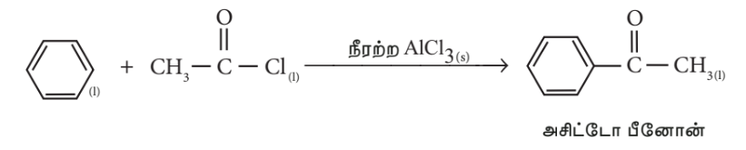

அசிட்டோ பீனோன்

### 10.2.1 வினைவேக மாற்றிகளின் சிறப்பியல்புகள்

1. ஒரு வேதிவினைக்கு குறைந்தளவே வினைவேக மாற்றி தேவைப்படுகிறது. பொதுவாக ஒரு பெரிய அளவு வினைக்கு சிறிதளவு வினைவேக மாற்றி போதுமானது.

2. வினைவேக மாற்றிகளில் சில இயற் மாற்றங்கள் நிகழலாம். ஆனால், அவற்றின் நிறையிலேயே வேதி மாற்றமும் நிகழ்வதில்லை.

3. ஒரு வினைவேக மாற்றியானது தாமாக ஒரு வினையை துவக்க இயலாது. அதாவது, நிகழாத ஒரு வினையை துவக்கி வைக்க இயலாது.ஆனால், மெதுவாக நிகழும் ஒரு வினையின் வேகத்தை இதனால் அதிகரிக்க இயலும்.

4. ஒரு திண்ம வினைவேகமாற்றியானது, நன்கு தூளாக்கப்பட்ட நிலையில் எடுத்துகொள்ளப்பட்டால் அது அதிக திறனுடன் செயலாற்றும்.

5. ஒரு வினைவேக மாற்றியானது ஒரு குறிப்பிட்ட வகை வினைக்கு மட்டும் வினையூக்கியாக செயலாற்றுகின்றன. எனவே அவை தேர்ந்து செயலாற்றக்கூடியவை எனலாம்.

6. ஒரு சமநிலை வினையில், வினைவேக மாற்றியை சேர்க்கும்போது சமநிலை எட்டப்படும் நேரம் குறைகிறது. மேலும், அது சமநிலை நிலையையோ, சமநிலை மாறிலியின் மதிப்பையோ பாதிப்பதில்லை.

7. ஒரு வினைவேக மாற்றியானது ஒரு குறிப்பிட்ட வெப்பநிலையில் அதிக திறனுடன் செயல்படுகிறது. இந்த வெப்பநிலையானது உகந்த வெப்பநிலை என்றமைக்கப்படுகிறது.

8. வினைவேக மாற்றிகள் பொதுவாக வினைபொருட்களின் தன்மையை பாதிப்பதில்லை. எடுத்துக்காட்டாக.

\[ 2SO_2 + O_2 \rightarrow 2SO_3 \]

இந்த வினையானது வினைவேக மாற்றி இல்லாத நிலையில் மெதுவாக நிகழ்கிறது, ஆனால் Pt வினைவேக மாற்றி முன்னிலையில் வேகமாக நிகழ்கிறது.

### உயர்த்திகள் மற்றும் வினைவேகமாற்ற நச்சு

ஒரு வினைவேகமாற்ற வினையிலுள்ள சில சேர்மங்கள் வினைவேகமாற்றியின் செயல்திறனை அதிகரிக்கின்றன. அத்தகைய சேர்மங்கள் உயர்த்திகள் என்றமைக்கப்படுகின்றன.

எடுத்துக்காட்டாக, ஹேபர் முறையில் அம்மோனியா தயாரிக்கும் செயல்முறையில், மாலிப்டினத்தை சேர்க்கும் போது இரும்பு வினைவேகமாற்றியின் செயல்திறன் அதிகரிக்கிறது.

எனவே மாலிப்டினம் உயர்த்தி என்றழைக்கப்படுகிறது. இதேபோல, \( Al_2O_3 \) ஐ பயன்படுத்தியும் இரும்பு வினைவேகமாற்றியின் செயல்திறனை அதிகரிக்க முடியும்.

இதற்கு மாறாக, வினைவேகமாற்ற வினைகளில் சில சேர்மங்களை சேர்க்கும்போது, அவை வினைவேகமாற்றிகளின் செயல்திறனை குறைக்கவோ அல்லது முழுவதுமாக இழக்கவோ செய்கின்றன. அத்தகைய சேர்மங்கள் வினைவேகமாற்ற நச்சுகள் என்றழைக்கப்படுகின்றன.

**எடுத்துக்காட்டுகள்,**

\[ 2SO_2 + O_2 \rightarrow 2SO_3 \] என்ற வினையில் செயல்படும் Pt வினைவேகமாற்றிக்கு, \( As_2O_3 \) நச்சாக செயல்படுகிறது.

அதாவது, \( As_2O_3 \) ஆனது Pt வினைவேகமாற்றியின் செயல்திறனை இழக்கசெய்கிறது. வினைவேகமாற்றியிலுள்ள கிளர்வு மையங்களை \( As_2O_3 \) அடைத்துக்கொள்கிறது. இதனால் அதன் செயல்பாடு இழக்கப்படுகிறது.

ஹேபர் முறையில் அம்மோனியா தயாரிக்கும் செயல்முறையில், இரும்பு வினைவேகமாற்றிக்கு \( H_2S \) நச்சாக செயல்படுகிறது.

\[ 2H_2 + O_2 \rightarrow 2H_2O \] என்ற வினையில் Pt வினைவேகமாற்றிக்கு, CO நச்சாக செயல்படுகிறது.

### தன்வினைவேக மாற்றம்

சில குறிப்பிட்ட வினைகளில், வினையில் உருவாகும் வினைபொருட்களுள் ஒன்று அதே வினைக்கு வினைவேக மாற்றியாக செயல்படுகிறது. துவக்கத்தில் வினை மிக மெதுவாக நிகழ்கிறது. ஆனால், நேரம் செல்ல செல்ல வினையின் வேகம் அதிகரிக்கிறது. பின்வரும் வினைகளில் தன் வினைவேக மாற்றம் கண்டறியப்பட்டுள்ளது.

\[ CH_3COOC_2H_5 + H_2O \rightarrow CH_3COOH + C_2H_5OH \]

அசிட்டிக் அமிலம் தன் வினைவேக மாற்றியாக செயல்படுகிறது.

\[ 2AsH_3 \rightarrow 2As + 3H_2 \]

ஆர்சனிக் தன்வினைவேக மாற்றியாக செயல்படுகிறது.

### தளர்வு வினைவேக மாற்றம்

சில குறிப்பிட்ட வினைகளில், சில சேர்மங்களை சேர்க்கும்போது வினையின் வேகம் குறைகிறது. பின்வரும் வினைக்கு எத்தனால் தளர்வு வினைவேக மாற்றியாக செயல்படுகிறது.

\[ (1) \quad 4CHCl_3 + 3O_2 \rightarrow 4COCl_2 + 2H_2O + 2Cl_2 \]

எத்தனால் வினையின் வேகத்தை குறைக்கிறது.

\[ (ii) \quad 2H_2O_2 \rightarrow 2H_2O + O_2 \]

ஹைட்ரஜன் பெராக்சைடு சிதைவடையும் வினையில், நீர்த்த அமிலம் அல்லது கிளிசரால் தளர்வு வினைவேக மாற்றிகளாக செயல்படுகின்றன.

### 10.2.2 வினைவேக மாற்றக் கொள்கைகள்

ஒரு வேதி வினை நிகழ வேண்டுமானால், கிளர்வு அணைவை உருவாக்குவதற்காக வினைபடு பொருட்கள் கிளர்வுறுத்தப்பட வேண்டும். கிளர்வு அணைவை உருவாக்கும் பொருட்டு, வினைபடு பொருட்களுக்கு தேவைப்படும் ஆற்றானது கிளர்வுறு ஆற்றல் என்றழைக்கப்படுகிறது. வினையின் வெப்பநிலை அதிகரிப்பதன் மூலம், கிளர்வுறு ஆற்றலை குறைக்க முடியும்.

வினைவேக மாற்றிகள் உள்ள போது, வினைபடு பொருட்கள் குறைந்த வெப்பநிலையிலேயே கிளர்வுறுத்தப்படுகின்றன, அதாவது கிளர்வுறு ஆற்றல் குறைக்கப்படுகிறது. வினைவேகமாற்றியானது, வினைபடு பொருட்களை பரப்பு கவர்ந்து, அவற்றிலுள்ள பிணைப்புகளை தளர்த்துவதன் மூலம் அவற்றை கிளர்வுறுத்தி, வினைபுரிய அனுமதிப்பதால் விளைபொருட்கள் உருவாகின்றன.

வினைவேக மாற்றிகளின் முன்னிலையில், கிளர்வுறு ஆற்றல் குறைக்கப்படுகிறது, அதிக எண்ணிக்கையிலான மூலக்கூறுகள் வினையில் பங்கேற்கின்றன.எனவே, வினையின் வேகம் அதிகரிக்கிறது.

ஒரு வேதி வினையில் வினைவேக மாற்றியின் செயல்பாட்டை விளக்குவதற்காக இரண்டு முக்கியமான கொள்கைகள் முன்மொழியப்பட்டுள்ளன.அவையாவன,

(i) இடைநிலைச் சேர்மம் உருவாதல் கொள்கை
(ii) பரப்பு கவர்தல் கொள்கை.

**இடைநிலைச் சேர்மம் உருவாதல் கொள்கை:**

வினைவேகமாற்றிகள், குறைந்த கிளர்வு ஆற்றலைக் கொண்ட புதிய வழிமுறையை உருவாக்குகின்றன.ஒருபடித்தான வினைவேக மாற்ற வினைகளில் ஒரு வினைவேகமாற்றியானது ஒன்று அல்லது அதற்கு மேற்பட்ட வினைபடு பொருட்களுடன் இணைந்து ஒரு இடைநிலை சேர்மத்தை உருவாக்குகிறது. இந்த இடைநிலைச் சேர்மமானது,மற்றொரு வினைபடுபொருளுடன் வினைப்பட்டோ அல்லது தாமாக சிதைந்தோ விளைபொருட்களை உருவாக்குகின்றன.மேலும் வினைவேகமாற்றியானது மீள் உருவாக்கம் பெறுகிறது.

பின்வரும் வினைகளை கருதுக

\[ A + B \rightarrow AB \] (1)

\[ A + C \rightarrow AC \] (இடைநிலை சேர்மம்) (2)

C என்பது வினைவேக மாற்றி

\[ AC + B \rightarrow AB + C \] (3)

(2) மற்றும் (3) ஆம் வினைகளுக்கான கிளர்வுறு ஆற்றல்கள், வினை (1) ஐவிட குறைவாக உள்ளன. எனவே, இடைநிலைச் சேர்மம் உருவாதல் மற்றும் சிதைதல் மூலம் வினையின் வேகம் அதிகரிக்கப்படுகிறது.

**எடுத்துக்காட்டு 1**

ஃபிரீடல் கிராஃப்ட் வினையின் வினைவழிமுறை கீழே கொடுக்கப்பட்டுள்ளது.

\[ C_6H_6 + CH_3Cl \xrightarrow{AlCl_3} C_6H_5CH_3 + HCl \]

வினைவேக மாற்றியின் செயல்பாடு கீழ்காணுமாறு விளக்கப்படுகிறது.

\[ CH_3Cl + AlCl_3 \rightarrow [CH_3]^+ + [AlCl_4]^- \] (இது ஒரு இடைநிலைச் சேர்மமாகும்.)

\[ C_6H_6 + [CH_3]^+[AlCl_4]^- \rightarrow C_6H_5CH_3 + AlCl_3 + HCl \]

**எடுத்துக்காட்டு 2**

\( MnO_2 \) முன்னிலையில் \( KClO_3 \) யின் வெப்பச்சிதைவு வினை பின்வருமாறு நிகழ்கிறது.

\[ 2KClO_3 \rightarrow 2KCl + 3O_2 \]

வினையில் நிகழும் படிகளை பின்வருமாறு எழுதலாம்

\[ 2KClO_3 + 6MnO_2 \rightarrow 6MnO_3 + 2KCl \] (இது ஒரு இடைநிலைச் சேர்மமாகும்.)

\[ 6MnO_3 \rightarrow 6MnO_2 + 3O_2 \]

**எடுத்துக்காட்டு 3:**

Cu முன்னிலையில் \( H_2 \) மற்றும் \( O_2 \) ஆகியன வினைபுரிவதால் நீர் உருவாகும் வினை பின்வருமாறு நிகழ்கிறது. \( 2H_2 + O_2 \xrightarrow{Cu} 2H_2O \). வினையில் நிகழும் படிகளை பின்வருமாறு எழுதலாம்.

\[ \begin{aligned} 2Cu + \frac{1}{2}O_2 & \rightarrow Cu_2O \\ \text{இது ஒரு இடைநிலைச் சேர்மமாகும்.} \\ Cu_2O + H_2 & \rightarrow H_2O + 2Cu \end{aligned} \]

**எடுத்துக்காட்டு 4:**

\( CuCl_2 \) முன்னிலையில் காற்றைக் கொண்டு HCl ஐ ஆக்ஸிஜனேற்றம் அடையும் வினை பின்வருமாறு நிகழ்கிறது. \( 4HCl + O_2 \xrightarrow{CuCl_2} 2H_2O + 2Cl_2 \). வினையில் நிகழும் படிகள்

\[ \begin{aligned} 2CuCl_2 & \rightarrow Cl_2 + Cu_2Cl_2 \\ 2Cu_2Cl_2 + O_2 & \rightarrow 2Cu_2OCl_2 \\ \text{இது ஒரு இடைநிலைச் சேர்மமாகும்.} \\ 2Cu_2OCl_2 + 4HCl & \rightarrow 2H_2O + 4CuCl_2 \end{aligned} \]

(i) வினைவேகமாற்றியின் தேர்ந்து செயலாற்றும் தன்மை.
(ii) வினைவேகமாற்றியின் செறிவு அதிகரிப்பை பொறுத்து வினையின் வேகம் அதிகரித்தல்.

ஆகியவற்றை இக்கொள்கை விளக்குகிறது.

**வரம்புகள்**

(i) வினைவேகமாற்ற நச்சு மற்றும் உயர்த்திகளின் செயல்பாடுகளை இடைநிலைச் சேர்மக் கொள்கையால் விளக்க இயலவில்லை.
(ii) பலபடித்தான வினைவேகமாற்ற வினைகளின் வினைவழிமுறையை இக்கொள்கையால் விளக்க இயலவில்லை.

**2. பரப்பு கவர்தல் கொள்கை**

லாங்மியூர் என்பவர் பலபடித்தான வினைவேகமாற்ற வினையில், வினைவேக மாற்றியின் செயல்பாட்டை, பரப்பு கவர்தலை அடிப்படையாக கொண்டு விளக்கினார். வினைபடு மூலக்கூறுகள் வினைவேக மாற்றியின் புறப்பரப்பில் பரப்பு கவரப்படுவதால், இதை தொடர்பு வினைவேக மாற்றம் எனவும் அழைக்கலாம்.

இக்கொள்கையின்படி, வினைபடு மூலக்கூறுகள், வினைவேக மாற்றியின் புறப்பரப்பில் பரப்பு கவரப்பட்டு கிளர்வு அணைவை உருவாக்குகின்றன. இவை உடனே சிதைந்து வினைபொருட்களை தருகின்றன.

பலபடித்தான வினைவேகமாற்ற வினையில் நிகழும் பல்வேறு படிநிலைகள் கீழே கொடுக்கப்பட்டுள்ளன.

1. வினைபடு மூலக்கூறுகள் வினைவேக மாற்றியின் புறப்பரப்பை நோக்கி நகர்கின்றன.
2. வினைபடு மூலக்கூறுகள் வினைவேக மாற்றியின் புறப்பரப்பில் பரப்பு கவரப்படுகின்றன.
3. பரப்புகவரப்பட்ட வினைபடு மூலக்கூறுகள் கிளர்வுற்று "கிளர்வு அணைவு" உருவாகிறது. மேலும், இந்த கிளர்வு அணைவு சிதைவடைந்து, வினைபொருட்களை உருவாக்குகின்றன.

4. வினைபொருள் மூலக்கூறுகள் பரப்பு நீக்கம் அடைகின்றன.
5. வினைபொருளானது வினைவேகமாற்றியின் புறப்பரப்பை விட்டு விலகிச் செல்கின்றன.

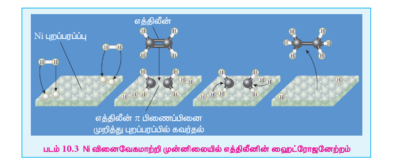

படம் 10.3 Ni வினைவேகமாற்றி முன்னிலையில் எத்திலினின் ஹைட்ரஜனேற்றம்

### கிளர்வு மையங்கள்

வினைவேக மாற்றியின் புறப்பரப்பானது வழுவழுப்பாக இருப்பதில்லை. அதில், பல்வேறு தடங்கள், விரிசல்கள் மற்றும் முனைகள் காணப்படுகின்றன. புறப்பரப்பிலுள்ள இத்தகைய பகுதிகளில் காணப்படும் அணுக்கள் நிறைவுறா பிணைப்புகளை கொண்டுள்ளதால் அதிகளவு எச்ச கவர்ச்சி விசைகளை கொண்டுள்ளன. இத்தகைய மையங்கள் கிளர்வு மையங்கள் என்றமைக்கப்படுகின்றன. எனவே, புறப்பரப்பானது அதிக பரப்பு கட்டிலா ஆற்றலை பெற்றுள்ளது.

இந்த கிளர்வு மையங்கள் வினைபடு மூலக்கூறுகளை பரப்பு கவர்ந்து, அவற்றை கிளர்வுறச் செய்து வினையின் வேகத்தை அதிகரிக்கின்றன.

பரப்பு கவர்தல் கொள்கையானது பின்வருவனவற்றை விளக்குகிறது.

i. உலோகங்கள் மற்றும் உலோக ஆக்சைடு துகள்களின் உருவ அளவை குறைக்கும்போது அவற்றின் பரப்பளவு அதிகரிக்கிறது. இதனால், அவற்றின் வினைவேகமாற்றியாக செயல்படும் திறனும், வினையின் வேகமும் அதிகரிக்கின்றன.

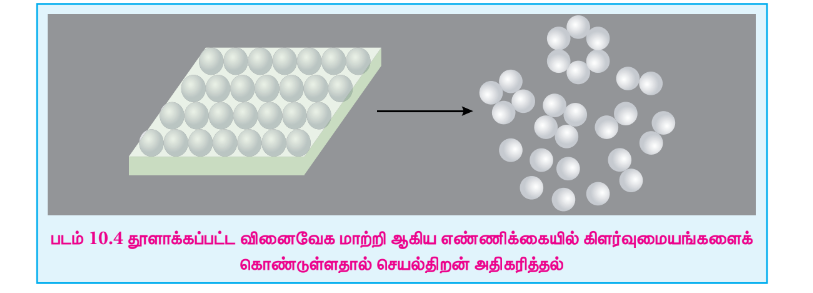

ii. வினைவேகமாற்றியின் கிளர்வு மையங்களை நச்சு பொருள் ஆக்கிரமிக்கும்போது வினைவேகமாற்ற நச்சுத் தன்மை உருவாகிறது.
iii. உயர்த்திகள் புறப்பரப்பிலுள்ள கிளர்வு மையங்களின் எண்ணிக்கையை அதிகரிக்கின்றன.

## 10.3 நொதி வினைவேக மாற்றம்

நொதிகள் என்பவை முப்புரிமான அமைப்பு கொண்ட சிக்கலான புரத மூலக்கூறுகளாகும். இவை உயிரினங்களில் நிகழும் வேதி வினைகளுக்கு வினையூக்கிகளாக செயல்படுகின்றன. அநேக நேரங்களில் நொதிகள் கூழ்மநிலையில் காணப்படுகின்றன.மேலும், அவற்றின் வினையூக்க செயல்பாடுகளில் தேர்ந்து செயலாற்றக்கூடியவைகளாக உள்ளன. ஒரு குறிப்பிட்ட உயிருள்ள செயலில் உருவாகும் ஒவ்வொரு நொதியும், செல்லில் நிகழும் ஒரு குறிப்பிட்ட வினைக்கு வினைவேக மாற்றியாக செயல்பட முடியும்.

**நொதி வினைவேக மாற்றத்திற்கான சில பொதுவான எடுத்துக்காட்டுகள்:**

1) கிளைசில் L-குளுட்டமில் L-தைரோசின் எனும் புரதமானது, புரசின் எனும் நொதியால் நீராற்பகுக்கப்படுகிறது.
2) டையஸ்டேஸ் எனும் நொதி ஸ்டார்ச்சை மால்டோசாக நீராற்பகுக்கிறது.

\[ 2(C_6H_{10}O_5)_n + nH_2O \rightarrow nC_{12}H_{22}O_{11} \]

3) ஈஸ்டில் உள்ள ஸைமேஸ் எனும் நொதியானது குளுக்கோஸை எத்தனாலாக மாற்றமடையச் செய்கிறது.

\[ C_6H_{12}O_6 \rightarrow 2C_2H_5OH + 2CO_2 \]

4) மைக்கோ டபர்மா அசிட்டி எனும் நொதி ஆல்கஹாலை அசிட்டிக் அமிலமாக ஆக்ஸிஜனேற்றமடையச் செய்கிறது.

\[ C_2H_5OH + O_2 \rightarrow CH_3COOH + H_2O \]

5) சோயாப் பயறுகளில் உள்ள யூரியேஸ் எனும் நொதி யூரியாவை நீராற்பகுக்கிறது.

\[ NH_2 - CO - NH_2 + H_2O \rightarrow 2NH_3 + CO_2 \]

### 10.3.1 நொதி வினைவேகமாற்ற வினையின் வினைவழிமுறை

நொதி வினைவேக மாற்றத்தை விளக்குவதற்காக பின்வரும் வினைவழிமுறையானது முன்மொழியப்பட்டது.

\[ E + S \rightleftharpoons ES \rightarrow P + E \]

இங்கு E என்பது நொதி, S என்பது வினைபடுபொருள், ES என்பது கிளர்வு அணைவு, P என்பது வினைபொருள் என குறிப்பிடப்படுகின்றன.

படம் 10.5 நொதி வினை வேகமாற்ற வினை வழிமுறை

### நொதி வினைவேகமாற்ற வினைகள் சில சிறப்புப் பண்புகளை கொண்டுள்ளன.

(i) பயனுள்ள மற்றும் திறனுள்ள மாற்றம் என்பது நொதி வினைவேக மாற்ற வினைகளில் சிறப்புப் பண்பாகும். ஒரு நொதியானது ஒரு நிமிட நேரத்தில் லட்சக்கணக்கான வினைபடு மூலக்கூறுகளை வினைபொருளாக மாற்றக்கூடியது.

எடுத்துக்காட்டாக \( 2H_2O_2 \rightarrow 2H_2O + O_2 \)

வினைவேகமாற்றி இல்லாத நிலையில் இவ்வினைக்கான கிளர்வுறு ஆற்றல் மதிப்பு \( 18 \ \mathrm{kcal/mol} \). வினையில் கூழ்ம பிளாட்டினத்தை வினைவேகமாற்றியாக சேர்த்த பின்பு, வினையின் கிளர்வுறு ஆற்றல் மதிப்பு \( 11.7 \ \mathrm{kcal/mol} \). ஆனால், நொதி வினைவேகமாற்றி முன்னிலையில் இவ்வினையின் கிளர்வுறு ஆற்றல் மதிப்பு \( 2 \ \mathrm{kcal/mol} \) ஐ விட குறைவாக உள்ளது.

(ii) நொதி வினைவேக மாற்றமானது அதிக தேர்ந்து செயலாற்றும் தன்மையை பெற்றுள்ளது.

\[ H_2N-CO-NH_2 + H_2O \rightarrow 2NH_3 + CO_2 \]

யூரியாவின் நீராற்பகுப்பு வினைக்கு வினைவேகமாற்றியாக செயல்படும் யூரியேஸ் எனும் நொதியானது மெத்தில் யூரியா நீராற்பகுப்பு வினைக்கு வினைவேகமாற்றியாக செயல்படுவதில்லை.

\[ H_2N-CO-NH-CH_3 + H_2O \rightarrow \text{வினை இல்லை} \]

(iii) நொதி வினைவேகமாற்ற வினையானது அதன் உகந்த வெப்பநிலையில் அதிகபட்ச வேகத்தில் நிகழ்கிறது. முதலில், வெப்பநிலை அதிகரிக்கும்போது வினையின் வேகமும் அதிகரிக்கிறது. ஆனால், ஒரு குறிப்பிட்ட வெப்பநிலைக்கு மேல் நொதிச் செயல்பாடு இழக்கப்படுகிறது. இதனால் வினையின் வேகம் பூஜ்ஜியமாக கூட குறையலாம். எந்த குறிப்பிட்ட வெப்பநிலையில் நொதிச் செயல்பாடு அதிகபட்சமாக உள்ளதோ அந்த வெப்பநிலை அந்த நொதியின் உகந்த வெப்பநிலை என்றழைக்கப்படுகிறது. எடுத்துக்காட்டு:

அதிக வெப்பநிலையில் நொதிச் செயல்பாடு இழப்பதால் வினைவேகம் விரைவாக குறைக்கிறது

படம் 10.6 வினைவேகம் Vs வெப்பநிலை

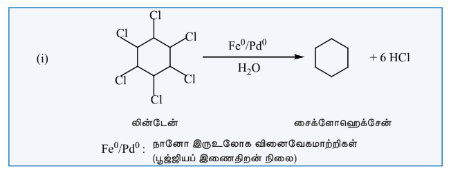

படம் 10.7 வினைவேகம் vs pH

* மனித உடலில் செயல்படும் நொதிகளின் உகந்த வெப்பநிலை \( 37^\circ C / 98^\circ F \) ஆகும்.
* காய்ச்சலின் போது, உடலின் வெப்பநிலை அதிகரிப்பதால், நொதிச் செயல்பாடு தகர்ப்பதால், உயிருக்கு ஆபத்தான நிலை உருவாகலாம்.

(iv) அமைப்பின் pH மதிப்பைப் பொருத்து நொதி வினைவேகமாற்ற வினைகளின் வேகம் அமைகிறது. வினைவேகமானது, உகந்த pH இல் அதிகபட்சமாக உள்ளது.

(v) நொதிகளின் செயல்பாட்டை தடுத்து நச்சுப்படுத்த முடியும்.ஒரு நொதியின் செயல்பாட்டை ஒரு நச்சுப் பொருளால் குறைக்கவோ அல்லது முற்றிலுமாக இழக்கவோ செய்ய முடியும்.

மருந்துகளின் உடலியல் செயல்பாடானது, அவற்றின் தடுத்தல் செயல்முறையுடன் தொடர்புபடுத்தப்படுகிறது.

எடுத்துக்காட்டு: சல்பா மருந்துகள்.

பெனிசிலின், பாக்டீரியாக்களின் செயல்பாட்டை தடுப்பதன் காரணமாக நிமோனியா, வயிற்றுப் போக்கு, காலரா மற்றும் மற்ற தொற்று நோய்களை குணப்படுத்த பயன்படுகிறது.

(vi) துணைநொதிகள் அல்லது கிளர்வுறுத்திகளினால் நொதிகளின் வினைவேகமாற்ற செயல்பாடு அதிகரிக்கிறது. துணைநொதி என்றழைக்கப்படும் ஒரு சிறிய புரதமானது (வைட்டமின்) நொதியின் வினைவேகமாற்ற செயல்பாட்டை உயர்த்துகிறது.

## 10.4 ஜியோலைட் வினைவேக மாற்றம்

ஜியோலைடுகள் பற்றி விவரிக்காமல், பலபடித்தான வினைவேக மாற்றத்தின் விளக்கம் முழுமையடையாது. ஜியோலைடுகள் நுண்துளைகளை உடைய, படிகவடிவுடைய, நீரேறிய அலுமினோ சிலிக்கேட்டுகளாகும். இவை சிலிக்கான் மற்றும் அலுமினியம் நான்முகிகளால் ஆனவை. இயற்கையில் காணப்படும் 50 வெவ்வேறு வகை ஜியோலைடுகளும், 150 தொகுப்பு ஜியோலைடுகளும் காணக்கிடைக்கின்றன.

சிலிக்கான் நான்கு இணைதிறனையும், அலுமினியம் மூன்று இணைதிறனையும் கொண்டிருப்பதால் ஜியோலைட்டு அணிக்கோவையில் மின் எதிர்மின்னம் காணப்படுகிறது. இந்த எதிர்மின்னத்தை நடுநிலையாக்க \( H^+ \) அல்லது \( Na^+ \) போன்ற கட்டமைப்புசாரா அயனிகள் காணப்படுகின்றன. புரோட்டான்களைக் கொண்டுள்ள ஜியோலைட்டுகள் திண்ம அமிலங்களாகவும், வினைவேக மாற்றிகளாகவும் பயன்படுத்தப்படுகின்றன. மேலும், இவை பெட்ரோலிய தொழிற்சாலைகளில் உயர் ஹைட்ரோகார்பன்களை சிதைத்து பெட்ரோல், டீசல் போன்றவற்றை பெறுவதிலும் அதிகமாக பயன்படுத்தப்படுகின்றன. \( Na^+ \) அயனிகளைக் கொண்டுள்ள ஜியோலைட்டுகள் கார வினைவேக மாற்றிகளாக பயன்படுத்தப்படுகின்றன.

ஜியோலைட்டுகளின் முக்கிய பயன்பாடுகளில் ஒன்று அவற்றின் வடிவ தெரிவுத்திறனாகும். ஜியோலைட்டுகளில், கிளர்வு மையங்கள் அதாவது புரோட்டான்கள் நுண்துளைகளினுள் அமைந்துள்ளன. எனவே, ஜியோலைட்டுகளின் நுண் துளைகளுக்குள் மட்டுமே வினைகள் நிகழ்கின்றன.

**வினைப்பொருள் தெரிவுத்திறன்:**

வினைப்பொருள் கலவையிலுள்ள பெரிய மூலக்கூறுகள், ஜியோலைட் படிகத்தின் கிளர்வு மையங்களை சென்றடையாமல் தடுக்கப்படுகின்றன. இந்த தெரிவுத்திறனானது வினைப்பொருள் வடிவத் தெரிவுத்திறன் என்றழைக்கப்படுகிறது.

**இடைநிலைச் சேர்ம தெரிவுத்திறன்:**

வினையில் உருவாகும் இடைநிலைச் சேர்மமானது, ஜியோலைடுகளின் நுண்துளை அளவை விட பெரியதாக இருந்தால் விளைப்பொருள் உருவாகாது.

**விளைப்பொருள் தெரிவுத்திறன்:**

சில விளைப்பொருள் மூலக்கூறுகள் ஜியோலைடுகளின் நுண்துளைகளிலிருந்து வெளியேற இயலாத அளவிற்கு மிகப்பெரியதாக இருக்கும்போது, இந்த சிக்கல் உருவாகிறது.

### நிலைமை மாற்ற வினைவேக மாற்றம்

வினையில் ஈடுபடும் இரண்டு வினைபடு பொருட்களில் ஒன்று ஒரு கரைப்பானிலும், மற்றொன்று வேறொரு கரைப்பானிலும் கரைந்திருந்து, மேலும் அவ்விரு கரைப்பான்களும் ஒன்றுடன் ஒன்று கலக்காதவைகளாக இருந்தால், வினைபடு பொருட்களுக்கிடையே நிகழக்கூடிய வினை மிக மெதுவாக நிகழும். கரைப்பான்கள் தனித்தனி நிலைமைகளை உருவாக்குவதால், வினைபடு பொருட்கள் எல்லையை தாண்டிச் சென்று வினைபுரிய வேண்டிய சூழல் உருவாகிறது.ஆனால், எல்லை வழியே வினைபடு பொருட்கள் ஊடுருவி செல்லுதல் என்பது அவ்வளவு எளிதல்ல. இத்தகைய சூழ்நிலைகளில், இரண்டு கரைப்பான்களுடனும் கரையக்கூடிய மூன்றாவது கரைப்பான் சேர்க்கப்படுகிறது, இதனால், நிலைமை எல்லை நீக்கப்பட்டு, வினைபடு பொருட்கள் எளிதாக கலந்து, வேகமாக வினைபடுகின்றன. ஆனால், ஏதாவது ஒரு விளைப்பொருளின் மிகையளவு தயாரிப்பில், மூன்றாம் கரைப்பான் பயன்படுத்தப்படுவது விலையுற்றதாக அமையலாம். இத்தகைய சிக்கல்களை தீர்க்க, நிலைமை மாற்ற வினைவேக மாற்றம் சிறந்த தீர்வை அளிக்கிறது. இதில் கரைப்பான்களின் பயன்பாடு தவிர்க்கப்படுகிறது. இதில் நிலைமை மாற்ற வினைவேகமாற்றியை பயன்படுத்தி, வினைப்பொருளை ஒரு கரைப்பானிலிருந்து, இரண்டாம் வினைப்பொருள் இருக்கும் மற்றொரு கரைப்பானுக்கு நகர வழிவகை செய்யப்படுகிறது.வினைபடு பொருட்கள் இப்பொழுது நெருங்கி வந்துள்ளதால், அதிவேகமாக வினைப்பட்டு விளைப்பொருட்களை உருவாகுகின்றன.

**எடுத்துக்காட்டு:**

பின்வரும் வினையில் \( Cl^- \) ஐ \( CN^- \) வைத்து பதிலீடு செய்தல்.

\[ R-Cl + NaCl \rightarrow R-CN + NaCl \]

கரிம நிலைமை நீர்ம நிலைமை கரிம நிலைமை நீர்ம நிலைமை

\( R-Cl = 1 \)-குளோரோபியூட்டேன்
\( R-CN = 1 \)-சயனோபியூட்டேன்

கரிமநிலைமையிலுள்ள 1-குளோரோபியூட்டேனுடன் நீர்த்த நிலைமையிலுள்ள சோடியம் சயனைடு கலக்கப்பட்ட இருநிலைமை கலவையை பல நாட்களுக்கு நேரடியாக வெப்பப்படுத்தினாலும் 1-சயனோபியூட்டேன் கிடைப்பதில்லை. ஆனால், சிறிதளவு டெட்ரா ஆல்கைல் அம்மோனியம் குளோரைடு போன்ற நான்கிணைய உப்பை சேர்க்கும் போது, அதிவேகமாக, \( 100\% \) விளைச்சலுடன் ஓரிரு மணித்துளிகளில் 1-சயனோபியூட்டேன் உருவாகிறது. இந்த வினையில் நீர்வெறுக்கும் மற்றும் நீர்விரும்பும் முனைகளைக் கொண்டுள்ள டெட்ரா ஆல்கைல் அம்மோனியம் நேரயனியானது தனது நீர்விரும்பும் முனையை பயன்படுத்தி நீர்த்த நிலைமையிலிருக்கும் \( CN^- \) அயனிகளை கரிமநிலைமைக்கு நகர்த்தி 1-குளோரோபியூட்டேனுடன் வினைபுரிய தூண்டுகிறது.

\[ NaCN + R_4N^+Cl^- \rightarrow R_4N^+CN^- + NaCl \]

நீர்ம நிலைமை கரிம நிலைமைக்கு நகர்கின்றது

\[ R_4N^+CN^- + R-Cl \rightarrow R-CN + R_4N^+Cl^- \]

இரண்டும் கரிம நிலைமையில் உள்ளன
நீர்ம நிலைமைக்கு நகர்ந்து வெளியேறி CN உடன்
அணைந்து இதனை கடத்துகின்றது

எனவே, நிலைமை மாற்ற வினைவேகமாற்றியானது, ஒரு வினைபடுபொருளை ஒரு நிலைமையிலிருந்து, மற்றொரு நிலைமைக்கு கடத்துவதன் மூலமாக, வினையின் வேகத்தை அதிகரிக்கின்றன.

### நானோ வினைவேக மாற்றம்

உலோகம் மற்றும் உலோக ஆக்சைடுகளின் நானோ துகள்கள் பல்வேறு வேதி மாற்றங்களில் வினைவேக மாற்றிகளாக பயன்படுகின்றன. நானோ வினைவேக மாற்றிகளானவை, ஒருபடித்தான மற்றும் பலபடித்தான வினைவேக மாற்றிகளை விட சிறந்தவைகளாக உள்ளன. ஒருபடித்தான வினைவேகமாற்றிகளைப் போலவே, நானோ வினைவேகமாற்றிகளும் \( 100\% \) தேர்ந்தெடுக்கப்பட்ட மாற்றத்தையும், மேம்பட்ட வினைச்சுலைவையும் தருகின்றன. மேலும், இவை அதிவேக செயல்திறனைக் கொண்டுள்ளன. பலபடித்தான வினைவேகமாற்றிகளைப் போலவே, நானோ வினைவேகமாற்றிகளை மீளப்பெற்று, மறுபயன்பாடு செய்ய முடியும்.உண்மையில், நானோ வினைவேகமாற்றிகள் என்பவை கரையும் பலபடித்தான வினைவேக மாற்றிகளாகும். நானோ துகள்களால் வினைக்கும் பெறும் வினைக்கு எடுத்துக்காட்டு கீழே கொடுக்கப்பட்டுள்ளது.

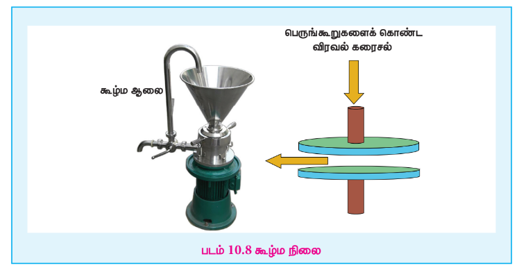

## 10.5 கூழ்மம், பிரிகைநிலைமை மற்றும் பிரிகை ஊடகம்

ஒரு மெல்லிய சவ்வின் வழியே, சர்க்கரை, யூரியா அல்லது சோடியம் குளோரைடு கரைசல்கள் ஊடுருவிச் செல்கின்றன. ஆனால், பசை, ஜெலாட்டின் அல்லது கோந்து கரைசல்கள் ஊடுருவிச் செல்வதில்லை என்பதை தாமஸ் கிரஹாம் கண்டறிந்தார். அவர் முன்னதாக குறிப்பிடப்பட்ட சேர்மங்களை படிகப்போலிகள் எனவும், பின்னதாக குறிப்பிடப்பட்ட சேர்மங்களை கூழ்மங்கள் (கிரேக்க மொழியில், kola – பசை, eidos- போன்றவை) என்றும் அழைத்தார்.எந்தப் பொருளையும், அதன் துகள் அளவை \( 1-200 \ \mathrm{nm} \) அளவிற்கு குறைப்பதன் மூலம் கூழ்மமாக மாற்றமுடியும் என்பது பின்னர் உணர்ந்தறியப்பட்டது.

எனவே, கூழ்மம் என்பது இரண்டு பொருட்களைக் கொண்ட ஒருபடித்தான கலவை ஆகும். இதில் உள்ள ஒரு பொருளானது (குறைந்தளவு உள்ளது) மற்றொரு பொருளில் (அதிகளவு உள்ளது) விரவியுள்ளது. ஒரு கூழ்மத்தில், அதிகளவு காணப்படும் பொருள், பிரிகை ஊடகம் எனவும், குறைந்தளவு காணப்படும் பொருள், பிரிகை நிலைமை எனவும் அழைக்கப்படுகின்றன.

### 10.5.1 கூழ்மக்கரைசல்களின் வகைப்பாடு

அநேக கூழ்ம அமைப்புகளில் பிரிகை நிலைமைகள் திண்மங்களாகவும், பிரிகை ஊடகம் நீர்மங்களாகவும் காணப்படுகின்றன.

நீரை பிரிகை ஊடகமாக கொண்டிருக்கும் கூழ்மங்கள் "நீர்மக் கூழ்மங்கள்" என குறிப்பிடப்படுகின்றன.

ஆல்கஹாலை பிரிகை ஊடகமாக கொண்டிருக்கும் கூழ்மங்கள் ஆல்கஹால் கூழ்மங்கள் எனவும், பென்சீனை பிரிகை ஊடகமாக கொண்டிருக்கும் கூழ்மங்கள் பென்சோ கூழ்மங்கள் எனவும் குறிப்பிடப்படுகின்றன.

பிரிகை நிலைமை மற்றும் பிரிகை ஊடகத்திற்கிடையே நிலவும் விசைகளின் அடிப்படையில் மற்றொரு வகையில் கூழ்மங்கள் வகைப்படுத்தப்படுகின்றன.

கரைப்பான் விரும்பும் கூழ்மங்களில், பிரிகை நிலைமைக்கும் பிரிகை ஊடகத்திற்கும் இடையே வலுவான கவர்ச்சி விசை நிலவுகிறது. எடுத்துக்காட்டுகள்: புரதம் மற்றும் ஸ்டார்ச் ஆகியவற்றின் கூழ்ம கரைசல்கள். இவை அதிக நிலைப்புத் தன்மை கொண்டவை, எளிதில் வீழ்படிவாவதில்லை.அவை வீழ்படிவான பின்னரும் கூட, பிரிகை ஊடகத்தை சேர்த்து மீளவும் கூழ்மநிலைக்கு கொண்டுவர இயலும்.

கரைப்பான் வெறுக்கும் கூழ்மங்களில், பிரிகை நிலைமைக்கும் பிரிகை ஊடகத்திற்கும் இடையே கவர்ச்சி விசைகள் ஏதுமில்லை. இவை குறைந்த நிலைப்புத் தன்மை கொண்டவைகளாகும், மேலும் எளிதில் வீழ்படிவாகின்றன.ஆனால், பிரிகை ஊடகத்தை சேர்ப்பதன் மூலம் மீண்டும் இவற்றை உருவாக்க இயலாது.இவை, ஒரு குறிப்பிட்ட நேரத்திற்கு பிறகு தாமாகவே திரிந்துவிடுகின்றன. இவை மீளாக் கூழ்மங்கள் என்றழைக்கப்படுகின்றன.

எடுத்துக்காட்டுகள்: கோல்டு, சில்வர், பிளாட்டினம் மற்றும் காப்பர் கூழ்மங்கள்.

பிரிகை நிலைமை மற்றும் பிரிகை ஊடகத்தின் இயற் நிலைமைகளின் அடிப்படையில் கூழ்மங்களின் வகைகள் பின்வரும் அட்டவணையில் பட்டியலிடப்பட்டுள்ளது.

**பிரிகை நிலைமை மற்றும் பிரிகை ஊடகத்தின் இயற் நிலைமைகளின் அடிப்படையில் கூழ்மங்களின் வகைப்பாடு.**

| வ.எண் | பிரிகை ஊடகம் | பிரிகை நிலைமை | கூழ்மத்தின் பெயர் | எடுத்துக்காட்டுகள் |
|---|---|---|---|---|
| 1. | வாயு | நீர்மம் | நீர்மகாற்று கரைசல் | மூடுபனி, தெளிப்பு காற்று கரைசல். |
| 2. | வாயு | திண்மம் | திண்மகாற்று கரைசல் | புகை, தூசி போன்ற காற்று மாசுபடுத்திகள். |
| 3. | நீர்மம் | வாயு | நுண்கலக்கப்பட்ட | கிரீம், வேவிங் கிரீம், சோடா நீர், நுரை. |
| 4. | நீர்மம் | நீர்மம் | பால்மம் | பால், கிரீம், மையனேஸ். |
| 5. | நீர்மம் | திண்மம் | கூழ்ம கரைசல் | இங்க், பெயிண்ட், கூழ்மநிலையில் கோல்டு. |
| 6. | திண்மம் | வாயு | திண்ம நுரை | நுரைக்கல், நுரை படுக்கை, ரப்பர், ஏராட்டி (பிரட்). |
| 7. | திண்மம் | நீர்மம் | களி | வெண்ணெய், பாலாடைக்கட்டி. |
| 8. | திண்மம் | திண்மம் | திண்மக் கூழ்ம கரைசல் | முத்துகள், மாறுநிற மணிக்கல், நிறமுள்ள கண்ணாடி, உலோக கலவைகள், கூழ்மநிலையில் பிரிகையடைந்த எளிதுருக்க கலவை. |

### 10.5.2 கூழ்மங்களை தயாரித்தல்

பெரும்பாலான நீர்விரும்பு பொருட்களை, நீரில் சேர்த்து, வெப்பப்படுத்தி அவற்றை கூழ்மக்கரைசல்களாக உருவாக்க முடியும். இதேபோல, பென்சீனில் உடனே கூழ்மக்கரைசலை உருவாக்க முடியும். சோப்புகளை நீரில் சேர்த்து கரைக்கும் போது தானாகவே கூழ்மக்கரைசலை உருவாக்க முடியும்.பொதுவாக, கூழ்மங்கள் பிரிவு முறைகளை பயன்படுத்தி தயாரிக்கப்படுகின்றன.

i. பிரிவு முறை: இம்முறையில், பெரிய துகள்கள், கூழ்மங்கள் அளவிற்கு உடைக்கப்படுகின்றன.
ii. தொகுப்பு முறை: இம்முறையில், சிறிய அணுக்கள் அல்லது மூலக்கூறுகள், பெரிய திரள் அளவிலான துகள்களாக மாற்றப்படுகின்றன.

**1) பிரிகை முறைகள்:**

**(i) இயந்திரப் பிரிகை முறை:**

கூழ்ம ஆலையை பயன்படுத்தி, திண்மங்கள் கூழ்மத்துகள் அளவிற்கு அரைக்கப்படுகின்றன. இந்த கூழ்ம ஆலையில் எதிரெதிர் திசைகளில், அதிவேகத்தில், ஏறத்தாழ ஒரு நிமிடத்தில் 7000 சுழற்சிகள் வரை சுழலும் உரோக தடுக்கள் வைக்கப்பட்டுள்ளன.

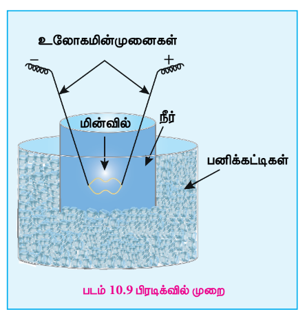

இரண்டு தடுக்களுக்கிடையே உள்ள இடைவெளியை சரிசெய்வதன் மூலம் தேவையான உருவளவு கொண்ட கூழ்மத்துகள்களைப் பெற முடியும்.

இந்த முறையைப் பயன்படுத்தி இங்க் மற்றும் கிராஃபைட் கூழ்மங்கள் தயாரிக்கப்படுகின்றன.

**(ii) மின்னா®் பிரிகை முறை:**

முதன்முதலில் 1898 ல் ஜார்ஜ் பிரடிக் என்பவரால் பழுப்புநிற பிளாட்டின கூழ்மம் தயாரிக்கப்பட்டது. பனிக்கட்டிகளால் சூழப்பட்ட நீரினுள் வைக்கப்பட்டுள்ள பிளாட்டின மின்முனைகளுக்கிடையே, ஒரு மின்வில் உருவாக்கப்படுகிறது. \( 1 \ \mathrm{amp} / 100 \ \mathrm{V} \) அளவுள்ள மின்னோட்டத்தை பயன்படுத்தி உருவாக்கப்படும் மின்வில்லானது உலோகத்தை ஆவியாக்குகிறது, இது உடனடியாக குளிர்ந்து, கூழ்மக்கரைசலை உருவாகிறது. இந்த முறையை பயன்படுத்தி காப்பர், சில்வர், கோல்டு, பிளாட்டினம் போன்ற பல்வேறு உலோகங்களின் கூழ்மக்கரைசல்கள் தயாரிக்கப்படுகின்றன. கூழ்மக் கரைசலை நிலைப்படுத்துவதற்காக, கார ஹைட்ராக்சைடுகள் நிலைப்படுத்தும் காரணிகளாக சேர்க்கப்படுகின்றன.

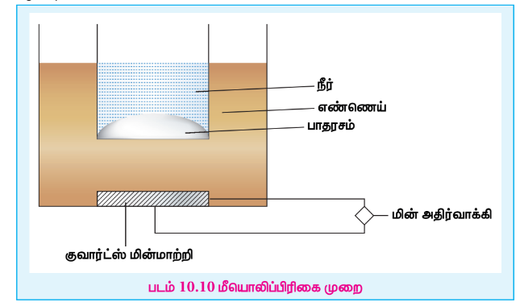

ஸ்வெட்பர்க் என்பவர் இந்த முறையில் சில மாற்றங்களை உருவாக்கினார். நீர்மங்களின் வேதிச் சிதைவை தடுக்கும் உயர் அதிர்வெண் கொண்ட மாறுதிசை மின்னோட்டத்தை பயன்படுத்தி பென்டேன், ஈதர் மற்றும் பென்சீன் போன்ற எளிதில் தீப்பற்றும், கரிம நீர்மங்களின் கூழ்மக் கரைசல்களை அவர் தயாரித்தார்.

**(iii) மீவாய் பிரிகை முறை:**

\( 20 \ \mathrm{kHz} \) (கேட்கும் எல்லை) க்கும் அதிகமான அதிர்வெண் கொண்ட ஒலி அலைகளைப் பயன்படுத்தி பெரிய உருவளவு கொண்ட தொங்கல் துகள்களை, கூழ்மத்துகள் அளவிற்கு சிதைக்க முடியும்.

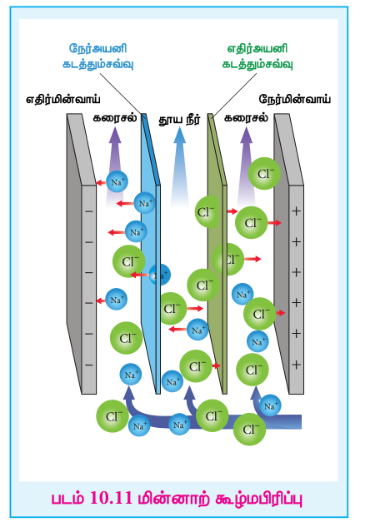

கிளாஸ் என்பவர் பாதரசத்தை, அதிக அதிர்வெண் கொண்ட மீயொலி அதிர்வுகளுக்கு உட்படுத்தி பாதரசு கூழ்மத்தை தயாரித்தார்.

அதிர்வாக்கிகளால் உருவாக்கப்படும் மீயொலி அதிர்வுகள் எண்ணெய் வழியாக பரவி, கலனில் நீருடன் வைக்கப்பட்டுள்ள பாதரசத்திற்கு கடத்தப்படுகிறது.

**(iv) கூழ்மமாக்கல்:**

தகுந்த மின்பகுளிகளை சேர்ப்பதன் மூலம், வீழ்படிவாக்கப்பட்ட துகள்களை கூழ்மநிலைக்கு மாற்ற இயலும். இந்த செயல்முறையானது கூழ்மமாக்கல் என பெயரிடப்படுகிறது. மேலும் சேர்க்கப்பட்ட மின்பகுளியானது கூழ்மமாக்கும் காரணி அல்லது விரவுதல் காரணி என்றழைக்கப்படுகிறது.

**2) தொகுப்பு முறைகள்:** கூழ்ம உருவாகத்திற்கு தேவையான பொருளானது, சிறிய துகள்களாகவோ, மூலக்கூறுகள் அல்லது அயனிகளாகவோ இருந்தால், அவை தொகுப்பு முறைகளை பயன்படுத்தி கூழ்மத்துகள் அளவிற்கு மாற்றப்படுகின்றன. கூழ்ம அளவிலுள்ள துகள்களை தயாரிக்கும் போது மிகவும் கவனமுடன் இருந்தால் அவசியம், இல்லையெனில் வீழ்படிவாக்கல் நிகழக்கூடும்.கூழ்மத் துகள்களை தயாரிக்க பயன்படும் வேதி முறைகள் பின்வருமாறு.

**(i) ஆக்ஸிஜனேற்றம்:**

சில அலோகங்களின் கூழ்ம கரைசல்கள் இம்முறையில் தயாரிக்கப்படுகின்றன.

(a) ஹைட்ரேயோடிக் அமிலத்தை அயோடிக் அமிலத்துடன் சேர்க்கும் போது, \( I_2 \) கூழ்ம கிடைக்கிறது.

\[ HIO_3 + 5HI \rightarrow 3H_2O + 3I_2(\mathrm{sol}) \]

(b) \( H_2Se \) கரைசலின் வழியே \( O_2 \) வாயுவை செலுத்தும்போது, செனியம் கூழ்ம கிடைக்கிறது.

\[ 2H_2Se + O_2 \rightarrow 2H_2O + 2Se(\mathrm{sol}) \]

**(ii) ஒடுக்கம்:**

கூழ்ம கரைசல்களை உருவாக்க, பீனைல் ஹைட்ரசீன், ஃபார்மால்டிஹைடு போன்ற பல்வேறு கரிம சேர்மங்கள் பயன்படுகின்றன. எடுத்துக்காட்டாக, ஃபார்மால்டிஹைடை பயன்படுத்தி, ஆரிக் குளோரைடை ஒடுக்குவதன் மூலம் கோல்டு கூழ்ம தயாரிக்கப்படுகிறது.

\[ 2AuCl_3 + 3HCHO + 3H_2O \rightarrow 2Au(\mathrm{sol}) + 6HCl + 3HCOOH \]

**(iii) நீராற்பகுத்தல்**

குரோமியம் மற்றும் அலுமினியம் போன்ற உலோகங்களின் ஹைட்ராக்சைடு கூழ்மங்கள் இந்த முறையை பயன்படுத்தி தயாரிக்கப்படுகின்றன.

எடுத்துக்காட்டாக,

\[ FeCl_3 + 3H_2O \rightarrow Fe(OH)_3 + 3HCl \]

**(iv) இரட்டைச் சிதைவு**

இந்த முறையானது நீரில் கரையாத கூழ்மக்கரைசல்களை தயாரிக்க பயன்படுகிறது. ஆர்சனிக் ஆக்சைடு கரைசலின் வழியே ஹைட்ரஜன் சல்பைடு வாயுவை செலுத்தும்போது, மஞ்சள் நிற ஆர்சனிக் சல்பைடு கூழ்மம் பெறப்படுகிறது.

\[ As_2O_3 + 3H_2S \rightarrow As_2S_3 + 3H_2O \]

**(v) சிதைத்தல்**

நீர்க்கப்பட்ட சோடியம் தயோசல்பேட் கரைசலுடன் சில துளிகள் அமிலத்தை சேர்க்கும் போது, சோடியம் தயோசல்பேட் சிதைவடைவதால் உருவாகும் நீரில் கரையாத தனித்த சல்பர் அணுக்கள் ஒன்றிணைந்து சிறிய திரட்சிகளாக ஒன்றிணைக்கின்றன. கூழ்மத் துகள் அளவிற்குள் உருவாகும் இந்த திரட்சிகள் அவற்றின் அளவைப் பொருத்து கரைசலுக்கு நீலம், மஞ்சள் மற்றும் சிவப்பு போன்ற வெவ்வேறு நிறங்களை வழங்குகின்றன.

\[ S_2O_3^{2-} + 2H^+ \rightarrow S + H_2O + SO_2 \]

**3) கரைப்பான் மாற்றத்தின் மூலம் கூழ்ம தயாரிப்பு:**

பாஸ்பரஸ் அல்லது சல்பர் போன்ற சில சேர்மங்களை ஆல்கஹாலில் கரைத்து, அக்கரைசலை நீரில் ஊற்றுவதன் மூலம் கூழ்மக் கரைசல்கள் பெறப்படுகின்றன. இவை நீரில் கரையாத காரணத்தினால் கூழ்ம கரைசல்களை உருவாக்குகின்றன.

ஆல்கஹாலில் உள்ள P + நீர் \( \rightarrow \) P(கூழ்மம்).

### 10.5.3 கூழ்மங்களை தூய்மையாக்குதல்

வெவ்வேறு முறைகளில் தயாரிக்கப்படுவதால் கூழ்மக்கரைசல்கள் மாசுகளை கொண்டிருக்கலாம். இந்த மாசுகள் நீக்கப்படவில்லை எனில் அவை கூழ்மங்களை நிலையற்றதாக்கி வீழ்படிவாக்கி விடக்கூடும். இந்நிகழ்வு திரிதல் என்றழைக்கப்படுகிறது. எனவே, கூழ்மங்களின் நிலைத்தன்மையை அதிகப்படுத்த இந்த மாசுகளாகிய மின்பகுளிகளை நீக்க வேண்டும். கூழ்மக்கரைசலின் தூய்மையாக்கல் பின்வரும் முறைகளை பயன்படுத்தி நிகழ்த்தப்படுகிறது.

(i) கூழ்மப்பிரிப்பு (ii) மின்னா®் கூழ்மப்பிரிப்பு (iii) நுண்வடிகட்டல்.

**(i) கூழ்மப்பிரிப்பு:**

1861 ஆம் ஆண்டு T. கிரஹாம் என்பவர், ஒருடையூடுகிமும் சவ்வை (டயாலிசிஸ் சவ்வு) பயன்படுத்தி டயாலிசிஸ் கரைசலிலிருந்து மின்பகுளிகளை பிரித்தெடுத்தார். இம்முறையில், கூழ்மக் கரைசலானது ஒருடையூடுகிமும் சவ்வினால் செய்யப்பட்ட பைக்குள் எடுத்துக்கொள்ளப்படுகிறது. இந்த பையானது சுத்த நீருள்ள முகவையில் அமிழ்த்தி வைக்கப்படுகிறது. சவ்வு பைக்குள் உள்ள மின்பகுளிகள் சவ்வின் வழியாக ஊடுருவி வெளியேறி நீரினால் நீக்கப்படுகிறது.

சிறுநீரக பிறழியக்கத்தின் காரணமாக இரத்தத்தினுள் மின்பகுளிச் செறிவுகள் அதிகரித்து நச்சுத் தன்மை உருவாகிறது.ஐசோடானிக் உப்புக் கரைசலில் வைக்கப்பட்டுள்ள குறிப்பிட்ட நீளமுள்ள ஒருடை புகவிமும் சவ்வின் வழியே நோயாளியின் இரத்தத்தை செலுத்தி டயாலிசிஸ் சிகிச்சை அளிக்கப்படுகிறது.

**(ii) மின்னா®் கூழ்மப்பிரிப்பு:**

கூழ்மக் கரைசலிருந்து மின்பகுளிகள் வெளியேறும் நிகழ்வானது மின்புலத்தில் வைக்கப்படும்போது வேகமாக நிகழ்கிறது. மின்பகுளி மாசுகளைக் கொண்டுள்ள கூழ்மக்கரைசலானது இரண்டு கூழ்மப்பிரிப்பு சவ்வுகளுக்கிடையே வைக்கப்படுகிறது. இதன் இருமருங்கும் நீர் நிரம்பிய தனியறைகளுக்குள் செல்கின்றன. இந்த மாசுகள் அவ்வப்போது நீக்கப்படுகின்றன. மின்னோட்டத்தை பயன்படுத்துவதால் மின்பகுளிகளின் ஊடுருவல் வேகமாக நிகழ்கிறது. எனவே இச்செயல்முறையானது கூழ்மப்பிரிப்பை விட துரிதமானது.

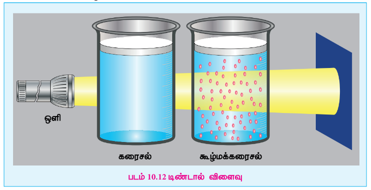

**(iii) நுண்வடிகட்டல்**

சாதாரண வடிதாளிலுள்ள நுண்துளைகள் கூழ்மத் துகள்களை கடந்து செல்ல அனுமதிக்கின்றன. நுண்வடிகட்டலில் பயன்படுத்தப்படும் சவ்வுகளானவை, கொல்லோடியன், பளிங்குத்தாள் அல்லது விஸ்கிங் கொண்டு தயாரிக்கப்படுகின்றன. இந்த நுண்வடிதாள்களைப் பயன்படுத்தி கூழ்மங்களை வடிகட்டும்போது, கூழ்மத்துகள்கள் வடிதாளிலேயே தங்குகின்றன. மேலும் மாசுகள் கழுவப்பட்டு நீக்கப்படுகின்றன.

அழுத்தத்தை பயன்படுத்தி இச்செயல்முறை விரைவாக்கப்படுகிறது. மின்பகுளிகளிடமிருந்து கூழ்மத் துகள்களை நுண்வடிதாள் வழியாக வடிகட்டி நீக்கும் செயல்முறையானது நுண்வடிகட்டல் என்றழைக்கப்படுகிறது. கொல்லோடியன் என்பது ஆல்கஹால் மற்றும் நீர்க்கலவையில் \( 4\% \) நைட்ரோ செல்லுலோஸ் கரைந்துள்ள கரைசலாகும்.

### 10.5.4 கூழ்மங்களின் பண்புகள்

**1) நிறம்:**

ஒரு கூழ்மத்தின் நிறமும், அதே சேர்மம் திரளாக இருக்கும்போது பெற்றிருக்கும் நிறமும் எப்பொழுதும் ஒன்றாக இருப்பதில்லை.எடுத்துக்காட்டாக, நீர்க்கப்பட்ட பாலின் நிறம் எதிரொளிக்கப்பட்ட ஒளியில் நீலநிறமாகவும், ஊடுருவிய ஒளியில் சிவப்பு நிறமாகவும் புலப்படுகிறது. கூழ்மக் கரைசலின் நிறமானது பின்வரும் காரணிகளை பொருத்தமைகிறது.

(i) தயாரிப்பு முறை
(ii) ஒளிமூலத்தின் அலைநீளம்.
(iii) கூழ்மத் துகளின் அளவு மற்றும் வடிவம்
(iv) எதிரொளிக்கப்பட்ட ஒளியிலா அல்லது ஊடுருவிய ஒளியிலா எதில் பார்வையாளர் நோக்குகிறார்?

**2) உருவளவு:**

கூழ்மத் துகள்களின் உருவளவு \( 1 \ \mathrm{nm} (10^{-9} \ \mathrm{m}) \) லிருந்து \( 1000 \ \mathrm{nm} (10^{-6} \ \mathrm{m}) \) விட்டம் வரை வேறுபடுகின்றன.

**3) கூழ்மக்கரைசல்கள் இரண்டு வெவ்வேறு நிலைகளைக் கொண்டுள்ள பலபடித்தான கலவைகள்:** கூழ்மப்பிரிப்பு, நுண்வடிகட்டல் மற்றும் மீமையவிலக்கம் ஆகிய சோதனைகள் கூழ்மக்கரைசல்களை பலபடித்தான தன்மை கொண்டவை என்பதை தெளிவாக காட்டினாலும், அண்மைக் காலங்களில் கூழ்மக் கரைசல்களானவை எல்லைக் கோட்டு வகைகளாகத்தான் கருதப்படுகின்றன.

**4) வடிதிறன்:**

சாதாரண வடிதாளில் உள்ள நுண்துளைகள் பெரியதாக இருப்பதால் கூழ்மத் துகள்கள் எளிதாக வடிதாளின் வழியே வடிந்து செல்கின்றன.

**5) வீழ்படிவாத் தன்மை:**

கூழ்மகரைசல்கள் அதிக நிலைப்புத் தன்மை வாய்ந்தவை.அதாவது, அவை புவிஈர்ப்பு விசையால் பாதிக்கப்படுவதில்லை.

**6) செறிவு மற்றும் அடர்த்தி**

நீர்க்கப்பட்ட நிலையிலுள்ள கூழ்மகரைசல்கள் அதிக நிலைப்புத் தன்மை கொண்டவை. ஊடகத்தின் கனஅளவு குறைக்கப்படும்போது திரிதல் நிகழ்கிறது. பொதுவாக, செறிவு குறையும்போது கூழ்மத்தின் அடர்த்தியும் குறைகிறது.

**7) விரவுத் திறன்**

உண்மைக் கரைசல்களைப் போல் இல்லாமல், சவ்வுகளின் வழியே கூழ்மங்கள் குறைந்தளவு விரவுத்திறனைக் கொண்டுள்ளன.

**8) தொகைசார் பண்புகள்**

கூழ்மக் கரைசல்கள் தொகைசார் பண்புகளைப் பெற்றுள்ளன. அதாவது, கொதிநிலை ஏற்றம், உறைநிலைத் தாழ்வு மற்றும் சவ்வூடு பரவல் அழுத்தம். கூழ்ம துகள்களின் மூலக்கூறு எடையை கணக்கிட சவ்வூடு பரவல் அழுத்த மதிப்புகள் பயன்படுகின்றன.

**9) கூழ்மதுகள்களின் வடிவம்** கூழ்மதுகள்களின் வெவ்வேறு வடிவங்களை அறிந்துகொள்ளுதல் மிக சுவாரசியமானதாகும். சில எடுத்துக்காட்டுகள் இங்கே கொடுக்கப்பட்டுள்ளன.

| கூழ்மக் கரைசலில் துகள்கள் | வடிவம் |
|---|---|
| \( As_2S_3 \) | கோள வடிவம் |
| \( Fe(OH)_3 \) கூழ்மம், நீலநிற கோல்டு கூழ்மம் | தட்டு வடிவம் |
| \( W_3O_5 \) கூழ்மம் (டங்ஸ்டன் அமில கூழ்மம்) | தண்டு வடிவம் |

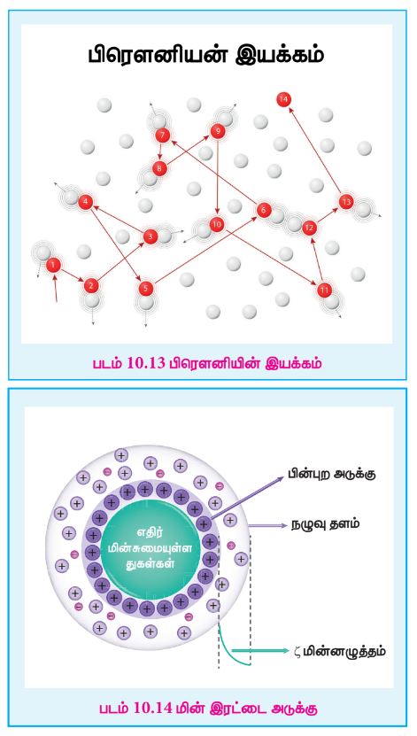

**10) ஒளியியல் பண்பு**

கூழ்மங்கள் ஒளியியல் பண்புகளைப் பெற்றுள்ளன. ஒரு ஒருபடித்தான கரைசலை, ஒளியின் திசையிலேயே காணும்போது அது தெளிவாக புலப்படுகிறது, ஆனால் செங்குத்து திசையில் இருண்டதாக புலப்படுகிறது.

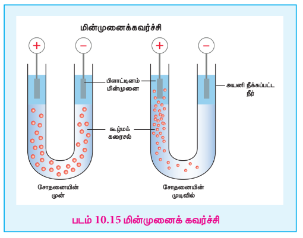

ஆனால் கூழ்மக் கரைசல் வழியே ஒளி பயணிக்கும்போது, அது எல்லா திசைகளிலும் சிதறடிக்கப்படுகிறது. இவ்விளைவானது ஃபாரடேயால் முதன்முதலில் கண்டறியப்பட்டது. ஆனால், டிண்டால் இதை தெளிவாக ஆராய்ந்தார், எனவே இது டிண்டால் விளைவு என்றழைக்கப்படுகிறது. கூழ்மத் துகள்கள் ஒளியின் ஒரு பகுதியை உறிஞ்சிக்கொள்கின்றன, ஒளியின் மீதமுள்ள பகுதியானது கூழ்மத்தின் புறப்பரப்பிலிருந்து எல்லா திசைகளிலும் சிதறடிக்கப்படுகிறது. எனவே ஒளியின் தடம் தெளிவாக புலப்படுகிறது.

**11) இயக்கவியல் பண்பு**

நீரில் மிதக்கவிடப்பட்ட மகரந்த துகள்களை நுண்ணோக்கி வழியே காணும்போது அவை சீரற்ற, தாறுமாறான இயக்கத்தை கொண்டிருப்பதை ராபர்ட் பிரௌன் கண்டறிந்தார்.இந்நிகழ்வு கூழ்மத் துகள்களின் பிரௌனியன் இயக்கம் என்றழைக்கப்படுகிறது. இதை பின்வருமாறு விளக்க முடியும். கூழ்மத் துகள்கள் தொடர்ந்து பிரிகை ஊடக மூலக்கூறுகளுடன் மோதுவதால் அவை தாறுமாறான, சீரற்ற, தொடர் இயக்கத்தை பெறுகின்றன.

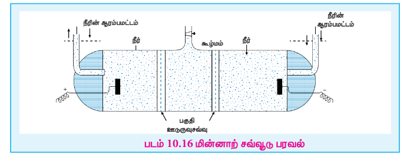

**பிரௌனியன் இயக்கத்தை பயன்படுத்தி நாம்,**

I. அவகேட்ரோ எண்ணை கணக்கிடலாம்.
II. வெப்பநிலை அதிகரிக்கும்போது துகள்களின் ஓயாத, அதிவேக இயக்கமும் அதிகரிப்பதாக கருதி இயக்கவியல் கொள்கையை உறுதிப்படுத்தலாம்.
III. கூழ்மங்களின் நிலைப்புத்தன்மையை புரிந்து கொள்ளலாம்: துகள்கள் தொடர்ந்து, அதிவேக இயக்கத்தில் இருப்பதால் ஒன்றுக்கொன்று நெருங்கி வந்து ஒன்றிணைவதில்லை.அதாவது, துகள்களின் மீது புவிஈர்ப்பு விசை செயல்படுவதை பிரௌனியன் இயக்கம் அனுமதிப்பதில்லை.

படம் 10.13 பிரௌனின் இயக்கம்

**12) மின்னா®் பண்பு**

**(i) ஹெல்ம்ஹோல்ட்ஸ் மின் இரட்டை அடுக்கு** கூழ்மத்துகளின் புறப்பரப்பின் தேர்ந்த பரப்புகவரும் தன்மையினால், ஒரு குறிப்பிட்ட வகை அயனிகள் மட்டுமே பரப்புகவரப்படுகின்றன. இந்த அடுக்கானது ஊடகத்திலுள்ள, எதிரான மின்சுமை கொண்ட அயனிகளை கவர்ந்திழுக்கிறது. எனவே, பிரிப்பு எல்லையில் மின் இரட்டை அடுக்கு அமைக்கப்படுகிறது.

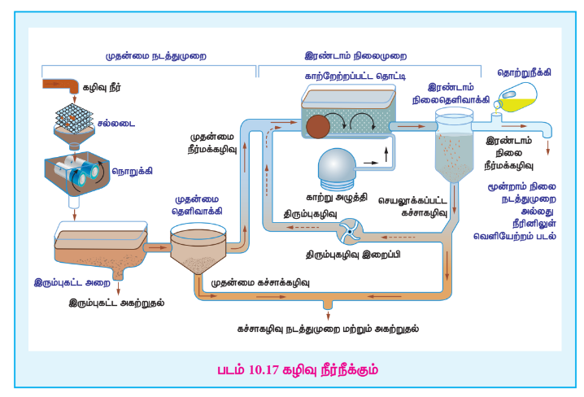

படம் 10.14 மின் இரட்டை அடுக்கு

இது ஹெல்ம்ஹோல்ட்ஸ் மின் இரட்டை அடுக்கு என்றழைக்கப்படுகிறது. அருகருகே உள்ள கூழ்மத்துகள்கள் ஒரே வகை மின்சுமையை பெற்றிருப்பதால் நெருங்கி வந்து ஒன்றிணைய முடியாது. எனவே இது கூழ்மத்தின் நிலைப்புத் தன்மையை விளக்குவதற்கு உதவுகிறது.

**(ii) மின்முனைக் கவர்ச்சி:**

நீர்விரும்பும் கூழ்மக்கரைசலில் அமிழ்த்தி வைக்கப்பட்டுள்ள பிளாட்டின மின்முனைகளின் வழியே மின்னழுத்த வேறுபாட்டை உருவாக்கும் போது பிரிகையடைந்த கூழ்ம துகள்கள் ஒரு குறிப்பிட்ட மின்முனையை நோக்கி நகருகின்றன. மின்புலத்தில் கூழ்மத் துகள்கள் நகரும் இந்த நிகழ்வானது மின்முனைக் கவர்ச்சி அல்லது எதிர் மின்வாய் தொங்கல்வு என்று அழைக்கப்படுகிறது. கூழ்மத் துகள்கள் எதிர்மின் முனையை நோக்கி நகர்ந்தால், அவை நேர்மின்சுமையை \( (+) \) பெற்றுள்ளன எனவும், நேர்மின்முனையை நோக்கி நகர்ந்தால், அவை எதிர்மின்சுமையை பெற்றுள்ளன எனவும் பொருள்

படம் 10.15 மின்முனைக் கவர்ச்சி

கொள்ளலாம். அதாவது கூழ்மத் துகளின் நகர்வு திசையை பொருத்து அவற்றின் மின்சுமையை நாம் தீர்மானிக்க முடியும். எனவே, மின்முனைக்கவர்ச்சியானது கூழ்மத் துகள்களின் மின்சுமையை கண்டறிய பயன்படுகிறது.

மின்முனைக்கவர்ச்சியை பயன்படுத்தி மின்சுமை கண்டறியப்பட்ட கூழ்மங்களுக்கான சில எடுத்துக்காட்டுகள் கீழே கொடுக்கப்பட்டுள்ளன.

| நேர்மின் சுமை கொண்ட கூழ்மங்கள் | எதிர்மின் சுமை கொண்ட கூழ்மங்கள் |
|---|---|
| ஃபெர்ரிக் ஹைட்ராக்சைடு | Ag, Au & Pt |
| அலுமினியம் ஹைட்ராக்சைடு | ஆர்சனிக் சல்பைடு |
| கார சாயங்கள் | களிமண் |
| ஹீமோகுளோபின் | ஸ்டார்ச் |

**(iii) மின்னா®் சவ்வூடு பரவல்**

ஒரு கூழ்மக்கரைசல் நடுநிலைத்தன்மை கொண்டது.எனவே கரைசலிலுள்ள பிரிகை துகள்களின் மின்சுமைக்கு சமமான ஆனால் எதிரான மின்சுமையை ஊடகம் பெற்றிருக்கும். கூழ்மத் துகள்களின் இயக்கம் தடை செய்யப்பட்டுள்ள போது, மின்புலத்தில் கூழ்மத்துகள்கள் நகரும் திசைக்கு எதிர்திசையில் ஊடகம் நகருகிறது. மின்புலத்தில் பிரிகை ஊடகம் நகரும் இச்செயல்பாடானது மின்னா®் சவ்வூடு பரவல் என்றமைக்கப்படுகிறது.

படம் 10.16 மின்னா®் சவ்வூடு பரவல்

**13. திரிந்துபோதல் அல்லது வீழ்படிவாதல்** கூழ்மத் துகள்களின் துகள்திரட்டல் மற்றும் அடியில் தங்குதல் நிகழ்வானது திரிந்துபோதல் என்றமைக்கப்படுகிறது.திரிந்துபோதலின் பல்வேறு முறைகள் கீழே கொடுக்கப்பட்டுள்ளன.

(i) மின்பகுளிகளை சேர்த்தல்
(ii) மின்முனைக் கவர்ச்சி
(iii) எதிரெதிர் மின்சுமை கொண்ட கூழ்மங்களை கலத்தல்
(iv) கொதிக்கவைத்தல்

**(i) மின்பகுளிகள் சேர்த்தல்**

ஒரு எதிர்மின் அயனியானது, நேர்மின்சுமை கொண்ட கூழ்மத்தினை வீழ்படிவாக்குகிறது. இதன் நேர்மாறும் உண்மை.

அயனியின் இணைதிறன் அதிகமாக உள்ள போது, அதன் விழ்படுவாக்கும் திறன் அதிகரிக்கிறது. எடுத்துக்காட்டாக,

சில நேர்மின் மற்றும் எதிர்மின் அயனிகளின் வீழ்படிவாக்கும் திறன் பின்வரும் வரிசையில் அமைகிறது.

\[ Al^{3+} > Ba^{2+} > Na^+ , \text{ இதேபோல } [Fe(CN)_6]^{3-} > SO_4^{2-} > Cl^- \]

\( 2 \) மணி நேரத்தில், ஒரு கூழ்மக்கரைசலை வீழ்படிவாக்குவதற்கு தேவைப்படும் குறைந்தபட்ச செறிவை (மில்லியோல்கள் / லிட்டர்) அளவிடுவதன் மூலம் ஒரு மின்பகுளியின் வீழ்படிவாக்கும் திறன் நிர்ணயிக்கப்படுகிறது. இந்த மதிப்பானது, துகள்திரட்டு மதிப்பு என்றமைக்கப்படுகிறது. துகள்திரட்டு மதிப்பு குறைவு எனில் வீழ்படிவாக்கும் திறன் அதிகம்.

**(ii) மின்முனைக்கவர்ச்சி:**

மின்முனைக் கவர்ச்சியின்போது மின்சுமை பெற்ற கூழ்மத் துகள்கள் எதிரான மின்சுமை பெற்ற மின்முனையை நோக்கி நகருகின்றன. இதற்கு காரணம் கூழ்மங்களின் மின்சுமை நடுநிலையாக்கப்பட வேண்டும் என்பதே ஆகும். துகள்கள் மின்சுமையை இழந்தவுடன் வீழ்படிவாக்கப்படுகின்றன.

**(iii) எதிரெதிர் மின்சுமை கொண்ட கூழ்மங்களை கலத்தல்**

எதிரெதிரான மின்சுமைகளைக் கொண்ட கூழ்மங்களை ஒன்றாக கலக்கும்போது, ஒன்றையொன்று திரிந்துபோகச் செய்கின்றன. துகள்களின் புறப்பரப்பிலிருந்து அயனிகள் வெளியேறுவதே இதற்கு காரணம்.

**(iv) கொதிக்கவைத்தல்**

கொதிக்கவைக்கும்போது, மோதல்கள் அதிகரிப்பதால், கூழ்மத் துகள்கள் ஒன்றிணைந்து வீழ்படிவாகின்றன.

**14. பாதுகாப்பு நடவடிக்கை:**

பொதுவாக, கரைப்பான் வெறுக்கும் கூழ்மங்கள் சிறிதளவு மின்பகுளிகள் இருந்தாலே எளிதில் வீழ்படிவாகின்றன. ஆனால், சிறிதளவு கரைப்பான் விரும்பும் கூழ்மம் சேர்த்து அவை நிலைப்படுத்தப்படுகின்றன.

கோல்டு கூழ்மத்தை பாதுகாக்க அதனுடன் சிறிதளவு ஜெலாட்டின் சேர்க்கப்படுகிறது.

| கூழ்மம் | கோல்டு எண் |
|---|---|
| ஜெலாட்டின் | \( 0.005-0.01 \) |
| முட்டை வெண்கரு | \( 0.08-0.10 \) |
| அரபு கோந்து | \( 0.1-0.15 \) |
| உருளைக்கிழங்கு ஸ்டார்ச் | \( 25 \) |

ஒரு கூழ்மத்தின் பாதுகாக்கும் திறனை அறிய சிக்கமாண்டி என்பவர் " கோல்டு எண்" எனும் சொற் பதத்தை உருவாக்கினார். \( 10 \ \mathrm{ml} \) கோல்டு கூழ்மத்துடன் \( 1 \ \mathrm{ml} \ 10\% \ NaCl \) கரைசலை சேர்த்தும்போது, வீழ்படிவாதலை தடுக்க தேவைப்படும் நீர்விரும்பும் கூழ்மத்தின் மில்லிகிராம் எண்ணிக்கையானது கோல்டு எண் என வரையறுக்கப்படுகிறது. கோல்டு எண் மதிப்பு குறைவு எனில் பாதுகாக்கும் திறன் அதிகம்.

## 10.6 பால்மங்கள்

பால்மங்கள் என்பவை ஒரு நீர்மத்தில் மற்றொரு நீர்மம் விரவியுள்ள கூழ்மக்கரைசல்களாகும். பொதுவாக இரண்டு வகையான பால்மங்கள் உள்ளன.

(i) எண்ணெய் விரவிய நீர் (O/W) (ii) நீர் விரவிய எண்ணெய் (W/O)

**எடுத்துக்காட்டு:**

கெட்டியான மசகுகள் (Stiff greases) என்பவை எண்ணெயில் நீர் விரவியுள்ள பால்மங்களாகும். அதாவது நீரானது உயவு எண்ணெயில் விரவச் செய்யப்பட்டுள்ளது.

ஒரு நீர்மத்தை, மற்றொரு நீர்மத்தில் விரவச் செய்து பால்மங்களை தயாரிக்கும் செயல்முறையானது பால்மமாக்கல் என்றழைக்கப்படுகிறது.

இரண்டு நீர்மங்களை கலக்குவதற்காக, கூழ்ம ஆலையை ஒருபடித்தாக்கியாக பயன்படுத்திக் கொள்ள முடியும். அதிக நிலைப்புத் தன்மை கொண்ட பால்மத்தை பெற அதனுடன் சிறிதளவு பால்மமாக்கி அல்லது பால்மமாக்கும் காரணி சேர்க்கப்படுகிறது.

பல்வேறு வகை பால்மக் காரணிகள் உள்ளன.

i. பெரும்பாலான கரைப்பான் விரும்பும் கூழ்மங்களும் பால்மமாக்கிகளாக செயல்படுகின்றன. எடுத்துக்காட்டு: பசை, ஜெலாட்டின்.
ii. சோப்பு மற்றும் சல்பானிக் அமிலங்கள் போன்ற முனைவுற்ற தொகுதிகளுடன் கூடிய நீண்ட சங்கிலிச் சேர்மங்கள்.
iii. களிமண் மற்றும் விளக்குக் கரி போன்ற நீரில் கரையாத மாவுப் பொருட்களும் பால்மாக்கிகளாக செயல்படுகின்றன.

### பால்மத்தின் வகையை கண்டறிதல்:

பின்வரும் சோதனைகளின் மூலம் இருமுக பால்மங்களை கண்டறிய முடியும்.

**(i) சாய சோதனை:**

சிறிதளவு எண்ணெய்யில் கரையும் சாயம் பால்மத்துடன் சேர்த்து நன்கு குலுக்கப்படுகிறது. நீர்ம பால்மம் சாயத்தின் நிறத்தை ஏற்பதில்லை. ஆனால், எண்ணெய் பால்மமானது சாயத்தின் நிறத்தை ஏற்கிறது.

**(ii) பாகுநிலை சோதனை**

பால்மத்தின் பாகுநிலைத் தன்மையானது சோதனைகள் மூலம் கண்டறியப்படுகிறது. எண்ணெய் பால்மங்கள் , நீர்ம பால்மங்களை விட அதிக பாகுநிலைத் தன்மையை பெற்றுள்ளன.

**(iii) கடத்துத்திறன் சோதனை**

நீர்ம பால்மங்களின் கடத்துத்திறன் எப்பொழுதும் எண்ணெய் பால்மங்களை விட அதிகம்.

**(iv) பரவுதல் சோதனை**

பால்மங்களை எண்ணெய் பரப்பின்மீது பரவச் செய்யும்போது, நீர்ம பால்மங்களைவிட எண்ணெய் பால்மங்கள், எளிதாக பரவுகின்றன.

### 10.6.1 பால்மச் சிதைவு

பால்மங்களை இரண்டு தனித்தனி அடுக்குகளாக பிரிக்க முடியும். இச்செயல்முறையானது பால்மச் சிதைவு என்றழைக்கப்படுகிறது.

1. ஒரு பகுதிக்கூறு மட்டும் வாலைவடித்தல்
2. ஒரு மின்பகுளியை சேர்த்து மின்சுமையை தகுத்தல்.
3. வேதி முறைகளை பயன்படுத்தி பால்மக் காரணிகளை சிதைத்தல்.
4. கரைப்பான் சாறு இறக்குதல் முறையை பயன்படுத்தி ஒரு பகுதிக்கூறை நீக்குதல்.
5. ஒரு பகுதிக்கூறு மட்டும் உறைய வைத்தல்.
6. மையவிலக்கு விசையை செலுத்துதல்.
7. நீர் விரவிய எண்ணெய் (W/O) வகை பால்மத்துடன் நீர்நீக்கும் காரணிகளை சேர்த்தல்.
8. மீயொலி அலைகளை பயன்படுத்துதல்.
9. உயர் அழுத்தத்தில் வெப்பப்படுத்துதல்.

### நிலைமை நேர்மாற்றம்

W/O பால்மத்தை O/W பால்மமாக மாற்றும் செயல்முறையானது நிலைமை நேர்மாற்றம் என்றமைக்கப்படுகிறது.

**எடுத்துக்காட்டாக:**

பொட்டாசியம் சோப்பை பால்மக்காரணியாக கொண்ட எண்ணெய் விரவிய நீர் பால்மத்துடன் \( CaCl_2 \) அல்லது \( AlCl_3 \) ஆகியவற்றை சேர்ப்பதனால் அதை நீர் விரவிய எண்ணெய் பால்மமாக மாற்ற முடியும்.இந்த நிலைமை நேர்மாற்ற விளைவையானது அதிமுக்கிய ஆராய்ச்சிகளில் பயன்படுத்தப்படுகிறது.

## 10.7 கூழ்மங்களின் பல்வேறு பயன்கள்

வாழ்வின் ஒவ்வொரு அங்கத்திலும் கூழ்மங்கள் முக்கிய பங்காற்றுகின்றன. மனித உடலானது எண்ணிலடங்கா கூழ்மநிலை கரைசல்களை கொண்டுள்ளன. நமது உடலிலுள்ள இரத்தம், தாவர மற்றும் விலங்கு செல்களிலுள்ள புரோட்டோபிளாஸ்மா மற்றும் நமது இரைப்பையிலுள்ள கொழுப்பு ஆகியன பால்மங்களாக உள்ளன. பாலிஸ்டைரின், சிலிக்கோன்கள் மற்றும் PVC போன்ற தொகுப்பு பலபடிகளும் கூழ்மங்களே ஆகும்.

உணவுகள் பால், கிரீம், வெண்ணெய், ஆகிய உணவுப் பொருட்கள் கூழ்மநிலையில் உள்ளன.

**மருந்துகள்:**

ஊசி மூலம் செலுத்துவதற்கு ஏற்றவாறு, பெனிசிலின் மற்றும் ஸ்ட்ரெப்டோமைசின் போன்ற எதிர் நுண்ணுயிரி மருந்துகள் கூழ்மநிலையில் தயாரிக்கப்படுகின்றன. கூழ்மநிலையுள்ள கோல்டு மற்றும் கூழ்மநிலையுள்ள கால்சியம் ஆகியன பானிகளில் பயன்படுகிறது. மெக்னீஷியா பால்மம் வயிற்று உபாதைகளை சரி செய்ய பயன்படுகிறது. ஜெலாட்டினால் பாதுகாக்கப்பட்ட சில்வர் கூழ்மமானது ஆர்ஜிரால் என அறியப்படுகிறது. இது கண் மருந்துகளில் பயன்படுகிறது.

**தொழிற்சாலைகளில்** கூழ்மங்கள் பல்வேறு தொழிற் பயன்களைப் பெற்றுள்ளன.

**(i) நீர்க்கதிகரிப்பு:**

\( Al^{3+} \) அயனிகளைக் கொண்டுள்ள படிகாரங்களை பயன்படுத்தி, குடிநீரிலுள்ள மிதக்கும் மாசுகளை திரியச் செய்தல் மூலம் குடிநீர் சுத்திகரிக்கப்படுகிறது.

**(ii) சலவைத் தொழில்:**

துணிகளிலுள்ள அழுக்கு மற்றும் எண்ணெய் படிவுடன், சோப்பு மூலக்கூறுகள் சேர்ந்து பால்மங்கள் உருவாவதால் சோப்புகள் அழுக்கு நீக்கிகளாக செயல்படுகின்றன.

**(iii) தோல் பதனிடுதல்:**

விலங்குத் தோல் என்பது நேர்மின் துகள்களைக் கொண்ட புரதங்களாகும். இவற்றுடன் பூனின் சேர்த்து, திரியச் செய்து விரைப்பான தோல் பெறப்பட்டு பயன்படுத்தப்படுகிறது. இதற்காக குரோமியம் உப்புகள் பயன்படுத்தப்படுகின்றன. இவ்வகை குரோம் பதனிடுதல் மூலம் மிருதுவான, பளபளப்பான தோலை தயாரிக்க முடியும்.

**(iv) ரப்பர் தொழில்:**

இயற்கை ரப்பரின் ரப்பர் பாலானது எதிர்மின் துகள்களைக் கொண்ட ஒரு பால்மமாகும். சல்பருடன் சேர்த்து ரப்பரை வெப்பப்படுத்தி வல்கனைஸ் செய்யப்பட்ட ரப்பர் தயாரிக்கப்படுகிறது. இது டயர்கள், டியூப்கள் போன்றவற்றை தயாரிக்க பயன்படுகிறது.

**(v) கழிவுநீர் நீக்கம்:**

கழிவுநீரானது நீரில் பிரிகையடைந்த அழுக்கு, மண் மற்றும் கழிவுகளை கொண்டுள்ளது. இதில் மின்சாரத்தை செலுத்தும்போது கழிவுப் பொருட்கள் வீழ்படிவாகின்றன. இவை உரங்களாக பயன்படுத்தப்படுகின்றன.

**(vi) காட்ரெல் வீழ்படிவாக்கி**

காற்றிலுள்ள கார்பன் துகள்கள் காட்ரெல் வீழ்படிவாக்கியால் வீழ்படிவாக்கப்படுகின்றன. இதில், ஏற்ததாழ \( 50,000 \ \mathrm{V} \) மின்னழுத்த வேறுபாடு பயன்படுத்தப்படுகிறது. கார்பன் துகள்கள் மீதுள்ள மின்சுமை நடுநிலையாக்கப்பட்டு வீழ்படிவாக்கப்படுகிறது. அதாவது, கார்பன் துகள்களற்ற காற்று கிடைக்கிறது.

**(vii) காற்றிலுள்ள தூசித் துகள்களின் டிண்டால் விளைவால்** வானம் நீல நிறமாக உள்ளது.

**(viii) டெல்டா உருவாதல்:**

கடலும் ஆற்றுநீரும் ஒன்றாக சந்திக்கும் இடத்தில் அவற்றிலுள்ள மின்பகுளிகள், ஆற்றுநீரிலுள்ள திண்மத் துகள்களை திரியச் செய்கின்றன. இதனால் பூமியானது விளைநிலமாக மாறுகிறது.

**(ix) பகுப்பாய்வு பயன்பாடுகள்**

பண்பறி மற்றும் பருமனறி பகுப்பாய்வுகள், கூழ்மங்களின் பல்வேறு பண்புகளை அடிப்படையாக கொண்டவைகளாகும்.

எனவே, நமது வாழ்வில் கூழ்மங்களின் பயன்பாடுகள் உள்ளடங்காத துறைகள் எதுவுமே இல்லை எனும் முடிவுக்கு வர இயலும்.

இயற்கைத் தேன் ஒரு கூழ்மமாகும்.இதை செயற்கைத் தேனிலிருந்து வேறுபடுத்தி அறிய இதனுடன் அம்மோனியா கலந்த \( AgNO_3 \) கரைசல் சேர்க்கப்படுகிறது. இயற்கைத் தேனாக இருந்தால் உலோக சில்வர் உருவாகும். மேலும் இக்கரைசலானது பாதுகாக்கப்பட்ட கூழ்மங்களான ஆல்புமின் அல்லது ஈதர் கலந்த எண்ணெய் ஆகியவற்றை மிகக் குறைந்தளவில் கொண்டிருப்பதால் வெளிர் மஞ்சள் நிறத்தை பெற்றுள்ளது. செயற்கைத் தேனாக இருந்தால் அடர் மஞ்சள் அல்லது பசுமை கலந்த மஞ்சள் நிற வீழ்படிவைத் தருகிறது.

## மதிப்பீடு

### சரியான விடையை தேர்ந்தெடுத்து எழுதுக.

1. \( \log \frac{x}{m} \) மதிப்புகளை \( \log p \) மதிப்புகளுக்கு எதிராக கொண்டு வரைபடத்தில் ஃபிரண்டலிச் சமவெப்பக் கோடு வரையப்பட்டுள்ளது. கோட்டின் சாய்வு மற்றும் அதன் y – அச்சு வெட்டுத்துண்டு மதிப்புகள் முறையே குறிப்பிடுவது

அ) \( \frac{1}{n} , k \) ஆ) \( \log \frac{1}{n} , k \) இ) \( \frac{1}{n} , \log k \) ஈ) \( \log \frac{1}{n} , \log k \)

2. இயற்புறப்பரப்பு கவர்ச்சிக்கு பின்வருவனவற்றுள் எது தவறானது?

அ) மீள்தன்மை கொண்டது
ஆ) வெப்பநிலை அதிகரிக்கும்போது அதிகரிக்கிறது
இ) பரப்பு கவர்தல் வெப்பம் குறைவு
ஈ) புறப்பரப்பு பரப்பளவு அதிகரிக்கும்போது அதிகரிக்கிறது

3. பின்வரும் பண்புகளில் பரப்பு கவர்தலுடன் தொடர்புடையது எது? (NEET)

அ) \( \Delta G \) மற்றும் \( \Delta H \) எதிர்குறி மதிப்பையும் ஆனால் \( \Delta S \) நேர்குறி மதிப்பையும் பெற்றுள்ளன.
ஆ) \( \Delta G \) மற்றும் \( \Delta S \) எதிர்குறி மதிப்பையும் ஆனால் \( \Delta H \) நேர்குறி மதிப்பையும் பெற்றுள்ளன.
இ) \( \Delta G \) எதிர்குறி மதிப்பையும் ஆனால் \( \Delta H \) மற்றும் \( \Delta S \) நேர்குறி மதிப்பையும் பெற்றுள்ளன.
ஈ) \( \Delta G , \Delta H \) மற்றும் \( \Delta S \) அனைத்தும் எதிர்குறி மதிப்பை பெற்றுள்ளன.

4. மூடுபனி என்பது எவ்வகை கூழ்மம்?

அ) வாயுவில் திண்மம்
ஆ) வாயுவில் வாயு
இ) வாயுவில் நீர்மம்
ஈ) நீர்மத்தில் வாயு

5. கூற்று : \( Al^{3+} \) அயனியின் வீழ்படிவாக்கும் திறன் \( Na^+ \) அயனியை விட அதிகம்.

காரணம்: சேர்க்கப்பட்ட துகள்திரட்டு அயனியின் இணைதிறன் அதிகமாக உள்ள போது, அதன் வீழ்படிவாக்கும் திறனும் அதிகம்.

அ) கூற்று மற்றும் காரணம் இரண்டும் சரி. மேலும், காரணம் கூற்றிற்கான சரியான விளக்கமாகும்.
ஆ) கூற்று மற்றும் காரணம் இரண்டும் சரி. ஆனால், காரணம் கூற்றிற்கான சரியான விளக்கமல்ல.
இ) கூற்று சரி ஆனால் காரணம் தவறு.
ஈ) கூற்று மற்றும் காரணம் இரண்டும் தவறு.

6. கூற்று: காயத்தால் உண்டாகும் இரத்தக் கசிவை தடுக்க ஃபெர்ரிக் குளோரைடை பயன்படுத்த முடியும். இக்கூற்றை நியாயப்படுத்தும் சரியான விளக்கம் எது?

அ) இது உண்மையில், ஃபெர்ரிக் குளோரைடு நச்சுத் தன்மை கொண்டது.
ஆ) இது உண்மை, இரத்தம் என்பது ஒரு எதிர்மின்சுமை கொண்ட கூழ்மமாகும். \( Fe^{3+} \) அயனிகள் இரத்தத்தை திரியச் செய்கின்றன.
இ) இது உண்மையில், ஃபெர்ரிக் குளோரைடு ஓர் அயனிச் சேர்மமாகும், இது இரத்த ஒட்டத்தில் கலக்கிறது.
ஈ) இது உண்மை, \( Cl^- \) அயனியுடன் சேர்ந்து எதிர்மின் கூழ்மம் உருவாவதால் திரிதல் நிகழ்கிறது.

7. தைலமுடி கிரீம் என்பது ஒரு

அ) களி
ஆ) பால்மம்
இ) திண்மக் கூழ்மம்
ஈ) கூழ்மக் கரைசல்

8. பின்வருவனவற்றுள் எது சரியாக பொருந்தியுள்ளது?

அ) பால்மம் - புகை
ஆ) களி - வெண்ணெய்
இ) நுரை - பனிமூட்டம்
ஈ) கலக்கப்பட்ட கிரீம் - கூழ்மக் கரைசல்

9. \( As_2S_3 \) கூழ்மத்தை திரியச் செய்ய மிகவும் பயனுள்ள மின்பகுளி

அ) NaCl
ஆ) \( Ba(NO_3)_2 \)
இ) \( K_3[Fe(CN)_6] \)
ஈ) \( Al_2(SO_4)_3 \)

10. பின்வருவனவற்றுள் எந்த ஒன்று பரப்பு இழுவிசை குறைப்பி அல்ல?

அ) \( CH_3-(CH_2)_{15}-\overset{+}{N}-(CH_3)_2 \ CH_2Br \)
ஆ) \( CH_3-(CH_2)_{15}-NH_2 \)
இ) \( CH_3-(CH_2)_{16}-CH_2 \ OSO_2^- \ Na^+ \)
ஈ) \( OHC-(CH_2)_{14}-CH_2-COO^- \ Na^+ \)

11. ஒரு கூழ்மக்கரைசல் வழியே ஒளிக்கற்றையை செலுத்தும் போது காணக்கிடைக்கும் நிகழ்வு

அ) எதிர்மின்வாய் தொங்கல்
ஆ) மின்முனைக்கவர்ச்சி
இ) திரிதல்
ஈ) டிண்டால் விளைவு

12. மின்புலத்தில் வைக்கப்பட்டுள்ள ஒரு கூழ்மநிலை அமைப்பிலுள்ள துகள்கள் எதிர்மின்முனையை நோக்கி நகருகின்றன.அதே கூழ்மக்கரைசலின் திரிதல் நிகழ்வானது \( K_2SO_4 \) (i), \( Na_3PO_4 \) (ii), \( K_4[Fe(CN)_6] \) (iii) மற்றும் \( NaCl \) (iv) ஆகியவற்றைக் கொண்டு ஆய்வு செய்யப்படுகிறது. அவற்றின் வீழ்படிவாகும் திறன்

அ) II > I > IV > III
ஆ) III > II > I > IV
இ) I > II > III > IV
ஈ) இவற்றில் எதுவுமில்லை

13. கொல்லோடியன் என்பது பின்வருவனவற்றுள் எதன் ஆல்கஹால்- ஈதர் கலவையில் \( 4\% \) கரைசலாகும்?

அ) நைட்ரோகிளிசரின்
ஆ) செல்லுலோஸ் அசிட்டேட்
இ) கிளைகால் டைநைட்ரேட்
ஈ) நைட்ரோசெல்லுலோஸ்

14. பின்வருவனவற்றுள் எது ஒருபடித்தான வினைவேக மாற்றத்திற்கு எடுத்துக்காட்டு?

அ) ஹேபர் முறையில் அம்மோனியா தயாரித்தல்
ஆ) தொடு முறையில் கந்தக அமிலம் தயாரித்தல்
இ) எண்ணெய்களின் ஹைட்ரஜனேற்றம்
ஈ) நீர்த்த HCl முன்னிலையில் சுக்ரோஸின் நீராற்பகுத்தல்

15. பின்வருவனவற்றை பொருத்துக

| A) \( V_2O_5 \) | i) உயர் அடர்த்தி பாலிஎதிலின் |
|---|---|
| B) ஜீக்லர்- நாட்டா | ii) PAN |
| C) பெராக்சைடு | iii) \( NH_3 \) |
| D) தூளாக்கப்பட்ட Fe | iv) \( H_2SO_4 \) |

அ) (iv)(i)(ii)(iii)
ஆ) (i)(ii)(iv)(iii)
இ) (ii)(iii)(iv)(i)
ஈ) (iii)(iv)(i)(ii)

16. \( As_2S_3 \) கூழ்மத்தை வீழ்படிவாக்கும் மின்பகுளிகள் வீழ்படிவாக்கும் திறன் மதிப்புகள் மில்லியோல்கள் /லிட்டர் அலகில் கீழே கொடுக்கப்பட்டுள்ளன.

\[ (I) (NaCl) = 52 \qquad (II) (BaCl_2) = 0.69 \qquad (III) (MgSO_4) = 0.22 \]

வீழ்படிவாக்கும் திறன்களின் சரியான வரிசை

அ) III > II > I
ஆ) I > II > III
இ) I > III > II
ஈ) II > III > I

17. ஒரு வாயுவானது, ஒரு திண்ம உலோக பரப்பின்மீது பரப்பு கவரப்படுதல் என்பது தன்னிச்சையான மற்றும் வெப்பம் உமிழ் நிகழ்வாகும், ஏனெனில்

அ) \( \Delta H \) அதிகரிக்கிறது
ஆ) \( \Delta S \) அதிகரிக்கிறது
இ) \( \Delta G \) அதிகரிக்கிறது
ஈ) \( \Delta S \) குறைகிறது

18. x என்பது பரப்புகவர் பொருளின் அளவு, m என்பது பரப்புப் பொருளின் அளவு எனக்கொண்டால், பின்வரும் தொடர்புகளில் பரப்பு கவர்தல் செயல்முறையுடன் தொடர்பில்லாதது எது?

அ) மாறாத T யில் \( x/m = f(P) \)
ஆ) மாறாத P யில் \( x/m = f(T) \)
இ) மாறாத \( x/m \) யில் \( P = f(T) \)
ஈ) \( x/m = PT \)

19. ஒரு அயனியின் வீழ்படிவாக்கும் திறன் பின்வரும்பண்புகளில் எதைச் சார்ந்து அமைந்துள்ளது? (NEET - 2018)

அ) அயனியின் மின்சுமையாவு மற்றும் மின்சுமையின் குறி.
ஆ) அயனியின் உருவளவை மட்டும்
இ) அயனியின் மின்சுமையாவை மட்டும்
ஈ) அயனியின் மின்சுமையின் குறியை மட்டும்

20. பொருத்துக

| A) தாது நைட்ரஜன் | i) குளோரின் |
|---|---|
| B) வேறுப் பிரிகை முறை | ii) கந்தக அமிலம் |
| C) தொடு முறை | iii) அம்மோனியா |
| D) டக்கான் முறை | iv) சோடியம் அசைடு அல்லது பேரியம் அசைடு |

அ) (i) (ii) (iii) (iv)
ஆ) (ii) (iv) (i) (iii)
இ) (iii) (iv) (ii) (i)
ஈ) (iv) (iii) (ii) (i)

### சிறு வினாக்கள்

1. இயற்புறப்பரப்பு கவர்தலின் சிறப்புப் பண்புகள் இரண்டை தருக.
2. இயற்புறப்பரப்பு கவர்தல், வேதிப்புறப்பரப்பு கவர்தல் வேறுபடுத்துக.
3. வேதிப்புறப்பரப்பு கவர்தலில், வெப்பநிலை அதிகரிக்கும்போது பரப்பு கவர்தலானது முதலில் அதிகரித்து பின்னர் குறைகிறது ஏன்?
4. \( NH_3 \) அல்லது \( O_2 \) ஆகிய இரண்டில் எது கரியின் புறப்பரப்பில் எளிதில் பரப்புகவரப்படும்? ஏன்?
5. இயற்புறப்பரப்பு கவர்தலை காட்டிலும் வேதிப்புறப்பரப்பு கவர்தலின் பரப்பு கவர்தல் வெப்பம் அதிகம் ஏன்?
6. வீழ்படிவை கூழ்மக் கரைசலாக மாற்றுவதற்காக கூழ்மமாக்கி சேர்க்கப்படுகிறது. இக்கூற்றை எடுத்துக்காட்டுடன் விளக்குக.
7. கூழ்மநிலையிலுள்ள \( Fe(OH)_3 \) மற்றும் \( As_2S_3 \) ஆகியவற்றை ஒன்றாக கலக்கும்போது நிகழ்வதென்ன?
8. கூழ்மம் மற்றும் களி ஆகியவற்றிற்கிடையே உள்ள வேறுபாடுகள் யாவை?
9. கரைப்பான் விரும்பும் கூழ்மங்கள், கரைப்பான் வெறுக்கும் கூழ்மங்களை விட அதிக நிலைப்புத் தன்மை வாய்ந்தவை. ஏன்?
10. படிகாரங்கள் சேர்ப்பதால் நீர் சுத்திகரிக்கப்படுகிறது. ஏன்?
11. ஒரு திண்மத்தின் மீது ஒரு வாயு மூலக்கூறுகள் பரப்பு கவரப்படுதலை பாதிக்கும் காரணிகள் யாவை?
12. நொதிகள் என்றால் என்ன? நொதி வினைவேக மாற்றத்தின் வினைவழிமுறை பற்றி குறிப்பு வரைக.
13. வினைவேக மாற்றியின் செயல்பாடு மற்றும் தெரிவுத்திறன் பற்றி நீவிர் அறிவது என்ன?
14. ஜியோலைடுகள் வினைவேக மாற்றத்தின் சில சிறப்புப் பண்புகளை விரி.
15. பால்மங்களின் மூன்று பயன்களை எழுதுக.
16. நனைக்கப்பட்ட படிகாரத்தை தேய்க்கும்போது இரத்தக் கசிவு நிறுத்தப்படுவது ஏன்?
17. ஒரு பொருள் நல்ல வினைவேக மாற்றியாக திகழ பரப்பு நீக்கம் அவசியம். ஏன்?
18. கூறை பற்றி கருத்துரைக்க: கூழ்மம் என்பது ஒரு சேர்மமல்ல, ஆனால் அது சேர்மத்தின் ஒரு குறிப்பிட்ட நிலையாகும்.
19. ஏதேனும் ஒரு திரிதல் முறையை விளக்குக.
20. மின்னா®் சவ்வூடு பரவல் பற்றி குறிப்பு வரைக.
21. வினைவேகமாற்ற நச்சுகள் பற்றி குறிப்பு வரைக.
22. வினைவேக மாற்றம் பற்றிய இடைநிலைச் சேர்மம் உருவாதல் கொள்கையை ஒரு எடுத்துக்காட்டுடன் விளக்குக.
23. ஒருபடித்தான மற்றும் பலபடித்தான வினைவேக மாற்றங்களுக்கிடையே உள்ள வேறுபாடுகள் யாவை?
24. வினைவேக மாற்றம் பற்றிய பரப்பு கவர்தல் கொள்கையை விரி.
