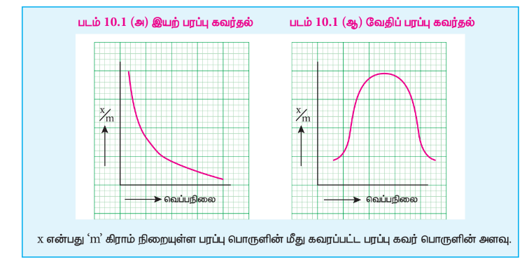
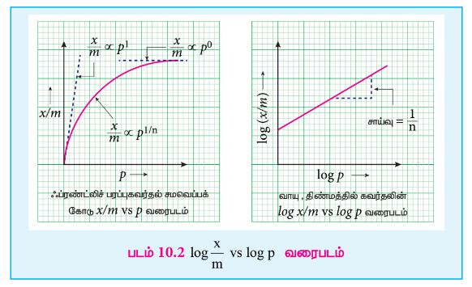
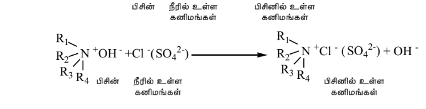

## 10.1 பரப்பு கவர்தல் மற்றும் உறிஞ்சுதல்

திண்ம பரப்பில் உள்ள பிணைக்கப்படாத இணைதிறன் அல்லது எச்ச விணசகளின் காரணமாக திண்ம புறப்பரப்பானது அதன் அருகாமையிலுள்ள பொருட்களை கவர்ந்திழுக்கும் திறணைப் பெற்றுள்ளன.எடுத்துக்காட்டாக,

அம்மோனியாவை கரி பரப்பு கவர்தல், நீர் மூலக்கூறுகளை சிலிக்காளெல் பரப்புகவர்தல், சர்க்கரையிலுள்ள நிறமிகளை கரி பரப்பு கவர்தல்.

பரப்பு கவர்தல் என்பது ஒரு புறப்பரப்பு நிகழ்வு தான் என்பதை இந்த எடுத்துக்காட்டுகள் காட்டுகின்றன. பரப்பு கவர்தலுக்கு மாறாக, உறிஞ்சுதல் என்பது ஒரு திரள் நிகழ்வாகும்.அதாவது, பரப்புகவர் பொருள் மூலக்கூறுகள் பரப்பு பொருளின் திரள் முழுவதும் விரவியுள்ளது.

* எந்த பொருளின் மீது பரப்பு கவர்தல் நிகழ்கிறதோ அது பரப்புப் பொருள் ஆகும்.
* பரப்புகவரப்பட்ட பொருளானது பரப்புகவர் பொருள் எனவும் அழைக்கப்படுகின்றன.
* இரண்டு நிலைமைகளை பிரிக்கும் இடைபரப்பானது இடைப்பட்ட நிலைமை என அறியப்படுகிறது. மூலக்கூறுகள் பரப்பு கவரப்படுவதால், இடைமுகப்பில் மூலக்கூறுகளின் செறிவு அதிகரித்து காணப்படுகிறது.
* இடைமுகப்பில் பொருளின் செறிவு அதிகமாக காணப்படின் அது நேர்மறை பரப்பு கவர்தல் எனவும், மூலக்கூறுகளின் செறிவு குறைவாக காணப்படின் அது எதிர்மறை பரப்பு கவர்தல் என்றமழக்கப்படுகிறது.
* பரப்புகவரப்பட்ட பொருளானது புறப்பரப்பிலிருந்து நீக்கமடையச் செய்யும் செயல்முறையானது "பரப்பு நீக்கம்" என்றமைக்கப்படுகிறது.
* He, Ne, \( O_2 \), \( N_2 \), \( SO_2 \) மற்றும் \( NH_3 \) போன்ற வாயுக்களும், NaCl அல்லது KCl ஆகியவற்றின் கரைசல்களும் தகுந்த பரப்பு பொருட்களால் பரப்புகவரப்படுகின்றன.இந்தமூலக்கூறுகள் பரப்புகவர் பொருட்கள் என குறிப்பிடப்படுகின்றன.
* சிலிக்கா ஜல், Ni, Cu, Pt, Ag மற்றும் Pd போன்ற உலோகங்களும் மற்றும் சில கூழ்மங்களும் பரப்பு பொருட்களாக செயல்பட முடியும்.

### பரப்பு கவர்தனின் சிறப்பியல்புகள்:

1. பரப்பு கவர்தல் அனைத்து வகை இடைப்பரப்புகளிலும் நிகழ முடியும். அதாவது, வாயு-திண்மம், நீர்மம்- திண்மம், நீர்மம்-நீர்மம், திண்மம்- திண்மம் மற்றும் வாயு-நீர்மம் என எல்லா வகை இடைபரப்புகளுக்கிடையேயும் பரப்பு கவர்தல் நிகழ்கிறது.
2. பரப்பு கவர்தல் ஒரு தன்னிச்சையான செயல்முறையாகும், மேலும் இது எப்பொழுதும் கட்டினா ஆற்றல் குறையும் வகையில் நிகழ்கிறது. \( \Delta G \) மதிப்பு பூஜ்ஜியமாகும் போது, சமநிலை எப்பெபுகிறது. நாமறிந்தபடி, \( \Delta G = \Delta H - T \Delta S \) இங்கு \( \Delta G \) என்பது கட்டினா ஆற்றலில் ஏற்படும் மாற்றம், \( \Delta H \) என்பது என்தால்பி மாற்றம், மற்றும் \( \Delta S \) என்பது என்படோரி மாற்றம்.
3. மூலக்கூறுகள் பரப்புகவரப்பட்டுள்ள போது, மூலக்கூறுகளின் ஒழுங்கற்ற தன்மை எப்பொழுதும் குறைகிறது.அதாவது, \( \Delta S < 0 \) மற்றும் \( T \Delta S \) எதிர்குறி மதிப்பை பெறுகிறது, எனவே,பரப்பு கவர்த்தெரு வெப்பம் உமிழ் செயல்முறையாகும். பரப்பு கவர்தல் மிக விரைவான செயல்முறையாகும். ஆனால், உட்கவர்தல் மெதுவாக நிகழும் செயல்முறையாகும்.

M.C. பெயின் என்பவர் ஒரே நேரத்தில் ஒன்றாக நிகழும் பரப்பு கவர்தல் மற்றும் உட்கவர்தலை குறிப்பிடுவதற்காக 'sorption' (கவர்தல்) என்ற சொல்லை பயன்படுத்தினார். உலோகப்பரப்புகளினில் நிகழும் வாயுக்களின் பரப்பு கவர்தல் மற்றும் உறிஞ்சதலை குறிப்பிட T. கிரஹாம் என்பவர் occlusion (மறைத்தல்) என்ற சொல்லை பயன்படுத்தினார்.

### 10.1.1 பரப்பு கவர்தனின் வகைகள்:

பரப்புப் பொருளுக்கும், பரப்புகவரப்படும் பொருளுக்கும் இடையே செயல்படும் விசைகளின் தன்மையைப் பொருத்து பரப்பு கவர்தலானது, இயற்புறப்படும் கவர்தல் மற்றும் வேதிப்புறப்படும் கவர்தல் என வகைப்படுத்தப்படுகிறது. வேதிப்புறப்படும் கவர்தலில், வாயுவலக்கூறுகள் புறப்படப்படன் வேதிப்பினைப்புகளை உருவாக்குவதன் மூலம் இறுத்தி வைக்கப்பட்டுள்ளன. வலுவான பினைப்பு உருவாவதால், பரப்பு கவர்தலின் போது ஏறத்தாழ \( 400 \ \mathrm{kJ/mol} \) ஆற்றல் வெப்பமாக உமிழ்ப்படுகிறது. 

**எடுத்துக்காட்டுகள்:**

* பங்ஸ்டனின் புறப்பரப்பின் மீது \( O_2 \) வாயு பரப்பு கவரப்பருத்த, நிக்கல் புறப்பரப்பின் மீது \( H_2 \) வாயு பரப்பு கவரப்பருத்த, நிக்கல் பறப்பரப்பின் மீது எத்தில் ஆல்கஹால் ஆவி பரப்பு கவரப்பருத்த.

இயற்புறப்படிப் கவர்தலில், பரப்பப் பொருளுக்கும், பரப்புகவரப்படும் பொருளுக்கும் இடையே வாண்டர் வால்ஸ் விசை, இருமுனை- இருமுனை இடையீருகள், சினதவு விசைகள் போன்ற இயற்விசைகள் செயல்படுகின்றன. இந்த விசைகள் வலிமை குனைந்தவைகளாக இருப்பதால் பரப்பு கவர்தல் வெப்பம் குனைவாக உள்ளது. மேலும், இயற்புறப்படிப் கவர்தல் குனைந்த வெப்பநிலைகளில் நிகழ்கிறது.எடுத்துக்காட்டுகள்:

(a) மைக்காவின் மீது \( N_2 \) வாயு பரப்பு கவரப்பருத்த.

(b) கரியின்மீது வாய்க்கள் பரப்பு கவரப்படுதல்.

பின்வரும் அட்டவணை 10.1 வேதி மற்றும் இயற்புறப்பரப்பு கவர்தலுக்கிடையேயான வேறுபாடுகளை விளக்குகிறது.

**அட்டவணை 10.1 வேதி மற்றும் இயற்புறப்பரப்பு கவர்தலுக்கிடையேயான வேறுபாடுகள்**

| | வேதிப்புறப்பரப்பு கவர்தல் அல்லது கிளர்வுறுத்தப்பட்ட பரப்பு கவர்தல் | இயற்புறப்பரப்பு கவர்தல் அல்லது வாண்டர்வாளல் பரப்பு கவர்தல் |
|---|---|---|
| 1. | இது மிக மெதுவாக நிகழ்கிறது. | இது கணப்பொழுதில் நிகழ்கிறது |
| 2. | இது அதிக தேர்ந்த செயல்முறையாகும். பரப்பு பொருள் மற்றும் பரப்புகவர் பொருள் ஆகியவற்றின் தன்னமைய பொருந்தமைக்கிறது. | இது தேர்ந்த செயல்முறை அல்ல. |
| 3. | அழுத்தம் அதிகரிக்கும்போது வேதிப்புறப்பரப்பு கவர்தல் வேகமாக நிகழ்கிறது, ஆனால், இது பரப்பு கவர்தலின் அளவை மாற்றுவதில்லை. | இயற்புறப்பரப்புக் கவர்ச்சியில் அழுத்தம் அதிகரிக்கும்போது, பரப்பு கவர்தலின் அளவும் அதிகரிக்கிறது. |
| 4. | வெப்பநிலையை அதிகரிக்கும்போது வேதிப்புறப்பரப்பு கவர்தல் முதலில் அதிகரித்து பின்னர் குறைகிறது. | வெப்பநிலை அதிகரிக்கும்போது இயற்புறப்புக் கவர்ச்சி குறைகிறது. |
| 5. | வேதிப்புறப்பரப்பு கவர்தலில் பரப்பு பொருளுக்கும், பரப்புகவர் பொருளுக்கும் இடையே எனக்கரான் இடமாற்றம் நிகழ்கிறது. | எலக்கரான்கள் இடமாற்றம் நிகழ்வதில்லை |
| 6. | பரப்பு கவர்தல் வெப்பம் அதிகம். அதாவது 40 முதல் \( 400 \ \mathrm{kJ/mol} \) வரை. | பரப்பு கவர்தல் வெப்பம் குறைவு. \( 40 \ \mathrm{kJ/mol} \) என்ற அளவிலேயே உள்ளது. |
| 7. | பரப்பின் மீது பரப்புகவர் பொருளின் ஒற்றை அடுக்கு உருவாகிறது. | பரப்பின் மீது பரப்புகவர் பொருளின் பலஅடுக்குகள் உருவாகின்றன. |
| 8. | கிளர்வு மையங்கள் என்றமைக்கப்படும் சில குறிப்பிட்ட அமைவிடங்களில் மட்டும் பரப்பு கவர்தல் நிகழ்கிறது. இது பரப்பரப்பின் பரப்பளவைப் பொருத்து அமைக்கிறது. | இது எல்லா இடங்களிலும் நிகழ்கிறது. |
| 9. | வேதிப்புறப்பரப்பு கவர்தலில், குறிப்பிடத்தைந்த கிளர்வுகள்ள் ஆற்றல் கொண்ட கிளர்வு அணைவு உருவாதல் நிகழ்கிறது. | கிளர்வு கொள் ஆற்றல் முக்கியமற்றது. |

### 10.1.2 பரப்பு கவர்தலை பாதிக்கும் காரணிகள்

பரப்பு கவர்தலை பாதிக்கும் பல்வேறு காரணிகளை கருதுவதன் மூலம் அதை தெளிவாக புரிந்து கொள்ள முடியும். பண்பியலாக, பரப்பு கவர்தலின் அளவு பின்வரும் காரணிகளை சார்ந்துள்ளது.

(i) பரப்புப் பொருளின் தன்மை 
(ii) பரப்புகவர் பொருளின் தன்மை
(iii) அழுத்தம்
(iv) குறிப்பிட்ட வெப்பநிலையில் செறிவு.

**1. பரப்புப் பொருளின் தன்மை:**
பரப்பு கவர்தல் என்பது ஒரு புறப்பரப்பு நிகழ்வாக இருப்பதால், அது பரப்புப் பொருளின் பரப்பளவை சார்ந்து அமைகிறது. அதாவது புறப்பரப்பு பரப்பளவு அதிகம் எனில், பரப்பு கவரப்பட்ட பொருளின் அளவும் அதிகமாக இருக்கும்.

**2. பரப்புகவர் பொருளின் தன்மை:**
பரப்புகவர் பொருளின் தன்மையும் பரப்பு கவர்தலை பாதிக்கிறது. \( SO_2 \), \( NH_3 \), HCl மற்றும் \( CO_2 \) போன்ற வாயுக்கள் அதிக வாண்டர்வால்ஸ் கவர்ச்சி விசையை கொண்டிருப்பதால் எளிதில் திரவமாகின்றன.அதே சமயம் நிரந்தர வாயுக்களான \( H_2 \), \( N_2 \) மற்றும் \( O_2 \) போன்றவை எளிதில் திரவமாவதில்லை. இந்த நிரந்தர வாயுகள் குறைந்த நிலைமாறு வெப்பநிலையை கொண்டுள்ளன மேலும் மெதுவாக பரப்புகவரப்படுகின்றன. ஆனால் உயர் நிலைமாறு வெப்பநிலையை கொண்டுள்ள வாயுக்கள் எளிதாக பரப்புகவரப்படுகின்றன.

**3. வெப்பநிலையின் விளைவு**
வெப்பநிலையை அதிகரிக்கும்போது வேதிப் புறப்பரப்பு கவர்தலானது முதலில் அதிகரித்து பின்னர் குறைகிறது. ஆனால் இயற்புறப்பரப்புக் கவர்தல் வெப்பநிலையை அதிகரிக்கும் போது குறைகிறது.

**4. அழுத்தத்தின் விளைவு:**
அழுத்தம் அதிகரிக்கும்போது வேதிப் புறப்பரப்பு கவர்தலானது வேகமாக நிகழ்கிறது. ஆனால், அது பரப்பு கவர்தலின் அளவை மாற்றுவதில்லை. இயற்புறப்பரப்புக் கவர்தலில் அழுத்தம் அதிகரிக்கும்போதுபரப்பு கவர்தலின் அளவும் அதிகரிக்கிறது.

### 10.1.3 பரப்பு கவர்தல் சமவெப்பக் கோடுகள் மற்றும் சம அழுத்தக்கோடுகள்

மாறாத வெப்பநிலையில் பரப்பு கவர்தலில் ஏற்படும் மாற்றத்தை சமவெப்பக் கோடுகள் குறிப்பிடுகின்றன. மாறாத அழுத்தத்தில் பரப்பு கவர்தலின் அளவுகளை வெப்பநிலைக்கு எதிராக படம் வரையும்போது கிடைக்கும் கோடுகள் சம அழுத்தக் கோடுகள் என்றழைக்கப்படுகின்றன.படத்தில் காட்டியுள்ளவாறு இயற்பரப்பு கவர்தல் மற்றும் வேதிப்புறப்பரப்புக் கவர்தலின் சம அழுத்தக் கோடுகள் வெவ்வேறானவை.

இயற் புறப்பரப்பு கவர்தலில், வெப்பநிலை அதிகரிக்கும்போது \( \frac{x}{m} \) மதிப்பு குறைகிறது.ஆனால், வேதிப்புறப்பரப்பு கவர்தலில், வெப்பநிலை அதிகரிக்கும்போது \( \frac{x}{m} \) மதிப்பு முதலில் அதிகரித்து பின்னர் குறைகிறது. பரப்பு கவர்தலுக்காக பரப்பு கிளர்வுறுதல் அவசியம் என்பதை இந்த அதிகரிப்பு விளக்குகிறது, ஏனெனில், கிளர்வு அணைவு உருவாவதற்கு குறிப்பிட்ட அளவு ஆற்றல் தேவைப்படுகிறது.

உயர் வெப்பநிலையில், பரப்புகவர் பொருளின் இயக்க ஆற்றல் அதிகரிப்பதால் நிகழும் பரப்பு நீக்கத்தின் காரணமாக பரப்பு கவர்தல் குறைகிறது.

#### 10.1.3.1 பரப்பு கவர்த்தசமவப்பக் ககாருகள்:

பரப்பு கவர்தல் சமவப்பக் கோடுகளை அளவியலாக கற்க முடியும். மாறாத வெப்பநிலையில், பரப்புகவரப்பட்ட பொருளின் அளவிற்கும், அழுத்தத்திற்கும் (அல்லது பரப்புகவர் பொருளின் செறிவு) இடையே வரையப்படும்போது கிடைக்கும் கோடுகள் சமவெப்ப கோடுகள் என்றழக்கப்படுகின்றன.

இந்த சமவெப்பக் கோடுகளை விளக்குவதற்காக பல்வேறு சமன்பாடுகள் பரிந்துரைக்கப்பட்டுள்ளன, அவையாவன :

(i) ஃபிரண்ட்லிச் பரப்பு கவர்தல் சமவெப்பக் கோடு.

ஃபிரண்ட்லிச் கூற்றுப்படி,

\[ \frac{x}{m} = k p^\frac{1}{n} \]

இங்கு x என்பது p அழுத்தத்தில் 'm' கிராம் நிறையுள்ள பரப்புப் பொருளின் மீது பரப்பு கவரப்பட்ட பரப்புகவர் பொருளின் அளவாகும். k மற்றும் n ஆகியன ஃபிரண்ட்லிச்சால் அறிமுகப்படுத்தப்பட்ட மாறிலிகளாகும். n மதிப்பு எப்பொழுதும் ஒன்றைவிட குறைவாகவே இருக்கும். இந்த சமன்பாடானாது தின்ம பரப்பின்மீது வாயுக்கள் பரப்பு கவரப்படும் செயல்முறைக்கு பொருந்தக்கூடியது. c எனும் செறிவுடைய கரைசல்களின் பரப்பு கவர்தலுக்கு பயன்படுத்தும்போது, இதே சமன்பாடானது பின்வருமாறு என மாறுகிறது.

\[ \frac{x}{m} = k c^\frac{1}{n} \]

மாறாத வெப்பநிலையில், வாய்க்களின் (அல்லது பரப்புகவர் பொருள்) பரப்பு கவர்தலின்மீதான அழுத்தத்தின் விளைவை இச்சமன்பாடு அளவியலாக கணக்கிறுகிறது. சமன்பாட்டின் இருமுறும் log எடுக்கும்போது $\frac{x}{m} = k p^\frac{1}{n}$

\[ \log \frac{x}{m} = \log k + \frac{1}{n} \log p \]

இங்கு வெட்டுத்துண்டானது \( \log k \) மதிப்பையும் சாய்வு \( \frac{1}{n} \) மதிப்பையும் தருகிறது.

அழுத்தம் அதிகரிக்கும்போது \( \frac{x}{m} \) மதிப்பு அதிகரித்தலை இச்சமன்பாடு விளக்குகிறது.ஆனால், கண்டறியப்பட்ட மதிப்புகள், குறைந்த அழுத்தத்தில் வித்தியாசப்படுகின்றன.

**வரம்புகள்:**

1. இச்சமன்பாடானது முற்றிலும் கற்பிதமானது, ஒரு குறிப்பிட்ட அழுத்த எல்லைக்குள் மட்டுமே சரியாக அமைகிறது.
2. k மற்றும் n ஆகிய மாறிலிகளின் மதிப்புகளும் வெப்பநிலையை பொருத்து மாறுகின்றன.இதற்கான விளக்கம் வழங்கப்படவில்லை.

### 10.1.4 பரப்பு கவர்தலின் பயன்கள்:

பரப்பு கவர்தலானது எண்ணிலடங்கா பயன்பாடுகளை கொண்டுள்ள போதிலும், அவற்றுள் சிலவற்றை நாம் கருதுவோம்

**1. வளிமக் கவசங்கள்:** முதல் உலகப்போர் சமயத்தில் கரிபுகைபடலம் முகமூடிகள் பிரிட்டீஷ்காரர்களாலும் அமெரிக்கர்களாலும் பயன்படுத்தப்பட்டது. கிளர்வுறுத்தப்பட்ட கரியானது சிறந்த பரப்புப் பொருட்களில் ஒன்றாக விளங்குவது கண்டறியப்பட்டுள்ளது.

**2. டெய்ல் மற்றும் தீவார் ஆகியோர் கலன்களில்** அதிகபட்ச வெற்றிடத்தை உருவாக்க கிளர்வுறுத்தப்பட்ட கரியை பயன்படுத்தினர்.நீர்நீக்கவும், \( CO_2 \), \( N_2 \), \( Cl_2 \), \( O_2 \) மற்றும் He போன்ற வாயுக்களை தூய்மையாக்கவும் அலுமினா மற்றும் சிலிக்கா பயன்படுத்தப்பட்டன.ஊது உலையில் காற்றை உலர்த்துவதற்கு சிலிக்கா ஜெல்லும் பயன்படுத்தப்படுகிறது.

**3. பரப்பு கவர்தலின் அதி முக்கிய பயன்பாடுகளில் ஒன்று** கடினநீரை மென்னீராக மாற்றுவதாகும். இந்த செயல்முறைக்கு பெர்மூடீட் எனும் அயனி பரிமாற்ற பிசின் பயன்படுத்தப்படுகிறது. இது தன்னுடைய புறப்பரப்பில் \( Ca^{2+} \) மற்றும் \( Mg^{2+} \) அயனிகளை பரப்புகவர்கின்றன. கீழே காண்பிக்கப்பட்ட படி பெர்மூடீட் புறப்பரப்பில் அயனிப் பரிமாற்றம் நிகழ்கிறது.

\[ Na_2Al_2Si_4O_{12} + CaCl_2 \rightarrow CaAl_2Si_4O_{12} + 2NaCl \]

சாதாரண உப்புக்கரைசலை சேர்ப்பதன் மூலம், தீர்ந்துபோன பெர்மூட் திரும்பக் கிடைக்கிறது.

\[ CaAl_2Si_4O_{12} + 2NaCl \rightarrow Na_2Al_2Si_4O_{12} + CaCl_2 \]

**4. அயனிப் பரிமாற்ற பிசின்கள்**

அயனிப் பரிமாற்ற பிசின்கள் பரப்பு கவர்தல் செயல்முறையை அடிப்படையாக கொண்ட செயல்படுகின்றன. இவை நீரை கனிம நீக்கம் செய்யப் பயன்படுகின்றன. நேரயனி மற்றும் எதிரயனி பரிமாற்ற பிசின்களைக் கொண்ட இரண்டு குழாய்கள் வழியே நீரை செலுத்தி இச்செயல்முறையானது நிகழ்த்தப்படுகிறது.

\[ 2RSO_3H + Ca^{2+}(Mg^{2+}) \rightarrow (RSO_3)_2Ca(Mg) + 2H^+ \]

**5. பெட்ரோலியம் மற்றும் சமையல் எண்ணெய் சுத்திகரிப்பு:**

புல்லர் மண் (fuller's earth- முல்தானி மண்) மற்றும் சிலிக்கா ஜெல் ஆகியன சுத்திகரிப்பு செயல்முறையில் பயன்படுகின்றன.

**6. சர்க்கரையை நிறமிநீக்கச் செய்தல்:**

சர்க்கரைப் பாகிலிருந்து பெறப்படும் சர்க்கரையில் கலந்துள்ள நிறமுள்ள மாசுகள், விலங்கு கரியை சேர்ப்பதன் மூலம் நீக்கப்படுகின்றன. இங்கு விலங்கு கரியானது நிறமிநீக்கச் செய்யும் பொருளாக பயன்படுகிறது.

**7. வண்ணப்பிரிகை முறை:**

ஒரு கலவையிலுள்ள கூறுகளை தனித்தனியாக பிரிக்க வண்ணப்பிரிகை முறை பயன்படுகிறது. இது, பரப்புப் பொருளின் பரப்பின் மீது, கலவையிலுள்ள கூறுகள் பரப்பு கவரப்படுவதை, அடிப்படையாக கொண்டு நிகழ்கிறது. இது மிகத் திறனுள்ள முறையாகும், மேலும் கலவையில் உள்ள உட்கூறுகள் நுண்ணிய அளவுகளில் இருந்தாலும் அவற்றை கண்டறிவதற்கும், இனங்காணுவதற்கும், அளவிடுவதற்கும் இம்முறை பயன்படுகிறது.

**8. வினைவேகமாற்று வினை**

வினைவேக மாற்றயியல் என்பது புறப்பரப்பு வேதியியலின் முக்கிய பிரிவாகும், இது வினைவேக மாற்றிகளின் புறப்பரப்பில் பொருட்கள் பரப்பு கவரப்படுதல் நிகழ்வை அடிப்படையாக கொண்டுள்ளது. எடுத்துக்காட்டுகள்:

ஹேபர் முறையில், பின்வரும் வினையில் காட்டியவாறு, \( N_2 \) மற்றும் \( H_2 \) ஆகியவற்றிலிருந்து அம்மோனியா தயாரிக்கப்படுகிறது.

\[ N_2 + 3H_2 \rightarrow 2NH_3 \]

இச்செயல்முறையில், Fe வினைவேக மாற்றியாகவும், Mo உயர்த்தியாகவும் செயல்படுகின்றன. இரும்பின் புறப்பரப்பில் வினை நிகழ்கிறது.

எண்ணெய்களை வைட்ரஜனேற்றம் அடையச் செய்து வனஸ்பதி தயாரித்தலில் நிக்கல் வினைவேகமாற்றியாக பயன்படுகிறது. நிக்கலின் புறப்பரப்பில் வினை நிகழ்கிறது.

தாவரஎண்ணெய் \( + H_2 \xrightarrow{Ni \\ 473K} \) வனஸ்பதி

**9. பண்பறி பகுப்பாய்வு:**

\( Al^{3+} \) அயனிக்கரைசலுடன் விடம்ஸ் கரைசலை சேர்க்கும் போது, கரைசலின் அமிலத்தன்மை காரணமாக அது சிவப்பு நிறமாக மாறுகிறது. அதனுடன் அம்மோனியம் ஹைட்ராக்சைடு சேர்க்கும் போது நீல நிற செதில்கள் உருவாகின்றன. \( NH_4OH \) ஐ சேர்ப்பதால் உருவாகும் \( Al(OH)_3 \) இன் புறப்பரப்பில் நீல நிற விடம்ஸ் சேர்மம் பரப்பு கவரப்படுதலே இதற்கு காரணம் ஆகும்.

**10. மருந்துகள்:**

மருந்துகள், உடல் திசுக்களின் மீது பரப்பு கவரப்படுவதால் நோய்களை தீர்க்கின்றன.

**11. உலோக தாதுக்களை அடர்பித்தல்:**

சல்பைடு தாதுக்கள், நிலை மிதப்பு முறையில் அடர்பிக்கப்படுகின்றன. இதில் வேண்டிய தாதுத் துகள்கள் பைன் எண்ணெய்யால் நனைக்கப்படுகின்றன.

**12. சாயநிறுத்திகள் மற்றும் சாயங்கள்**

பெரும்பாலான சாயங்கள் இழைகளின் மீது பரப்புகவரப்படுகின்றன. சாயநிறுத்திகள் என்பவை இழைகளின் மீது சாயத்தை நிலைநிறுத்தும் சேர்மங்களாகும்.

**13. பரப்பு கவர்தல் நிறங்காட்டிகள்**

வீழ்படிவாக்கல் தரம்பார்த்தல்களில், வெளியிலிருந்து சேர்க்கப்படும் நிறங்காட்டியானது
முடிவு நிலை அறிய பயன்படுகிறது. இந்த நிறங்காட்டியானது, வீழ்படிவின் புறப்பரப்பில் பரப்பு
கவர்ப்பட்டவுடன் அதன் நிறத்தை மாற்றிக்கொள்கிறது. இது தரம்பார்த்தலின் முடிவுநிலையை
சுட்டிக்காட்ட பயன்படுகிறது.