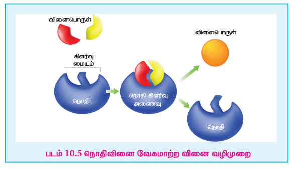
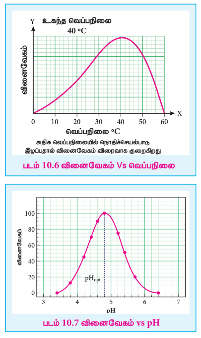

## 10.3 நொதி வினைவேக மாற்றம்

நொதிகள் என்பவை முப்புரிமான அமைப்பு கொண்ட சிக்கலான புரத மூலக்கூறுகளாகும். இவை உயிரினங்களில் நிகழும் வேதி வினைகளுக்கு வினையூக்கிகளாக செயல்படுகின்றன. அநேக நேரங்களில் நொதிகள் கூழ்மநிலையில் காணப்படுகின்றன.மேலும், அவற்றின் வினையூக்க செயல்பாடுகளில் தேர்ந்து செயலாற்றக்கூடியவைகளாக உள்ளன. ஒரு குறிப்பிட்ட உயிருள்ள செயலில் உருவாகும் ஒவ்வொரு நொதியும், செல்லில் நிகழும் ஒரு குறிப்பிட்ட வினைக்கு வினைவேக மாற்றியாக செயல்பட முடியும்.

**நொதி வினைவேக மாற்றத்திற்கான சில பொதுவான எடுத்துக்காட்டுகள்:**

1) கிளைசில் L-குளுட்டமில் L-தைரோசின் எனும் புரதமானது, புரசின் எனும் நொதியால் நீராற்பகுக்கப்படுகிறது.
2) டையஸ்டேஸ் எனும் நொதி ஸ்டார்ச்சை மால்டோசாக நீராற்பகுக்கிறது.

\[ 2(C_6H_{10}O_5)_n + nH_2O \rightarrow nC_{12}H_{22}O_{11} \]

3) ஈஸ்டில் உள்ள ஸைமேஸ் எனும் நொதியானது குளுக்கோஸை எத்தனாலாக மாற்றமடையச் செய்கிறது.

\[ C_6H_{12}O_6 \rightarrow 2C_2H_5OH + 2CO_2 \]

4) மைக்கோ டபர்மா அசிட்டி எனும் நொதி ஆல்கஹாலை அசிட்டிக் அமிலமாக ஆக்ஸிஜனேற்றமடையச் செய்கிறது.

\[ C_2H_5OH + O_2 \rightarrow CH_3COOH + H_2O \]

5) சோயாப் பயறுகளில் உள்ள யூரியேஸ் எனும் நொதி யூரியாவை நீராற்பகுக்கிறது.

\[ NH_2 - CO - NH_2 + H_2O \rightarrow 2NH_3 + CO_2 \]

### 10.3.1 நொதி வினைவேகமாற்ற வினையின் வினைவழிமுறை

நொதி வினைவேக மாற்றத்தை விளக்குவதற்காக பின்வரும் வினைவழிமுறையானது முன்மொழியப்பட்டது.

\[ E + S \rightleftharpoons ES \rightarrow P + E \]

இங்கு E என்பது நொதி, S என்பது வினைபடுபொருள், ES என்பது கிளர்வு அணைவு, P என்பது வினைபொருள் என குறிப்பிடப்படுகின்றன.

### நொதி வினைவேகமாற்ற வினைகள் சில சிறப்புப் பண்புகளை கொண்டுள்ளன.

(i) பயனுள்ள மற்றும் திறனுள்ள மாற்றம் என்பது நொதி வினைவேக மாற்ற வினைகளில் சிறப்புப் பண்பாகும். ஒரு நொதியானது ஒரு நிமிட நேரத்தில் லட்சக்கணக்கான வினைபடு மூலக்கூறுகளை வினைபொருளாக மாற்றக்கூடியது.

எடுத்துக்காட்டாக \( 2H_2O_2 \rightarrow 2H_2O + O_2 \)

வினைவேகமாற்றி இல்லாத நிலையில் இவ்வினைக்கான கிளர்வுறு ஆற்றல் மதிப்பு \( 18 \ \mathrm{kcal/mol} \). வினையில் கூழ்ம பிளாட்டினத்தை வினைவேகமாற்றியாக சேர்த்த பின்பு, வினையின் கிளர்வுறு ஆற்றல் மதிப்பு \( 11.7 \ \mathrm{kcal/mol} \). ஆனால், நொதி வினைவேகமாற்றி முன்னிலையில் இவ்வினையின் கிளர்வுறு ஆற்றல் மதிப்பு \( 2 \ \mathrm{kcal/mol} \) ஐ விட குறைவாக உள்ளது.

(ii) நொதி வினைவேக மாற்றமானது அதிக தேர்ந்து செயலாற்றும் தன்மையை பெற்றுள்ளது.

\[ H_2N-CO-NH_2 + H_2O \rightarrow 2NH_3 + CO_2 \]

யூரியாவின் நீராற்பகுப்பு வினைக்கு வினைவேகமாற்றியாக செயல்படும் யூரியேஸ் எனும் நொதியானது மெத்தில் யூரியா நீராற்பகுப்பு வினைக்கு வினைவேகமாற்றியாக செயல்படுவதில்லை.

\[ H_2N-CO-NH-CH_3 + H_2O \rightarrow \text{வினை இல்லை} \]

(iii) நொதி வினைவேகமாற்ற வினையானது அதன் உகந்த வெப்பநிலையில் அதிகபட்ச வேகத்தில் நிகழ்கிறது. முதலில், வெப்பநிலை அதிகரிக்கும்போது வினையின் வேகமும் அதிகரிக்கிறது. ஆனால், ஒரு குறிப்பிட்ட வெப்பநிலைக்கு மேல் நொதிச் செயல்பாடு இழக்கப்படுகிறது. இதனால் வினையின் வேகம் பூஜ்ஜியமாக கூட குறையலாம். எந்த குறிப்பிட்ட வெப்பநிலையில் நொதிச் செயல்பாடு அதிகபட்சமாக உள்ளதோ அந்த வெப்பநிலை அந்த நொதியின் உகந்த வெப்பநிலை என்றழைக்கப்படுகிறது.

**எடுத்துக்காட்டு:**

* மனித உடலில் செயல்படும் நொதிகளின் உகந்த வெப்பநிலை \( 37^\circ C / 98^\circ F \) ஆகும்.
* காய்ச்சலின் போது, உடலின் வெப்பநிலை அதிகரிப்பதால், நொதிச் செயல்பாடு தகர்ப்பதால், உயிருக்கு ஆபத்தான நிலை உருவாகலாம்.

(iv) அமைப்பின் pH மதிப்பைப் பொருத்து நொதி வினைவேகமாற்ற வினைகளின் வேகம் அமைகிறது. வினைவேகமானது, உகந்த pH இல் அதிகபட்சமாக உள்ளது.

(v) நொதிகளின் செயல்பாட்டை தடுத்து நச்சுப்படுத்த முடியும்.ஒரு நொதியின் செயல்பாட்டை ஒரு நச்சுப் பொருளால் குறைக்கவோ அல்லது முற்றிலுமாக இழக்கவோ செய்ய முடியும்.

மருந்துகளின் உடலியல் செயல்பாடானது, அவற்றின் தடுத்தல் செயல்முறையுடன் தொடர்புபடுத்தப்படுகிறது.

எடுத்துக்காட்டு: சல்பா மருந்துகள்.

பெனிசிலின், பாக்டீரியாக்களின் செயல்பாட்டை தடுப்பதன் காரணமாக நிமோனியா, வயிற்றுப் போக்கு, காலரா மற்றும் மற்ற தொற்று நோய்களை குணப்படுத்த பயன்படுகிறது.

(vi) துணைநொதிகள் அல்லது கிளர்வுறுத்திகளினால் நொதிகளின் வினைவேகமாற்ற செயல்பாடு அதிகரிக்கிறது. துணைநொதி என்றழைக்கப்படும் ஒரு சிறிய புரதமானது (வைட்டமின்) நொதியின் வினைவேகமாற்ற செயல்பாட்டை உயர்த்துகிறது.
