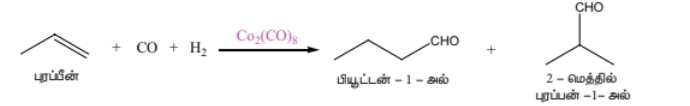
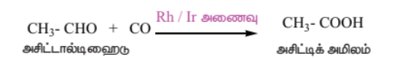
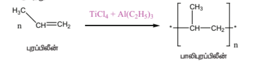

## 4.3 இடைநிலை தனிமங்களின் பண்புகளில் காணப்படும் பொதுவான போக்கு

## 4.3.1 உலோகத் தன்மை

அனைத்து இடைநிலை தனிமங்களும் உலோகங்களாகும். அனைத்து உலோகங்களைப் போன்று இடைநிலை உலோகங்களும் சிறந்த வெப்ப மற்றும் மின்கடத்திகளாகச் செயல்படும் தன்மையைப் பெற்றுள்ளன. முதல் மற்றும் இரண்டாம் தொகுதி உலோகங்களைப் போலன்றி பதினொன்றாம் தொகுதி இடைநிலை தனிமங்களைத் தவிர்த்து பெரும்பாலான இடைநிலை உலோகங்கள் கடினமானவை, இந்நாள் வரை அறியப்பட்ட அனைத்து உலோகங்களில், அறை வெப்பநிலையில் வெள்ளியானது அதிக மின் கடத்தும் திறனைப் பெற்றுள்ளது. உண்மையான உலோகங்களைப் போன்று, பெரும்பாலான இடைநிலை தனிமங்களும், அறுங்கோண நெருங்கிப் பொதிந்த அமைப்பு அல்லது கனசதுர நெருங்கிப் பொதிந்த அமைப்பு அல்லது பொருள்மைய கனசதுர அமைப்பு ஆகியனவற்றில் ஏதேனும் ஒரு அமைப்பைப் பெற்றுள்ளன.

படம் 4.2 3d, 4d மற்றும் 5d இடைநிலை உலோகங்களின் அணிக்கோவை வடிவமைப்புகள்

 
இடைநிலை உலோக வரிசையில், இடமிருந்து வலமாகச் செல்லும் போது, ஆரம்பத்தில் உலோகப் பிணைப்பிற்கு தேவையான தனித்த d எலக்ட்ரான்களின் எண்ணிக்கை அதிகரிப்பதால் உருகுநிலையும் அதிகரித்து, அதிகபட்ச மதிப்பினை அடைந்து பின், உலோக பிணைப்பிற்கு தேவையான d எலக்ட்ரான்கள் இணையாவதால் உருகுநிலையின் மதிப்பு குறைகிறது. எடுத்துக்காட்டாக, முதல் இடைநிலைத் தனிம வரிசையில், ஸ்காண்டியத்திலிருந்து (உருகுநிலை 1814 K) வெனேடியம்(உருகுநிலை 2183 K) வரை உருகுநிலை அதிகரிக்கிறது. வெனேடியத்தின் உருகுநிலையானது குரோமியத்தின் உருகுநிலையான 2180 K க்கு அருகாமையில் உள்ளது. எனினும் 3d வரிசையில், மாங்கனீஸ் மற்றும் 4d வரிசையில் Tc ஆகியன குறைவான உருகுநிலைகளைப் பெற்றுள்ளன. இடைநிலைத் தனிம வரிசையில் ஏறத்தாழ மைய பகுதியில் அமைந்துள்ள தனிமானது அதிகபட்ச உருகுநிலையை பெற்றுள்ளது. இதிலிருந்து \( d^5 \) எனும் எலக்ட்ரான் அமைப்பானது அணுக்களுக்கிடையே வலிமையான கவர்ச்சி விசை உருவாக சாதகமாக உள்ளது என அறிய முடிகிறது. முதல் இடைநிலைத் தனிமங்களின் உருகுநிலையில் ஏற்படும் மாற்றங்களை பின்வரும் வரைபடம் காட்டுகிறது.

படம் 4.3 3d வரிசை தனிமங்களின் உருகுநிலையில் ஏற்படும் மாறுபாடு

 

## 4.3.2 அணு ஆரம் மற்றும் அயனிகளின் உருவளவில் ஏற்படும் மாறுபாடுகள்

ஒரு வரிசையில் இடமிருந்து வலமாகச் செல்லும் போது அணுக்கருவின் மின்சுமை அதிகரிப்பதாலும் கூடுதல் எலக்ட்ரான்கள் ஒரே கூட்டில் சேர்க்கப்படுவதாலும் பொதுவாக அணு ஆரம் சீராகக் குறைகிறது. 3d இடைநிலைத் தனிம வரிசையில் ஸ்காண்டியத்திலிருந்து வெனேடியம் வரை எதிர்பார்த்தவாறு அணு ஆரம் சீராக குறைகிறது. ஆனால் அதன் பின்னர் தாமிரம் வரை அணு ஆரத்தில் குறிப்பிடத்தகுந்த மாற்றம் ஏதுமின்றி ஏறத்தாழ சீராக உள்ளது. 3d வரிசையில் ஸ்காண்டியத்திலிருந்து துத்தநாகம் வரை செல்லும் போது, கூடுதல் எலக்ட்ரான்கள் 3d ஆர்பிட்டால்களில் சேர்கின்றன, அதே நேரத்தில் அணுக்கருவின் மின்சுமையும் அதிகரிக்கின்றது. 3d ஆர்பிட்டாலில் இடம்பெற்றுள்ள எலக்ட்ரான்கள் அணுக்கருவின் அதிகரிக்கும் மின்சுமையினை பகுதியளவே மறைக்கிறது. எனவே செயலுறு அணுக்கரு மின்சுமையின் மதிப்பு சிறிதளவு அதிகரிக்கின்றது. இதன் விளைவாக அணு ஆரம் குறைய வேண்டும் எனினும் 3d ஆர்பிட்டாலில் சேரும் எலக்ட்ரான்கள் 4s எலக்ட்ரான்களை வலிமையாக விலக்குகின்றன. மேற்கண்டுள்ள இவ்விரு விளைவுகளும் ஒன்றுக்கொன்று எதிர்எதிர் திசைகளில் செயல்படுவதோடு மட்டுமல்லாமல் அவை ஒன்றையொன்று சமன் செய்யவும் முயல்வதால் அணு ஆரமானது குறையாமல் ஏறத்தாழ மாறாமல் உள்ளது. 3d வரிசையின் இறுதியில் இடம்பெற்றுள்ள துத்தநாகம் தனது d ஆர்பிட்டாலில் 10 எலக்ட்ரான்களை கொண்டுள்ளது. இந்நேர்வில் எலக்ட்ரான்களுக்கு இடையேயான விலக்கு விசையானது செயலுறு அணுக்கரு மின்சுமையை விட அதிகமாக இருப்பதால் இணைதிற கூட்டிலுள்ள ஆர்பிட்டால் சிறிதளவு விரிவடைகிறது. இதன் காரணமாக துத்தநாகத்தின் அணு ஆரம் சிறிதளவு அதிகரிக்கின்றது. நாம் ஒரு தொகுதியில் மேலிருந்து கீழாகச் செல்லும் போது, அணு ஆரம் பொதுவாக அதிகரிக்கின்றது. இதே போக்கு d தொகுதித் தனிமங்களிலும் எதிர்பார்க்கப்படுகின்றது.

படம் 4.4 (அ) 3d தனிமங்களின் அணு ஆரங்கள்

 

படம் 4.4 (ஆ) 4d தனிமங்களின் அணு ஆரங்கள்

 

படம் 4.4 (இ) 5d தனிமங்களின் அணு ஆரங்கள்

 

ஐந்தாவது வரிசை d தொகுதியில், எலக்ட்ரான்கள் 4d ஆர்பிட்டாலில் சேர்க்கப்படுவதால் அவ்வரிசையில் இடம்பெற்றுள்ள 4d வரிசை தனிமங்களின் அணு ஆரமானது அதற்கு இணையான 3d வரிசை தனிமங்களைக் காட்டிலும் அதிகமாக உள்ளது. எனினும் 5d வரிசை தனிமங்களில் எதிர்பார்த்ததற்கு மாறான போக்கு காணப்படுகிறது. அதாவது, 5d வரிசை தனிமங்களின் அணு ஆரங்களின் மதிப்புகள் அவைகளுக்கு இணையான 4d வரிசை தனிமங்களின் அணு ஆரங்களை விட அதிக மதிப்பினை பெற்றிருக்காமல் ஏறத்தாழ ஒத்த அணு ஆரங்களைப் பெற்றுள்ளன. இதற்கு லாந்தனாய்டு குறுக்கம் காரணமாக அமைகின்றது. லாந்தனாய்டு குறுக்கத்தினை உள் இடைநிலைத் தனிமங்கள் பாடப் பகுதியில் பின்னர் கற்போம்.

## 4.3.3 அயனியாக்கும் ஆற்றல்

இடைநிலைத் தனிமங்கள் s மற்றும் p தொகுதித் தனிமங்களுக்கு இடைப்பட்ட அயனியாக்கும் ஆற்றலைப் பெற்றுள்ளன. இடைநிலைத் தனிம வரிசையில் இடமிருந்து வலமாகச் செல்லும் போது எதிர்பார்த்தபடியே அயனியாக்கும் ஆற்றல் அதிகரிக்கின்றது. d ஆர்பிட்டாலில் எலக்ட்ரான்கள் நிரப்பப்படும் போது, அணுக்கருவின் மின்சுமையும் அதிகரிக்கிறது. இதன் காரணமாக அயனியாக்கும் ஆற்றலின் மதிப்பும் அதிகரிக்கின்றது. முதல் இடைநிலை வரிசைத் தனிமங்களின் அயனியாக்கும் ஆற்றலில் ஏற்படும் மாறுபாடுகளைக் கீழ்க்கண்டுள்ள படம் விளக்குகிறது.

படம் 4.5 3d வரிசை தனிமங்களின் அயனியாக்கும் ஆற்றலில் ஏற்படும் மாறுபாடுகள்

 

ஒரு குறிப்பிட்ட வரிசையில் அணு எண் அதிகரிக்கும் போது முதல் அயனியாக்கும் ஆற்றலில் ஏற்படும் அதிகரிப்பானது சீராக அமைவதில்லை. d தொகுதி தனிமங்களில் கூடுதல் எலக்ட்ரான்கள் (n-1) d ஆர்பிட்டாலில் சேர்கின்றன. மேலும் இந்த உட்கூட்டு எலக்ட்ரான்கள் ஒரு திரை போல செயல்பட்டு இணைதிற ns எலக்ட்ரான்களின் மீது அணுக்கரு செலுத்தும் கவர்ச்சி விசையினைக் குறைக்கின்றன. எனவே இதன் விளைவாக அயனியாக்கும் ஆற்றலில் மாறுபாடுகள் ஏற்படுகின்றன.

அயனியாக்கும் ஆற்றல் மதிப்புகளைக் கொண்டு சேர்மங்களின் வெப்ப இயக்கவியல் நிலைப்பு தன்மையைத் தீர்மானிக்க இயலும். எடுத்துக்காட்டாக, \( Ni^{2+} \) மற்றும் \( Pt^{2+} \) ஆகிய அயனிகளின் நிலைப்புத் தன்மையை ஒப்பிடுவோம்.

நிக்கலுக்கு, \( IE_1 + IE_2 = (737 + 1753) = 2490 \ kJ mol^{-1} \)

பிளாட்டினத்திற்கு, \( IE_1 + IE_2 = (864 + 1791) = 2655 \ kJ mol^{-1} \)

எனவே, \( Pt^{2+} \) உடன் ஒப்பிடும் போது \( Ni^{2+} \) உருவாக குறைவான ஆற்றல் தேவைபடுகிறது. இதனால் Pt(II) சேர்மங்களை காட்டிலும் Ni(II) சேர்மங்கள் அதிக வெப்ப இயக்கவியல் நிலைப்புத் தன்மையினை உடையவை என அறிகிறோம்.

### தன் மதிப்பீடு 1:

\( Ni^{4+} \) மற்றும் \( Pt^{4+} \) ஆகியவனவற்றின் அயனியாக்கும் ஆற்றல் மதிப்புகளிலிருந்து அவைகளின் நிலைப்புத் தன்மையினை ஒப்பிடுக.

| IE | Ni | Pt |
|---|---|---|
| I | 737 | 864 |
| II | 1753 | 1791 |
| III | 3395 | 2800 |
| IV | 5297 | 4150 |

## 4.3.4 ஆக்சிஜனேற்ற நிலை

முதலாவது இடைநிலை உலோகமான ஸ்காண்டியம் +3 ஆக்சிஜனேற்ற நிலையை மட்டுமே கொண்டுள்ளது. ஆனால், மற்ற இடைநிலை தனிமங்கள் மாறுபடும் ஆக்சிஜனேற்ற நிலைகளைப் பெற்றுள்ளன. ஏனெனில், இவைகளின், (n-1)d மற்றும் ns ஆர்பிட்டால்களுக்கிடையே காணப்படும் ஆற்றல் வேறுபாடு மிகக் குறைவாக இருப்பதால் அவற்றில் இடம் பெற்றுள்ள எலக்ட்ரான்களை இழந்து அவைகள் மாறுபடும் ஆக்சிஜனேற்ற நிலைகளைப் பெறுகின்றன. 3d வரிசை இடைநிலைத் தனிமங்களின் ஆக்சிஜனேற்ற நிலைகள் பின்வரும் அட்டவணையில் சுருக்கமாக கொடுக்கப்பட்டுள்ளன.

d வரிசைத் தொடரின் துவக்கத்தில் +3 ஆக்சிஜனேற்ற நிலையானது நிலைப்புத் தன்மையுடையதாக உள்ளது. ஆனால், தொடரின் இறுதியில் +2 ஆக்சிஜனேற்ற நிலையானது நிலைப்புத் தன்மையைப் பெற்றதாக உள்ளது. எலக்ட்ரான்களின் எண்ணிக்கை அதிகரிக்கும் போது ஆக்சிஜனேற்ற நிலைகளின் எண்ணிக்கையும் அதிகரிக்கிறது. மேலும் இணையாகும் எலக்ட்ரான்களின் எண்ணிக்கை அதிகரிக்கும் போது ஆக்சிஜனேற்ற நிலைகளின் எண்ணிக்கை குறைகிறது. எனவே முதல் மற்றும் கடைசி தனிமங்கள் குறைவான ஆக்சிஜனேற்ற நிலைகளையும் மையப் பகுதியினை ஒட்டி அமைந்துள்ள தனிமங்கள் அதிக எண்ணிக்கையிலான ஆக்சிஜனேற்ற நிலைகளையும் பெற்றுள்ளன. எடுத்துக்காட்டாக, முதல் தனிமமான ஸ்காண்டியம் +3 ஆக்சிஜனேற்ற நிலையை மட்டும் கொண்டுள்ளது. மையத்தில் அமைந்துள்ள தனிமமான மாங்கனீஸ் +2 முதல் +7 வரையிலான ஆறு ஆக்சிஜனேற்ற நிலைகளை கொண்டுள்ளது. கடைசி தனிமமான தாமிரம் +1 மற்றும் +2 ஆகிய இரு ஆக்சிஜனேற்ற நிலைகளை மட்டும் கொண்டுள்ளது.

3d தனிம வரிசை உலோகங்களின் பல்வேறு ஆக்சிஜனேற்ற நிலைகளின் ஒப்பீட்டு நிலைப்புத் தன்மையினை, பாதியளவு மற்றும் முழுமையாக நிரப்பப்பட்ட d ஆர்பிட்டால்களின் நிலைப்புத் தன்மையோடு தொடர்புபடுத்தி விளக்க இயலும். எடுத்துக்காட்டாக, \( Mn^{2+} (3d^5) \) ஆனது \( Mn^{4+} (3d^3) \) ஐ விட அதிக நிலைப்புத் தன்மை உடையது.

4d மற்றும் 5d உலோகங்களின் ஆக்சிஜனேற்ற நிலையானது, இட்ரியம் மற்றும் லாந்தனத்தின் +3 முதல் ருத்தினியம் மற்றும் ஆஸ்மியத்தின் +8 வரை மாறுபடுகிறது. 4d மற்றும் 5d தனிமங்கள், ஆக்சிஜன், புளூரின் மற்றும் குளோரின் ஆகிய அதிக எலக்ட்ரான் கவர் தன்மையுடைய தனிமங்களுடன் உருவாக்கும் சேர்மங்களில் அவைகளின் அதிகபட்ச ஆக்சிஜனேற்ற நிலை காணப்படுகிறது. எ.கா \( RuO_4, OsO_4 \) மற்றும் \( WCl_6 \). ஒரு வரிசையில் மேலிருந்து கீழாக வரும் போது உயர் ஆக்சிஜனேற்ற நிலைகளின் நிலைப்புத் தன்மை பொதுவாக அதிகரிக்கிறது. அதே நேரத்தில் குறைந்த ஆக்சிஜனேற்ற நிலைகளின் நிலைப்புத் தன்மை குறைகிறது. இதனை \( \Delta G^0 \) vs ஆக்சிஜனேற்ற எண்ணைக் குறிப்பிடும் ஃபுரோஸ்ட் வரைபடத்திலிருந்து அறிந்து கொள்ளலாம். டைட்டேனியம், வெனேடியம் மற்றும் குரோமியத்தில் +3 ஆக்சிஜனேற்ற நிலையானது அதிக வெப்ப இயக்கவியல் நிலைப்புத் தன்மையைப் பெற்றுள்ளது. இரும்பினைப் பொருத்தவரையில் +2 மற்றும் +3 ஆக்சிஜனேற்ற நிலைகள் ஏறத்தாழ சமமான நிலைப்புத் தன்மையைக் கொண்டுள்ளன. 3d இடைநிலைத் தனிம வரிசையில் தாமிரம் மட்டும் தனித்துவமிக்க +1 ஆக்சிஜனேற்ற நிலையைக் கொண்டுள்ளது. இந்த நிலையானது +2 மற்றும் 0 ஆக்சிஜனேற்ற நிலைகளாக எளிதில் மாற்றமடையும் தன்மையினைப் பெற்றுள்ளது.

படம் 4.6 ஃபுரோஸ்ட் வரைபடம்

 

### தன் மதிப்பீடு 2 :

இரும்பினைப் பொருத்த வரையில் +3 ஆக்சிஜனேற்ற நிலையானது +2 ஆக்சிஜனேற்ற நிலையை விட அதிக நிலைப்புத் தன்மை உடையது. ஆனால், மாங்கனீசைப் பொருத்த வரையில் இதன் மறுதலையானது உண்மை. ஏன்?

## 4.3.5 இடைநிலை தனிமங்களின் திட்ட மின் முனை மின்னழுத்த மதிப்புகள்

ஆக்சிஜனேற்ற ஒடுக்க வினைகளில் ஒன்று அல்லது அதற்கு மேற்பட்ட எலக்ட்ரான்கள் ஒரு வினைபடு பொருளிலிருந்து மற்றொன்றிற்கு மாற்றப்படுகின்றன. இத்தகைய வினைகள் எப்போதும் இரட்டை வினைகளாகவே நிகழ்கின்றன. அதாவது, ஒரு சேர்மம் ஆக்சிஜனேற்றம் அடைந்தால் மற்றொன்று கண்டிப்பாக ஆக்சிஜனொடுக்கம் அடைய வேண்டும். ஆக்சிஜனேற்றம் அடையும் சேர்மம் ஆக்சிஜனொடுக்கி எனவும், மேலும் ஒடுக்கமடையும் சேர்மம் ஆக்சிஜனேற்றி எனவும் அழைக்கப்படுகின்றன. ஒரு தனிமத்தின் ஆக்சிஜனேற்றும் மற்றும் ஒடுக்கும் தன்மையினை அதன் திட்ட மின் முனை மின்னழுத்த மதிப்புகளின் அடிப்படையில் அளந்தறிய இயலும்.

1 atm, 273K திட்ட அழுத்த மற்றும் வெப்ப நிலையில் மூலக்கூறு வைட்ரஜனாது நீரேற்றம் அடைந்த புரோட்டானாக ஆக்சிஜனேற்றம் அடையும் ஒரு மின் முனையைக் கொண்டுள்ள மின்கலனின் திட்ட மின்னியக்கு விசையின் மதிப்பானது திட்ட மின் முனை மின்னழுத்த மதிப்பு எனப்படும்.

ஒரு உலோகத்தின் திட்ட மின் முனை மின்னழுத்த மதிப்பானது அதிக எதிர்க்குறி மதிப்பைப் பெற்றிருப்பின், அந்த உலோகமானது ஒரு வலிமையான ஒடுக்கும் காரணியாகும். ஏனெனில் இவைகள் எலக்ட்ரான்களை எளிதில் இழக்கின்றன. (\( E^0 \))

முதல் இடைநிலை வரிசை உலோகங்களின் திட்ட மின் முனை மின்னழுத்த மதிப்புகள் (ஒடுக்க மின்னழுத்தம்) பின்வரும் அட்டவணையில் தரப்பட்டுள்ளன.

| வினை | திட்ட ஒடுக்க மின்னழுத்தம் (V) |
|---|---|
| \( Ti^{2+} + 2e^- \rightarrow Ti \) | -1.63 |
| \( V^{2+} + 2e^- \rightarrow V \) | -1.19 |
| \( Cr^{2+} + 2e^- \rightarrow Cr \) | -0.91 |
| \( Mn^{2+} + 2e^- \rightarrow Mn \) | -1.18 |
| \( Fe^{2+} + 2e^- \rightarrow Fe \) | -0.44 |
| \( Co^{2+} + 2e^- \rightarrow Co \) | -0.28 |
| \( Ni^{2+} + 2e^- \rightarrow Ni \) | -0.23 |
| \( Cu^{2+} + 2e^- \rightarrow Cu \) | +0.34 |
| \( Zn^{2+} + 2e^- \rightarrow Zn \) | -0.76 |

3d வரிசையில் டைட்டேனியத்திலிருந்து துத்தநாகம் நோக்கிச் செல்லும் போது, திட்ட ஒடுக்க மின்னழுத்த மதிப்புகள் \( E^0_{M^{2+}/M} \) குறைவான எதிர்க்குறி மதிப்பினை நோக்கிச் செல்கின்றன. மேலும், தாமிரமானது நேர்க்குறி ஒடுக்க மின்னழுத்த மதிப்பை பெற்றுள்ளது. அதாவது, \( Cu^{2+} \) அயனியைக் காட்டிலும் தனிம நிலை தாமிரமானது அதிக நிலைப்புத் தன்மை உடையது. 3d வரிசை தனிமங்களின் திட்ட ஒடுக்க மின்னழுத்தத்தின் பொதுவான போக்கில் படத்தில் காட்டியுள்ளவாறு இரு விலகல்கள் காணப்படுகின்றன. அதாவது மாங்கனீஸ் மற்றும் துத்தநாகம் ஆகியனவற்றின் \( E^0_{M^{2+}/M} \) மதிப்பானது வழக்கமான போக்கிலிருந்து அதிக எதிர்க்குறி உடையதாக உள்ளது. \( Mn^{2+} \) - இன் சரிபாதியளவு நிரப்பப்பட்ட \( d^5 \) எலக்ட்ரான் அமைப்பும் \( Zn^{2+} \) - இன் முழுமையாக நிரப்பப்பட்ட எலக்ட்ரான் அமைப்பும் இவ்விலகலுக்கு காரணமாக அமைகின்றன. அதிக ஆக்சிஜனேற்ற நிலையில் காணப்படும் இடைநிலை உலோகங்கள் ஆக்சிஜனேற்றியாக செயல்பட முனைகின்றன. எடுத்துக்காட்டாக, \( Fe^{3+} \) ஆனது ஒரு வலிமையான ஆக்சிஜனேற்றி ஆகும். இது தாமிரத்தை \( Cu^{2+} \) ஆக ஆக்சிஜனேற்றம் அடையச் செய்கிறது. இவ்வினையின் சாத்தியத் தன்மையினை பின்வரும் திட்ட மின் முனை மின்னழுத்த மதிப்புகளிலிருந்து தீர்மானிக்கலாம்.

\( Fe^{3+}(aq) + e^- \rightarrow Fe^{2+}(aq) \) \( E^0 = +0.77V \)

\( Cu^{2+}(aq) + 2e^- \rightarrow Cu(s) \) \( E^0 = +0.34V \)

\( M^{3+}/M^{2+} \) அரை கலனின் திட்ட மின் முனை மின்னழுத்த மதிப்புகளானது \( M^{3+} \) மற்றும் \( M^{2+} \) அயனிகளுக்கிடையேயான ஒப்பீட்டு நிலைப்புத் தன்மையைத் தருகிறது. திட்ட ஒடுக்க மின்னழுத்த மதிப்புகள் கீழே அட்டவணைப்படுத்தப்பட்டுள்ளன.

| அரை வினை | திட்ட ஒடுக்க மின்னழுத்தம் (V) |
|---|---|
| \( Ti^{3+} + e^- \rightarrow Ti^{2+} \) | -0.37 |
| \( V^{3+} + e^- \rightarrow V^{2+} \) | -0.26 |
| \( Cr^{3+} + e^- \rightarrow Cr^{2+} \) | -0.41 |
| \( Mn^{3+} + e^- \rightarrow Mn^{2+} \) | +1.51 |
| \( Fe^{3+} + e^- \rightarrow Fe^{2+} \) | +0.77 |
| \( Co^{3+} + e^- \rightarrow Co^{2+} \) | +1.81 |

டைட்டேனியம், வெனேடியம் மற்றும் குரோமியம் ஆகியனவற்றின் எதிர்க்குறி ஒடுக்க மின்னழுத்த மதிப்புகளிலிருந்து அவைகளில் உயர் ஆக்சிஜனேற்ற நிலையானது முன்னுரிமை பெற்றுள்ளன என அறிய முடிகிறது. நிலைப்புத் தன்மையுடைய \( Cr^{3+} \) அயனியை ஒடுக்கமடையச் செய்ய வேண்டுமெனில், அதிக எதிர்க்குறி திட்ட ஒடுக்க மின்னழுத்த மதிப்புடைய துத்தநாக உலோகம் (\( E^0 = -0.76 V \)) போன்ற வலிமைமிக்க ஒடுக்க காரணியைப் பயன்படுத்த வேண்டும். \( Mn^{3+}/Mn^{2+} \) - ன் அதிக ஒடுக்க மின்னழுத்த மதிப்பிலிருந்து \( Mn^{2+} \) அயனியானது \( Mn^{3+} \) அயனியைக் காட்டிலும் அதிக நிலைப்புத் தன்மை உடையது என அறிய முடிகிறது. \( Fe^{3+}/Fe^{2+} \) - இன் திட்ட ஒடுக்க மின்னழுத்த மதிப்பானது 0.77V. இக்குறைவான மதிப்பிலிருந்து, வழக்கமான நிபந்தனைகளில், \( Fe^{3+} \) மற்றும் \( Fe^{2+} \) ஆகிய இரண்டும் நடைமுறையில் இருப்பதற்கான சாத்தியத்தினை அறிய முடிகிறது. Mn யிலிருந்து Fe க்குச் செல்லும் போது மின்னழுத்த மதிப்பில் திடீர் குறைவு ஏற்படுகிறது. இதற்கு \( Mn^{3+} \) அயனியானது \( 3d^4 \) எலக்ட்ரான் அமைப்பினையும் \( Mn^{2+} \) அயனியானது \( 3d^5 \) எலக்ட்ரான் அமைப்பினைப் பெற்றிருப்பதே காரணமாகும். சரிபாதியளவு நிரப்பட்ட d ஆர்பிட்டால் அதிக நிலைப்புத் தன்மையைப் பெறுவதால் \( Mn^{3+} \) - இன் ஒடுக்கம் மிகவும் சாத்தியமான ஒன்றாகும் (\( E^0 = +1.51V \)).

படம் 4.7 (ஆ) \( (E^0_{M^{3+}/M^{2+}}) \) - 3d வரிசை

## 4.3.6 காந்தப் பண்புகள்

இடைநிலைத் தனிமங்களில் பெரும்பாலான சேர்மங்கள் பாரா காந்தத் தன்மை உடையவை. மேலும் காந்த பண்புகள் அணுக்களின் எலக்ட்ரான் அமைப்புகளோடு தொடர்புடையவை. எலக்ட்ரான்கள் அணுக்கருவைச் சுற்றிவரும் ஆர்பிட்டால் இயக்கத்துடன், தனது சுய அச்சினைப் பற்றி தனக்குத்தானே சுழல்கிறது என நாம் ஏற்கனவே பதினொன்றாம் வகுப்பில் கற்றறிந்துள்ளோம். இவ்வியக்கங்களின் காரணமாக ஒரு சிறிய காந்தப் புலம் உருவாகிறது. காந்த புலத்தினை காந்த திருப்புத்திறனைக் கொண்டு மதிப்பிடலாம். காந்த பண்புகளின் அடிப்படையில் பொருட்கள் (i) பாரா காந்த தன்மையுடைய பொருட்கள், (ii) டையா காந்த தன்மையுடைய பொருட்கள் என வகைப்படுத்தலாம். இவற்றினைத் தவிர ஃபெர்ரோ மற்றும் எதிர் ஃபெர்ரோ காந்தப் பொருள்களும் காணப்படுகின்றன.

டையா காந்தப் பொருட்கள், முதன்மை காந்த இருமுனைகள் எதனையும் பெற்றிருப்பதில்லை. அதாவது, ஒரு பொருளில் உள்ள அனைத்து எலக்ட்ரான்களும் இரட்டைகளாகக் காணப்பட்டால் அப்பொருள் டையா காந்தப் பண்பினைப் பெற்றுள்ளது எனவும் இதனைக் குறிப்பிடலாம். இத்தகைய பொருட்களை புற காந்தப் புலத்தில் வைக்கும் போது அவை காந்தப் புலத்தால் விலக்கப்படுகின்றன. மேலும் அப்பொருளில் ஒரு காந்தத் தூண்டல் உருவாகிறது. உருவாகும் காந்தத் தூண்டலானது, செயல்படுத்தப்படும் காந்தப்புலத்திற்கு எதிரான திசையில் ஒரு வலிமைக் குறைந்த காந்தப் புலத்தை ஏற்படுத்துகிறது.

பாரா காந்தப் பொருட்கள் இணையாகாத எலக்ட்ரான்களைப் பெற்றுள்ளன. இவைகள் ஒன்றிலிருந்து ஒன்று தனித்திருக்குமாறு காந்த இருமுனைகளைக் கொண்டுள்ளன. புற காந்தப் புலம் செயல்படாத நிலையில் காந்த இருமுனைகள் ஒழுங்கின்றி அங்கும் இங்கும் அமைந்துள்ளன. எனவே இத்தகைய திடப் பொருட்கள் நிகர காந்தத் தன்மையைப் பெற்றிருப்பதில்லை. ஆனால் காந்தப் புலம் செயல்படுத்தும் போது காந்த இருமுனைகள் புற காந்தப் புலத்தின் திசையில் அவற்றிற்கு இணையாக ஒருங்கமைகின்றன. எனவே இவை புற காந்தப் புலத்தினால் ஈர்க்கப்படுகின்றன.

ஃபெர்ரோ காந்தப் பொருட்கள் சிறிய பெருங்கூறு அமைப்புகளைக் கொண்டுள்ளன. ஒவ்வொரு பெருங்கூறு அமைப்பிலும் காந்த இருமுனைகள் ஒருங்கே அமைந்துள்ளன. ஆனால் இது அடுத்தடுத்த பெருங்கூறுகளின் இருமுனை சுழற்சியானது ஒழுங்கின்றி அமைந்துள்ளது. இணையாகாத d எலக்ட்ரான்களைப் பெற்றுள்ள சில இடைநிலைத் தனிமங்கள் அல்லது அவைகளின் அயனிகள் ஃபெர்ரோ காந்தத் தன்மையை பெற்றுள்ளன.

பெரும்பாலான நேர்வுகளில், பாரா காந்த தன்மையுடைய 3d இடைநிலை உலோகங்களின் காந்த திருப்பத்திறனானது அவைகளின் எலக்ட்ரான் சுழற்சியினால் உருவாகும் காந்த திருப்பத் திறனை மட்டுமே பொறுத்து அமைவதாக உள்ளது. ஆர்பிட்டால் திருப்பத் திறன் (L) ஆனது அதனினுள் அடங்கியிருப்பதாக கருதப்படுகிறது. எனவே காந்தத் திருப்பத் திறனை பின்வருமாறு கணக்கிடலாம்.

\[ \mu = g \sqrt{S(S+1)} \ \mu_B \]

இங்கு S என்பது இணையாகாத எலக்ட்ரான்களின் தற்குழற்சி குவாண்டம் எண்களின் கூடுதலைக் குறிப்பிடுகிறது. மேலும், \( \mu_B \) என்பது போர் மேக்னடான் ஆகும்.

'n' – தனித்த இணையாகாத எலக்ட்ரான்களைக் கொண்டுள்ள ஒரு அயனிக்கு \( S = \frac{n}{2} \) மேலும் ஒரு எலக்ட்ரானுக்கு \( g = 2 \)

எனவே, தற்சுழற்சியை மட்டுமே பொறுத்தமையும் காந்த திருப்பத் திறனானது பின்வருமாறு:

\[ \mu = 2 \sqrt{\left(\frac{n}{2}\right)\left(\frac{n}{2}+1\right)} \ \mu_B \]

\[ \mu = 2 \sqrt{\frac{n(n+2)}{4}} \ \mu_B \]

\[ \mu = \sqrt{n(n+2)} \ \mu_B \]

மேற்கண்டுள்ள வாய்ப்பாட்டினைப் பயன்படுத்தி கணக்கிடப்பட்ட காந்தத் திருப்புத்திறன் மதிப்புகள் பரிசோதனை மூலம் கண்டறியப்பட்ட மதிப்புகளோடு ஒப்பிட்டு பின்வரும் அட்டவணையில் தரப்பட்டுள்ளன. பெரும்பாலான நேர்வுகளில் அவற்றிற்கிடையே பெரிய வேறுபாடுகள் ஏதுமில்லை.

| அயனி | அமைப்பு | n | \( \mu = \sqrt{n(n+2)} \ \mu_B \) | \( \mu_{(observed)} \) |
|---|---|---|---|---|
| \( Sc^{3+}, Ti^{4+}, V^{5+} \) | \( d^0 \) | 0 | \( \mu = \sqrt{0(0+2)} = 0 \ \mu_B \) | டையா காந்த பண்பு |
| \( Ti^{3+}, V^{4+} \) | \( d^1 \) | 1 | \( \mu = \sqrt{1(1+2)} = \sqrt{3} = 1.73 \ \mu_B \) | 1.75 |
| \( Ti^{2+}, V^{3+} \) | \( d^2 \) | 2 | \( \mu = \sqrt{2(2+2)} = \sqrt{8} = 2.83 \ \mu_B \) | 2.76 |
| \( Cr^{3+}, Mn^{4+}, V^{2+} \) | \( d^3 \) | 3 | \( \mu = \sqrt{3(3+2)} = \sqrt{15} = 3.87 \ \mu_B \) | 3.86 |
| \( Cr^{2+}, Mn^{3+} \) | \( d^4 \) | 4 | \( \mu = \sqrt{4(4+2)} = \sqrt{24} = 4.89 \ \mu_B \) | 4.80 |
| \( Mn^{2+}, Fe^{3+} \) | \( d^5 \) | 5 | \( \mu = \sqrt{5(5+2)} = \sqrt{35} = 5.91 \ \mu_B \) | 5.96 |
| \( Co^{3+}, Fe^{2+} \) | \( d^6 \) | 4 | \( \mu = \sqrt{4(4+2)} = \sqrt{24} = 4.89 \ \mu_B \) | 5.3-5.5 |
| \( Co^{2+} \) | \( d^7 \) | 3 | \( \mu = \sqrt{3(3+2)} = \sqrt{15} = 3.87 \ \mu_B \) | 4.4-5.2 |
| \( Ni^{2+} \) | \( d^8 \) | 2 | \( \mu = \sqrt{2(2+2)} = \sqrt{8} = 2.83 \ \mu_B \) | 2.9-3.4 |
| \( Cu^{2+} \) | \( d^9 \) | 1 | \( \mu = \sqrt{1(1+2)} = \sqrt{3} = 1.732 \ \mu_B \) | 1.8-2.2 |
| \( Cu^+, Zn^{2+} \) | \( d^{10} \) | 0 | \( \mu = \sqrt{0(0+2)} = 0 \ \mu_B \) | டையா காந்த பண்பு |

## 4.3.7 வினையூக்கி பண்புகள்

வேதித் தொழிற்சாலைகளில், பலபடிகள் வாசனைப் பொருட்கள், மருந்துகள் போன்ற பல்வேறு வினைப் பொருட்கள் பெருமளவில் தயாரிக்கப்படுகின்றன. பெரும்பாலான உற்பத்திச் செயல் முறைகள் சுற்றுச்சூழலில் மிகப் பெரிய பாதிப்புகளை ஏற்படுத்துகின்றன. எனவே சுற்றுச்சூழலுக்கு உகந்த தகுந்த மாற்றுச் செயல்முறைகளைக் கண்டறிவது அவசியமாகிறது. இத்தகைய சூழலில் தகுந்த வினைவேக மாற்றிகளை பயன்படுத்தி மேற்கொள்ளப்படும் செயல் முறைகளானவை, குறைவான ஆற்றலை பயன்படுத்துதல், வீணாகும் பொருட்களின் உற்பத்தியைக் குறைத்தல் மற்றும் அதிகளவு வினைபடி பொருட்களை வினைவினைப் பொருட்களாக மாற்றுதல், சூழலுக்கு உகந்ததாக அமைத்தல் போன்ற பல்வேறு நன்மைகளைக் கொண்டுள்ளன.

இடைநிலை உலோகங்கள் மற்றும் அவற்றின் சேர்மங்கள் பல்வேறு தொழிற் செயல்முறைகளில் வினைவேக மாற்றிகளாக செயல்படுகின்றன. இடைநிலை உலோகங்கள் தகுந்த ஆற்றல் உடைய d ஆர்பிட்டால்களைக் கொண்டிருப்பதால் அந்த ஆர்பிட்டால்களால் வினைபடி மூலக்கூறுகளிலிருந்து எலக்ட்ரான்களை ஏற்றுக் கொள்ள முடியும் அல்லது வினைவேக மாற்றியானது வினைபடி மூலக்கூறுகளுடன் தங்களிடம் உள்ள d எலக்ட்ரான்களை பயன்படுத்தி பிணைப்புகளை உருவாக்க இயலும். எடுத்துக்காட்டாக, வினைவேக மாற்றியின் முன்னிலையில் ஆல்கீன்களின் ஆல்கீன்களின் ஹைட்ரஜனேற்ற வினையில், ஆல்கீன்கள் அவைகளிடம் உள்ள \( \pi \) எலக்ட்ரான்களைப் பயன்படுத்தி வினைவேக மாற்றியின் காலியான d ஆர்பிட்டாலுடன், கிளர்வு மையங்களில் பிணைப்புகளை ஏற்படுத்துகின்றன.

ஹைட்ரஜன் மூலக்கூறில் உள்ள  $\sigma$  பிணைப்பு பிளக்கப்படுகின்றது. மேலும் ஒவ்வொரு ஹைட்ரஜன் அணுவும் வினைவேக மாற்றி அணுக்களின் d எலக்ட்ரான்களுடன் பிணைப்புகளை உருவாக்குகின்றன. பின் இவ்விரு வைட்ரஜன் அணுக்களும், ஆல்கீன்களின் பகுதி பிளக்கப்பட்ட \( \pi \) பிணைப்புடன் பிணைந்து ஆல்கேன்களைத் தருகின்றன.

<pre>ஆல்கீன்                                ஆல்கேன்
</pre>

சில வினைவேக மாற்றச் செயல்முறைகளில் இடைநிலைத் தனிமங்களின் மாறுபாடும் ஆக்சிஜனேற்ற நிலைகள் முக்கியப் பங்காற்றுகின்றன. எடுத்துக்காட்டாக, \( SO_3 \) யிலிருந்து கந்தக அமிலத்தை பெருமளவில் தயாரிக்கும் முறையில் வேனடியம் பென்டாக்சைடு வினைவேக மாற்றியாக பயன்படுகிறது. இவ்வினையில் வினைவேக மாற்றி (\( V_2O_5 \)) ஆனது \( SO_2 \) ஐ ஆக்சிஜனேற்றம் அடையச் செய்கிறது. இவ்வினையில் \( V_2O_5 \) ஆனது வேனடியம் (IV) ஆக ஒடுக்கம் அடைகிறது. மேலும் சில எடுத்துக்காட்டுகள் கீழே தரப்பட்டுள்ளன.

(i) ஒலிஃபீன்களின் ஹைட்ரோ பார்மைல் ஏற்றம்

(ii) அசிட்டால்டிஹைடிலிருந்து அசிட்டிக்கமிலம் தயாரித்தல்

(iii) சீக்லர் – நட்டா வினைவேக மாற்றி

## 4.3.8 உலோகக் கலவைகள் உருவாதல்

ஒரு உலோகத்தை ஒன்று அல்லது அதற்கு மேற்பட்ட தனிமங்களுடன் ஒன்றோடொன்று கலப்பதால் ஒரு உலோகக் கலவை உருவாகிறது. கலவையில் அதிக அளவு உள்ள உலோகம் கரைப்பான் எனவும், குறைவாக உள்ள மற்ற தனிமங்கள் கரைபொருட்கள் எனவும் அழைக்கப்படுகின்றன. ஹியூம் – ரோத்தரி விதிப்படி ஒரு பதிலீடடைந்த உலோகக் கலவை உருவாக, கரைப்பான் மற்றும் கரைபொருள் ஆகியனவற்றின் அணு ஆரங்களுக்கிடையேயான வேறுபாடு 15% விட குறைவாக இருக்க வேண்டும். கரைப்பான் மற்றும் கரைபொருள் இவ்விரண்டும் ஒரே இணைதிறன் மற்றும் படிக அமைப்பினைப் பெற்றிருக்க வேண்டும். மேலும் அவைகளின் எலக்ட்ரான் கவர்திற மதிப்பின் வேறுபாடானது பூஜ்ஜியத்திற்கு அருகாமையில் அமைய வேண்டும். இந்நிபந்தனைகளை நிறைவுச் செய்யும் இடைநிலை உலோகங்கள் தங்களுக்குள் பல்வேறு உலோகக் கலவைகளை உருவாக்குகின்றன. ஏனெனில் அவற்றின் உருவளவு அணுக்கள் ஏறத்தாழ ஒத்துள்ளன.மேலும் படிக அணிக்கோவைப் புள்ளிகளில் காணப்படும் ஒரு உலோகத்தினை மற்றொரு உலோகம் எளிதில் இடப்பெயர்ச்சி அடையச் செய்து உலோகக் கலவைகளை உருவாக்குகின்றன. இவ்வாறு உருவாகும் உலோகக் கலவைகள் கடினமாக இருப்பதுடன் பெரும்பாலும் அதிக உருகுநிலைகளைக் கொண்டுள்ளன. எடுத்துக்காட்டு ஃபெர்ரஸ் உலோகக் கலவைகள், தங்கம் – தாமிரம் ஆகியனவற்றின் உலோகக் கலவை, குரோமியத்தின் உலோகக் கலவைகள் போன்றவை.

## 4.3.9 இடைச்செருகல் சேர்மங்களை உருவாக்குதல்

ஒரு உலோக அணிக்கோவைத் தளத்தில் உள்ள இடைச்செருகல் துளைகளில் ஹைட்ரஜன், போரான், கார்பன் அல்லது நைட்ரஜன் போன்ற சிறிய அணுக்கள் இடம்பெறுவதால் ஏற்படும் சேர்மங்கள் இடைச்செருகல் சேர்மங்கள் அல்லது உலோகக் கலவைகள் என அழைக்கப்படுகின்றன. வழக்கமாக இவை வேதி வினைக்கூறு விகித அடிப்படையில் அமையாத சேர்மங்களாகும். இடைநிலை உலோகங்கள் கணக்கற்ற \( TiC, ZrH_{1.92}, Mn_4N \) போன்ற இடைச்செருகல் சேர்மங்களை உருவாக்குகின்றன. உலோக அணிக்கோவை தளத்தில் இடம் பெறும் அணுக்களில் இச்சேர்மங்கள் புதிய பண்புகளைப் பெறுகின்றன.

(i) இவை கடினமானவை. மேலும் வெப்ப மற்றும் மின் கடத்தும் தன்மையைப் பெற்றுள்ளன.

(ii) இவை அவற்றில் அடங்கியுள்ள தூய உலோகங்களைக் காட்டிலும் அதிக உருகுநிலையைக் கொண்டுள்ளன.

(iii) இடைநிலை உலோகங்களின் ஹைட்ரைடுகள் வலிமைமிக்க ஆக்சிஜன் ஒடுக்கிகள் ஆகும்.

(iv) உலோக கார்பைடுகள் வேதி மந்த தன்மையைப் பெற்றுள்ளன.

## 4.3.10 அணைவுச் சேர்மங்களை உருவாக்குதல்

தங்களிடம் உள்ள எலக்ட்ரான் இரட்டைகளை வழங்கி ஈதல் சகப்பிணைப்பினை ஏற்படுத்தும் இயல்புடைய மூலக்கூறுகள் / அயனிகளுடன், இடைநிலைத் தனிமங்கள் அணைவுச் சேர்மங்களை உருவாக்கும் தன்மையினைக் கொண்டுள்ளன. இடைநிலைத் தனிம அயனிகள் சிறிய உருவளவையும் அதிக மின்சுமையையும் கொண்டுள்ளன. மேலும் பிறத் தொகுதிகள் வழங்கும் எலக்ட்ரான் இணைகளை ஏற்றுக்கொள்ளும் வகையில் காலியான குறைந்த ஆற்றலுடைய d ஆர்பிட்டால்களைக் கொண்டுள்ளன. இத்தகைய பண்புகளால் இடைநிலை உலோகங்கள் அதிக எண்ணிக்கையிலான அணைவுச் சேர்மங்களை உருவாக்குகின்றன. எடுத்துக்காட்டுகள் \([Fe(CN)_6]^{4-}\), \([Co(NH_3)_6]^{3+}\), போன்றவை.

அணைவுச் சேர்மங்களின் வேதியியலை அலகு 5 ல் விரிவாகக் கற்கலாம்.
