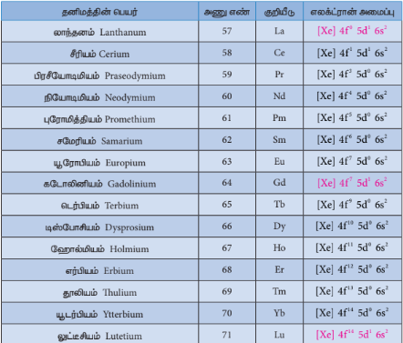
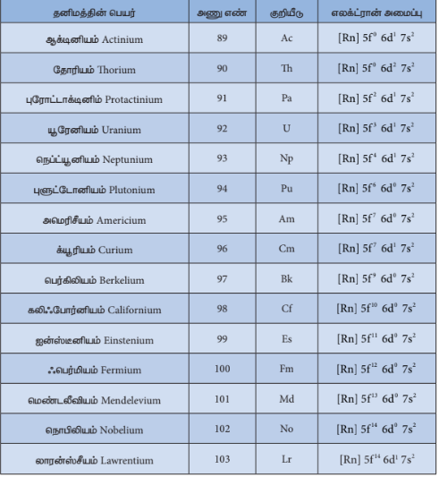

## 4.4 d வரிசை இடைநிலைத் தனிமங்களின் முக்கியமானச் சேர்மங்கள்
### ஆக்சைடு மற்றும் ஆக்சோ நேரயனிகள்

பொதுவாக இடைநிலைத் தனிமங்கள் அதிக வெப்ப நிலையில் மூலக்கூறு ஆக்சிஜனுடன் வினைபுரிந்து அவற்றின் உலோக ஆக்சைடுகளைத் தருகின்றன. 3d வரிசையில் உள்ள முதல் தனிமமான ஸ்காண்டியத்தை தவிர்த்து பிற அனைத்து இடைநிலைத் தனிமங்களும் அயனித் தன்மையுடைய உலோக ஆக்சைடுகளை தருகின்றன. உலோக ஆக்சைடுகளில் உலோகங்களின் ஆக்சிஜனேற்ற எண் +2 முதல் +7 வரை மாறுபடுகிறது. உலோகத்தின் ஆக்சிஜனேற்ற எண் அதிகரிக்க அதிகரிக்க ஆக்சைடுகளின் அயனித்தன்மை குறைகிறது. எடுத்துக்காட்டாக, \( Mn_2O_7 \) சகப்பிணைப்புத் தன்மையுடையது. பெரும்பாலான உயர் ஆக்சைடுகள் அமிலத் தன்மையுடையவை. \( Mn_2O_7 \) நீரில் கரைந்து பெர்மாங்கனிக் அமிலத்தினைத் (\( HMnO_4 \)) தருகிறது. இதைப்போலவே \( CrO_3 \) ஆனது குரோமிக் அமிலம் (\( H_2CrO_4 \)), மற்றும் டைகுரோமிக் அமிலங்களைத் (\( H_2Cr_2O_7 \)) தருகின்றது. பொதுவாக தாழ் ஆக்சைடுகள் ஈரியல்புத் தன்மையுடையதாகவோ அல்லது காரத் தன்மையுடையதாகவோ காணப்படுகின்றன. உதாரணமாக குரோமியம் (III) ஆக்சைடு (\( Cr_2O_3 \)) ஈரியல்புத் தன்மையுடையது மற்றும் குரோமியம் (II) ஆக்சைடு (\( CrO \)) காரத் தன்மையுடையது.

### பொட்டாசியம் டைகுரோமேட் \( K_2Cr_2O_7 \)

#### தயாரித்தல்

குரோமைட் தாதுவிலிருந்து பொட்டாசியம் டைகுரோமேட் தயாரிக்கப்படுகிறது. தாதுவானது புவிஈர்ப்பு முறையைப் பயன்படுத்தி அடர்ப்பிக்கப்படுகிறது. பின் அடர்ப்பிக்கப்பட்ட தாதுவுடன் அதிகளவு சோடியம் கார்பனேட் மற்றும் சுண்ணாம்பு சேர்க்கப்பட்டு எதிர் அனல் உலையில் வறுக்கப்படுகிறது.

\[ 4FeCr_2O_4 + 8Na_2CO_3 + 7O_2 \xrightarrow{900 - 1000^\circ C} 8Na_2CrO_4 + 2Fe_2O_3 + 8CO_2 \uparrow \]

வறுக்கப்பட்ட தாதுவானது பின் நீருடன் சேர்க்கப்பட்டு கரையாத இரும்பு ஆக்சைடிலிருந்து கரையக்கூடிய சோடியம் குரோமேட்டாக பிரித்தெடுக்கப்படுகிறது. சோடியம் குரோமேட்டின் மஞ்சள் நிறக் கரைசலை அடர் கந்தக அமிலத்துடன் வினைப்படுத்தும்போது சோடியம் குரோமேட்டு ஆனது சோடியம் டைகுரோமேட்டாக மாற்றப்படுகிறது.

\[ 2Na_2CrO_4 + H_2SO_4 \longrightarrow Na_2Cr_2O_7 + Na_2SO_4 + H_2O \]

மேற்கண்டுள்ள கரைசலை அடர்பித்தல் மூலமாக குறைந்த கரையும் தன்மையுடைய சோடியம் சல்பேட் நீக்கப்படுகிறது. எஞ்சியுள்ள கரைசல் வடிகட்டப்பட்டு பின் அடர்ப்பிக்கப்படுகிறது. இதனை குளிர்வித்து \( Na_2SO_4.2H_2O \) படிகங்கள் பெறப்பட்டு நீக்கப்படுகின்றன.

சோடியம் டைகுரோமேட்டின் தெவிட்டிய நீர்க்கரைசல் KCl கரைசலுடன் கலக்கப்பட்டு பின் அடர்ப்பித்தல் மூலம் NaCl படிகங்கள் நீக்கப்படுகின்றன. இக்கரைசல் சூடான நிலையிலேயே வடிகட்டப்படுகிறது. மேலும் வடிநீரைக் குளிர்விப்பதன் மூலம் \( K_2Cr_2O_7 \) படிகங்கள் பெறப்படுகின்றன.

\[ Na_2Cr_2O_7 + 2KCl \longrightarrow K_2Cr_2O_7 + 2NaCl \]

#### இயற்பியல் பண்புகள்

பொட்டாசியம் டைகுரோமேட் ஆரஞ்சு சிவப்பு நிறப் படிகங்களாகும். இதன் உருகுநிலை 671 K மேலும் இது குளிர்ந்த நீரில் மிதமான அளவில் கரைகின்றது ஆனால் சூடான நீரில் நன்கு கரைகிறது. டைகுரோமேட்டை வெப்பப்படுத்தும் போது அது சிதைவடைந்து \( Cr_2O_3 \) மற்றும் ஆக்சிஜன் மூலக்கூறுகளைத் தருகிறது. பொட்டாசியம் டைகுரோமேட்டை வெப்பப்படுத்தும் போது நச்சுத் தன்மையுடைய குரோமியம் புகை உருவாவதால் இதற்கு மாற்றாக சோடியம் டைகுரோமேட் பயன்படுத்தப்படுகிறது.

\[ 4K_2Cr_2O_7 \xrightarrow{\Delta} 4K_2CrO_4 + 2Cr_2O_3 + 3O_2 \uparrow \]

#### டைகுரோமேட் அயனியின் வடிவமைப்பு :

குரோமேட் மற்றும் டைகுரோமேட் ஆகிய இரண்டும் குரோமியத்தின் ஆக்சோ நேரயனிகளாகும். மேலும் இவைகள் வலிமையான ஆக்சிஜனேற்ற காரணிகளாகும். இவ்வயனிகளில் குரோமியம் +6 ஆக்சிஜனேற்ற நிலையில் காணப்படுகிறது. நீர்க்கரைசலில் குரோமேட் மற்றும் டைகுரோமேட் அயனிகள் ஒன்றிலிருந்து மற்றொன்றாக மாற்றமடையும் இயல்பினைக் கொண்டுள்ளன. காரக் கரைசலில் குரோமேட் அயனியும் அமிலக் கரைசலில் டைகுரோமேட் அயனியும் முக்கியத்துவம் பெறுகின்றன. இவ்வயனிகளின் வடிவமைப்புகள் மேலே கண்டுள்ள படத்தில் கொடுக்கப்பட்டுள்ளன.

#### வேதிப் பண்புகள்

**1. ஆக்சிஜனேற்றம்**

அமில ஊடகத்தில் பொட்டாசியம் டைகுரோமேட் ஒரு வலிமைமிக்க ஆக்சிஜனேற்றி ஆகும். \( H^+ \) அயனியின் முன்னிலையில், ஆக்சிஜனேற்றியாக செயல்படும்போது, டைகுரோமேட்டில் ஏற்படும் மாற்றம் கொடுக்கப்பட்டுள்ளது.

\[ Cr_2O_7^{2-} + 14H^+ + 6e^- \rightarrow 2Cr^{3+} + 7H_2O \]

மேற்கண்டுள்ள வினையில் குரோமியத்தின் ஆக்சிஜனேற்ற நிலை +6 – லிருந்து +3 - ஆகக் குறைகின்றது. பொட்டாசியம் டைகுரோமேட் ஒரு ஆக்சிஜனேற்றியாக செயல்படுகிறது என்பதை பின்வரும் எடுத்துக்காட்டுகள் மூலம் விளக்கலாம்.

(i) இது ஃபெர்ரஸ் உப்புகளை ஃபெர்ரிக் உப்புகளாக ஆக்சிஜனேற்றம் அடையச் செய்கிறது.

\[ Cr_2O_7^{2-} + 6Fe^{2+} + 14H^+ \rightarrow 2Cr^{3+} + 6Fe^{3+} + 7H_2O \]

(ii) இது அயோடைடு அயனியை, அயோடினாக ஆக்சிஜனேற்றம் அடையச் செய்கிறது.

\[ Cr_2O_7^{2-} + 6I^- + 14H^+ \rightarrow 2Cr^{3+} + 3I_2 + 7H_2O \]

(iii) இது சல்பைடு அயனியை, சல்பராக ஆக்சிஜனேற்றம் அடையச் செய்கிறது.

\[ Cr_2O_7^{2-} + 3S^{2-} + 14H^+ \rightarrow 2Cr^{3+} + 3S + 7H_2O \]

(iv) இது சல்பர் டை ஆக்சைடை, சல்பேட் அயனியாக ஆக்சிஜனேற்றம் அடையச் செய்கிறது.

\[ Cr_2O_7^{2-} + 3SO_2 + 2H^+ \rightarrow 2Cr^{3+} + 3SO_4^{2-} + H_2O \]

(v) இது ஸ்டேனஸ் உப்புகளை, ஸ்டேனிக் உப்புகளாக ஆக்சிஜனேற்றம் அடையச் செய்கிறது.

\[ Cr_2O_7^{2-} + 3Sn^{2+} + 14H^+ \rightarrow 2Cr^{3+} + 3Sn^{4+} + 7H_2O \]

(vi) இது ஆல்கஹால்களை, கார்பாக்சிலிக் அமிலங்களாக ஆக்சிஜனேற்றம் அடையச் செய்கிறது.

\[ 2K_2Cr_2O_7 + 8H_2SO_4 + 3CH_3CH_2OH \rightarrow 2K_2SO_4 + 2Cr_2(SO_4)_3 + 3CH_3COOH + 11H_2O \]

**குரோமைல் குளோரைடு சோதனை**

பொட்டாசியம் டைகுரோமேட்டை ஏதேனும் ஒரு குளோரைடு உப்புடன் சேர்த்து அடர் கந்தக அமிலத்தின் முன்னிலையில் வெப்பப்படுத்தும்போது ஆரஞ்சு சிவப்பு நிற குரோமைல் குளோரைடு ஆவி (\( CrO_2Cl_2 \)) வெளியேறுகிறது. கனிம உப்புகளைக் கண்டறியும் பண்பறி பகுப்பாய்வில், குளோரைடு அயனி இருப்பதை உறுதிப்படுத்துவதற்கு இச்சோதனைப் பயன்படுகிறது.

\[ K_2Cr_2O_7 + 4NaCl + 6H_2SO_4 \rightarrow 2KHSO_4 + 4NaHSO_4 + 2CrO_2Cl_2 \uparrow + 3H_2O \]

வெளியேறும் குரோமைல் குளோரைடு ஆவியானது சோடியம் ஹைட்ராக்சைடு கரைசலில் கரைக்கப்படுகிறது. பின் இதனுடன் அசிட்டிக் அமிலம் சேர்த்து கரைசலை அமிலத் தன்மை பெறச்செய்து பின் லெட் அசிட்டேட் கரைசலைச் சேர்க்கும்போது, மஞ்சள் நிற லெட் குரோமேட் வீழ்படிவு உருவாகிறது.

\[ CrO_2Cl_2 + 4NaOH \rightarrow Na_2CrO_4 + 2NaCl + 2H_2O \]

\[ Na_2CrO_4 + (CH_3COO)_2Pb \rightarrow PbCrO_4 \downarrow + 2CH_3COONa \]

லெட் குரோமேட்(மஞ்சள் நிற வீழ்படிவு)

**பொட்டாசியம் டைகுரோமேட்டின் பயன்கள்**

1. ஒரு வலிமையான ஆக்சிஜனேற்றியாகப் பயன்படுகிறது.
2. சாயமிடுதல் மற்றும் அச்சு தொழிலில் பயன்படுகிறது.
3. தோல் பதனிடுதலில் பயன்படுகிறது.
4. பருமனறி பகுப்பாய்வில் இரும்பின் சேர்மங்கள் மற்றும் அயோடைடுகளை அளந்தறியப் பயன்படுகிறது.

### பொட்டாசியம் பெர்மாங்கனேட் - \( KMnO_4 \)

#### தயாரித்தல்

பொட்டாசியம் பெர்மாங்கனேட்டானது பைரோலுசைட் (\( MnO_2 \)) தாதுவிலிருந்து தயாரிக்கப்படுகிறது. தயாரித்தல் செயல்முறையானது பின்வரும் படிநிலைகளை உள்ளடக்கியது.

(i) \( MnO_2 \) வை பொட்டாசியம் மாங்கனேட் ஆக மாற்றுதல்.

நன்கு தூளாக்கப்பட்ட தாதுவானது KOH வுடன் காற்று அல்லது \( KNO_3 / KClO_3 \) போன்ற ஆக்சிஜனேற்றி முன்னிலையில் உருக்கப்படுகிறது. பச்சை நிற பொட்டாசியம் மாங்கனேட் உருவாகிறது.

\[ 2MnO_2 + 4KOH + O_2 \rightarrow 2K_2MnO_4 + 2H_2O \]

பொட்டாசியம் பெர்மாங்கனேட் (பச்சை)

 
(ii) பொட்டாசியம் மாங்கனேட்டை பொட்டாசியம் பெர்மாங்கனேட்டாக ஆக்சிஜனேற்றமடையச் செய்தல்

மேற்கண்டுள்ளவாறு உருவான பொட்டாசியம் மாங்கனேட்டை, வேதி அல்லது மின்னாற் ஆக்சிஜனேற்றமடையச் செய்தல் ஆகிய இரு வழி முறைகளில் ஏதேனும் ஒரு வழிமுறையினைப் பின்பற்றி ஆக்சிஜனேற்றமடையச் செய்து பொட்டாசியம் பெர்மாங்கனேட்டைப் பெறலாம்.

**வேதி ஆக்சிஜனேற்றம்**

இந்த முறையில் பொட்டாசியம் மாங்கனேட்டானது ஓசோன் (\( O_3 \)) அல்லது குளோரினுடன் வினைபடுத்தப்பட்டு பெர்மாங்கனேட் தயாரிக்கப்படுகிறது.

\[ 2MnO_4^{2-} + O_3 + H_2O \longrightarrow 2MnO_4^- + 2OH^- + O_2 \]

\[ 2MnO_4^{2-} + Cl_2 \longrightarrow 2MnO_4^- + 2Cl^- \]

**மின்னாற் ஆக்சிஜனேற்றம்**

இம்முறையில் பொட்டாசியம் மாங்கனேட்டின் நீர்க்கரைசலானது சிறிதளவு காரத்தின் முன்னிலையில் மின்னாற் பகுக்கப்படுகிறது.

\[ K_2MnO_4 \rightleftharpoons 2K^+ + MnO_4^{2-} \]

\[ H_2O \rightleftharpoons H^+ + OH^- \]

நேர்மின் வாயில் மாங்கனேட் அயனிகள் பெர்மாங்கனேட் அயனிகளாக மாற்றப்படுகின்றன.

\[ 2MnO_4^{2-} \rightleftharpoons 2MnO_4^- + 2e^- \] (பச்சை)

எதிர்மின் வாயில் ஹைட்ரஜன் வெளியேறுகிறது.

\[ 2H^+ + 2e^- \longrightarrow H_2 \uparrow \]

இளஞ்சிவப்பு நிறக் கரைசலை ஆவியாதலுக்கு உட்படுத்தி செறிவூட்டி பின் குளிர்விக்கும் போது பொட்டாசியம் பெர்மாங்கனேட் படிகங்கள் பெறப்படுகின்றன.

#### இயற்பியல் பண்புகள்

பொட்டாசியம் பெர்மாங்கனேட் அடர் இளஞ்சிவப்பு நிறப் படிகங்களாகக் காணப்படுகின்றது. இதன் உருகுநிலை 513 K. இது குளிர்ந்த நீரில் மிதமாக கரையும் ஆனால் சூடான நீரில் நன்கு கரைகிறது. 

#### பெர்மாங்கனேட் அயனியின் வடிவமைப்பு

பெர்மாங்கனேட் அயனியில் \( d^3s \) இனக்கலப்புடைய \( Mn^{7+} \) அயனியானது ஒரு நான்முகியின் மையத்தில் கீழே கண்டுள்ள படத்தில் காட்டப்பட்டுள்ளவாறு அமைந்துள்ளது.

படம் 4.9 பெர்மாங்கனேட் அயனியின் வடிவமைப்பு

 

#### வேதிப் பண்புகள்

**1. வெப்பத்தின் விளைவு**

பொட்டாசியம் பெர்மாங்கனேட்டை வெப்பப்படுத்தும் போது அது சிதைவடைந்து பொட்டாசியம் மாங்கனேட் மற்றும் மாங்கனீஸ் டை ஆக்சைடு ஆகியவற்றைத் தருகிறது.

\[ 2KMnO_4 \xrightarrow{\Delta} K_2MnO_4 + MnO_2 + O_2 \]

**2. அடர் கந்தக அமிலத்துடன் வினை**

குளிர்ந்த அடர் கந்தக அமிலத்துடன் வினைபடுத்தும் போது இது சிதைவடைந்து மாங்கனீஸ் ஹெப்டாக்சைடைத் தருகிறது. தொடர்ச்சியாக ஹெப்டாக்சைடு வெடிக்கும் தன்மையுடன் சிதைவடைகிறது.

\[ 2KMnO_4 + 2H_2SO_4 \longrightarrow Mn_2O_7 + 2KHSO_4 + H_2O \] (குளிர்)

\[ 2Mn_2O_7 \xrightarrow{\Delta} 4MnO_2 + 3O_2 \]

ஆனால், சூடான அடர் கந்தக அமிலத்துடன் வினைப்படுத்தும் போது மாங்கனீஸ் சல்பேட் உருவாகிறது.

\[ 4KMnO_4 + 6H_2SO_4 \longrightarrow 4MnSO_4 + 2K_2SO_4 + 6H_2O + 5O_2 \] (சூடான)

**3. ஆக்சிஜனேற்றும் பண்பு**

பொட்டாசியம் பெர்மாங்கனேட் ஒரு வலிமையான ஆக்சிஜனேற்றியாகும். வெவ்வேறு ஊடகங்களில் இதன் ஆக்சிஜனேற்ற வினை வேறுபடுகிறது.

**அ. நடுநிலை ஊடகங்களில்**

நடுநிலை ஊடகத்தில் இது \( MnO_2 \) ஆக ஒடுக்கம் அடைகிறது.

\[ MnO_4^- + 2H_2O + 3e^- \longrightarrow MnO_2 + 4OH^- \]

(i) இது \( H_2S \) ஐ சல்பராக ஆக்சிஜனேற்றம் அடையச் செய்கிறது.

\[ 2MnO_4^- + 3H_2S \longrightarrow 2MnO_2 + 3S + 2OH^- + 2H_2O \]

(ii) இது தயோ சல்பேட்டை, சல்ஃபேட்டாக ஆக்சிஜனேற்றம் அடையச் செய்கிறது.

\[ 8MnO_4^- + 3S_2O_3^{2-} + H_2O \longrightarrow 6SO_4^{2-} + 8MnO_2 + 2OH^- \]

**ஆ. கார ஊடகங்களில்**

கார உலோக ஹைட்ராக்சைடுகளின் முன்னிலையில், பெர்மாங்கனேட் அயனியானது மாங்கனேட் அயனியாக மாற்றமடைகிறது.

\[ MnO_4^- + e^- \longrightarrow MnO_4^{2-} \]

இந்த மாங்கனேட் அயனியானது, ஒடுக்கும் காரணிகளால் மேலும் \( MnO_2 \) ஆக ஒடுக்கம் அடைகிறது.

\[ MnO_4^{2-} + 2H_2O + 2e^- \longrightarrow MnO_2 + 4OH^- \]

எனவே, ஒட்டுமொத்த வினையினை பின்வருமாறு எழுத முடியும்.

\[ MnO_4^- + 2H_2O + 3e^- \rightarrow MnO_2 + 4OH^- \]

இந்த வினையானது, நடுநிலை ஊடகத்தில் நிகழும் வினையினை ஒத்துள்ளது.

**பேயரின் காரணி**

குளிர்ந்த, நீர்த்த, காரம் கலந்த \( KMnO_4 \) ஆனது பேயரின் காரணி என அழைக்கப்படுகிறது. இது ஆல்கீன்களை டையால்களாக ஆக்சிஜனேற்றம் அடையச் செய்கிறது. எடுத்துக்காட்டாக, எத்திலீனை பேயரின் காரணியுடன், வினைப்படுத்தும் போது எத்திலீன் கிளைக்கால் உருவாகிறது. இவ்வினை நிறைவுறா தன்மையைக் கண்டறிய உதவும் ஒரு சோதனையாகப் பயன்படுகிறது.

**இ. அமில ஊடகத்தில்**

நீர்த்த கந்தக அமிலத்தின் முன்னிலையில், பொட்டாசியம் பெர்மாங்கனேட்டானது ஒரு வலிமைமிக்க ஆக்சிஜனேற்றியாக செயல்படுகிறது. பெர்மாங்கனேட் அயனியானது \( Mn^{2+} \) அயனியாக மாற்றப்படுகிறது.

\[ MnO_4^- + 8H^+ + 5e^- \rightarrow Mn^{2+} + 4H_2O \]

அமில ஊடகத்தில் பொட்டாசியம் பெர்மாங்கனேட்டின் ஆக்சிஜனேற்றும் தன்மையை பின்வரும் எடுத்துக்காட்டுகள் விளக்குகின்றன.

(i) இது ஃபெர்ரஸ் உப்புகளை ஃபெர்ரிக் உப்புகளாக ஆக்சிஜனேற்றம் அடையச் செய்கிறது.

\[ 2MnO_4^- + 10Fe^{2+} + 16H^+ \rightarrow 2Mn^{2+} + 10Fe^{3+} + 8H_2O \]

(ii) இது அயோடைடு அயனியை அயோடினாக ஆக்சிஜனேற்றம் அடையச் செய்கிறது.

\[ 2MnO_4^- + 10I^- + 16H^+ \rightarrow 2Mn^{2+} + 5I_2 + 8H_2O \]

(iii) இது ஆக்சாலிக் அமிலத்தை, கார்பன் டை ஆக்சைடாக ஆக்சிஜனேற்றம் அடையச் செய்கிறது.

\[ 2MnO_4^- + 5(COO)_2^{2-} + 16H^+ \rightarrow 2Mn^{2+} + 10CO_2 + 8H_2O \]

(iv) இது சல்பைடு அயனியை, சல்பராக ஆக்சிஜனேற்றம் அடையச் செய்கிறது.

\[ 2MnO_4^- + 5S^{2-} + 16H^+ \rightarrow 2Mn^{2+} + 5S + 8H_2O \]

(v) இது நைட்ரைட்டை, நைட்ரேட்டுகளாக ஆக்சிஜனேற்றம் அடையச் செய்கிறது.

\[ 2MnO_4^- + 5NO_2^- + 6H^+ \rightarrow 2Mn^{2+} + 5NO_3^- + 3H_2O \]

(vi) இது ஆல்கஹால்களை ஆல்டிஹைடுகளாக ஆக்சிஜனேற்றம் அடையச் செய்கிறது.

\[ 2KMnO_4 + 3H_2SO_4 + 5CH_3CH_2OH \rightarrow K_2SO_4 + 2MnSO_4 + 5CH_3CHO + 8H_2O \]

(vii) இது சல்பைட்டை, சல்பேட்டாக ஆக்சினேற்றம் அடையச் செய்கிறது.

\[ 2MnO_4^- + 5SO_3^{2-} + 6H^+ \rightarrow 2Mn^{2+} + 5SO_4^{2-} + 3H_2O \]

**பொட்டாசியம் பெர்மாங்கனேட்டின் பயன்கள்**

பொட்டாசியம் பெர்மாங்கனேட்டின் சில முக்கியமானப் பயன்கள் பின்வருமாறு

1. இது வலிமைமிக்க ஆக்சிஜனேற்றியாக பயன்படுகிறது.
2. பல்வேறு தோல் தொற்றுகள் மற்றும் கால்களில் ஏற்படும் பூஞ்சை தொற்றுகளுக்கு மருந்தாகப் பயன்படுகிறது.
3. நீரை தூய்மைப்படுத்தும் தொழிற்சாலைகளில், நிலத்தடி நீரிலிருந்து ஹைட்ரஜன் சல்பைடு மற்றும் இரும்பை நீக்கப் பயன்படுகிறது.
4. கரிமச் சேர்மங்களில் காணப்படும் நிறைவுறாத் தன்மையை கண்டறிய பேயரின் காரணியாகப் பயன்படுகிறது.
5. ஃபெரஸ் உப்புகள், ஆக்சலேட்டுகள், ஹைட்ரஜன் பெராக்சைடு மற்றும் அயோடைடுகளை அளந்தறியும் பருமனறி பகுப்பாய்வுகளில் பயன்படுகிறது.

**குறிப்பு :** \( KMnO_4 \) கரைசலை அமிலத்தன்மையுடையதாக்க HCl ஐப் பயன்படுத்த இயலாது. ஏனெனில் பெர்மாங்கனேட் அதனை குளோரினாக ஆக்சிஜனேற்றம் அடையச் செய்கிறது.

\[ 2MnO_4^- + 10Cl^- + 16H^+ \rightarrow 2Mn^{2+} + 5Cl_2 + 8H_2O \]

\( HNO_3 \) ஐப் பயன்படுத்த இயலாது. ஏனெனில் இது வலிமையான ஆக்சிஜனேற்றியாக இருப்பதால் இவ்வினையின் ஒடுக்கக் காரணிகளுடன் வினைபுரிகிறது.

\( H_2SO_4 \) ஆனது பொட்டாசியம் பெர்மாங்கனேட்டுடன் எத்தகைய வேதி வினையும் புரிவதில்லை. எனவே \( KMnO_4 \) ஐ அமிலத்தன்மையுடையதாக்க இதுவே தகுந்த அமிலமாகும்.

 

**குறிப்பு :** அமில ஊடகத்தில் \( KMnO_4 \) –ன் சமான நிறை = \( \frac{KMnO_4 \text{ மூலக்கூறு நிறை}}{பரிமாற்றப்படும் எலக்ட்ரான்களின் மோல்களின் எண்ணிக்கை} = \frac{158}{5} = 31.6 \)

கார ஊடகத்தில் \( KMnO_4 \) –ன் சமான நிறை = \( \frac{KMnO_4 \text{ மூலக்கூறு நிறை}}{பரிமாற்றப்படும் எலக்ட்ரான்களின் மோல்களின் எண்ணிக்கை} \frac{158}{1} = = 158 \)

நடுநிலை ஊடகத்தில் \( KMnO_4 \) –ன் சமான நிறை = \( \frac{KMnO_4 \text{ மூலக்கூறு நிறை}}{பரிமாற்றப்படும் எலக்ட்ரான்களின் மோல்களின் எண்ணிக்கை} = \frac{158}{3} = 52.67 \)

 

## f – தொகுதித் தனிமங்கள் – உள் இடைநிலைத் தனிமங்கள்

உள் இடைநிலைத் தனிமங்கள் பின்வரும் இரண்டு வரிசைத் தொடர் தனிமங்களைக் கொண்டுள்ளன.

1) லாந்தனாய்டுகள் (முன்னர் லாந்தனைடுகள் என அழைக்கப்பட்டவை).

2) ஆக்டினாய்டுகள் (முன்னர் ஆக்டினைடுகள் என அழைக்கப்பட்டவை).

லாந்தனாய்டு தொடரானது, சீரியம் (\( _{58}Ce \)) முதல் லூடீசியம் (\( _{71}Lu \)) வரை லாந்தனத்தை (\( _{57}La \)) தொடர்ந்து வரும் பதினான்கு தனிமங்களை உள்ளடக்கியது. இவைகளின் இணைதிற எலக்ட்ரான்கள் 4f ஆர்பிட்டால்களில் சேர்கின்றன.

ஆக்டினாய்டு தொடரானது, தோரியம் (\( _{90}Th \)) முதல் லாரன்சியம் வரை (\( _{103}Lr \)) ஆக்டினியத்தைத் (\( _{89}Ac \)) தொடர்ந்து வரும் பதினான்கு தனிமங்களை உள்ளடக்கியது. இவைகளின் இணைதிற எலக்ட்ரான்கள் 5f ஆர்பிட்டால்களில் சேர்கின்றன.

### தனிம வரிசை அட்டவணையில் லாந்தனாய்டுகளின் இடம்

நவீன தனிம வரிசை அட்டவணையில் தொகுதி 3 வரிசை 6 யில் லாந்தனாய்டுகள் இடம் பெற்றிருக்க வேண்டும். எனினும் ஆறாவது தொடரில் லாந்தனத்திற்கு பிறகு எலக்ட்ரான்கள் 4f உட்கூட்டில் சேர்கின்றன. மேலும், லாந்தனத்தைத் தொடர்ந்து வரும் 14 தனிமங்களும் ஒத்த வேதிப் பண்புகளைக் கொண்டுள்ளன. எனவே இத்தனிமங்கள் அனைத்தும் ஒன்றாக ஒரு தொகுதியாக தனிம வரிசை அட்டவணையில் கீழ்புறம் தனியே இடம் பெற்றுள்ளன. இதைப் போலவே ஆக்டினியத்தைத் தொடர்ந்து வரும் 14 தனிமங்களும் அவைகளில் இயற் மற்றும் வேதிப் பண்புகளில் ஒத்துக் காணப்படுகின்றன. இவ்வாறு லாந்தனாய்டுகளுக்கு தனியே இடம் அமைக்கப்பட்டிருப்பதை பின்வருவன நியாயப்படுத்துகின்றன.

1. லாந்தனாய்டுகளின் பொதுவான எலக்ட்ரான் அமைப்பு \([Xe] 4f^{1-14} 5d^{0-1} 6s^2\)

2. லாந்தனாய்டுகளின் பொதுவான ஆக்சிஜனேற்ற நிலை +3

3. இச்சேர்மங்கள் அனைத்தும் ஒத்த இயற் மற்றும் வேதிப் பண்புகளைக் கொண்டுள்ளன.

லாந்தனாய்டு தனிமங்களை லாந்தனத்தினைத் தொடர்ந்து 4d வரிசைக்கு கீழே இடம் பெறச் செய்யும் நிலையில் அவைகளின் பண்புகள் அத்தொகுதியில் இடம்பெறும் மற்ற d தொகுதித் தனிமங்களின் பண்புகளிலிருந்து பெரிதும் வேறுபட்டிருப்பதால் தனிம வரிசை அட்டவணையில் ஒழுங்கான அமைப்பு குலைவுறும். எனவே, உள் இடைநிலை தனிமங்களுக்கென படத்தில் காட்டியவாறு தனிம வரிசை அட்டவணையில் கீழே தனியிடம் ஒதுக்கப்பட்டுள்ளதே சரியானதாகும்.

படம் 4.10 தனிம வரிசை அட்டவணையில் லாந்தனாய்டுகளின் இடம்

 

### லாந்தனாய்டுகளின் எலக்ட்ரான் அமைப்பு

ஆஃபா தத்துவத்தின்படி எலக்ட்ரான்கள் வெவ்வேறு ஆர்பிட்டால்களில் நிரப்பப்படும்போது, அவைகளின் ஆற்றலின் ஏறுவரிசையில் நிரப்பப்படுகின்றன என நாம் அறிவோம். இவ்விதியின் படி 5s, 5p மற்றும் 6s ஆகிய ஆர்பிட்டால்கள் நிரப்பப்பட்ட பின் லாந்தனத்திலிருந்து 4f ஆர்பிட்டாலில் எலக்ட்ரான் நிரப்பப்படுதல் துவங்க வேண்டும். எனவே லாந்தனத்தின் எதிர்ப்பார்க்கப்படும் எலக்ட்ரான் அமைப்பு \([Xe] 4f^1 5d^0 6s^2\) ஆனால் லாந்தனத்தின் உண்மையான எலக்ட்ரான் அமைப்பு \([Xe] 4f^0 5d^1 6s^2\) எனவே இது d தொகுதி தனிமத்தைச் சார்ந்தது. 4f ஆர்பிட்டால் நிரப்பப்படுதல் சீரியத்தில் (Ce) துவங்குகிறது. இதன் எலக்ட்ரான் அமைப்பு \([Xe] 4f^1 5d^1 6s^2\) சீரியத்திலிருந்து மற்ற தனிமங்களை நோக்கிச் செல்லும் போது கூடுதல் எலக்ட்ரான்கள் 4f ஆர்பிட்டால்களில் தொடர்ச்சியாகச் சேர்கின்றன. இதனை பின்வரும் அட்டவணையிலிருந்து அறியலாம்.

**அட்டவணை லாந்தனம் மற்றும் லாந்தனாய்டுகளின் எலக்ட்ரான் அமைப்பு**

கடோலினியம் (Gd) மற்றும் லுடீசியம் (Lu) ஆகியனவற்றில் முறையே அவற்றின் 4f ஆர்பிட்டால்கள் சரிபாதி மற்றும் முழுமையாக நிரப்பப்பட்டுள்ளன. மேலும் அவைகளின் 5d ஆர்பிட்டாலில் ஒரு எலக்ட்ரான் காணப்படுகிறது. எனவே 4f வரிசைத் தொடர்த் தனிமங்களின் பொதுவான எலக்ட்ரான் அமைப்பினை நாம் \([Xe] 4f^{1-14} 5d^{0-1} 6s^2\) என எழுதலாம்.

### லாந்தனாய்டுகளின் ஆக்சிஜனேற்ற நிலை

லாந்தனாய்டுகளின் பொதுவான ஆக்சிஜனேற்ற நிலை +3 ஆகும். சில லாந்தனாய்டுகள் +3 ஆக்சிஜனேற்ற நிலையுடன் கூடுதலாக +2 அல்லது +4 ஆக்சிஜனேற்ற நிலைகளையும் கொண்டுள்ளன.

\( Gd^{3+} \) மற்றும் \( Lu^{3+} \) அயனிகள் கூடுதல் நிலைப்புத் தன்மையினைப் பெற்றுள்ளன. காரணம் அவைகளின் f ஆர்பிட்டால்களில் முறையே சரிபாதி மற்றும் முழுமையாக நிரப்பப்பட்டுள்ளன. அவைகளின் எலக்ட்ரான் அமைப்புகள் பின்வருமாறு.

\[ Gd^{3+} : [Xe]4f^7 \]

\[ Lu^{3+} : [Xe]4f^{14} \]

இதைப் போலவே சீரியம் மற்றும் டெர்பியம் ஆகியன எலக்ட்ரான்களை இழந்து +4 ஆக்சிஜனேற்ற நிலையை அடையும் போது முறையே \( 4f^0 \) மற்றும் \( 4f^7 \) ஆகிய எலக்ட்ரான் அமைப்புகளைப் பெறுகின்றன. \( Eu^{2+} \) மற்றும் \( Yb^{2+} \) அயனிகள் முறையே சரிபாதி மற்றும் முழுமையாக நிரப்பப்பட்ட எலக்ட்ரான் அமைப்புகளைப் பெற்றுள்ளன.

வெவ்வேறு ஆக்சிஜனேற்ற நிலைகளின் நிலைப்புத் தன்மையானது இத்தனிமங்களின் பண்புகளைத் தீர்மானிக்கிறது. லாந்தனாய்டுகளின் பல்வேறு ஆக்சிஜனேற்ற நிலைகள் பின்வரும் அட்டவணையில் கொடுக்கப்பட்டுள்ளன.

### அணு மற்றும் அயனி ஆரம்

4f தொடரில் சீரியம் (\( _{58}Ce \)) முதல் லூடீசியம் (\( _{71}Lu \)) வரை செல்லும் போது அணு எண் அதிகரிக்க அதிகரிக்க லாந்தனாய்டுகளின் அணு மற்றும் அயனி ஆரங்கள் சீராகக் குறைந்து வருகின்றன.இவ்வாறு அயனி ஆரம் குறைவது லாந்தனாய்டு குறுக்கம் எனப்படும்.
 

 

படம் 4.11 லாந்தனாய்டுகளின் அணு ஆரத்தில் ஏற்படும் மாறுபாடுகள்

 

### லாந்தனாய்டு குறுக்கத்திற்கான காரணங்கள்

4f தொடரில் (Ce) முதல் (Lu) வரை ஒரு தனிமத்திலிருந்து மற்றொரு தனிமத்திற்குச் செல்லும் போது, அணுக்கரு மின்சுமையானது ஓரலகு அதிகரிக்கிறது. மேலும், கூடுதல் எலக்ட்ரான்கள் அதே 4f உட்கூட்டில் சேர்க்கப்படுகின்றன. 4f உட்கூடானது விரவிய வடிவத்தினைப் பெற்றுள்ளது என நாம் அறிவோம். எனவே மற்ற எலக்ட்ரான்களோடு ஒப்பிடும் போது, 4f எலக்ட்ரான்களின் திரை மறைப்பு விளைவு குறைவு. இதன் காரணமாக 4f எலக்ட்ரான்களின் மீதான அணுக்கருவின் செயலுறு மின் சுமை அதிகரிக்கிறது. மேலும், \( Ln^{3+} \) அயனிகளின் உருவளவு குறைகிறது. அயனி ஆர மதிப்புகளைக் குறிக்கும் கீழ்க்கண்டுள்ள வரைபடத்திலிருந்து லாந்தனாய்டு குறுக்கத்தினை உணர்ந்து கொள்ள இயலும்.

### லாந்தனாய்டு குறுக்கத்தின் விளைவுகள்

1. **காரத் தன்மை குறைதல்**

\( Ce^{3+} \) யிலிருந்து \( Lu^{3+} \) நோக்கிச் செல்லும் போது \( Ln^{3+} \) அயனிகளின் காரத் தன்மை குறைகிறது. \( Ln^{3+} \) அயனிகளின் உருவளவு குறைவதாலும், \( Ln - OH \) பிணைப்பின் அயனித் தன்மை குறைவதாலும் (சகப்பிணைப்புத் தன்மை அதிகரிப்பதன் காரணமாகவும்) காரத் தன்மையானது குறைகிறது.

2. **லாந்தனாய்டுகளுக்கிடையேயான ஒற்றுமைகள்**

f தொடர் முழுமைக்கும் அணு ஆரத்தில் 10 pm குறைவும் அயனி ஆரத்தில் 20 pm குறைவும் மட்டுமே காணப்படுகிறது. இவ்வாறு லாந்தனாய்டுகளில் அயனி ஆரங்களில் மிகச் சிறிதளவே வேறுபாடுகள் காணப்படுவதால் அவைகளின் வேதிப் பண்புகள் ஏறத்தாழ ஒத்துள்ளன.

3. **முதல் மற்றும் இரண்டாம் வரிசை இடைநிலைத் தனிமங்களைக் காட்டிலும்**

 இரண்டாம் மற்றும் மூன்றாம் இடைநிலைத் தனிம வரிசைத் தனிமங்கள் அதிகளவில் ஒன்றுக்கொன்று ஒத்துள்ளன இதனைப் பின்வரும் அணு ஆர மதிப்புகளிலிருந்து அறியலாம்.

| வரிசை | தனிமம் | அணு ஆரம் |
|---|---|---|
| 3d வரிசை | Ti | 132 pm |
| 4d வரிசை | Zr | 145 pm |
| 5d வரிசை | Hf | 144 pm |

### ஆக்டினாய்டுகள்

ஆக்டினியத்தினைத் தொடர்ந்து வரும் 14 தனிமங்கள். அதாவது தோரியம் (\( _{90}Th \)) முதல் லாரன்சீயம் (\( _{103}Lr \)) வரையிலான தனிமங்கள் ஆக்டினாய்டுகள் என அழைக்கப்படுகின்றன. லாந்தனாய்டுகளைப் போலன்றி அனைத்து ஆக்டினாய்டுகளும் கதிரியக்கத் தன்மையுடையவை. மேலும் பெரும்பாலானவை குறைவான அரை வாழ் காலங்களைப் பெற்றுள்ளன. இயற்கையில் யூரேனியம் மற்றும் தோரியம் ஆகியன மட்டும் குறிப்பிட்ட தகுந்த அளவு கிடைக்கின்றன. மேலும் யூரேனியத் தாதுக்களில் மிகச் சிறிதளவு புளுட்டோனியம் காணப்படுகிறது. நெப்ட்யூனியம் மற்றும் அதனைத் தொடர்ந்து வரும் உயர் தனிமங்கள் அனைத்தும், இயற்கையில் கிடைக்கும் தனிமங்களிலிருந்து அவைகளின் செயற்கை கதிரியக்க பரிமாற்ற வினைகளின் மூலம் தொகுப்பு முறையில் தயாரிக்கப்படுகின்றன. லாந்தனாய்டுகளை போலவே இவைகளும் தனிம வரிசை அட்டவணையில் கீழ்புறத்தில் தனியே வைக்கப்பட்டுள்ளன.

### எலக்ட்ரான் அமைப்பு

ஆக்டினாய்டுகள் வரையறுக்கப்பட்ட எலக்ட்ரான் அமைப்பினைப் பெற்றிருப்பதில்லை. இவற்றின் (5f தொகுதித் தனிமங்களின்) பொதுவான இணைதிறகூட்டு எலக்ட்ரான் அமைப்பினை \([Rn]5f^{0-14} 6d^{0-2}7s^2\) எனக் குறிப்பிடலாம். ஆக்டினாய்டு தனிமங்களின் எலக்ட்ரான் அமைப்பு பின்வரும் அட்டவணையில் தரப்பட்டுள்ளது.

**ஆக்டினாய்டுகளின் எலக்ட்ரான் அமைப்பு**

### ஆக்டினாய்டுகளின் ஆக்சிஜனேற்ற நிலை

லாந்தனாய்டுகளைப் போலவே ஆக்டினாய்டுகளிலும் பொதுவான ஆக்சிஜனேற்ற நிலையாக +3 காணப்படுகிறது. இதனுடன் +2, +3, +4, +5, +6, மற்றும் +7 ஆகிய மாறுபடும் ஆக்சிஜனேற்ற நிலைகளையும் ஆக்டினாய்டுகள் பெற்றுள்ளன.

அமெரிசியம் (Am) மற்றும் தோரியம் (Th) ஆகியன அவற்றின் சில சேர்மங்களில் +2 ஆக்சிஜனேற்ற நிலையைப் பெற்றுள்ளன. எடுத்துக்காட்டு தோரியம் அயோடைடு (\( ThI_2 \)). Th, Pa, U, Np, Pu மற்றும் Am ஆகிய தனிமங்கள் +5 ஆக்சிஜனேற்ற நிலையைப் பெற்றுள்ளன. Np மற்றும் Pu ஆகியன +7 ஆக்சிஜனேற்ற நிலையைப் பெற்றுள்ளன.

### லாந்தனாய்டுகள் மற்றும் ஆக்டினாய்டுகளுக்கிடையேயான வேறுபாடுகள்

| வ. எண் | லாந்தனாய்டுகள் | ஆக்டினாய்டுகள் |
|---|---|---|
| 1 | வேறுபடுத்தும் எலக்ட்ரான் 4f ஆர்பிட்டாலில் சேர்கிறது. | வேறுபடுத்தும் எலக்ட்ரான் 5f ஆர்பிட்டாலில் சேர்கிறது. |
| 2 | 4f ஆர்பிட்டாலில் பிணைப்பு ஆற்றல் அதிகம் | 5f ஆர்பிட்டாலில் பிணைப்பு ஆற்றல் குறைவு |
| 3 | இவைகளின் அணைவுக் சேர்மங்களை உருவாக்கும் தன்மை குறைவு | இவற்றின் அணைவுக் சேர்மங்களை உருவாக்கும் தன்மை அதிகம். |
| 4 | பெரும்பாலான லாந்தனாய்டுகள் நிறமற்றவை. | பெரும்பாலான ஆக்டினாய்டுகள் நிறமுடையவை (\( U^{3+} \) சிவப்பு, \( U^{4+} \) பச்சை, \( UO_2^{2+} \) மஞ்சள்). |
| 5 | இவைகள் ஆக்சோ நேரயனிகளை உருவாக்குவதில்லை | இவைகள் ஆக்சோ நேரயனிகளை உருவாக்குகின்றன. \( UO_2^{2+} \), \( NpO_2^{2+} \) |
| 6 | லாந்தனாய்டுகள் சில நேர்வுகளில் +3 ஆக்சிஜனேற்ற நிலையுடன், +2 மற்றும் +4 ஆக்சிஜனேற்ற நிலைகளையும் பெற்றுள்ளன. | ஆக்டினாய்டுகள் +3 ஆக்சிஜனேற்ற நிலையுடன் +4, +5, +6 மற்றும் +7 போன்ற உயர் ஆக்சிஜனேற்ற நிலைகளை பெற்றுள்ளன. |

## பாடச் சுருக்கம்

- IUPAC வரையறையின்படி ஒரு தனிமத்தின் அணுவானது முழுவதும் நிரப்பப்படாத d உட்கூட்டினை பெற்றிருந்தாலோ அல்லது அத்தனிமம் உருவாக்கும் நேரயனியானது முழுவதும் நிரப்பப்படாத d உட்கூட்டினை பெற்றிருந்தாலோ அத்தனிமம் ஒரு இடைநிலை உலோகமாகும். இவைகள் தனிம வரிசை அட்டவணையில் மையப் பகுதியில் s மற்றும் p – தொகுதி தனிமங்களுக்கு இடையில் இடம்பெற்றுள்ளன.

- d தொகுதித் தனிமங்கள் பின்வரும் வரிசைகளை உள்ளடக்கி உள்ளன. (i) 3d தொடர் (4 வது வரிசை) – ஸ்காண்டியம் முதல் துத்தநாகம் (Zinc) வரை (10 தனிமங்கள்) (ii) 4d தொடர் (5 வது வரிசை) – இட்ரியம் முதல் காட்மியம் வரை (10 தனிமங்கள்) (iii) 5d தொடர் (6 வது வரிசை) – லாந்தனம் மற்றும் ஹாப்னியம் முதல் மெர்குரி வரை (10 தனிமங்கள்)

- d தொகுதித் தனிமங்களின் பொதுவான எலக்ட்ரான் அமைப்பினை [மந்தவாயு] \( (n-1)d^{1-10} ns^{1-2} \) என எழுதலாம். இங்கு \( n = 4 \) முதல் 7 வரை. ஆறு மற்றும் ஏழாம் வரிசைகளில், (La மற்றும் Ac ஆகியனவற்றைத் தவிர்த்து) எலக்ட்ரான் அமைப்பில் (n-2) f ஆர்பிட்டாலும் இடம் பெறுகின்றன. இந்நேர்வுகளில் பொதுவான எலக்ட்ரான் அமைப்பினை [மந்தவாயு] \( (n-2)f^{14} (n-1)d^{1-10} ns^{1-2} \) என எழுதலாம்.

- அனைத்து இடைநிலை தனிமங்களும் உலோகங்களாகும். அனைத்து உலோகங்களைப் போன்று இடைநிலை உலோகங்களும் சிறந்த வெப்ப மற்றும் மின்கடத்திகளாகச் செயல்படும் தன்மையைப் பெற்றுள்ளன. முதல் மற்றும் இரண்டாம் தொகுதி உலோகங்களைப் போலன்றி பதினொன்றாம் தொகுதி இடைநிலை தனிமங்களைத் தவிர்த்து பெரும்பாலான இடைநிலை உலோகங்கள் கடினமானவை.

- இடைநிலை உலோக வரிசையில், இடமிருந்து வலமாகச் செல்லும் போது, ஆரம்பத்தில் உலோகப் பிணைப்பிற்கு தேவையான தனித்த d எலக்ட்ரான்களின் எண்ணிக்கை அதிகரிப்பதால் உருகுநிலையும் அதிகரித்து, அதிகபட்ச மதிப்பினை அடைந்து பின், உலோக பிணைப்பிற்கு தேவையான d எலக்ட்ரான்கள் இணையாவதால் உருகுநிலையின் மதிப்பு குறைகிறது.

- இடைநிலைத் தனிமங்கள் s மற்றும் p தொகுதித் தனிமங்களுக்கு இடைப்பட்ட அயனியாக்கும் ஆற்றலைப் பெற்றுள்ளன. இடைநிலைத் தனிம வரிசையில் இடமிருந்து வலமாகச் செல்லும் போது எதிர்பார்த்தபடியே அயனியாக்கும் ஆற்றல் அதிகரிக்கின்றது.

- முதலாவது இடைநிலை உலோகமான ஸ்காண்டியம் +3 ஆக்சிஜனேற்ற நிலையை மட்டுமே கொண்டுள்ளது. ஆனால், மற்ற இடைநிலை தனிமங்கள் மாறுபடும் ஆக்சிஜனேற்ற நிலைகளைப் பெற்றுள்ளன. ஏனெனில், இவைகளின், (n-1)d மற்றும் ns ஆர்பிட்டால்களுக்கிடையே காணப்படும் ஆற்றல் வேறுபாடு மிகக் குறைவாக இருப்பதால் அவற்றில் இடம் பெற்றுள்ள எலக்ட்ரான்களை இழந்து அவைகள் மாறுபடும் ஆக்சிஜனேற்ற நிலைகளைப் பெறுகின்றன.

- மின்னழுத்த மதிப்புகள் \( E^0_{M^{2+}/M} \) குறைவான எதிர்க்குறி மதிப்பினை நோக்கிச் செல்கின்றன. மேலும், தாமிரமானது நேர்க்குறி ஒடுக்க மின்னழுத்த மதிப்பைப் பெற்றுள்ளது. அதாவது, \( Cu^{2+} \) அயனியைக் காட்டிலும் தனிம நிலை தாமிரமானது அதிக நிலைப்புத் தன்மை உடையது.

- இடைநிலைத் தனிமங்களில் பெரும்பாலான சேர்மங்கள் பாரா காந்தத் தன்மை உடையவை. மேலும் காந்த பண்புகள் அணுக்களின் எலக்ட்ரான் அமைப்புகளோடு தொடர்புடையவை.

- இடைநிலை உலோகங்கள் மற்றும் அவற்றின் சேர்மங்கள் பல்வேறு தொழிற் செயல்முறைகளில் வினைவேக மாற்றிகளாக செயல்படுகின்றன. இடைநிலை உலோகங்கள் தகுந்த ஆற்றல் உடைய d ஆர்பிட்டால்களைக் கொண்டிருப்பதால் அந்த ஆர்பிட்டால்களால் வினைபடு மூலக்கூறுகளிலிருந்து எலக்ட்ரான்களை ஏற்றுக் கொள்ள முடியும் அல்லது வினைவேக மாற்றியானது வினைபடு மூலக்கூறுகளுடன் தங்களிடம் உள்ள d எலக்ட்ரான்களை பயன்படுத்தி பிணைப்புகளை உருவாக்க இயலும்.

- தங்களிடம் உள்ள எலக்ட்ரான் இரட்டைகளை வழங்கி ஈதல் சகப்பிணைப்பினை ஏற்படுத்தும் இயல்புடைய மூலக்கூறுகள் / அயனிகளுடன், இடைநிலைத் தனிமங்கள் அணைவுச் சேர்மங்களை உருவாக்கும் தன்மையினைக் கொண்டுள்ளன.

- உள் இடைநிலைத் தனிமங்கள் பின்வரும் இரண்டு வரிசைத் தொடர் தனிமங்களைக் கொண்டுள்ளன. 1) லாந்தனாய்டுகள் (முன்னர் லாந்தனைடுகள் என அழைக்கப்பட்டவை). 2) ஆக்டினாய்டுகள் (முன்னர் ஆக்டினைடுகள் என அழைக்கப்பட்டவை). லாந்தனாய்டு தொடரானது, சீரியம் (\( _{58}Ce \)) முதல் லுடீசியம் (\( _{71}Lu \)) வரை லாந்தனத்தை (\( _{57}La \)) தொடர்ந்து வரும் பதினான்கு தனிமங்களை உள்ளடக்கியது. இவைகளின் இணைதிற எலக்ட்ரான்கள் 4f ஆர்பிட்டால்களில் சேர்கின்றன.
  1. லாந்தனாய்டுகளின் பொதுவான எலக்ட்ரான் அமைப்பு \([Xe] 4f^{1-14} 5d^{0-1} 6s^2\)
  2. லாந்தனாய்டுகளின் பொதுவான ஆக்சிஜனேற்ற நிலை +3

- 4f தொடரில் சீரியம் (\( _{58}Ce \)) முதல் லுடீசியம் (\( _{71}Lu \)) வரை செல்லும் போது அணு எண் அதிகரிக்க அதிகரிக்க லாந்தனாய்டுகளின் அணு மற்றும் அயனி ஆரங்கள் சீராகக் குறைந்து வருகின்றன. இவ்வாறு அயனி ஆரம் குறைவது லாந்தனாய்டு குறுக்கம் எனப்படும்.

- ஆக்டினாய்டுகள் வரையறுக்கப்பட்ட எலக்ட்ரான் அமைப்பினைப் பெற்றிருப்பதில்லை. இவற்றின் (5f தொகுதித் தனிமங்களின்) பொதுவான இணைதிறகூட்டு எலக்ட்ரான் அமைப்பினை \([Rn]5f^{0-14} 6d^{0-2}7s^2\) எனக் குறிப்பிடலாம்.

- லாந்தனாய்டுகளைப் போலவே ஆக்டினாய்டுகளிலும் பொதுவான ஆக்சிஜனேற்ற நிலையாக +3 காணப்படுகிறது. இதனுடன் +2, +3, +4, +5, +6, மற்றும் +7 ஆகிய மாறுபடும் ஆக்சிஜனேற்ற நிலைகளையும் ஆக்டினாய்டுகள் பெற்றுள்ளன.
